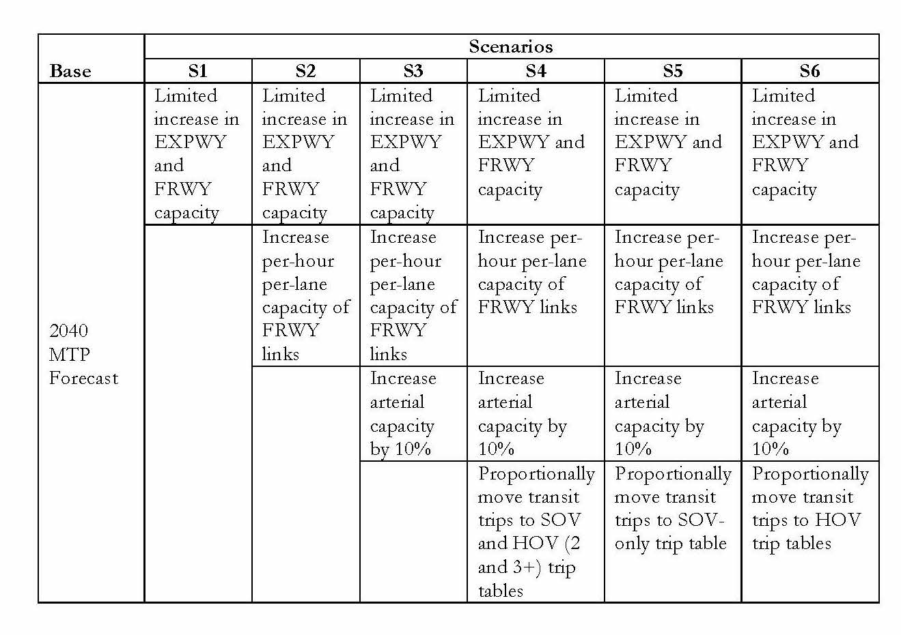

 This page is part of the Category \[.

Several agencies have already begun to integrate connected and autonomous vehicles into their travel forecasting process. All are "works in progress," such that the descriptions below are likely to evolve over the next year in response to changing analytical needs, knowledge is gained about social and behavioral responses to CAVs, and best practices emerge. Some examples of these early applications are described below, organized by broad category of models.

[NCHRP Report 20-102(9) Providing Support to the Introduction of CV/AV Impacts into Regional Transportation Planning and Modeling Tools](http://apps.trb.org/cmsfeed/TRBNetProjectDisplay.asp?ProjectID=4008) is work in progress to investigate the methods and process for considering CAV in travel modeling. One initial product from this work is a review of current practice, documented in *Technical Memorandum 1: Review of Recent AV CV Modeling, December 2016*[^1]. The following material comes from this report and is intended to demonstrate existing work/experimentation for evaluating the impacts of CAV using travel forecasting models and tools. This is by no means an exhaustive list of existing work and others who have conducted work of a similar nature are encouraged to include a description of the approach, measures and outcomes under the appropriate modeling type listed in the sections below.

It is important to note that none of the modeling frameworks described here are necessarily better than the other when it comes to accommodating the uncertain future of CAV. Whether it is the overall lack of behavioral data that exists when considering CAV impacts or the caveat of imposed changes intended to represent expected behavioral changes from widespread deployment of CAV, there remains much to be learned. However, some experimentation has been done and is reported here to begin to provide some understanding of the complexities and challenges to be faced.

These examples are divided into 3 categories. Those using :

-   Trip Based Models
-   Activity Based Models, and
-   Other Modeling Frameworks.

Trip Based Modeling Systems
---------------------------

Each of the four steps in a trip-based model (trip generation, trip distribution, mode choice and traffic assignment) can be modified to include some aspect of CAV technology. Potentially modified parameters or processes in the four-step model stream are:

-   Regional geographic distribution of household and employment growth inputs.
-   Value of time in generalized cost equations and mode choice.
-   Modifying in-vehicle travel time and other mode choice parameters.
-   Adding a mode for AV and estimating associated parameters.
-   Post processing of trip tables for input to disaggregate traffic assignment.
-   Modifying network link capacities.
-   Re-designating trips from SOV to a new CAV mode, or from SOV to high occupancy vehicle (HOV) modes to reflect how CAV might impact ridesharing.
-   Modification of trip rates (person or auto, truck, commercial)

Techniques used for CAV modeling reported are focused on changing trip tables to mimic potential changes in behavior, modifying mode choice parameters, and changing network capacity to reflect potential operational characteristics of CAV.

### Capital Area MPO (Austin, Texas) CAV Modeling Experiment

Recently modeling experiments were performed using the Capital Area MPO (CAMPO) trip based modeling system by the Texas A&M Transportation Institute under contract to the Texas Department of Transportation. The CAMPO model is a four-step model with a calibrated mode choice submodel. The model has four time periods and has a feedback loop from traffic assignment to trip distribution.

Six scenarios were imagined by the analysts for testing. All six scenarios were for a 2040 forecast year and were compared to the most recent CAMPO regional transportation plan (referred to as base in this analysis). A comparison was also done to an all-or-nothing traffic assignment. As shown in Table 1, the analysts imposed changes to network capacity and trip tables by mode.

First, one lane was added to freeways and expressways to mimic the reduction in required emergency lanes and/or narrowing of lanes due to expectations that CAVs may be able to operate in closer proximity. Scenario 2 includes an increase in per-lane capacity to 4,000 vehicle per lane per hour to mimic the potential of CAVs traveling in coordinated flow conditions. Scenario 3 adds an increase in arterial capacity of 10 percent. Arterial capacity is limited by intersection capacity, and it was assumed that CAV would not have a major impact on coordinated arrivals at intersections. Scenario 4 imposes shifts in mode by moving 100 percent of trips by bus and rail to SOVs and HOVs (shared-ride 2 and 3+). The trips were shifted in proportion to the results of the base 2040 CAMPO mode choice model results.

Scenario 5 assumes all transit trips are moved to single-occupant mode, and scenario 6 assumes that all transit trips are moved to shared-ride 2 and 3+ modes to mimic the impact of CAVs in the system.

**<big>Table 1 - Scenarios from the CAMPO Modeling Experiment</big>**

*Source: Report \#0-6848, Transportation Planning Implications of Automated and Connected Vehicles on Texas Highway, pending publication*

Results of this analysis showed increases in vehicle miles traveled (VMT) under all scenarios modeled. The increase in VMT ranges from 2.34 percent for scenario 1 (add 1 lane to freeways) to almost 8 percent for scenario 5 (move all transit to SOV) when compared to the base 2040 model. However, because capacity was increased on the freeway network the percent of VMT in congested conditions (volume-to-capaicty ratio greater than 0.85) is less than half compared to the base 2040 model.

In a separate experiment (Zmud, Sener, and Wagner (2015)[^2]), changes were imposed to the mode choice parameters in the CAMPO mode choice model. The CAMPO mode choice model is a common nested logit-based choice modeling structure. These experiments were run using the 2010 calibration year of the CAMPO model. The assumption was that under the introduction of CAV, in-vehicle travel time would be perceived as less difficult, since the driving task is removed and the rider can now perform other activities in the vehicle. The experiment was to modify the coefficient of in-vehicle travel time (CIVT) in the mode choice model (reduced by 25 percent and 75 percent). The reduction of CIVT for the auto mode had a significant impact on transit mode share, reducing transit trips by up to 30 percent overall and bus trips by over 70 percent.

When considering the experiments conducted using the CAMPO Model, it is important to be mindful of the following limitations:

-   The changes imposed on network capacity and modal trip tables do not directly represent CAV impacts, but mimc the **potential** impacts that may result.
-   Decreases in average trip length were due to changes in travel time only as the CAMPO model does not include a feedback loop to residential/workplace location choice to allow for potential redistribution of home/work locations.
-   CAV may likely have an impact on the choice of time of day for trip making, however the CAMPO models exogenously impose the percentage of daily trips by time period. Thus, impacts of CAV on trip generation can not be modeled without structurally changing the CAMPO Trip Generation model.
-   The CAMPO mode choice/AV experiment is meant to show the sensitivity in the models to changes in variables that are expected to be significant for CAV travel behavior, and does not directly model CAV impacts. Changes to the CIVT for the auto mode in the CAMPO mode choice model showed a great deal of sensitivity, reducing transit trips by up to 70 percent. This indicates that, under 2010 conditions when the coefficients were calibrated (to 2010 household travel survey data), travel time was a significant consideration for auto drivers. When the 2010 household survey was administered, CAV technology was not a consideration in respondents’ travel options, and therefore is not explicitly included in the model coefficients as calibrated.

Activity-based modeling systems
-------------------------------

Tour and activity-based models are typically implemented in a microsimulation framework, making addition of ad hoc components and capabilities easier than in the aggregate deterministic frameworks employed in trip-based models.

### Puget Sound

Puget Sound Regional Council (PSRC) tested various CAV scenarios using their SoundCast activity-based model system in 2014 (Childress et al. 2015).[^3] There were three main scenarios tested. One scenario increased capacity by 30 percent on all freeways and major arterials. A second scenario included the same capacity increases plus a reduction in auto in-vehicle time by 35 percent for all trips. Rather than reducing the value of the CIVT, the in-vehicle time itself was reduced, but the outcomes for the scenarios should be the same, as long as the real travel time was used in vehicle hours of travel VHT calculations. In the third scenario, a 50 percent reduction in parking costs was also added. For the first two scenarios, the results showed a 2.5 percent increase in trips and a 3 to 5 percent increase in VMT, but a 2 to 4 percent reduction in VHT due to somewhat faster average speeds.

PSRC also simulated a fourth scenario that assumed that all CAV are used as vehicles owned by ridesharing services with mileage=based pricing, rather than as privately owned vehicles. This was simulated by changing the price of all auto travel to \$1.65/mile, much higher than the typical operating cost of privately owned autos (the federal per-mile reimbursement rate is approximately \$0.55/mile and is reset each fiscal year), but not including any capacity increases, value of time reductions or parking price reductions that were included in the first three scenarios. It is important to note that mileage-based pricing includes the cost of roadway maintenance and sometimes is tested as a replacement for traditional transportation financing. Therefore, the cost impacting the user could vary if the pricing is intended to model vehicle operating costs or include mileage fees that replace, for instance, a gas tax to fund transportation.

The results for the fourth scenario showed about a 40 percent reduction in both VMT and VHT. The representation of this vehicle-sharing scenario seems unrealistic in a number of ways. First, any improvements in effective capacity, value of time and parking price that apply to privately owned CAVs in the first three scenarios would likely also apply for shared CAVs; in fact parking price would disappear all together. Second, the SoundCast models include several variables that inhibit car travel for households with no vehicles or fewer vehicles than drivers. Those availability effects would not apply for households using shared vehicles, so should be removed from the models for this scenario. As a result, the predicted drop in VMT and VHT for shared use of CAVs in this analysis may be greatly overstated.

### San Francisco Bay Area

MTC, the MPO for the nine-county San Francisco Bay Area, has tested the impacts of autonomous vehicles on travel demand in two phases using their activity-based travel demand model. In the first phase of testing, relatively simple changes were made to link-level capacities to reflect efficiencies gained by platooning, signal optimization, and reduced congestion due to increased safety.[^4] Four alternative capacity increases were tested, with capacity increases ranging from 120 percent to 180 percent on major arterials and between 150 percent and 300 percent on freeways. These changes result in very small changes in total trips generated, trip lengths, and trips by mode. Auto and bus trips increase slightly while fixed-guideway trips decrease somewhat due to the improved performance of the road system. Total VMT exhibit the greatest change, with increases of between 3 percent and 5 percent depending upon the scenario tested. Auto travel times generally improve, with the greatest percentage decreases observed on Bay Area bridges, which tend to be highly congested in the baseline scenario.

The second phase of MTC autonomous vehicle testing was performed by a former Stanford PhD candidate, Michael Gucwa. As part of his PhD dissertation (unfinished), Mr. Gucwa increased link capacities and modified mode choice in-vehicle time parameters to reflect lower disutility for travel due to convenience of driving an AV (Gucwa 2014)[^5]. The scenario modeling tested two levels of capacity and between three and four levels of modified in-vehicle time parameters. His research findings were generally consistent with the previous analysis, though he finds a greater increase in VMT (between 4 percent and 8 percent), likely due to the additional reduction in the CIVT.

### Ontario (Canada)

The ability to explicitly represent CAV demand and impacts was recently added to Ontario's provincial model. The modeling system, known as the Transport and Regional Economic Simulation of Ontario (TRESO), is a microsimulation-based modeling system that integrates local and long-distance resident, visitors, and commercial vehicle travel models with a space-time traffic assignment operating at two levels of network resolution. The specific enhancements relevant to modeling connected and autonomous vehicles include:

-   Vehicles are added to the [synthetic population](Population_Synthesis) (household and persons) based upon user-specified rules of CAV5 adoption by market segment. The possibilities include conventional and autonomous vehicles by [SAE automation level](https://www.sae.org/misc/pdfs/automated_driving.pdf) that are either privately owned or shared. The latter are intentionally vaguely defined to enable travelers to choose the service or mode with highest utility during mode choice. The markets can be segmented by income, household structure, area type, or other household or person attributes.
-   CAVs and mobility services (e.g., Lyft, Uber) have been added to the mode choice model, both as top-level choices as well as access and egress modes for various transit submodes.
-   A ride-pairing module has been added to match inter-household trips by user-defined criteria and market shares to reflect potentially increased ride-sharing in both CAV and traditional vehicles. The matches are often made for similar travelers moving between the same origin and destination within a given time slice, which can vary by origin and/or destination region or accessibility levels at the origin or destination.
-   The capacities in traffic assignment are adjusted based upon the degree of market penetration by CAVs implied during vehicle synthesis. The adjustments are based upon a methodology advanced by [Levin & Boyles (2015)](http://trrjournalonline.trb.org/doi/abs/10.3141/2493-04) and traffic flow and vehicular considerations shared by [Mahmassani (2016)](http://pubsonline.informs.org/doi/abs/10.1287/trsc.2016.0712).

The enhancements intentionally require the analyst to explicit code assumptions about the future instead of relying upon estimated or asserted model parameters. Thus, the capabilities sacrifice rigor for ability to specify a wide range of alternatives. The intention is to run the TRESO system with a bundle of assumptions, enabling scores of different combinations of assumptions to be compared through the mining of model outputs.

Visioning (strategic) modeling systems
--------------------------------------

References
==========

[Content Charrette: Autonomous Vehicles](Content_Charrette:_Autonomous_Vehicles)

[^1]: [NCHRP Report 20-102(9) Providing Support to the Introduction of CV/AV Impacts into Regional Transportation Planning and Modeling Tools](http://apps.trb.org/cmsfeed/TRBNetProjectDisplay.asp?ProjectID=4008)

[^2]: Zmud, Johanna and Ipek Sener, Jason Wagner. Consumer Acceptance and Travel Behavior Impacts of Automated Vehicles, Texas A&M Transportation Institute, Transportation Policy Research Center, 2015

[^3]: Childress, S., B. Nichols, B. Charlton, S. Coe (2015). Using an Activity-Based Model to Explore Possible Impacts of Automated Vehicles. Submitted for presentation at the 2015 TRB Annual Conference, Washington, D.C.[1](https://psrc.github.io/attachments/2014/TRB-2015-Automated-Vehicles-Rev2.pdf)

[^4]: Travel Model Development: Sensitivity Testing; DRAFT Technical Report; Metropolitan Transportation Commission with Parsons Brinckerhoff, Inc.; June 27, 2013 (2013)[2](http://analytics.mtc.ca.gov/foswiki/pub/Main/Documents/2013_06_27_RELEASE_DRAFT_Sensitivity_Testing.pdf)

[^5]: Gucwa, M. (2014, July 14). Retrieved from [Gucwa 2014](https://higherlogicdownload.s3.amazonaws.com/AUVSI/c2a3ac12-b178-4f9c-a654-78576a33e081/UploadedImages/documents/pdfs/7-16-14%20AVS%20presentations/Michael%20Gucwa.pdf).

