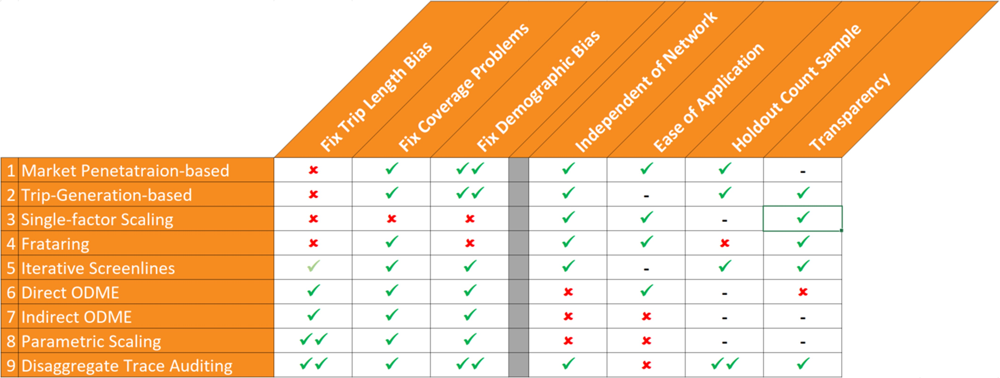

The technology consultancy [Gartner defines](http://www.gartner.com/it-glossary/big-data/) "Big Data" as

> high-volume, high-velocity and high-variety information assets that demand cost-effective, innovative forms of information processing for enhanced insight and decision making.

There are some specialized contexts (e.g., [CERN](https://home.cern/about/computing), the Kepler Space Telescope) in which big data can refer to actively collected data. In general and in most contexts including transportation, however, big data is synonymous with passive data, and it is precisely this that distinguishes it from traditional data. Traditional data sources required investment in data collection as an activity. In contrast, big data is generally collected passively, generated as a byproduct of other processes, and therefore is collected at no or very little cost. Instead of requiring an investment in data collection, big data requires investment and effort to process the data to produce accurate, representative, and meaningful data products while respecting and protecting privacy.

The explosion of big data in the popular awareness in the past several years was largely initiated by the increasing widespread use of passive data on consumers' web browsing habits to develop targeted advertising. In effect, market researchers tracked consumers as they moved through cyber space and were able to process and analyze these tracks or traces produce real insights into consumer behavior. There is a close analogy here to the way passive data is now being used in mobility analysis and travel forecasting. Increasingly, people are being tracked not only as they navigate through cyber space but also as they move through physical space, and the large scale passive trace data this produces is increasingly being processed and analyzed to produce insights into travel behavior and patterns.

Types of Source Data
--------------------

The big data sets and products being used in transportation are generally produced by three or four types of underlying technologies:

-   [Cellular Communications Data](Cellular_Communications_Data) - this data is generated by communications or signaling between cellular devices and cell towers
-   [Global Positioning Systems (GPS) Data](Global_Positioning_Systems_(GPS)_Data) - this data is based on line-of-sight with satellites and primarily comes from in-vehicle devices
-   [Location-Based Services (LBS)](Location-Based_Services_(LBS)_Data) or Smartphone Applications (App) Data - this data is based on the best location information available to a mobile device at a particular point in time and so may be a mix of GPS, Wifi or Bluetooth beacon or cellular data

See [Travel Time Speed and Reliability Data](Travel_Time_Speed_and_Reliability_Data) for additional discussion, examples and tools.

Each of these types of source data have their own distinct advantages and disadvantages. Some people do not consider Bluetooth data to be passive or big data because it is substantially different from other types of fully passive big data since it requires the active deployment of detectors. However, others do consider it passive since these detectors passively observe Bluetooth signals without requiring the subject's interaction or even knowledge much like the other data sources. Regardless of where it is categorized, Bluetooth data clearly shares some characteristics with traditional data sources and other characteristics with passive big data sources.

In considering different types of source data the following considerations are often important:

-   **Locational Precision** - different types of source data in different contexts are able to locate a vehicle or device within a larger or smaller area; some may be able to pinpoint the location within a few meters while others may only be within several square kilometers
-   **Sample Penetration** - sample penetration can be measured in various ways, in terms of the percent of people, VMT, or trips captured in the data; while some data sets may capture at least some information on more than 20 or 30% of the population, the percent of VMT or trips captured is less, and some data sets may actually be based on a fraction of a percent of the trips in an area
-   **Sample Duration** - the total amount of data being acquired or used is a function of both sample penetration and duration; a 5% sample for six months may be better or worse than a 10% sample for one month depending on the application
-   **Representativeness** - because it is collected passively, big data is not a controlled random sample and is not representative; all of these types of data are known to suffer from systematic biases discussed in more detail below
-   **Cost of Raw Data** - the cost of a data set or data product always a factor to be considered
-   **Cost of Processing & Expansion** - the cost of required processing and expansion should also be carefully considered along with the cost of the raw data set or data product

Types of Data Products
----------------------

Although big data can conceivably support a variety of novel data products, up to this point, it has primarily been used to generate two types of data products for transportation: network or supply data and origin-destination (OD) demand data.

### Network / Supply Data

**Network / Supply Data** which describes the condition or use of a section of roadway can be generated from either passive big data or traditional data collection such as floating car runs or traffic counts. Although based on underlying disaggregate data on individual vehicles or travelers, privacy is protected in this context by analyzing this data to produce aggregate statistics or metrics for a particular section of roadway.

#### Travel Time and Reliability

The first and most widespread use of big data for travel analysis has been for the estimation of **travel times and travel time reliability**. FHWA has made travel time data on the National Highway System (NHS) available to transportation planning agencies across the country through the National Performance Management Research Data Set (NPMRDS). Commercial data vendors also sell travel time and reliability metrics for roadways not covered as part of the NHS. While numerous studies have validated speed or travel time estimates from passive data on freeways, the estimation of travel times and reliability on signalized arterials is much more challenging, and requires the use of complex algorithms the accuracy of which is still a matter of active research. One of the key challenges in data processing for travel time metrics is correctly identifying and removing observations of pedestrians, cyclists, or vehicles which are stopped not because of traffic but for some activity, such as picking up a passenger. More generally this challenge relates to the exclusion of outliers which can also be caused by phenomenon such as construction, weather, crashes, etc., which the analyst may or may not want to include or exclude in certain metrics depending on the reason. Moreover, the choice of how to identify and exclude outliers can have a significant impact on both average travel times as well as reliability measures. Despite these challenges, travel time related metrics derived from big data are increasingly a critical resource for transportation planning and operations.

#### Traffic Volume

More recently, big data has begun to be used to produce estimates of **traffic volumes** on roadways. Early research, such as that conducted by MNDOT, indicates that such methods show significant promise, but also that significant challenges remain, particularly for lower volume facilities which might stand to benefit most from cost effective passive data methods.

### Origin-Destination (OD) / Demand Data

**Origin-Destination (OD) / Demand Data** which describes the number of trips between different locations (generally traffic analysis zones) can also be generated from either passive big data or traditional data collection such as household travel diary surveys or intercept surveys. While surveys have traditionally been the primary source of information on both travel behavior and travel patterns used for developing travel forecasting models, passively collected O-D data is now widely available and increasingly being used to support model development and travel forecasting. While both surveys and passive data can provide some of the same information (e.g., aggregate trip rates, lengths, etc.), they are not true substitutes—but rather, better understood as complements. Ideal modeling strategies will take advantage of both survey and passive data sets—using each for aspects they capture best.

Compared with traditional survey data, passive OD data offers three key advantages and suffers three key disadvantages. On the positive side, cost is one of the main advantages of passive OD datasets, which can provide OD data more cost effectively than surveys, especially for difficult to survey market segments such as truckers or tourists. The completeness or adequacy of the sample coverage in the spatial dimension provides a second powerful motivation for using these datasets. While traditional travel surveys typically provide observations on 2% or fewer of the OD pairs in a region, new sources of big data can provide observations covering more than one-quarter or one-third of all OD pairs. This order of magnitude difference in the completeness of the data provides a more complete picture of spatial travel patterns in a region that traditional data could not. Third, because of their cost-effectiveness and constant collection, these big data sets can provide longitudinal data capable of providing information on how OD patterns change over time.

On the other hand, for reasons of privacy, passive data is always anonymous and includes no information on traveler demographics. Some data products will provide information on demographics based on associations of locations with aggregate Census data, but the accuracy of such methods is not well demonstrated. Similarly, available data products do not currently provide reliable or accurate information on the mode or purpose of trips. Although some data products include information by imputed purpose, comparison of these data sets with either survey data or administrative records reveals substantial differences. The association of traveler demographics and the imputation of trip mode and purpose remain subjects of active research, and while current methods have critical limitations, improved methods may yield more reliable information in the future. Lastly, but perhaps most importantly, passive data are not representative, but demonstrated to be systematically biased both with regard to the demographics of travelers and with regard to the length of trips represented. Big data presents an opportunity for accurate OD data at unprecedented levels of geographic resolution, but only if it is properly expanded.

Representativeness and Expansion
--------------------------------

Although passive data provides large sample data, often including millions of trips, it is still only a sample, and because it is not a controlled random sample, it is not representative of all travelers or trips. Commercially available datasets include only travelers with certain devices, carriers, and/or apps installed. Moreover, short-distance trips or short-duration activities are often under-represented in the data because they require more frequent observations of position which are not always available due to several factors including battery management, device and app usage.

### Known Systematic Biases

Two types of locational bias have been documented in big data sets. First, some locations can be under-represented in the data due to lack of coverage or line-of-sight. In some cases, this may effect large rural areas, or in others, dense cities with "urban canyons". Second, various passive datasets are known to over-represent higher income and younger travelers. Both of these issues can lead to the over- or under-representation of certain origins or destinations in passive data and must be corrected for to produce accurate travel patterns. The final type of systematic bias in passive data affects not specific locations but rather trips or activities based on their duration. Because the frequency of positional observations varies within passive datasets, the sampling probability is a function of event duration. In other words, the longer a trip or activity, the more likely it is to be observed in passive data. The reasons for and the magnitude of this bias vary by the type of source data, but are often related to battery management.

### Expansion Methods

The nine methods now in use for expanding passively collected OD data can be categorized in terms of what control data they expand the passive data to match. There are now three sources of control data for expanding passive data: demographic data generally from the census, traffic counts on the roadway network, and disaggregate trace data from smartphone surveys. Methods based on demographic data such as market penetration-based factors and trip-generation based scaling are important for addressing demographic bias in some datasets, but cannot address trip length bias. Some methods for expanding to traffic counts can correct for trip length bias. Iterative screenline fitting using matrix partitioning does not rely on a network assignment model but is generally limited by several factors and therefore often must be supplemented by other methods. ODME is powerful but must be used with careful constraints, and even then provides little insight into the nature of the expansion. Parametric scaling provides a transparent expansion method, but is difficult to implement. New trace auditing methods using disaggregate smartphone survey data are perhaps the most promising, but require a smartphone survey dataset. While all of the methods have some usefulness, not all methods are equally robust or appropriate for certain datasets or analyses. Multiple complementary expansion methods are therefore often used together as an ensemble.

''Source: Bernardin and Sadrsadat, Methods for Validation and Expansion of Passively Collected Origin-Destination Data, 2018

Applications to Travel Forecasting
----------------------------------

Big data is increasingly being used for a variety of purposes in travel forecasting. These various applications of big data might be categorized into model validation, model development, and data driven forecasting.

### Model Validation

The first way that passive big data was used to support travel forecasting was for purposes of validating forecasting models, and this remains an important and common use of the data. Big data has been used to provide independent validation of both modeled speeds and OD flows based on other data sources such as floating car runs and travel surveys. While this is certainly a legitimate use of big data, it is arguably not its highest or best use, and over time big data is being used less for validating models developed from other data sources and increasingly for actually developing models.

### Model Development

Big data is being used to estimate, calibrate, or develop various components of travel forecasting models. The most common applications are the estimation of free-flow speeds and volume-delay curves for network modeling and the demand modeling of special travel markets such as trucks, external trips, and visitor travel.

Although establishment and intercept surveys have been used to produce information on truck ODs in the past, the cost of such surveys is high and often still struggle with low participation rates and yield small samples. Therefore, prior to the availability of truck GPS data, many agencies relied on quick response methods for forecasting truck traffic, but now it is increasingly commonplace for agencies to develop truck models based on big data. Even even in cases where trucks and freight were being modeled based on commodity flows, the use of truck GPS data has produced substantial improvements in truck model accuracy.

The development of external travel modules was one of the first and remains one of the most widespread uses of passive OD data for travel model development. Compared to older methods like traditional surveys and semi-passive methods (e.g., video-license plate surveys and Bluetooth), these newer methods are more cost-effective. Moreover, unlike semi-passive methods, fully-passive methods provide observations not only on external-external trips passing through the region, but also on the internal origins and destinations of inbound and outbound trips. Additionally, the expansion of passive external O-D data is often simpler than other O-Ds, as iterative proportional fitting (i.e., frataring) to traffic counts at external stations is often (but not always) sufficient to properly expand the data.

Visitor travel is negligible in some regions, while a major contributor to traffic in others. However, even in regions in which tourism plays a large role in the economy, visitor surveys often prove cost prohibitive. The use of passive O-D data for visitor modeling is more recent, but quickly growing, with recent/on-going studies in several states. Passive O-D data for visitors to a region can be acquired at much less cost than a visitor survey can be conducted and can provide much (if not all) of the information needed for visitor modeling. Although it typically cannot provide party size or purpose, passive O-D data can provide rich information including the entry/exit mode (auto vs. flight vs. cruise ship), duration of stay within the region (less than a day, overnight, multiple night), visitor trip/tour rates and attraction rates, trip/tour lengths, and general O-D patterns to support either trip-based or basic tour-based simulation models of visitor travel.

### Data Driven Forecasting

Finally, big data is increasingly being used to support data driven forecasting frameworks. Data driven modeling frameworks have historically been more widespread outside the United States, and in fact, are required in the United Kingdom. Awareness of this in the United States has increased recently due to greater global interaction and communication, and through TMIP webinars by RAND Europe showcasing their work in both Europe and Australia. Prior to this, however, data-driven approaches were becoming increasingly common in statewide models in the US (e.g., Indiana, Florida, Tennessee, Michigan), and now are seeing increasing use for MPO models. There are generally two methods for using travel demand models together with passive OD data or incorporating this data in travel demand models. The first approach uses travel demand models (usually of more traditional, aggregate designs) to pivot off of OD matrices developed from passive data and traffic counts. The second approach instead uses these OD matrices to develop fixed factors or constants which are incorporated into the travel model; this approach is more attractive for activity-based demand simulation models although it can also be applied with aggregate trip-based travel models. These two similar and related but alternative approaches are described in more detail and discussed [here](Data_Driven_Methods).

------------------------------------------------------------------------

