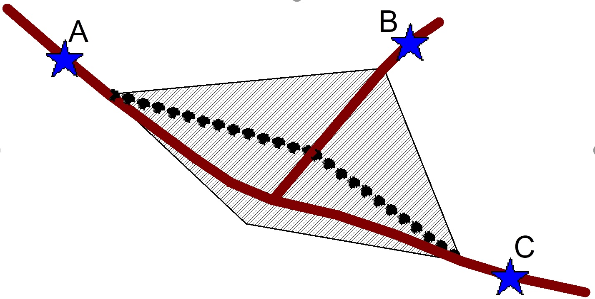

Bypasses of local scope are greatly limited in spatial extent, such that a full travel forecast with a model is unnecessary. Such bypasses include alternative routes around tourist attractions or localized business districts. Such bypasses could be handled with an existing regional model (with sufficient spatial precision) or a sub-area model, but could also be handled with statistical (e.g., time-series) methods, provided that locally collected destination-choice data can be obtained through a vehicle-re-identification study. (See [Working with vehicle re-identification data](Working_with_vehicle_re-identification_data_in_project-level_traffic_forecasting) for a discussion of vehicle re-identification in the context of O-D tables.) Presumably such bypasses are small and they would not necessitate a complete environmental review.

Time series analysis may be performed on the existing road to obtain forecasts of total traffic approaching the future bypassed area in both directions. However, additional information is required to determine the fraction of drivers who would chose the bypass over the original highway. Situations will differ, but many of the bypasses will be so advantageous to drivers that few drivers will stay on the original highway unless the original highway is the only way to reach the drivers’ destination. The fraction of drivers having necessary destinations along the original highway may be determined with a carefully designed vehicle re-identification study.

Vehicle re-identification technologies include aerial photography, Bluetooth MAC address recognition, and license plate matching. When matches are time-stamped, a good estimate of vehicle speed (and travel times between detectors) may also be obtained. Travel times are critical to understanding driver behavior.

It may be hypothesized that drivers traveling on the highway will either return the way they came, stop for a long while, or continue through the local area on the same highway or another highway. Depending on the travel times between identification stations, it can be further determined whether a given driver stopped for a long while. Then drivers can be assumed to be dependent on the original highway if they stopped for a long while or if they cannot reasonably reach their ultimate destination by way of the proposed bypass. A “long while” would be the amount of time necessary to do something purposeful within the cordon.

Vehicle re-identification data, particularly Bluetooth data, are drawn from a biased sample. At this writing, new vehicles are detected at a higher rate than older vehicles; trucks are detected at a higher rate than passenger cars; and detection rates can vary according to the location of the detector. Thus, it is critical that raw O-D tables be factored up by a method that is sensitive to differing rates at origins and destinations, such as Fratar factoring (aka, iterative proportional fitting).

Field data requirements go beyond a simple O-D study.

-   Besides simple matches (doubles), the software that analyzes the raw data must be able to detect complex tour patterns as evidenced by triples and quadruples. Single detections, which are elements of matches, are also needed to determine sampling rates.
-   Each match requires a time stamp and a duration between matches.

Travel times between stations need to be analyzed to determine the longest reasonable travel time a driver can take without stopping.
Each location is somewhat different, so professional judgment must be exercised when determining the number and locations of detectors.
The technique is illustrated by an example of a proposed bypass around a small beach community, where Main Street is clogged with pedestrians, cyclists and drivers accessing local businesses. A bypass, approximately four blocks long, is proposed for this community. The figure below illustrates the important parts of the street system and the location of Bluetooth detectors.

Bluetooth detectors are labeled A, B, and C. Existing highways are solid lines. The proposed bypass (dotted line) would be the preferred path from locations A to location C (and back) and from location B to location C (and back). The cordon area is cross-hatched.

The O-D information is organized into two separate tables: trips that took less than 1/4 hour and trips that took greater than 1/4 hour. One-quarter hour was selected as a divider because any through trips should reasonably be completed within 1/4 hour with ample time for a gas station stop, even with congestion. It would be difficult to do anything purposeful in less than ¼ hour, considering the needed travel time between detectors. Round trips can happen (that is, two trips with the same trip ends, but reversed in order), but in this example they only occur with longer trips. These tables are unexpanded, assuming no biases in the detection rates that would affect conclusions about diversion percentages.

| Short Trips | A   | B   | C   | Long Trips | A   | B   | C   |
|-------------|-----|-----|-----|------------|-----|-----|-----|
| A           | 0   | 88  | 54  | A          | 11  | 12  | 18  |
| B           | 78  | 0   | 37  | B          | 16  | 8   | 14  |
| C           | 49  | 39  | 0   | C          | 14  | 10  | 5   |

Long trips logically had a destination of some significance within the triangular cordon formed by the three stations. Round trips could pass through the cordon twice (in either direction), in which case there would be no local stop, or round trips could simply be returning from a destination within the cordon. These two situations can be distinguished within the Bluetooth data by seeing whether the vehicle passed through more than one detector station.

So from this table, it can be deduced that all of the “short trips” would have used the bypass, had it been available, and all of the “long trips” would have stayed on the original route. Since both O-D tables are almost symmetrical, it is possible to determine the fraction of traffic for the bypass in either direction by just comparing the total of short trips to the total of long trips. There are 345 short trips and 108 long trips, so the bypass will have approximately 76% of all traffic (345/(345 + 108)), as long as it remains uncongested.

References
==========

