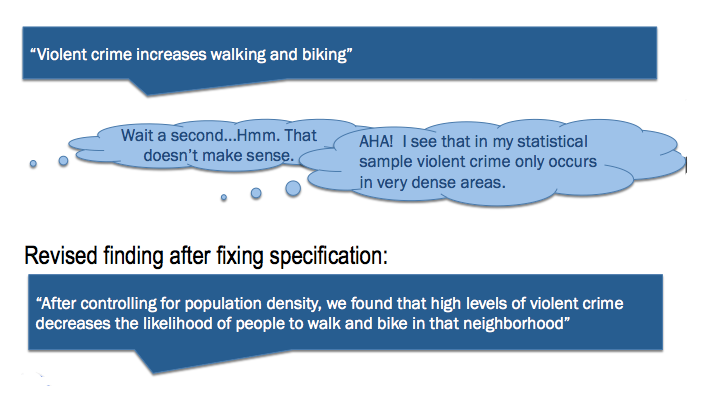

There are a few items that are useful to keep in mind when developing a choice model for use within a larger travel model framework that might not be applicable or on the radar for modelers developing specifications for use in research.

Good Attributes
---------------

A good choice model usually has the following attributes:

1.  **Practical** to use
2.  **Consistent** with evidence and common sense
3.  **Useful** to researchers or decision-makers
4.  ...might not be the most statistically strong (in fact, it probably isn't)

Developing a choice model is as much art as it is science. This is especially true when developing a model that will be used in practice.

------------------------------------------------------------------------

Practical
---------

### Inputs are Forecastable

*Can you (easily and reliably) forecast your independent variables?*

Possibly suspect/difficult variables:

-   \[ = f( Yelp Scores)
-   Residential Location Choice = f ( School Quality)
-   Bike Utility = f(potholes)
-   Walk Utility = f(violent crime)

*Remember: Garbage In Garbage Out*

### Do mechanics work with your travel model?

Are these variables "available to you" in your model system?

-   Person/HH/trip level (easier in microsimulation framework)
-   LOS variables (çan you 'skim' them?)

Does adding this variable significantly contribute to run time, memory, or storage requirements?

------------------------------------------------------------------------

Consistent
----------

### Use Common Sense

If your findings are inconsistent with past research, common sense, and anecdotal evidence, you have done one of the following:

1.  Made a discovery (yay!)
2.  Come across a statistical anomaly (annoying…)
3.  Poorly specified your variable (bad!)

Possible questions to help you differentiate garbage from discovery:

-   can you talk about your finding with a **straight face**?
-   can you **tell a story**?
-   are there underlying **missing variables**?
-   are there multiple **variables obscuring each other**?
-   is the sample **robust enough**?

Example Model Revision:

------------------------------------------------------------------------

Useful
------

*"Does \[ whatever specification you are considering\] have valid and relevant sensitivities?"*

:   

    :   AKA

*"…will it make sense and will anybody care?"*

### Is Your Model Specification Valid?

**Example 1**

Possible Model:
:   Transit utility increases with [TAZ](Traffic_Analysis_Zones) population

Incorrect Implication:
:   We can increase transit usage by making our TAZs larger

Better Model (find the real cause):
:   Transit utility increases with shorter walk access distances and more frequent transit service (which happen to be common in dense areas with high TAZ populations)

**Example 2**

Possible Model:
:   Bike LOS increases as the average traffic / lane at an intersection decreases

Incorrect Implication:
:   We can get more people to bike by widening roads at intersections

Better Model (find the real cause):
:   Bike LOS increases as conflicts with cars decrease

### Is Your Model Specification Relevant?

*"What questions are you trying to answer?"*

Make sure you have the sensitivity you need to answer your boss's boss's questions.

**Example**
are parking maximums the next hot political battle in your region? make sure you have parking competitiveness in your models!

------------------------------------------------------------------------

