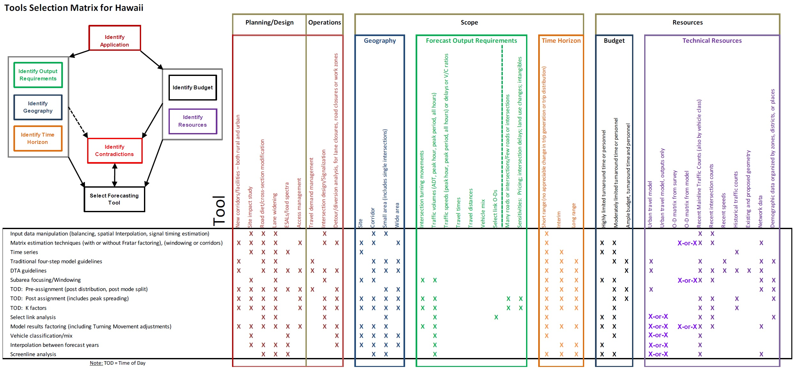

Go to [Project-level traffic forecasting](Project-level_traffic_forecasting) topic page.

There are a variety of techniques that might apply to any forecast. In addition, techniques may be used in combination to create a forecast.
The “tools selection matrix” from [NCHRP Report 765](NCHRP_Report_765) may be used to help identify techniques that have merit for a particular project-level forecast. The figure below is a “tools selection matrix” customized for Hawaii. The “tools selection matrix” is used to both positively and negatively influence the choice of technique.

See [NCHRP Report 765](NCHRP_Report_765) Appendix A for an illustrative example of how to use this matrix. The matrix identifies candidate techniques though this step-by-step process.

1.  Identify all columns that correspond to the characteristics of the project and the forecast.
2.  Shade each cell, containing an “X”, in an identified column.
3.  Tentatively select techniques (rows) that are likely candidates by virtue of the number of shaded cells in their rows.
4.  For each tentatively selected technique (row), identify contradictions. A contradiction is a cell with an “X” that is not shaded and is deemed critical to the technique.
5.  Eliminate any technique (row) with a contradiction.
6.  Review each remaining techniques for applicability to the project forecast.

