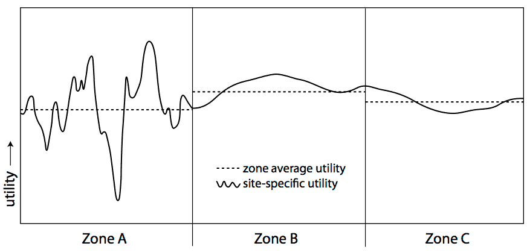

 This page is part of the Category \[.

Sometimes, a discrete choice is made from a very large pool of possible choices. In these circumstances, it may be useful to aggregate choices together, and represent a set of choices as a single meta-choice. This is particularly common in destination choice models, where the individual possible destinations are aggregated together as traffic analysis zones.

The aggregate choice in many ways represents a nested logit model, with the aggregations corresponding to the nests, except we only observe the choice at the nest level, not at the elemental alternative level.

Basic Aggregate Models
----------------------

To start with, we can make some assumptions:

1.  The individual elemental alternatives within each zone or aggregate are homogeneous. That is, each such alternative has the same systematic utility, *V~i~=βX~i~*
2.  The particular locations of the zonal or aggregation boundaries are arbitrary, and have no systematic meaning themselves.
3.  The number of individual elemental alternatives within each zone or aggregate is directly observable.

Using these assumptions, we can derive a reasonably simple aggregate/zonal choice model.

The usual form of the nested logit model calculates the probability of an alternative as *P~nest~ P~alt|nest~*.

In the case of aggregate choices, we do not observe the choice, but only the nest, so we only care about *P~nest~*. The nested formula for that term is

$$P_{nest} = {\exp(V_{nest}) \over \sum_{j \in nests} \exp(V_j)},$$

with

$$V_{nest} = \mu_{nest} {\log\left( \sum_{i \in nests} \exp\left({V_i \over \mu_{nest}}\right) \right)}.$$

Using assumption 2, we know that *μ~nest~* must be 1, as we want the aggregation nesting structure to collapse to a multinomial logit model. Further, our first assumption is that all the *V~i~* are equal, so the terms inside the summation can collapse together, leaving

with *N~nest~* as the number of discrete elemental alternatives inside the nest.

Under the assumptions we laid out above, estimating an aggregate model is actually quite simple. We can simply define a variable for each aggregate alternative that has a value of log(*N~nest~*), and including it in a MNL model, with a beta coefficient constrained to be equal to 1.

One thing to be careful of in these models: the log likelihood at “zeros” model should include the parameter on log(*N~nest~*) equal to 1, not 0. This is because this is not a parameter we are estimating in the model, it is a direct function of the structure of aggregation, which we have imposed externally.

In application, however, sometimes we want to relax some of the assumptions we outlined above, which can introduce some complications.

Relax Arbitrary Boundaries Assumption
-------------------------------------

Relaxing the assumption of arbitrary boundaries puts *μ~nest~* back into the equation for *V~nest~*:

    ''V~nest~ = μ~nest~ ''log( ''∑~i∈nest~ *exp(*V~i~ μ~nest~*))* = V~i~ + μ~nest~ *log(*N~nest~'')

The logsum parameter thus appears as a coefficient on log*(N~nest~)*. This may or may not be a good idea for transportation models. In an intra-urban model, if the boundaries of zones are at the TAZ level, which are small sectors drawn only for modelling purposes, relaxing this assumption probably doesn’t make sense. If the boundaries are aligned with political boundaries (counties, towns) that have differing taxing, administration, or other policies, it might be OK to relax this assumption. In a long distance travel model, if the boundaries are aligned with metropolitan areas, then it is certainly reasonable to relax the arbitrary bounds assumption.

Relaxing this constraint doesn’t require any special methods beyond the standard MNL tools. All that is necessary is to relax the constraint on the parameter attached to log*(N~nest~)*, so that it no longer must exactly equal 1.0. Of course, we still need to ensure that the estimated parameter is in the interval (0,1\]. Also, for the log likelihood at “zeros” model we should still consider the default value of the parameter on log*(N~nest~)* equal to 1, not 0.

Relaxing Homogeneity
--------------------

Another assumption we made was that the individual alternatives within a zone are homogeneous... but it is highly likely they are not. Variance in the systematic utilities, and in particular heteroskedastic variance (where the variance in different aggregates is different), can change the calculations. Consider the one dimensional destination choice depicted here:

The choice has been subdivided into three aggregation zones. The average utility of Zone A is lower than that of Zone B or Zone C, but the variance of utility in Zone A is much larger.

Recall that utility maximization theory posits that a decision maker will choose the one discrete alternative with maximum utility. The aggregation of those discrete alternatives into zones or aggregate choices does not change the underlying choice; a decision maker does not choose a zone, but she chooses a single discrete alternative in a zone.

While the average utility in Zone A is smaller, you can see that there are some points in Zone A with much higher utility, and which are more likely to be chosen. In general, all other things being equal, aggregate alternatives get a positive bump in their probability of selection with an increase in variance of the systematic utility, because they are more likely to include a subset of elemental alternatives with much better utility.

McFadden[^1] showed that, when the utilities in an aggregate are distributed normally, if we define *ω^2^~nest~* as the variance of *V~i~* in a nest, and *Ṽ~i~* as the average systematic utility of alternatives in the nest, then

     *V~nest~ = Ṽ~i~ + μ~nest~*log*(N~nest~) + (1/2)(ω^2^~nest~ / μ~nest~)*

Including the variance of utility as shown here introduces substantial non-linearities, as *μ~nest~* enters the utility function twice, once in the numerator and once in the denominator.

Estimating N
------------

Sometimes, it is not obvious what *N* should be. Land area? Employment? Population? It might be different for different types of trips, even if the types of trips are not differentiated in the data.

It is possible to build *N* as a linear combination of several component parts, so that you might have

     *N~nest~ = γ~remp~RetailEmployment+γ~nemp~NonretailEmployment+γ~pop~Population*

The *γ*'s then become new parameters to the model, in addition to the *β* and *μ* parameters.

The size value *N~nest~* still needs to be strictly positive, as it represents the number of discrete alternatives in the zone or aggregation. Therefore, all the data values and all the parameters inside *N* also need to be positive (or, more precisely, they must all be non-negative and at least one pairing must both be strictly positive). Enforcing positive data is easy, by only choosing variables that reflect size attributes (like employment, population, area). Enforcing positive coefficients requires constraints on the *γ* parameters, or, more simply, a rewrite of the formulation of *N*:

     ''N~nest~ = *exp(*γ́~remp~*)*RetailEmployment + *exp(*γ́~nemp~*)*NonretailEmployment + *exp(*γ́~pop~*)*Population''

Then *γ́* can be unconstrained. (This form also has advantages in the calculation of derivatives[^2].)

One of the issues with estimating *N* in this fashion is that the scale of *N*, like the scale of *V*, is not defined. Doubling the *N* size of all alternatives, by adding log(2) to all *γ́*, will not affect the probabilities. Therefore, one *γ́* needs to be arbitrarily fixed at zero. (In the non-estimated *N* case, this normalization occurs implicitly; there is no parameter inside the log term on *N*.)

References
==========

[Content Charrette: Destination Choice Models](Content_Charrette_Destination_Choice_Models)
[Source content](http://larch.readthedocs.io/en/latest/math/aggregate-choice.html)

[^1]: McFadden, D. (1978) Modelling the choice of residential location. Spatial Interaction Theory and Residential Location (Karlquist A. Ed., pp. 75-96). North Holland, Amsterdam.

[^2]: Daly, A. (1982) 'Estimating Choice Models Containing Attraction Variables', "Transportation Research, Part B: Methodological" Vol. 16, No. 1, pp. 5-15

