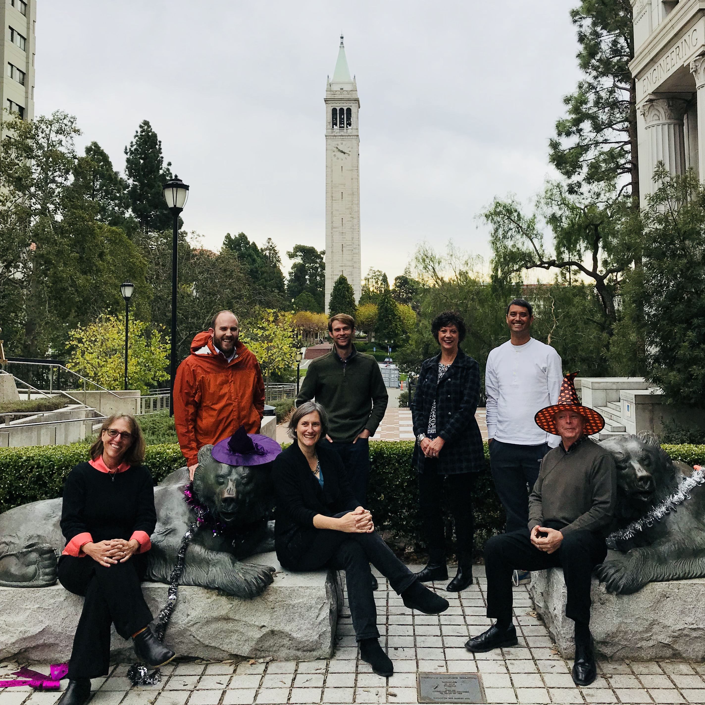

On November 7-8, 2017 the following individuals gathered for the express purpose of generating extensive content on the topic of Autonomous vehicles:

-   Rick Donnelly
-   Julie Dunbar
-   Greg Macfarlane
-   Brice Nichols
-   Dave Ory
-   Maren Outwater
-   Joan Walker

The following pages were generated during this two day workshop:

-   [Planning and policy context](Autonomous_vehicles_planning_and_policy_context)
-   [Behavioral considerations](Autonomous_vehicles_Behavioral_considerations)
-   [Modeling frameworks](Autonomous_vehicles_Modeling_frameworks)
-   [Forecasting](Autonomous_vehicles_Forecasting)
-   [Use cases](Autonomous_vehicles_use_cases)
-   [Early applications](Autonomous_vehicles_Early_applications)

