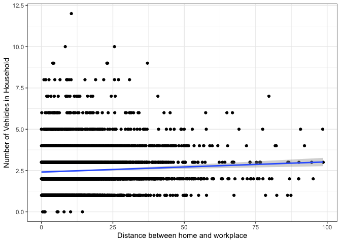

This page discusses why count models are necessary in certain applications, and
discusses beginning details of the Poisson, negative binomial, and hurdle models.

## Continuous versus count outcomes
Typical [regression models](Regression_Analysis) are aimed at predicting the
response of an outcome variable $y$ to a series of input variables $X = [x_1, x_2, \ldots x_p]$.
The result is a linear equation of a vector $\beta$ that describes the relationship
between each element of $X$ and the outcome $y$.

$$y = X\beta$$
This regression framework assumes that $y$ is a continuous variable, meaning
that it can take any numeric value within a particular range. The plot below
shows the relationship between the distance between home and workplace on the
$x$ axis, and the total miles driven on all vehicle trips on the $y$ axis,
for a sample of 5,000 reported car commuters who responded to the 2017 NHTS.
Both of these variables are continuous, meaning that a simple $y = X\beta$
regression model is appropriate, though more information might need to be
added to the model below to improve its fit and help explain outlying observations
or control for heteroskedasticity.

<!-- -->

But consider the plot below, showing the distance between home and work on the $x$ axis and
the number of vehicles owned by the commuter's household on the $y$ axis. Because
the number of vehicles is discrete and not continuous, the plot looks kind of
funny. But more importantly than this, we want a model that will predict
a discrete number of vehicles as an outcome variable, and the blue regression
line we estimated below will predict between 2.5 and 3.2 vehicles per household;
this isn't ideal.

<!-- -->

## Poisson Model

### Negative Binomial Model

## Hurdle Model
