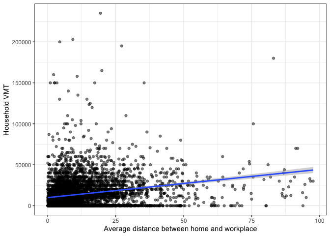

This page discusses why count models are necessary in certain applications, and
discusses beginning details of the Poisson, negative binomial, and hurdle models.

## Continuous versus count outcomes
Typical [regression models](Regression_Analysis) are aimed at predicting the
response of an outcome variable $y$ to a series of input variables $X = [x_1, x_2, \ldots x_p]$.
The result is a linear equation of a vector $\beta$ that describes the relationship
between each element of $X$ and the outcome $y$.

$$y = X\beta$$

This regression framework assumes that $y$ is a continuous variable, meaning
that it can take any numeric value within a particular range. The plot below
shows the relationship between the average distance between home and workplace for
workers in the household on the
$x$ axis, and the household VMT on the $y$ axis,
for households in smaller cities who responded to the 2017 NHTS.
Both of these variables are continuous, meaning that a simple $y = X\beta$
regression model is appropriate, though more information might need to be
added to the model below to improve its fit and help explain outlying observations
or control for heteroskedasticity.

<!-- -->

But consider the plot below, showing the same $x$ axis but with
the number of home-based work trips produced by each household on the $y$ axis.
Because the number of trips is discrete and not continuous, the plot looks kind
of funny. But more importantly than this, we want a model that will predict a
discrete number of vehicles as an outcome variable, and the blue regression line
we estimated below will predict between 2 and 1 trips household; this
isn't ideal.

<!-- -->

## Poisson Model

A better option would be to predict a probability that each household will produce
a certain discrete number of trips. One way to do this is with a Poisson
regression model. In this model, an analyst predicts the mean of a Poisson
distribution with a regression equation (instead of a line). The
Poisson distribution is:

$$P(k | \lambda_i) = \frac{\lambda_i^ke^{-\lambda_i}}{k!}$$

where the probability of a discrete outcome $k$ is determined by the mean
$\lambda_i$ of the distribution. The plot below shows how as the mean increases,
the probability of higher outcomes increases.

<!-- -->

A Poisson regression model allows attributes of an observation to affect the
value of the mean. So instead of $y = X\beta$ in the linear regression, we now
have $\lambda = X\beta$, and $\lambda$ gets put into the distribution equation
above. In the model below, average work distance decreases the average number of
trips, but more workers and more vehicles increases the average number.

<table class="table" style="width: auto !important; margin-left: auto; margin-right: auto;">
 <thead>
  <tr>
   <th style="text-align:left;">   </th>
   <th style="text-align:center;"> Linear </th>
   <th style="text-align:center;"> Poisson </th>
  </tr>
 </thead>
<tbody>
  <tr>
   <td style="text-align:left;"> (Intercept) </td>
   <td style="text-align:center;"> -0.106 </td>
   <td style="text-align:center;"> -0.570*** </td>
  </tr>
  <tr>
   <td style="text-align:left;">  </td>
   <td style="text-align:center;"> (-1.625) </td>
   <td style="text-align:center;"> (-13.865) </td>
  </tr>
  <tr>
   <td style="text-align:left;"> avg_workdist </td>
   <td style="text-align:center;"> -0.010*** </td>
   <td style="text-align:center;"> -0.006*** </td>
  </tr>
  <tr>
   <td style="text-align:left;">  </td>
   <td style="text-align:center;"> (-6.851) </td>
   <td style="text-align:center;"> (-7.070) </td>
  </tr>
  <tr>
   <td style="text-align:left;"> wrkcount </td>
   <td style="text-align:center;"> 1.168*** </td>
   <td style="text-align:center;"> 0.665*** </td>
  </tr>
  <tr>
   <td style="text-align:left;">  </td>
   <td style="text-align:center;"> (29.000) </td>
   <td style="text-align:center;"> (28.801) </td>
  </tr>
  <tr>
   <td style="text-align:left;"> hhvehcnt </td>
   <td style="text-align:center;"> 0.147*** </td>
   <td style="text-align:center;"> 0.089*** </td>
  </tr>
  <tr>
   <td style="text-align:left;box-shadow: 0px 1px">  </td>
   <td style="text-align:center;box-shadow: 0px 1px"> (5.626) </td>
   <td style="text-align:center;box-shadow: 0px 1px"> (5.925) </td>
  </tr>
  <tr>
   <td style="text-align:left;"> Num.Obs. </td>
   <td style="text-align:center;"> 5533 </td>
   <td style="text-align:center;"> 5533 </td>
  </tr>
  <tr>
   <td style="text-align:left;"> R2 </td>
   <td style="text-align:center;"> 0.185 </td>
   <td style="text-align:center;">  </td>
  </tr>
  <tr>
   <td style="text-align:left;"> R2 Adj. </td>
   <td style="text-align:center;"> 0.185 </td>
   <td style="text-align:center;">  </td>
  </tr>
  <tr>
   <td style="text-align:left;"> AIC </td>
   <td style="text-align:center;"> 19111.6 </td>
   <td style="text-align:center;"> 17871.7 </td>
  </tr>
  <tr>
   <td style="text-align:left;"> BIC </td>
   <td style="text-align:center;"> 19144.7 </td>
   <td style="text-align:center;"> 17898.1 </td>
  </tr>
  <tr>
   <td style="text-align:left;"> Log.Lik. </td>
   <td style="text-align:center;"> -9550.813 </td>
   <td style="text-align:center;"> -8931.830 </td>
  </tr>
  <tr>
   <td style="text-align:left;"> F </td>
   <td style="text-align:center;"> 419.097 </td>
   <td style="text-align:center;">  </td>
  </tr>
</tbody>
</table>

Of course, this is just an average. In a trip-based model, this average for each
household might be sufficient. But you could also simulate a discrete choice
for each person. The plot below shows the probability of a certain number of trips
made by a sample of households, alongside what the predicted Poisson mean was.
Households with a higher predicted mean have a higher probability of making more
trips.

<!-- -->

### Negative Binomial Model
The Poisson model assumes that the mean and standard deviation of the distribution
are the same. This can be a bad assumption, because it forces the distribution to
spread out when the mean is higher. The negative binomial model relaxes this assumption,
and might be useful in some contexts.

### Hurdle Model
The Poisson and negative binomial models assume the same distribution across
all outcomes; this might not be desirable if the number of zeros is high or
low for some structural reason. For example, owning zero vehicles is very different
from owning one or two. A hurdle model breaks the distribution into two different
components:

  - A binomial model determines the probability of choosing zero versus a positive
  number.
  - A poisson or negative binomial model (with zero removed) determines the
  probability of a specific positive number, conditioned on the previous model.

## References

 1. [UCLA Stats](https://stats.idre.ucla.edu/r/dae/poisson-regression/)
