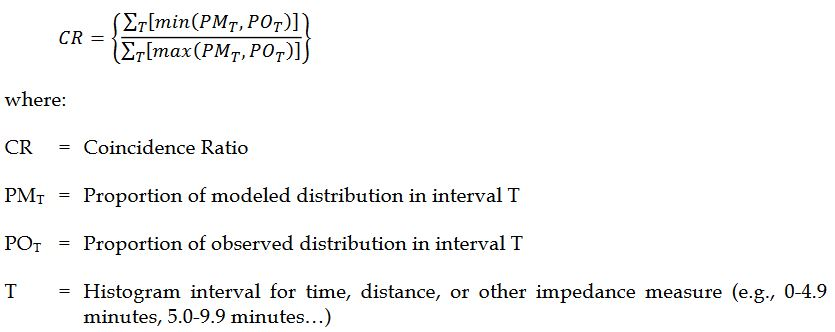
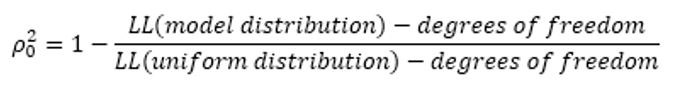
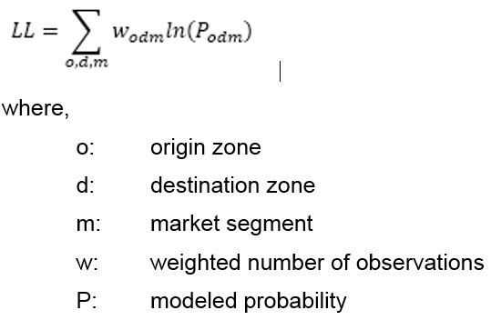
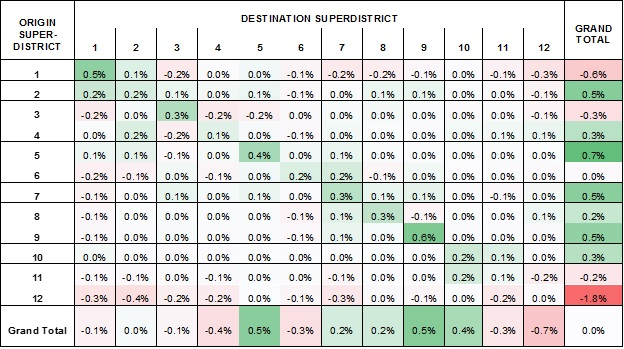
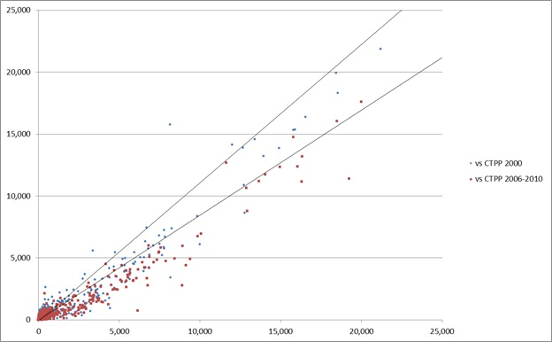

 This page is part of the Category \[.

In practice, destination choice models can rarely be applied for forecasting exactly as they are estimated. Calibration adjustments are commonly required for several reasons. Sometimes application of the model to application data sets produce results that differ in some important ways from the results when the model is applied to the estimation data sets. In some cases such differences can be caused or exacerbated by inconsistencies between the model estimation and application (such as different sources for explanatory variables like income or travel time or the omission of constraints in estimation). Careful and thoughtful adjustments in keeping with good professional judgment can be required to ensure the applied model demonstrates both reasonable ability to replicate observed travel patterns (from both estimation data and in some cases, other independent data sources for validation) and reasonable response properties or elasticities to key variables.

Estimation, Calibration, and Validation
---------------------------------------

The development of destination choice models includes several processes. Initial model parameters are statistically estimated from observed data (for more information see [here](Destination_Choice:_Parameter_Estimation)). Validation refers to the comparison of model results to independent observed data not used in parameter estimation. Initial comparison of the results from the application of the estimated model with independent validation data rarely confirms the validity of the model as estimated. The resulting process of adjusting the model specification and/or model parameters to achieve validation is referred to as calibration. Good professional judgment is required to balance the desire to achieve good fit between model results and validation data with the danger of distorting model sensitivities to change.

### Comparison of Predicted and Observed OD Matrices

The results of a destination choice model can be validated against OD matrices that are estimated or observed based on independent real-world data not used in model estimation. Since destination choice models are typically estimated from household survey data, the two most commonly used sources of validation data are traffic counts and more recently, passive OD data. Traffic counts can be used to validate destination choice models in several ways. Traffic counts along screenlines can be compared to the results of assigning the modeled OD matrix to a network, or in some cases, directly to aggregate district-to-district flows. Traffic counts can also be used to estimate OD matrices using origin-destination matrix estimation (ODME) routines. A comparison of model predicted OD matrices and ODME generated OD matrices can in some cases provide key insights on the validity and performance of the destination choice model, but only if the ODME process is used judiciously with good seed OD data and reasonable constraints on the perturbation of the seed. Passively collected data from mobile or in-vehicle devices are also now being used to infer OD matrices which can be used to validate destination choice models. In practice, traffic counts and passive OD data can and are often combined by using passive OD data as the seed for ODME or using traffic counts in some other way to expand passive OD data. Combining data from multiple sources (e.g., network sensors, count stations, smartphone traces, and GPS-enabled/connected devices or vehicles) may offer considerable promise in further enhancing the profession’s ability to derive accurate OD matrices that reflect ground truth on spatio-temporal patterns of mobility. Comparisons between model implied OD matrices and real-world OD matrices by time of day period can also be valuable in ensuring that the temporal distribution of travel is also being captured accurately in the model system. There are many ways to measure the distance (extent of similarity or dissimilarity) between two matrices (see [here](https://math.stackexchange.com/questions/507742/distance-similarity-between-two-matrices) as well as the discussion of [calibration measures](Destination_Choice:_Calibration_and_Validation#Calibration_Measures) below). Although it is desirable for model predicted OD matrices to replicate ground truth conditions closely, care must be exercised in the extent to which model parameters and constants are adjusted to match observed conditions. Analysts should exercise caution to avoid over-fitting to ground truth conditions lest the adjustments in model parameters or constants result in a model that replicates current conditions accurately at the expense of offering robust forecasts in future years under alternative scenarios.

### Sensitivity Analysis

As travel demand models are largely used for forecasting and predicting travel demand under alternative built environment and socio-economic/demographic scenarios, it is important to check the reasonableness of a model with respect to its predictive ability. While the ability to replicate ground truth conditions in the base year may be a necessary condition for validation, it is not necessarily a sufficient condition. To be certain of validity of the model under a wide variety of application scenarios, the model should ideally be dynamically validated using sensitivity tests. For a series of scenarios defined by changes in system conditions, the destination choice model should be applied and resulting changes in spatial patterns of travel demand should be examined for their reasonableness, degree of change/sensitivity, and predictive accuracy. In some instances, there may be real-world data (such as that available before-and-after an infrastructure improvement or a major land use change) and the predictive accuracy of the model can be compared against such longitudinal data. The possibility of such before-and-after comparisons is increasingly feasible given the new availability of cost effective passive OD data. Alternatively, the changes in spatial patterns of travel predicted by the model can be checked for reasonableness based on local knowledge of travel demand and its elasticity with respect to changes in system conditions. In some cases, there may also be statistics (measures of elasticity or change) published in the literature; such published sources may offer a basis to confirm the general validity of predictions output by a destination choice model. An example of such a publication is the [TCRP 95 Report](http://www.trb.org/Publications/TCRPReport95.aspx) series that documents Traveler Response to System Changes.

Calibration Measures
--------------------

A variety of measures can be used to evaluate the validity of destination choice models. Comparisons to trip length frequency distributions remain the most common approaches although it has been demonstrated that models can easily be over-calibrated to reproduce trip length frequency distributions at the expense of their ability to accurately reproduce actual spatial interaction patterns.[^1] Evaluation of the validity of destination choice models should therefore be based on actual comparisons of the predicted versus actual observed OD flows whenever possible. These comparisons frequently take the form of comparisons of district-to-district summaries of more detailed zonal OD flows, such as comparison of modeled county level commute flows to CTPP estimates. However, it is also possible to calculate a correlation coefficient or other goodness-of-fit measures depending on the type of data available. It is important to be aware, however, that spatial goodness-of-fit statistics are dependent on spatial aggregation or the zone system used, such that, for instance, district level statistics will appear better than zone level statistics and zone level statistics appear better than parcel level statistics comparing the same model to the same observed data. This is consistent with a general understanding of forecasting: given some observations about any given person, it is relatively easy to predict what city they work in, harder to predict the neighborhood, and quite difficult to accurately predict the exact building where they work.

### Trip Length Frequency Distribution

As noted above, comparisons of trip length frequency distributions (TLFD) are the most common validation checks performed for destination choice models and are generally considered a minimum requirement for documenting model validity in practice. Poor fit of the modeled TLFD to an observed TLFD clearly indicates that the model is not reproducing observed OD patterns. However, the converse is not true - good agreement between modeled and observed TLFDs does not guarantee that the model is reproducing observed OD patterns. There are many OD patterns with the same TLFD some of which can bear little resemblance to each other at all. Moreover, as is also noted above, over-fitting modeled TLFD to observed TLFD can actually degrade their replication of the observed OD patterns as measured by more robust goodness-of-fit measures.[^2] Therefore, while TLFD checks are generally recommended as a minimum standard of validation checking for destination choice models, whenever possible they should also be accompanied by evaluation of other calibration measures.

The trip length frequency distribution (TLFD) is calculated as the percentage of trips falling into certain ranges of distance (or duration), say 0-1 mile, 1-2 mile, 2-3 miles, etc. The figure below shows an example comparison of modeled and observed TLFDs.

''Comparison of Modeled and Observed Trip Length Frequencies

TLFD checks are usually performed separately for each trip purpose and/or market segment. For work trips, Census journey-to-work data (CTPP and/or LODES) are often used as a validation data source for observed trip lengths, in addition to the data from household travel survey. For non-work trips, model TLFD is usually compared with household travel survey data. It is important to keep in mind that TLFDs from travel survey data can be lumpy due to limited sample size, and in such cases, the model TLFD should be smoother than the survey TLFD. Caution should be used in comparing modeled TLFD to TLFD observed in passive data sources since these data are susceptible to systematic bias with respect to trip lengths which must be carefully corrected using appropriate expansion techniques in order to support valid comparisons.

In addition to visual comparison of TLFDs through graphs, these comparisons are sometimes quantified using metrics such as average trip lengths and/or coincidence ratios. The coincidence ratio measures the area under both TLFDs, as defined below:

Based on this definition, the coincidence ratio is defined on the range from 0 to 1 with 1 indicating identical distributions and values closer to 1 generally being more desirable within reason (although values very close to 1 may indicate over-fitting).

### Intrazonal Trip Percentages

Intrazonal trips are trips with both origin and destination in the same zone and constitute the diagonal of the OD matrix. Comparison of the modeled and observed percentage of intrzonal trips are an important calibration check for destination choice models. Attention to intrazonal trips is important because in model applications, intrazonal impedances or travel times are generally calculated by a different method than interzonal impedance or travel times and both this fact and sometimes differences in the nature of very short trips can lead to unreasonably high or low shares of intrazonal trips. Some agencies have used criteria such as that regionwide modeled intrazonal percentages should be within three percent of observed intrazonal percentages. This criteria may not be reasonable for all applications but large deviations between modeled and observed intrazonal percentages generally indicate the need for a calibration adjustment.

### Goodness-of-Fit Statistics

Formal goodness-of-fit statistics such as log likelihoods and rho-squared (or pseudo-r-squared) statistics are commonly used in the estimation of destination choice models to compare the model's predictions to observed patterns in the estimation data. These statistics are particularly valuable because they can summarize in a single measure the agreement of modeled and observed overall OD patterns - and distinguish, for instance, between different patterns with the same TLFD. Good goodness-of-fit statistics can therefore provide a much greater level of confidence in the validity of a destination choice model than traditional TLFD comparisons.

However, as noted above, it is important to keep in mind that spatial goodness-of-fit statistics are dependent on spatial aggregation or the zone system used, such that, for instance, district level statistics will appear better than zone level statistics and zone level statistics appear better than parcel level statistics comparing the same model to the same observed data. Bearing this is mind, it is difficult to formulate general criteria for goodness-of-fit statistics what constitutes a good value differs with the resolution of the zone system. Moreover, even though the scale does vary with the geographic resolution of the zones used, some generalizations can still be made. For example, aggregate destination choice models at the level of metropolitan traffic analysis zones commonly have rho-squared statistics in the range of 0.15 to 0.45.

While the variation of these statistics with zone sizes does limit the usefulness of these statistics for the establishment of validation guidelines or comparisons between different models, goodness-of-fit statistics can provide very valuable information about how much of the observed variation in OD patterns is explained or reproduced by the model. In particular, the rho-squared statistic can be understood in this way as the portion of the observed variation in destination choices at the level of the zones used explained by the model.

As valuable as they are, in practice these goodness-of-fit statistics are rarely re-calculated after estimation in the process of calibration. Wider use of formal goodness-of-fit statistics as a calibration measure could be an important advance to the state of the practice.

The most common formal goodness-of-fit statistic for destination choice models is the adjusted rho-squared statistic. The adjusted rho-squared is derived by comparing the log-likelihood of the model versus the observed data to the log-likelihood of a uniform discrete distribution versus the observed data. For this reason, rho-squared is sometimes also referred to as pseudo-r-squared because it can be thought of as analogous to or an extension of the common r^2^ used as a standardized goodness-of-fit measure for regression models derived from the sum of squared errors. Both statistics are measured on the range of 0 to 1 with higher values indicating greater model explanatory power and goodness-of-fit to observed data. The formula for the adjusted rho-squared is given below:

In turn, the log-likelihood of a probability distribution versus a set of discrete observations (weighted trips by mode in this case) is defined as follows:

Although formal goodness-of-fit statistics are often calculated using disaggregate data in the context of parameter estimation and are thought of in this context, they can be calculated in aggregate modeling contexts as well. Although it is not common to think of trip matrices as probability distributions, they can be easily understood and interpreted this way. Model trip tables can be easily converted into probability distributions by dividing each cell by the grand sum of the matrix (or of all matrices). A uniform probability distribution is simply a matrix (or matrices) of constants equal to the inverse of the dimensions of the distribution (number of zones x number of zones x modes).

### Aggregate District-to-District Flows

Interpreting a direct comparison of OD flow matrices is not possible (without the use of goodness-of-fit statistics) at the level of traffic analysis zones when these number in the hundreds or thousands, and even if it were, great care would need to be taken in considering the precision of the observed data at this level of resolution. However, by grouping zones into more aggregate districts, meaningful and valuable comparisons can be made between modeled OD flows between a dozen or so districts. Such checks are a best practice in destination choice model validation. They are most commonly used to compare county-level journey-to-work flows from the model to Census data, but can also be used to compare modeled flows for other trip types to household survey or passive data. While less comprehensive and rigorous than formal goodness-of-fit statistics, aggregate OD flow comparisons can provide valuable insights into what aspects of observed OD patterns a destination choice model does and does not capture and sometimes thereby suggest improvements to the model specification or specific calibration adjustments. An example of a district level OD flow comparison is offered below.

''Comparison Between Passive Cell Phone Based ODs and Destination Choice Models with Fixed Factors in Chattanooga

The same information can also be presented visually using scatterplots. The example below compares a home-based work destination choice model to Census journey-to-work data from two different time periods.

''Comparison of Modeled Home-based Work Flows to CTPP Data

In some cases, especially such as statewide models, the use of a log-log scale can be helpful for examining the fit of the model at different scales or orders of magnitude.

### Screenline Counts

Traffic counts along a screenline or cutline can be used to validate destination choice models in two ways. When a screenline partitions the model zone system into two distinct districts, a direct comparison can be made to aggregate district-to-district flows in the OD matrix. In other cases, the modeled OD matrix can be assigned to the model network and modeled network flows can be compared against screenline counts. In this context, it is important to keep in mind that if the model results do not reproduce screenline counts that this can be the result of problems either with the destination choice model or with the network assignment procedures.

Technical note: screen lines that fully partition the modeling region are mathematically identical to district-to-district validation tools, just with different district boundaries.

Calibration Strategies
----------------------

The objective of model calibration is to ensure that the estimated model, when applied to the entire region, reproduces the aggregate regional travel patterns, as observed in the OD data that was the source for model estimation, as well as in other, independent OD data sources. There are many reasons why the estimated model, when first applied, fails to reproduce the observed travel patterns:

-   The model may have been estimated with a very small sample of OD records, such that many OD flows may be missing or under/over-represented.
-   There may be errors upstream of the distribution model, for example in the level of service matrices, mode choice logsums, trip productions, home locations, employment estimates, and other model inputs.
-   Some key characteristic of the travel market may have been missed in the model estimation
-   The model estimation may have resulted in insignificant parameters for some variables that are nonetheless important to retain in the final model
-   Accessibility variables and other techniques used to represent agglomeration and destination constrains may not fully capture the effect on the constraints on the estimated parameters.
-   There may be an error in the model application software

It is incumbent upon the model developer to identify the most appropriate corrective action – adequate software testing, verification of all model inputs, re-estimation with additional explanatory variables and/or exploring market segmentation. However even after such steps have been taken, it is oftentimes necessary to adjust the estimated model parameters to improve the fit of the model to the observed aggregate data. Possible calibration actions include adjusting the coefficients of the impedance terms, adjusting the coefficient for intrazonal trips and other possible indicator variables, and adjusting the size term coefficients. The calculation of shadow prices for usual work and school location models is generally considered a model calibration step. The flexibility of the model structure allows for accounting for systematic differences that may emerge when the model is applied, and that may lead to additional utility function terms. Finally, when sampling is used to construct the destination choice set, sometimes adjusting the sampling utility function can lead to a better model fit.

The general approach for adjusting the model parameters is similar to the technique used to calibrate alternative-specific constants in other choice models. Consider first the case of adjusting the coefficient for intrazonal trips. Let’s suppose that S^0^~iz~ is the observed share of intrazonal trips, S~iz~ is the predicted share of intrazonal trips, and k~iz~ is the coefficient on the intrazonal indicator variable. The calibration adjustment can be calculated as:
delta = ln(S^0^~iz~)/ln(S~iz~)
and the adjusted constant would be:
k'~iz~ = k~iz~ + delta x dampening factor

The dampening factor is optional though highly recommended to avoid large swings to the model utility. A value between 0.25 and 0.50 usually works well. It may take a few iterations to arrive at the appropriate revised constant, that is, the one that ensures that S~iz~ is approximately equal to S^0^~iz~.

The process described above is largely mechanic and easily implementable in an automated fashion. Care should be taken though to avoid distorting the model in an effort to force it to match the observed shares, for example by calibrating an intra-zonal constant that is so large as to render the model insensitive to the other terms in the utility function. When this happens, it may be worthwhile to consider an alternative specification for intra-zonal trips, such as based on zone density and/or zone size, among other corrective actions.

The same technique can be used to adjust the coefficients of the distance terms, which is typically how the model is first calibrated to the observed trip length frequency. In this case though, the objective is to change the entire distance term specification, which may include several components: linear, square, log, square root, etc. Thus, the calibration “delta” is not a point estimate, but instead a function. This function adjustment can be calculated as follows:

1.  Apply the destination choice model, and tabulate the predicted TLFD, for example at half-mile bins
2.  Calculate the log ratio of observed to estimated trips shares for each distance bin
3.  Fit a function to the (distance, log ratio) points
4.  Add this function to the initial distance term, possibly dampened to avoid large swings

While this technique works in principle, a common pitfall must be watched for: the estimated delta function, when added to the original distance terms, may result in increasing marginal disutility with respect to distance for part of the valid range of distances in the model region. This specification should be avoided, since it states that the probability of selecting a destination zone increases with the distance to the destination, a clearly counter-intuitive specification. One technique that may be used to avoid this problem is to use a piece-wise specification, such as:

(add piece-wise spec)

This type of specification in itself is not a panacea, as it can result in cliff effects when the break points are not well-chosen.

References
==========

[Content Charrette: Destination Choice Models](Content_Charrette:_Destination_Choice_Models)

[^1]: Ye, X., W. Cheng and X. Jia (2012) "Synthetic Environment to Evaluate Alternative Trip Distribution Models." Transportation Research Record: Journal of the Transportation Research Board, No. 2302: p. 111-120.

[^2]: Ye, X., W. Cheng and X. Jia (2012) "Synthetic Environment to Evaluate Alternative Trip Distribution Models." Transportation Research Record: Journal of the Transportation Research Board, No. 2302: p. 111-120.

