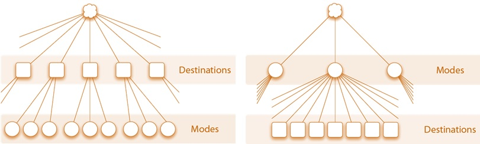

 This page is part of the Category \[.

Destination choice models can be implemented in various ways in different travel modeling frameworks. They can be applied disaggregately in activity-based models using Monte Carlo simulation or aggregately in trip-based models using matrices. In both of these contexts, there are important issues related to how destination choice models are integrated with the larger model system. Key issues include how various destination choices are related to each other, how choices of destination and mode are related to each other, and how the larger model system acheives an equilibrium between travel demand and supply, commonly through iterative feedback loops. Destination choice models can also be implemented in an incremental or [pivoting framework](Data_Driven_Methods#Pivot-Point_Methods).

Aggregate vs. Disaggregate Applications
---------------------------------------

Destination choice models can be applied disaggregately in activity-based models using Monte Carlo simulation or aggregately in trip-based models using matrices. In an aggregate model the destination choice selection probabilities are applied to all trips produced in a given [TAZ](Traffic_Analysis_Zone) at once, while in a disaggregate framework, a destination is predicted for individual trips, one at a time.

### Aggregate Applications

The application of a destination choice model in an aggregate framework, such as in a trip-based model, follows the same practice as commonly used for mode choice models. That is, destination selection probabilities are calculated for each trip market segment, and then they are multiplied by the total trip productions predicted for the market segment. In essence, the selection probabilities are treated as “shares”, to be used in allocating the trips produced in zone i to all destinations j in proportion to the selection probabilities. In an aggregate framework, care must be taken to use a consistent trip segmentation from trip generation through mode choice, particularly when mode choice logsums are used in the destination choice utility. A good practice is to use the same trip segmentation in the destination and mode choice models, and to use a trip generation segmentation that can be easily collapsed into the destination choice segments.

Given that most regional models have thousands of TAZs, the selection probabilities can be very small for the majority of TAZs. It is important to use adequate floating point precision when applying these models to avoid introducing rounding and/or truncation errors.
Aggregate applications of destination choice models can sometimes take advantage of optimized routines in travel modeling software packages for applying gravity models by reformulating the destination choice model as a gravity model with k factors where the k factor is calculated as the residual of the utility function beyond the impedance and size terms.

Doubly-constraining a destination choice model in an aggregate framework is typically accomplished by the application of iterative-proportional fitting (IPF), with target destination controls that are proportional to the model attractions

### Disaggregate Applications

The application of destination choice models in a disaggregate framework, such as an activity-based model, requires applying [Monte Carlo simulation](https://en.wikipedia.org/wiki/Monte_Carlo_method) to select a single TAZ as the trip or tour destination, given selection probabilities. The use of Monte Carlo simulation is common in the implementation of other probabilistic models, such as those used to predict mode choice, auto ownership or tour frequency in activity-based models.

In a disaggregate model the mode choice logsums used in the destination choice models are oftentimes referred to as “representative” logsums, because they omit certain decision-maker characteristics, in the interest of maintaining model run times within practical limits. For example, while the model system may use distributed values of time, the mode choice logsums may be computed only for a small number of value of time classes. Similarly, representative logsums may be used when the mode choice model includes explanatory variables such as age or household composition.

It is also common in a disaggregate framework to use a [sample of alternatives,](Destination_Choice_Set_Formation#Sampling_Approaches) rather than the entire destination choice set, when applying the model. This strategy is also used to control model run times, since resolving the destination choice probabilities over thousands of alternatives can be computationally onerous, although it is becoming less and less so.

Doubly-constraining a destination choice model in a disaggregate framework is typically accomplished with shadow prices. Shadow prices need to be calculated iteratively, since there is no exact a priori formula that will result in a doubly-constrained model.

System Integration Issues
-------------------------

Key issues include how various destination choices are related to each other, how choices of destination and mode are related to each other, and how the larger model system achieves an equilibrium between travel demand and supply, commonly through iterative feedback loops.

### Inter-related Destination Choices

Many destination choices are importantly related to each other, such as the choices of the various stop locations on a single tour. These relationships between various destination choices are reflected differently in various trip-based, hybrid, and activity-based modeling systems. For more discussion of joint or conditional destination choice frameworks see [here](Joint_/_Conditional_Destination_Choices).

### Destination and Mode Choice

Travelers' choices of destination and mode are importantly related. In the four-step model, [mode choice](Mode_choice) was originally formulated as conditional on destination choice, being applied as the third step after the second step of [trip distribution](Trip_distribution). This approach has the advantage of allowing mode choice models to be formulated using actual travel times between origins and destinations as level-of-service variables. Moreover, this formulation of mode choice models conditional on destination choice has been institutionalized in various guidelines for model development and application (such as for FTA grant applications).

Building on this approach, efforts to link mode and destination choice have most commonly involved the use of mode choice logsums as a multimodal impedance variable in destination choice models. In theory, if properly specified, this approach results in the destination-mode choice model system taking the mathematical form of a nested logit model. Such models can theoretically be (and have in a few cases actually been) estimated simultaneously as a single model, but the explosion of alternatives in this framework typically makes simultaneous estimation computationally intensive if not intractable. More commonly, the models are estimated sequentially, with the results of the mode choice model being used in the destination choice model estimation. This approach has been shown to be a form of limited information maximum likelihood and while unbiased is statistically inefficient compared to full information maximum likelihood estimation.

However, this widespread approach commonly leads to problems such as the inability to predict realistic trip length frequency distributions without the use of other, highly correlated explanatory variables such as distance and the inability to estimate valid parameters for the mode choice logsum variable in the destination choice model such that this parameter is often asserted in practice. Some have interpreted these problems as an indication that the traditionally assumed choice hierarchy is incorrect, and formulated alternative joint mode and destination choice models with the reverse hierarchy where destination choice is modeled as conditional on mode choice and destination choice logsums are used as explanatory variables in the mode choice.[^1]

''Traditional and Reverse Mode and Destination Choice Hierarchy

The traditional hierarchy implies that mode choices are more elastic (or more likely to change in response to shocks such as changes in travel times or fares) than destination choices. While this assumption is reasonable in certain travel markets or for certain market segments such as choice riders with personal vehicles available as an alternative, in many circumstances particularly in the United States, it may be more reasonable to assume that destinations are more elastic than modes. Transit captive travelers destination choice set may be determined by local bus service, for instance, in many cases. The assertion of the traditional choice hierarchy, by enforcing this hierarchy of elasticities, may be a cause of optimism bias in transit forecasts.

### System Equilibrium and Feedback

Originally, trip distribution models were applied using impedance measures based on free-flow or uncongested travel times. In this case the travel times on which the spatial distribution of trips is based are generally inconsistent with the travel times predicted by assignment in the larger model system. Combined distribution models were formulated and the practice of “feedback” developed to address this problem, especially to support emissions modeling which requires realistic travel times or speeds. In the context of travel forecasting, feedback generally refers to iterating the entire or several steps of the travel demand-network modeling system. At minimum, it generally means the feedback of travel times from assignment to distribution or destination choice. It was eventually recognized and proved that feedback models are equivalent to and can be formulated as combined distribution-assignment models.

The feedback process is common, and can be required under certain air quality conformity conditions, but is not universal. Although incorporating some form of system feedback is now quite common, there is little consistency in the details of how this feedback is implemented. Feedback can and has been implemented by feeding back trip tables or flow matrices, travel time or skim matrices, link flows or link travel times. Averaging can be done using the method of successive averages (MSA) or fixed factor methods. There are even more different criteria in use to measure the convergence of feedback loops or combined model systems. A key development in recent years with regard to feedback methods was the recognition that “naïve” feedback without any averaging of flows or travel times across iterations may not converge.

References
==========

[Content Charrette: Destination Choice Models](Content_Charrette:_Destination_Choice_Models)

[^1]: Newman, J., and V. Bernardin. “Hierarchical Ordering of Nests in a Joint Mode & Destination Choice Model.” Transportation, Vol. 37, No. 4 (2010): p. 677-688.

