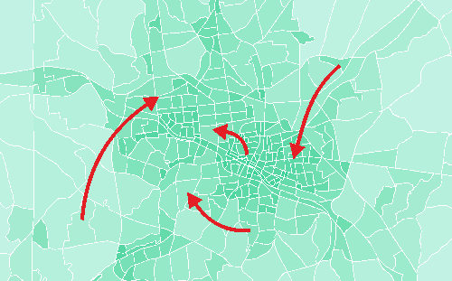
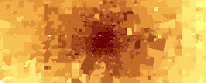

 This page is part of the Category \[.

The flexibility of destination choice models comes at a cost. While it is possible to represent the selection of trip destinations more rigorously, destination choice models tend to require more data and data with higher fidelity than traditional \[. A theoretical discussion of [factors affecting destination choice](Factors_Affecting_Destination_Choice) provides a general discussion, while this page list specific data sources that are commonly used in destination choice modeling. There are two types of data that are relevant for destination choice models. [Observed choice data](Destination_Choice_Data_Sources#Observed_Choice_Data) describe origin-destination flows that have been observed in a survey, by counting or by passive data collection. [Explanatory data](Destination_Choice_Data_Sources#Explanatory_Data), on the other hand, refer to input data that describe either destinations or characteristics of the decision maker who chooses the destination.

Observed Choice Data
--------------------

Observed Choice Data describe actually chosen origin-destination pairs. Usually provided at a zone-to-zone resolution, these data provide at a minimum the origin and destination of individual trips. For [tour-based](Tour_based_models) or [activity-based models](Activity_Based_Models), an entire trip chain is provided, such as going from home to work, from work to a restaurant and the restaurant back home. Often, such data are stratified by trip purpose, mode, time of day and various socio-demographic characteristics of the traveler.

### Household Travel Surveys

The most common source for Observed Choice Data are [household travel surveys](Household_travel_surveys). Origins and destinations usually are collected at the address level and translated into [TAZ](Traffic_Analysis_Zone) for data analysis. Long-distance data commonly are provided at a coarser geography, such as counties or metropolitan areas. Surveys have the benefit that they tend to provide rich information on the socio-demographic characteristics of the traveler as well as the purpose of the trip. In addition to individual trips, surveys also commonly allow the analyst to identify entire tours.

### Census Journey-to-Work

The [Census Transportation Planning Products Program](http://ctpp.transportation.org) (CTPP), hosted by the American Association of State Highway and Transportation Officials (AASHTO) in cooperation with the states, collects data on work trips. The rich dataset includes where people live and work, their journey to work commuting patterns and the modes they use for getting to work. Commute flow data are provided at the county-to-county level by mode. No trip purposes other than journey to work are represented in this dataset.

The Longitudinal Employer-Household Dynamics, published by the U.S. census bureau, additionally offers the LEHD Origin-Destination Employment Statistics, or [LODES](https://lehd.ces.census.gov/data/#lodes) dataset. These data provide commuter flows at the resolution of 2010 census blocks. Flow data are provided in 3 age groups (29 or younger, 30 to 54, 55 or older), 3 income groups (earnings \$1250/month or less, 1251/month to 3333/month, greater than 3333/month) and 3 industry categories (Goods Producing industry sectors, Trade, Transportation, and Utilities industry sectors, All Other Services industry sectors).

### Passively Collected Data

In contrast to survey data, passively collected data do not ask people about their travel behavior but rather collect data passively through cellular phones, GPS devices or other location-revealing technologies. While these data generally do not provide socio-demographic details of the traveler nor information on the motivation for a trip, these data have proven to be powerful because of their magnitude of coverage.

While surveys often cover 1 or 2 percent of the population, it is not uncommon for passively collected data to cover a quarter or a third of actual travel movements. An important benefit is the coverage of many origin-destination pairs. As an example, a household travel survey for the state of Tennessee covered with over 10,000 households roughly 40,000 origin-destination pairs, which is only 0.3 percent of all possible origin-destination pairs in Tennessee. Cell phone data, on the other hand, was able to capture 26 percent of all origin-destination pairs. There are many origin-destination pairs that are traveled very rarely (particularly from one rural area to another rural area in a different part of the state). Hence, it is expected that cell phone data was able to capture almost all origin-destination pairs that are actually traveled. The almost complete coverage has important benefits for the estimation of destination choice models, as the choice set is covered representatively.

A disadvantage of passively collected data is the lack of socio-economic characteristics of the traveler as well as missing information about the trip purpose. Sometimes, trip purposes are imputed by analyzing origin and destination. A trip from a residential area to a central business district could be classified as a home-to-work trip. The error margin of this imputation, however, is unknown. For this reason, passively collected data commonly are used for model calibration or validation purposes; however, they are also increasingly being used with [data driven methods](Data_Driven_Methods).

### Traffic Counts

Traffic counts commonly are provided by the local Department of Transportation or Metropolitan Planning Organization. Traffic counts also provide valuable information on origin-destination flows. For instance, traffic counts along [screenlines](Destination_Choice_Calibration_and_Validation#Screenline_Counts) can provide information on aggregate district-to-district flows and are commonly used for this reason in [destination choice model validation](Destination_Choice_Calibration_and_Validation#Estimation,_Calibration,_and_Validation). Traffic counts can also be used directly in model estimation to estimate model parameters (simultaneously with survey data).[^1] Finally, traffic counts may be used to impute origin-destination flows. In the so-called origin-destination matrix estimation (ODME), sometimes also called synthetic matrix estimation (SME), a trip matrix is synthesized that matches traffic count data.

ODME is a method to create a synthetic trip tables that resembles count data after assignment (Willumsen 1981[^2]). Such models often suffered from unexpectedly large differences in outcomes due to small changes in inputs (Aerde, Rakha and Paramahamsan 2003[^3]) as well as their inability to reconcile inconsistent or erroneous traffic counts (Hazelton 2003[^4]). As traffic counts do not distinguish trip purposes or user classes, ODME cannot provide trip tables by purpose or trip tables that distinguish travelers by socio-economic characteristics. Moreover, proper and responsible application of ODME reflects the importance of the initial seed distribution of OD patterns required by ODME and limits its distortion either through the formulation of the objective function for the optimization or the imposition of constraints. While in the past trip matrices generated with ODME flows were often only used if no other origin-destination data sources are available, the availability of good seed OD patterns from passive big data may now present a better foundation for ODME.

Explanatory Data
----------------

In addition to [observed choice data](Destination_Choice_Data_Sources#Observed_Choice_Data), destination choice models also need information on possible destinations, such as retail facilities, parks or hotels, and the corresponding [impedance](Impedance) to get there. Similarly, information about the travelers, such as age, sex or income, are relevant when estimating destination choice models. These data often are called Explanatory Data, or size term data. A more [theoretical discussion of explanatory data](Factors_Affecting_Destination_Choice#Size_Terms_/_Attractions) is provided elsewhere, this page here lists common data sources.

### Land Use Data

The most common attractor used in destination choice modeling are [socio-economic data](Spatial_Data#Land_Use/Demographic/Socio-economic_Data), i.e. population and employment. Employment often is distinguished by industry category, such as manufacturing, retail, office and other. Obviously, shopping trips are mostly attracted by retail employment, while trips for visiting most frequently are attracted by population. An important limitation of these data is that categories tend to be rather broad. Retail employment, for example, includes destinations as diverse as bakeries and car dealers, two very different retail facilities that in reality would attract very different trips. Further, is has been shown that larger facilities tend to attract more trips per employees than smaller facilities. Nevertheless, zonal land use data are the most common data source for modeling trip destinations.

**Zonal population data** usually are derived from [Census Data](https://www.census.gov/) that are provided at the Block Group Level. Population forecasts for future years are either developed manually (often using advise from an expert panel) or forecasted using \[.

**Zonal employment data** commonly are developed from business registration data. Clean-ups are necessary, because firms are commonly registered at their main site (or head quarter), and different branches are not coded explicitly. Alternatively, commercial databases (such as InfoUSA, Dun & Bradstreet or Woods & Poole databases) have been used.

### Accessibilities

[Accessibilities](Accessibility) are an aggregate measure that describes how easily from a given zone other destinations are accessible. The most commonly used definition of accessibilities are number of jobs that can be reached within a given time (such as 30 minutes), or the Potential Accessibility[^5] that discounts the size of destinations by their distance. Zones with higher accessibilities are generally assumed to attract larger number of travelers, all other things being equal. Zones with higher accessibilities tend to be located in neighborhoods that offer many trip attractions, and thereby, allow to link trips more easily.

A special form of accessibilities are [mode choice logsums](Skim_Matrix#Logsums) that do not only take into account travel time by one mode, but combine travel times by various modes. Modes may be weighted by the share they are used by a particular user class, which allows to better represent the relevance of transit access for low-income households.

### Passively-Collected Data

While [land use data](Destination_Choice_Data_Sources#Land_Use_Data) usually are based on census and business registration data, passively-collected data are gathered from online data sources, such as Cuebiq, Facebook, Foursquare, Google or Twitter. Often, these data are also called Location-Based Social Network (LBSN) data. These websites provides Application Programming Interfaces (API) that allow downloading the location, type and size of various trip attractors. Trip attractors include, for example:

-   Restaurants and Bars
-   Hotels
-   Parks
-   Ski Resorts
-   Outdoor
-   Medical facilities
-   Grocery Stores
-   etc.

The availability of categories depends on the LBSN site. Most LBSN websites allow downloading a small sample for free, while larger samples require paying a fee.

### Choice-Maker Data

Choice makers often are stratified in different user groups. This classification may be done by income, household size, number of workers, number of cars, car sufficiency (usually defined as cars per worker), age of head of household, or any combination thereof. In essentially all cases, trip purposes further stratify destination choice modeling.

In [trip-based models](Trip_Based_Models), the stratification in destination choice is constrained by the stratification defined in trip generation. [Activity-based models](Activity_Based_Models), on the other hand, commonly work with [synthetic populations](Synthetic_Population), and therefore, allow defining any stratification of user groups that works best in destination choice.

### Travel Time and Travel Cost Data

Finally, the destination choice model requires [impedances](Impedance) between zones. The impedance is commonly calculated as travel time, travel distance or travel costs. A combination of both is called generalized costs.

Costs may include parking, the costs for gasoline, maintenance costs, or the transit fare. For transit, access time, egress time, wait time and number of transit often is added to a generalized costs term.

#### Travel Time Conversions

It is not uncommon to convert travel time into the log of travel time. Using the log puts more emphasis on differences between destinations that are close. For example, if one grocery store is 6 minutes away and another one is 10 minutes away, the difference of 4 minutes may be important for the trip maker. On the other hand, a grocery store that is 30 minutes away is not perceived as being as much further away than another one that is 26 minutes away. Even though, the difference is the same, a difference of 4 minutes is perceived to be more relevant for short-distance trips than for longer distance trips. The log-conversion nicely accounts for this perception.

#### Online Sources for Impedances

Most commonly, [impedances](Impedance) are skimmed from the network of a travel demand model. In some cases, however, such data are not available from the model, particularly when the model is still under development. Alternatively, these data may be scraped from online sites.

For **short-distance travel**, the Google API allows downloading travel time and travel costs for a limited number of origin-destination pairs for free. For a large number of data requests, a fee has to be paid. Limiting the number of data requests per day may help avoid paying this fee. Where available, the Google API provides impedances by several modes.

For **long-distance travel**, the Rome2rio API provides travel time, costs and number of transfers for a variety of modes. A limited number of requests per day can be accessed for free. For larger datasets, a fee has to be paid.

References
==========

[Content Charrette: Destination Choice Models](Content_Charrette_Destination_Choice_Models)

[^1]: Bernardin, V., S. Trevino, G. Slater & J. Gliebe. “Simultaneous Travel Model Estimation from Survey Data and Traffic Counts.” Transportation Research Record: Journal of the Transportation Research Board, No. 2496 (2015): p. 69-76.

[^2]: Willumsen, L. G. (1981) Simplified transport models based on traffic counts. In: *Transportation* 10 (3):257-278. doi: 10.1007/BF00148462.

[^3]: Aerde, Michel, Hesham Rakha, and Harinarayan Paramahamsan (2003) Estimation of Origin-Destination Matrices: Relationship Between Practical and Theoretical Considerations. In: *Transportation Research Record: Journal of the Transportation Research Board* 1831 (-1):122-130. doi: 10.3141/1831-14.

[^4]: Hazelton, M. L. (2003) Some comments on origin-destination matrix estimation. In: *Transportation Research Part A - Policy and Practice* 37 (10):811-822. doi: Doi 10.1016/S0965-8564(03)00044-2.

[^5]: Hansen, Walter G. (1959) How accessibility shapes land use. Journal of the American Institute of Planners 25: 73-76.
