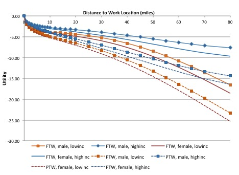

 This page is part of the Category \[.

The most common implementation of destination choice is the multinomial logit (MNL) model. Gravity models, which are commonly used in aggregate, trip-based models, can be shown to be a special case of destination choice. Another type of trip distribution model is the intervening opportunities model, which has fallen into disuse in North America. On the other hand, data-driven approaches are emerging, facilitated by the availability of origin/destination big data.

Multinomial logit
-----------------

### General specification

The following discussion assumes familiarity with the general formulation of [MNL](Choice_models). The destination choice problem is presented with reference to an individual decision-maker, however the model is equally applicable to aggregate, zone-based formulations.This section describes the specification of the destination choice utility function in general terms. More in-depth discussion of the factors that influence destination choice and how to represent them in the MNL model can be found [here](Factors_Affecting_Destination_Choice).

Given a trip origin *i*, and decision-maker *m*, the utility of each destination *j* can be written as follows:

$${ U }_{ j|im }={ \beta }_{ m }\times { TravelImpedance }_{ ij }+\ln { \left( { Size }_{ jm } \right) }$$

In this formulation, the utility of a destination depends on (a) the [impedance](Impedance) or spatial separation between the trip origin and the destination, and (b) the size or attractions at the destination. This is the simplest representation of destination choice utility. The impedance term is oftentimes referred to as the *qualitative* utility component, while the size or attraction term is referred to as the *quantitative* component.

[Impedance](Factors_Affecting_Destination_Choice#Distance_/_Impedance_Terms) can be measured by distance, auto travel time, or a generalized cost, among other possible measures of spatial separation. A convenient measure of impedance is the inclusive value, or logsum, of the mode choice model. The mode choice logsums are used when it is desirable to have sensitivity to multi-modal level of service in the destination choice model. The coefficient of the impedance variable(s) can be generic (i.e., the same for all decision-makers), or it can vary for certain types of travelers. For example, it is often found that women with pre-school children at home tend to choose work locations that are closer to home than other workers, all else equal. This is represented in the utility function by a more negative coefficient on distance impedance for women with pre-school children than the distance coefficient used for other workers.

The attraction variable is commonly referred to as the [size term](Factors_Affecting_Destination_Choice#Size_Terms_/_Attractions). It measures the activity opportunities at each destination. In the case of a work location model, the size term is typically employment. In the case of a school location model, the size term can be school enrollment. For many other trip purposes, the size term is typically a linear combination of different types of employment, for example:

$${ Size }_{ jm }={ \alpha }_{ 1 }\times { RetailEmp }\quad +\quad { \alpha }_{ 2 }{ \times ServiceEmp }\quad +\quad { \alpha }_{ 3 }\times { ProductionEmp }$$
The size term always enters the utility function in log form. The log formulation is necessary so that the choice probability of a destination is directly proportional to the number of opportunities at the destination. In other words, if the number of jobs at a destination doubles, all else equal, then the choice probability of this destination approximately doubles.

$${ Pr }_{ j|im }=\quad \frac { exp\left( { U }_{ j|im } \right) }{ \sum _{ k }^{ }{ exp\left( { U }_{ k|im } \right) } } =\frac { exp\left( { \beta }_{ m }\times Imp \right) }{ \sum _{ k }^{ }{ exp\left( { U }_{ k|im } \right) } } \times { S }_{ jm }$$

A corollary of the size term log specification is that the choice probabilities are invariant with respect to the scale of the size term. That is, the choice probabilities remain the same when the entire size term is multiplied by an arbitrary factor, f:

$${ Pr }_{ j }=\quad \frac { exp\left( { V }_{ j }+\ln { \left( { S }_{ j } \right) } \right) }{ \sum _{ }^{ }{ exp\left( { V }_{ k }+\ln { \left( { S }_{ k } \right) } \right) } } =\frac { exp\left( { V }_{ j } \right) \times { S }_{ j } }{ \sum _{ }^{ }{ exp\left( { V }_{ k } \right) \times { S }_{ k } } } =\frac { exp\left( { V }_{ j } \right) \times f{ S }_{ j } }{ \sum { exp\left( { V }_{ k } \right) \times f{ S }_{ k } } }$$

For this reason, by convention one of the variables in the size term is given a coefficient value of 1. Doing so is optional in model application, but necessary when estimating the model, since otherwise the estimation problem is undetermined.

The availability of opportunities for some types of trips is sometimes not well captured with employment variables in the size term. Consider for example trips to the beach, to open spaces like parks, or to secondary vacation homes. For these types of attractors, instead of a traditional size variable, it may be preferable to use an indicator or qualitative variable.

The representation of the [impedance measure](Impedance) need not be linear in the parameters; in fact, it is common for the marginal disutility with respect to distance to decrease with distance, as shown in the figure below. However, special rules apply when the impedance function is the mode choice logsum. To ensure proper elasticities between mode choice and destination choice, the mode choice logsum coefficient must take values between zero and one. (refer to section on joint dest choice/mode choice).

*Example of Impedance Measures:Marginal Disutility with Respect to Distance*

Since trip-maker characteristics are the same for all destinations, the way to represent the effect of these variables on destination choice is to interact them with one of the impedance variables, as shown below, or by partially or fully segmenting the model. In this example, $\gamma$ is an indicator variable that takes value $\lambda$ if the trip-maker exhibits a certain characteristic (e.g. she is a part-time worker), and takes value 0 otherwise.

$${ U }_{ j|im }={ \beta }_{ 1 }\times { D }_{ ij }\quad +\quad { \beta }_{ 2 }\times { D }_{ ij }\times { \gamma }_{ m }$$

An example of a partially segmented model is when the worker industry is known, and the size variable becomes a function of worker industry. An example of a fully segmented model is to specify different models (utility functions), one per household car sufficiency segment, in a trip-based model.

### Alternative-specific constants

Unlike for many other choice models, it is not common to incorporate alternative-specific constants for every destination zone. The use of constants results in some convenient mathematical properties; notably, for MNL models, the \*other\* parameters of the model will have unbiased estimators even in the presence of non-uniform sampling. However, including a complete set of alternative-specific constants can result in other complications: if the number of zonal alternatives approaches or exceeds the number of sampled destination observations, the model parameters will be completely over-determined and model estimation will simply fail. Even if the model is not completely over-determined, a very large number of observations may be necessary to provide sufficient statistical confidence in the estimation results. If the estimation data set is large relative to the number of zones, these problems may be overcome and it may be reasonable to use a complete set of alternative specific constants. Unfortunately it is not common to have datasets this large when using household surveys conducted in the United States.

Instead of employing a complete set of constants for every alternative, it may sometimes be advisable to include constants for just a partial set of alternatives. For example, the model could include a constant for destinations located in Central Business District areas, or for destinations that include a regional shopping mall.

### Agglomeration effects and competing destinations

In the utility functions described thus far, two destinations that are equi-distant from the origin and have the same size (number of jobs, for example), will exhibit the same choice probability, all else equal. However one of these destinations may be located in a Central Business District, while the other may be located in a suburb. The CBD destination may be more attractive because it more conveniently affords opportunities for conducting other activities, such as going out for lunch, shopping, recreation, etc. That is, part of the attractiveness of a destination may lie in the accessibility that it provides to other activities. This effect can be introduced in a destination choice model by adding [accessibility](Accessibility) variables. Note that the accessibilities are calculated from each destination zone to all other destinations:

$${ A }_{ j }=\ln { \left[ \sum _{ k }^{ }{ { S }_{ k } } \times exp\left( { C }_{ jk } \right) \right] }$$

Conversely, accessibility variables can help to differentiate between destinations that compete with each other. An example of competing destinations is retail locations for incidental shopping. The use of accessibility variables to capture differential spatial competition among alternatives lead Fotheringham to formulate the Competing Destinations model,[^1] which was later shown to be a special case of a destination choice model and adapted to more general use in this context.[^2] Both of these effects can be incorporated in destination choice models through the careful specification of multiple accessibility variables.[^3]

''Agglomeration Versus Spatial Competition

### Equilibrium constraints / Shadow pricing

It is sometimes desirable to apply a doubly-constrained model, as doing so reflects equilibrium conditions between supply and demand. *Doubly-constrained* means that the sum of predicted trips to each destination matches, or is at least proportional to, agreed-upon destination control totals. For example, it is desirable that a model that predicts usual school location for university students results in as many students selecting a school TAZ as the reported university enrollment at the TAZ. Similarly, it is desirable that the prediction of workers at their workplace is proportional to the number of jobs at each TAZ.
A destination choice model is not guaranteed to be doubly-constrained; the model may allocate more students to some schools than are actually enrolled in it, while allocating fewer than actual students to the other schools. To doubly-constrain a destination choice model, a constant is added to each alternative. These constants are known as shadow prices, and they are calculated in an iterative fashion:

1.  Apply the unconstrained model (i.e., model without shadow prices)
2.  Sum the model predictions for each destination, across all origins (i.e., the column sums of the origin/destination matrix)
3.  Compare the column sums to the destination control total (school enrollment, jobs, etc.)
4.  Calculate the natural log of the ratio of control destinations over predicted destinations
5.  Add this term to the utility function, apply the model again, and repeat the process until the shadow prices converge

While modifying a singly-constrained model in this fashion is common practice, it is known that ignoring constraints when estimating destination choice models can lead to biased estimates[^4]. There is some danger, therefore, that incorporating shadow prices via model calibration, as described above, may not be sufficient to correct for a fundamental model parameter bias. The difficulty however lies in that standard logit estimation software cannot estimate models with constraints. Bernardin et al (2014) have proposed a model estimation solution based on a genetic algorithm[^5]. An application to the estimation of the Iowa statewide model can be found [here](http://onlinepubs.trb.org/onlinepubs/conferences/2014/ITM/Presentations/Tuesday/ModelEstimation/vBernardin.pdf).

Gravity models as special case of MNL
-------------------------------------

Although gravity models are commonly discussed as though they were a fundamentally different type of model from destination choice models, in fact, gravity models can be shown to be a special case of destination choice models. (For further discussion and details, see [here](Destination_Choice_Theoretical_Foundations#Random_Utility_Models).)

Data driven models
------------------

The growing availability of big origin-destination (OD) data and other large-scale sources of OD data have provided the impetus for incorporating these data directly into trip distribution models, and in some cases entirely replace the model. There are generally two methods for using travel demand models together with observed OD data:

-   The first approach uses travel demand models (usually of more traditional, aggregate designs) to pivot off of OD matrices developed from a wide array of data sources, including mobile phone data, \[passive GPS-enabled device data, large-scale surveys (such as the American Community Survey 5% household sample or the Toronto Transportation Tomorrow survey), automated passive count (APC) data, and traffic counts.
-   The second approach instead uses these OD matrices to develop fixed factors or constants which are incorporated into the travel model; this approach is more attractive for activity-based demand simulation models although it can also be applied with aggregate trip-based travel models.

For more information about these approaches see [here](Data_Driven_Methods).

References
==========

[Content Charrette: Destination Choice Models](Content_Charrette_Destination_Choice_Models)

[^1]: Fotheringham, A. S. Modeling Hierarchical Destination Choice. Environment and Planning, Vol. 18A, 1986, pp. 401–418.

[^2]: Bhat, C., A. Govindarajan, and V. Pulugurta. Disaggregate Attraction–End Choice Modeling: Formulation and Empirical Analysis. In Transportation Research Record 1645, TRB, National Research Council, Washington, D.C., 1998, pp. 60–68.

[^3]: Bernardin, V., F. Koppelman, and D. Boyce. “Enhanced Destination Choice Models Incorporating Agglomeration Related to Trip Chaining While Controlling for Spatial Competition.” Transportation Research Record: Journal of the Transportation Research Board, No. 2132 (2009): p. 143-151.

[^4]: Satomura, T., J. Kim, G. Allenby. "Multiple-Constraint Choice Models with Corner and Interior Solutions". Marketing Science, Vol. 30, No. 3, 2011, pp. 481-490

[^5]: Bernardin, V., S. Trevino, G. Slater & J. Gliebe. “Simultaneous Travel Model Estimation from Survey Data and Traffic Counts.” Transportation Research Record: Journal of the Transportation Research Board, No. 2496 (2015): p. 69-76.
