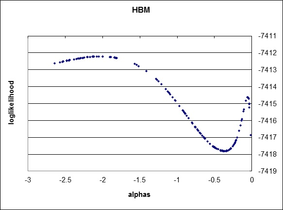

 This page is part of the Category \[.

Once observed choices and explanatory variables from data are related by formulating a utility function, the challenge becomes estimating the parameters that quantify these relationships or how explanatory variables contribute to destination choice probabilities. Rather than a one time effort, this is commonly an iterative process in which alternative specifications of the utility function are tested. The parameter estimation process is based in statistical / econometric theory and generally relies on maximum likelihood estimation (MLE) techniques. Specialized software or custom programming is generally required. Algorithmic approaches to MLE for destination choice models generally fall into two general families: gradient-based and metaheuristics.

Gradient-Based Approaches
-------------------------

The traditional approach for choice model parameter estimation is maximum likelihood estimation. This method is based on a probabilistic evaluation of the data and model: given the observed explanatory/exogenous data, the proposed model structure, and any given set of model parameters, what is the likelihood of having gotten the observed choices? Model estimation is the process for finding the set of parameters that maximizes the likelihood of the model. In practice it is preferable to maximize the logarithm of the likelihood function instead; this transformation does not change the location of the maximum parameter (logarithm are a monotonic function), and the resulting calculations are simpler and more numerically stable.

For regular MNL models that have a strictly linear-in-parameters utility function (i.e., for destination choice models with no parameters to estimate inside the size term), it is well known that the log of the likelihood function is both smooth and globally convex. This means that, for *any* initial guess at the model parameters, a gradient descent maximization algorithm will eventually converge to the global optimum. Put more simply, you'll always get the same result from parameter estimation and it is guaranteed to be correct. Moreover, because this kind of model is relatively common and simple to use, there are a variety of off-the-shelf computer programs that will be able to handle the parameter estimation efficiently.

However, destination choice models typically are not simple MNL models with a strictly linear-in-parameters utility function. Many times the [size term](Factors_Affecting_Destination_Choice#Size_Terms_/_Attractions) is parameterized inside its log function, which can potentially introduce non-convexity in the overall log likelihood function. This non-convexity can be addressed through a variety of techniques (some discussed below) although the computational effort typically increases greatly for achieving a reliable globally optimal solution for non-convex problems.

For a much more complete review of gradient-based approaches, readers are encouraged to review the book [Discrete Choice Methods with Simulation](https://eml.berkeley.edu/books/choice2.html) by Kenneth Train[^1].

Metaheuristics and Machine Learning
-----------------------------------

While gradient-based methods are efficient for parameter estimation problems where the maximum likelihood function can be shown to be globally convex, many destination choice models do not meet this criteria. Two common reasons that destination choice models have non-convex likelihood functions is because they use accessibility variables in the utility function to reflect the jointness of destination choices and/or because they include shadow prices or other constants to enforce a market equilibrium or attraction constraint. An example of a likelihood function with multiple optima for a destination choice model with an accessibility variable is shown in the figure below.

''Destination Choice Model Log Likelihood Function with Multiple Optima

The use of gradient-based methods to estimate parameters for models with non-convex likelihood functions can result in sub-optimal solutions. For example, if gradient-based methods were used to estimate the accessibility parameter for the model with the likelihood function illustrated above, assuming the starting parameter value was zero, the algorithm would find the local maxima close to zero, not the global maximum close to -2. One alternative that is sometimes proposed, is to use gradient-based algorithms with multiple parameter sets for starting points, but this approach is both labor and computationally intensive and quickly becomes increasingly complex as the number of parameters to be estimated increases.
Alternatively, various meta-heuristics for non-linear optimization and/or machine learning methods can be used for robust parameter estimation for models which are liable to multiple optima. Genetic algorithms have been applied for this task[^2][^3] and more recently other machine learning methods such as boosted decision trees[^4] have also been reported.

### Genetic Algorithms

A genetic algorithm begins by generating an initial population or set of solutions, each solution being a complete set of parameters. The algorithm then applies each candidate solution, often using the ultimate model application code. Another module evaluates the fitness of each solution, calculating its log likelihood by comparing the predicted probabilities from the model application to the observed data. Once the fitness of all the candidate solutions in the population has been evaluated, the least fit solutions die or are removed from the population, the best solution is cloned to start the next generation’s population and the remaining members of the new population are created by either mating or randomly recombining two solutions from the parent population (whose probability of reproducing is a function of their fitness) or by mutating a single solution from the parent population (again, whose probability of being selected for mutation is a function of its fitness). The process iterates until no further progress can be made and a maximum likelihood solution is produced.

The genetic programming approach has significant advantages and disadvantages compared to traditional analytic gradient-based methods. The key disadvantage is its computational intensity. It is computational expensive and take significantly long time to estimate model parameters. This is clearly a significant impediment to its widespread use. Better parallel processing may be able to reduce the run time by as much as an order of magnitude.

Despite the run time, the genetic programming approach has a number of very attractive advantages over traditional estimation methods. The method is robust to multiple optima which are possible for constrained or joint/conditional models. It obviates the need for sampling of alternatives common in destination choice model estimation, simplifying the estimation and improving the statistical efficiency of the estimator, making better use of limited survey data or full use of large passive datasets. It allows for and in fact benefits from the use of inequality constraints on parameters which can be value in practice to, for instance, enforce that a parameter has the logical sign. It allows for otherwise non-linear-in-parameters utility specifications, such as the estimation of embedded distance decay parameters in accessibility terms important for controlling for spatial autocorrelation, trip-chaining effects, etc. Also, it greatly reduces the opportunity for inconsistencies between estimation and ultimate application of the model for forecasting when the application code is used in estimation.

References
==========

[Content Charrette: Destination Choice Models](Content_Charrette_Destination_Choice_Models)

[^1]: Train, K. (2003). Discrete choice methods with simulation. Cambridge university press.

[^2]: Bernardin, V., F. Koppelman, and D. Boyce. “Enhanced Destination Choice Models Incorporating Agglomeration Related to Trip Chaining While Controlling for Spatial Competition.” Transportation Research Record: Journal of the Transportation Research Board, No. 2132 (2009): p. 143-151.

[^3]: Bernardin, V., S. Trevino, G. Slater & J. Gliebe. “Simultaneous Travel Model Estimation from Survey Data and Traffic Counts.” Transportation Research Record: Journal of the Transportation Research Board, No. 2496 (2015): p. 69-76.

[^4]: Winfield, M., R. Castellano, and Y. Kimmel. 2016. Predicting a New User's First Travel Destination on AirBnB. <http://blog.nycdatascience.com/student-works/capstone/predicting-new-users-first-travel-destination-airbnb-capstone-project/>

