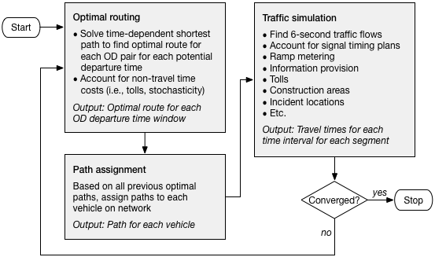

<PagesInCategory category="Network Assignment" />

Dynamic network assignment models (also referred to as dynamic traffic assignment models or DTA) capture the changes in network performance by detailed time-of-day, and can be used to generate time varying measures of this performance. They occupy the middle ground between static macroscopic traffic assignment and microscopic traffic simulation models. The same level of network and zonal resolution used in regional travel models are often used in DTA models, but at a much finer level of temporal detail. Because they typically employ link-based simulation models they produce more robust estimates of link flows and travel times. DTA models are often used for both small and large-scale traffic studies, but traditionally have not been used with regional travel models. That is rapidly changing, as the integration of DTA and [Activity-Based\_Models](https://tfresource.github.io/topics/Activity_based_models.html) is a hot topic in travel forecasting.

Background
----------

Traditional user equilibrium highway assignment models predict the effects of congestion and the routing changes of traffic as a result of that congestion. They neglect, however, many of the details of real-world traffic operations, such as queuing, shock waves, and signalization. Currently, it is common practice to feed the results of user equilibrium traffic assignments into dynamic network models as a mechanism for evaluating these policies. The simulation models themselves, however, do not predict the routing of traffic, and therefore are unable to account for re-routing owing to changes in congestion levels or policy, and can be inconsistent with the routes determined by the assignment. Dynamic network models overcome this dichotomy by combining a time-dependent shortest path algorithm with some type of simulation (often meso or macroscopic) of link travel times and delay. In doing so it allows added reality and consistency in the assignment step, as well as the ability to evaluate policies designed to improve traffic operations. These are some of the main [benefits of dynamic network models](Benefits_of_dynamic_network_models).

DTA models can generally be classified by how they model link or intersection delay. Analytical DTA models treat it in the same manner as static equilibrium assignment models, with no explicit representation of signals. Link capacity functions, often similar or identical to those used in static assignment, are used to calculate link travel times. Analytical models have been widely used in research and for real-time control system applications. Simulation-based DTA models include explicit representation of traffic control devices. Such models require detailed signal parameters to include phasing, cycle length, and offsets for each signal in the network. Delay is calculated for each approach, with vehicles moving from one link to the next only if available downstream capacity is available. The underlying traffic model is often different, but at the network level such models behave in a similar fashion.

Demand is specified in the form of origin–destination matrices for short time intervals, typically 15 minutes each. Trips are typically randomly loaded onto the network during each time interval. As with traffic microsimulation models, adequate downstream capacity must be present to load the trips onto the network. The shortest paths through time and space are found for each origin–destination pair, and flows loaded to these paths. A generalized flowchart of the process is shown below.

\
\
As with static assignment models, the process shown above is iteratively solved until a stable solution is reached. The memory and computing requirements of DTA, however, are orders of magnitude larger than for static assignment, reducing the number of iterations and paths that can be kept in memory. Instead of a single time period, as with static assignment, DTA models must store data for each time interval as well. A three-hour static assignment would involve only one time interval. A DTA model of the same period, however, might require 12 intervals, each 15 minutes in duration. These are all in addition to the memory requirements imposed by the number of user classes and zones.

Early Experiences
-----------------

Research into DTA dates back several decades, but was largely limited to academics working on its formulation and theoretical aspects. DTA overcomes the limitations of static assignment models, although at the cost of increased data requirements and computational burden. Moreover, software platforms capable of solving the DTA problem for large urban systems and experience in their use are recent developments.

Although its use in planning studies was perhaps always intended ([Peeta and Ziliaskopoulos 2001](http://link.springer.com/article/10.1023%2FA%3A1012827724856?LI=true)), most of the early investigations focused on freeway control and ITS applications ([Van Aerde and Yagar 1988](http://www.sciencedirect.com/science/article/pii/0191260788900489), [Mahmassani et al. 1994](https://trid.trb.org/view.aspx?id=690616)). Only a few large-scale applications in tandem with regional travel demand models have been attempted. [Dynameq](https://www.inrosoftware.com/en/products/dynameq/) has been successfully applied to a large subarea of Calgary and to analyses of the Rue Notre-Dame in Montreal. Although user group presentations of both applications have been made, and reported very encouraging results, the work is currently unpublished and inaccessible except through contact with the developers.

The largest known DTA application to date is described by [Hicks (2008)](http://www.trb.org/Publications/Blurbs/160461.aspx). The network from the Atlanta Regional Commission (ARC) regional travel model formed the starting point for the DTA network. Intersections were coded, centroid connectors were re-defined, and network coding errors were corrected. A signal synthesizer derived locally optimal timing parameters for more than 2,200 signalized intersections in the network. Trip matrices from the ARC model were divided into 15-minute intervals for the specification of demand. Approximately 40 runs of the model were required to diagnose coding and software errors. Unfortunately, the execution time for the model was approximately one week per run. The resulting model eventually validated well to observed conditions; however, the length of time required to render it operational and the run time required prevented it from being used in studies as originally intended. Subsequent work by the developer has resulted in substantial reductions in run time, but this remains a significant issue that must be overcome before such models can be more widely used.

Current Practices
-----------------

Research Needs
--------------

A number of cities are currently testing DTA models, but are not far enough along in their work to share even preliminary results. At least a dozen such cases are known to be in varying stages of planning or execution, suggesting that the use of DTA models in planning applications is about to expand dramatically. However, in addition to the issue of long run times, a number of other issues must be addressed before such models are likely to be widely adopted:

-   The integration of DTA and travel demand models has only been attempted on an ad hoc basis, although the topic has received considerable research interest ([Boyce 1986](http://journals.sagepub.com/doi/abs/10.1068/a180485), [Lin et al. 2008](http://www.caee.utexas.edu/prof/bhat/ABSTRACTS/CEMDAP_VISTA_pub.pdf)). Operational models formally incorporating feedback between the two modeling realms was attempted as part of SHRP 2 C10 project in [Sacramento](http://apps.trb.org/cmsfeed/TRBNetProjectDisplay.asp?ProjectID=2828) and [Jacksonville](http://apps.trb.org/cmsfeed/TRBNetProjectDisplay.asp?ProjectID=2829).

<!-- -->

-   Transit has only been recently tackled in DTA models. The development of [fast-trips](https://github.com/MetropolitanTransportationCommission/fast-trips) is ongoing, and several vendors of commercial packages are thought to be working towards the same capabilities.

<!-- -->

-   Traffic signal timings have a significant effect on network performance. However, most of the research on DTA models has been on node-abstract analytical solutions. Practical and scalable methods for developing signal timing inputs to regional DTA models have yet to emerge despite considerable evidence of its influence on capacity and operations ([Berg and Do 1981](https://trid.trb.org/view.aspx?id=174269), [Boyce et al. 1989](https://trid.trb.org/view.aspx?id=367767), [Rakha & Van Aerde 1996](http://www.civil.uwaterloo.ca/bhellinga/publications/Publications/TRB%201996%20Integration%20Features.pdf)).

<!-- -->

-   Criteria for the validation of such models have not been widely accepted. The paucity of traffic counts in most urban areas, and especially at 15, 30, or 60 minute intervals, is a significant barrier to definitive assessment of these models.

