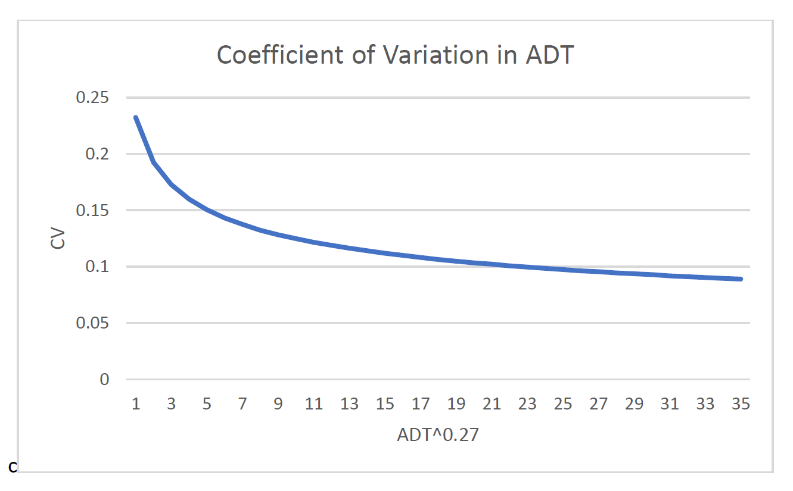

Go to the [Project-level traffic forecasting](Project_level_traffic_forecasting) topic page.

[NCHRP Report 765](NCHRP_Report_765) reviewed literature about variability in traffic volume ([Average Daily Traffic](Average_Daily_Traffic), or ADT) data. Although there were disagreements between studies as to methodology and results, the following equation, expressing the consensus of these studies, should be used for highway projects.

$$CV=\frac { 1.5 }{ { V }_{ }^{ 0.27 } }$$

where CV is the coefficient of variation (or the ratio of standard error to the mean) and V is the ADT.

Figure: example with ADT=1,000 to 50,000

References
----------

