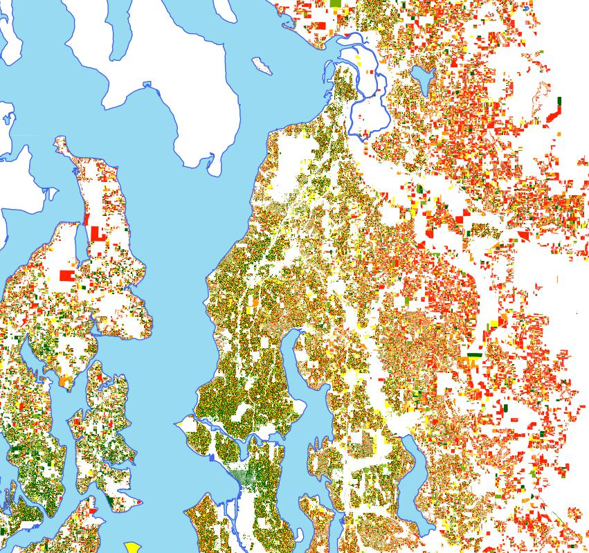

Travel model results often require additional interpretation and explanation to a non-technical audience. Because [activity-based models](Activity_Based_Models) are costly to implement and explain it is important to carefully convey how their functionality differs from other methods

Here are some ways that modelers have successfully explained activity-based models:

-   Develop novel visual plots and animations that explain the outputs. The graphic below shows modelled vehicle miles traveled per person by home parcel in Seattle. Prepare a comparable graphic using a trip based model and demonstrate the value of the added precision. Examples of video animations can be found at [www.youtube.com/ARCModeling](http://www.youtube.com/ARCModeling)

-   Compare to a familiar videogame simulation. Explain how a game, such as SimCity, evolves based on decisions made by the player.

<!-- -->

-   Translate the model results into a familiar story. Follow the day in the life of one your model residents to show how the model is synthesizing actual choices.

------------------------------------------------------------------------

