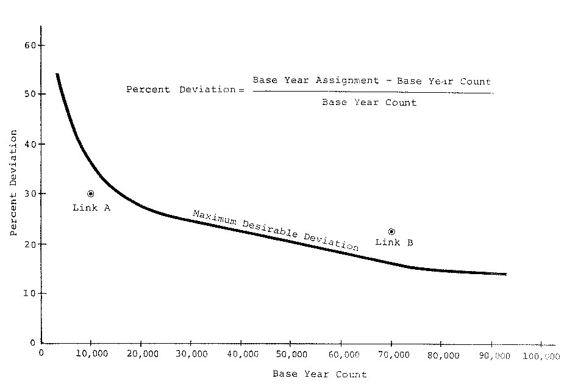

Go to the [Project-level traffic forecasting](Project-level_traffic_forecasting) topic page.

The half-lane rule was first introduced within [ NCHRP Report 255](NCHRP_Report_765) in 1982. At that time, many highway projects were either entirely new segments or expansion of existing segments. The half-lane rule was embodied in the well-known “maximum desirable deviation curve”, shown in the figure below.

This curve specifies the minimum standards for quality of outputs from a travel forecasting model prior to any refinement exercise. The curve is approximately the percentage of [ADT](Average_Daily_Traffic) that is carried by ½ lane of a road with an [ADT](Average_Daily_Traffic) given on the horizontal axis. If a regional model meets this requirement, then the project design is unlikely to be in error as to the number of lanes. This curve is still valid for decisions involving the number of lanes on a road segment between intersections and interchanges.

An extension of the half-lane rule was stated in [NCHRP Report 765](NCHRP_Report_765) as a five step procedure.

1.  *Identify those forecasted items that are critical to a design decision or to a go-or-no-go decision.*
2.  *Determine or assume a probability distribution for error in those forecasted items. A normal probability distribution may be assumed by default if the errors are small.*
3.  *Determine the levels of confidence in these items that are necessary to avoid a mistake in a decision. Confidence needs to be greater (e.g., 95% rather than 50%) when a mistake could be costly or irrevocable. Confidence can be less when there are numerous forecasted items that will affect the decision.*
4.  *Determine the ranges of each data item associated with a decision. Determine whether the decision can tolerate a large error on the low side or a large error on the high side (one-tailed) or whether the decision is intolerant of an error on both the high and low sides (two-tailed).*
5.  *Apply the probability distribution and confidence limits to the decision ranges of the data items to determine the acceptable [RMS Error](https://en.wikipedia.org/wiki/Root-mean-square_deviation) of the item.*' (Source: [NCHRP Report 765](NCHRP_Report_765))

This standard applies to forecast results after refinement, if any. This standard requires professional experience to determine the probability for the confidence level and whether the confidence level should be applied to one tail or two tails. Unless the project design is unusually sensitive to variability in forecast outputs, the parameters on the table below should be used to implement the extended half-lane rule.

| Parameter                                       | Value    |
|-------------------------------------------------|----------|
| Confidence Level                                | 50%      |
| Probability Distribution                        | Gaussian |
| Number of Tails in the Probability Distribution | Two      |

For the default parameters on this table, the confidence interval is ±0.6745 of the standard error from the mean, where the standard error may be estimated as the root-mean-square error ([RMSE](https://en.wikipedia.org/wiki/Root-mean-square_deviation)).

References
==========

