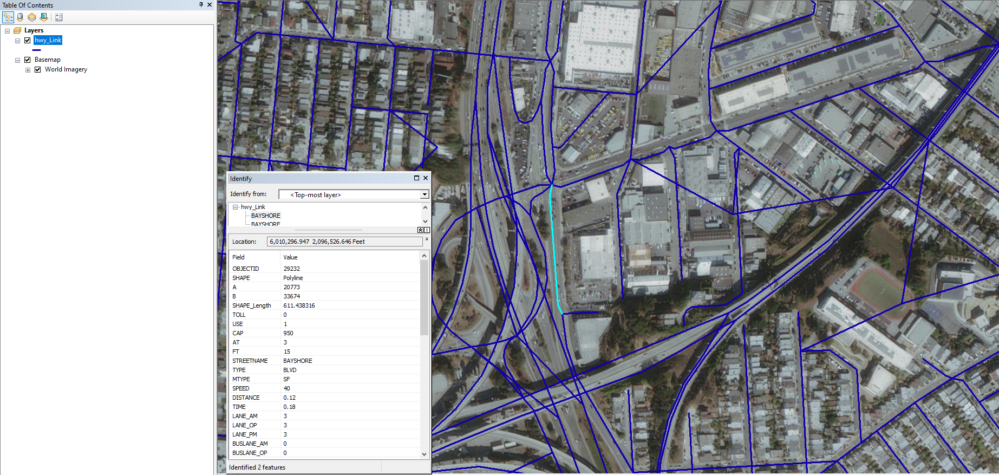

Highway networks provide a representation of individual, connected links between intersections through the use of **links** and **nodes**. The network may include thousands of nodes and links.

Links
-----

**Links** are often described by length, capacity, number of lanes, posted speed, and freeflow speed. The congested speed on any link may be calculated through the use of an appropriate volume-delay function (VDF). The links can represent a variety of attributes such as length, cost (such as time), and capacity. A typical highway network will include links ranging from high speed, high capacity (e.g., freeways) to low-speed, low capacity (e.g., residential streets).

Several typical *primary attributes* can be identified as critical to the performance of the travel demand model, and *secondary attributes* provide more information about the roadways.

| Primary Attributes| Secondary Attributes|
|--|--|
| Length/distance | Lane type |
| Speed | Median type|
| Number of lanes | Linear reference system  |
| Use | Parking|
| Facility type| School zones|
| Area type| Advisory speeds|
| Directionality| |
| Capacity |  |

Nodes
-----

**Nodes** often represent interchanges, signalized or unsignalized intersections, or other points where transitions in traffic can take place. In addition to XY coordinates, nodes may be characterized by turn restrictions or penalties, type of intersection control, and signal control configuration (if a traffic signal is present).

For simulation-based [DTA](Benefits_of_dynamic_network_models) models, networks will often include explicit representation of traffic control devices. Those models would require detailed signal parameters including phasing, cycle length, and offsets for each signal in the network. [^1]

Other Network Inputs
--------------------

**Tolls and other pricing strategies** can also be represented in the highway networks.

**Turn penalties/prohibitors** can also be represented in the highway networks.

------------------------------------------------------------------------

[^1]: [NCHRP\_Synthesis\_406:\_Advanced\_Practices\_in\_Travel\_Forecasting\_-\_A\_Synthesis\_of\_Highway\_Practice](http://www.trb.org/Publications/Blurbs/163651.aspx), Transportation Research Board, 2010.

