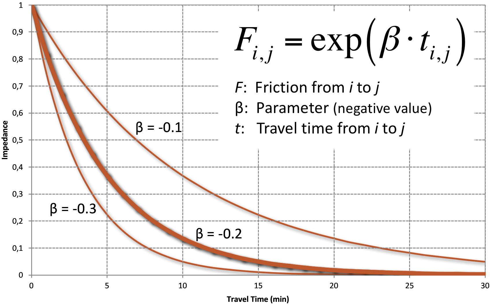

The impedance describes how difficult it is to get from one place to another place. The impedance is commonly calculated as travel time, travel distance, travel costs, or a combination thereof called generalized costs.

Travel costs may include parking, the costs for fuel, maintenance costs and transit fares. For transit, access time, egress time, wait time and number of transfers often is added to a generalized costs term (generally referred to as "level of service" variables).

Mathematical Formulation
------------------------

Some impedance measures combine different level-of-service variables as generalized costs. This is usually done through a linear combination of the component level-of-service variables, similarly to the calculation of utility calculations for mode choice models. For example:

$$Impedance = time_{InVehicle} + \beta_{1} * time_{OutOfVehicle} + beta_2 * costs$$

The parameters $$\inline\beta_k$$ are either estimated in a mode choice model or asserted based on information from other models. In the equation above, $$\inline\beta_1$$ represents the weight at which travelers value out-of-vehicle time relative to in-vehicle time (typically by a factor of 2 to 4 worse) and $$\inline1/\beta_2$$ represents the monetary value of in-vehicle time.

\
*Common representation of the impedance function*

Impedance Data
--------------

The generation of impedance measures depends on two primary components:

1.  **Network development –** As discussed in [Transportation Network Data](#Transportation_Network_Data), the highway network includes representations of the main roadways in the modeled region, along with characteristics of the highway links such as free-flow speeds or travel times, distances, facility types, number of lanes, and capacities. Transit networks generally represent every bus and rail route in the modeled region along with stop locations. Characteristics of routes such as headways, fares, travel times between stops, and access times to and from stops are represented.
2.  **Network skimming –** Skimming is the process of determining the times, costs, and distances between each pair of zones for which service is available (generally all pairs of zones for auto). Skims may be computed for each component of impedance (e.g., auto in-vehicle time, transit in-vehicle time, transit wait time, transit walk access time, etc.) using the appropriate network and network characteristics.

The main decisions regarding skimming concern the assumptions, or settings, used to determine the zone-to-zone paths. This is more prominent in the transit network skims since there are multiple transit paths between zones, and the optimal path may vary under different assumptions. For example, say there are two paths, one with 20 minutes in-vehicle time and 10 minutes out-of-vehicle time, and one with 12 minutes in-vehicle time and 15 minutes out-of-vehicle time. If in-vehicle time and out-of-vehicle time are weighted equally, the second path would be optimal, but if out-of-vehicle time is weighted twice as much as in-vehicle time, the first path would be optimal.

The accuracy of skim data is critical in obtaining valid mode choice model results. Skim data accuracy is primarily dependent on the accuracy of the network data themselves (see [Transportation Network Data](#Transportation_Network_Data)) and on the assumptions made or settings used in producing the skims. At the same time, the consistency of path building procedures and mode choice is crucial for producing logical results from mode choice models when transportation networks are modified in alternatives testing.

On the highway side, the main assumptions are the definition of "cost" in determining the lowest cost paths. The main component of generalized highway cost is travel time, but other variables, including toll cost and highway distance may be used.

Consistency with Mode Choice
----------------------------

The generalized cost for transit skimming should be consistent with the way in which the transportation level of service variables are used in the mode choice utility function, which is a linear combination of these variables. For example, if the out-of-vehicle time coefficient is twice the in-vehicle time coefficient in the mode choice model, out-of-vehicle time should be weighted at twice the weight of in-vehicle time when performing transit skimming.

Transit skim procedures often include a set of rules defining what constitutes a valid transit path. The rules are often based on available observed travel behavior data, such as transit on-board survey data. Some examples include:

-   Maximum walk access distance for transit with walk access modes;
-   Maximum walk egress distance for transit with walk egress modes (generally the same limits as for walk access);
-   Maximum auto access distance for transit with auto access modes;
-   Minimum transit in-vehicle time, to prevent unlikely transit trips of very short distances;
-   Maximum number of transit transfers; and
-   Maximum total travel time or cost.

Cliff Effect
------------

It is important to understand the consequences of these types of limits. While some of the limits are set to eliminate only truly invalid paths (for example, an urban model with a rule that total travel time must be less than five hours), others may exclude some borderline reasonable paths. This means that a transit path may be valid in one scenario but invalid in a slightly different scenario to which the results are being compared. For example, if a maximum walk distance of 1.00 mile is used, and a bus stop is 0.98 miles from an activity center in one scenario, but is replaced by a rail station 1.02 miles from the same activity center in another scenario, the latter scenario will not result in any transit riders from the activity center, even if the rail service is far superior to the bus service.

This type of problem is known as a "cliff" because when the transit availability is graphed as a function of the variable being limited, the graph shows a vertical line, or "cliff." The upper portion of [Figure 3.3](#Figure-f3-3) shows such a cliff graphically. One approach to reducing the impact of the cliff problem is replacement of the hard limit with a piecewise linear function of the availability of transit with walk access as a function of walk distance, as shown in the lower portion of [Figure 3.3](#Figure-f3-3).

References
==========

[Content Charrette: Destination Choice Models](Content_Charrette_Destination_Choice_Models)

