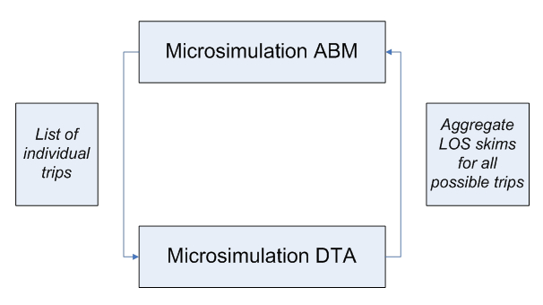

An integrated travel demand model that can serve various planning needs should include at least two primary components:

-   A travel demand model that generates trips by origin, destination, mode, and time of day, and
-   A network model that assigns these trips onto the corresponding networks, identifies routes chosen for each trip, and generates Level-of-Service skims that are fed back to the travel demand model.

Both parts are equally important and should be properly integrated.

Introduction
------------

### Purpose / Need / Importance

The purpose of an integrated model is to ensure that different network improvement scenarios and socio-economic / land-use scenarios can be simulated with respect to the transportation system performance in a consistent way. Integrated travel demand and network models are needed for practically any study where the compared alternatives are substantially different to generate corresponding impacts on either travel demand or network performance. In particular, an integrated model is essential for analysis of large-scale transportation projects, regional policies like pricing, or environmental studies.

### Historical Overview

Theory and practice of integrated demand-network models have a long history dated back to the fundamental works of Evans, 1976, Florian. 1977, and others. The basic idea of these integrated formulations was that that the demand part of the model can be expressed as a set of entropy-maximization terms (Wilson, 1970) while the network part of the model can be expressed as a set of link-based congestion terms (Beckman, 1956). These fundamental works related to integration of 4-step demand models and Static User Equilibrium network assignments. In these works, existence and uniqueness of the equilibrium solution was established. The practical way to achieve the equilibrium solution is to apply the travel demand and network model iteratively by feeding back the Level-of-Service Variables from the network model to the demand model. With the advent of advanced Activity-Based Models and Dynamic Traffic/Transit Simulations in practice since 2000, the basic idea of iterative procedure has been applied although the exact mathematical formulation of the integrated model as applied before for 4-step models with Static User Equilibrium cannot be easily extended (Ben-Akiva, et al, 2002, Waller & Castiglione, 2012, Vovsha & Mahmassani, 2012). This webpage is intended to provide an overview and resources for theoretical and practical aspects of constructing integrated models of travel demand and network. It covers different types of demand models and different types of network models with the corresponding analysis of compatibility and integration schemas.

Key Concepts
------------

### Components

#### Travel Demand Models

##### Aggregate 4-step / trip-based

The trip-based travel model approach evolved over many decades. As their name suggests, trip-based models use individual trips as the fundamental units of analysis. Trip-based models are widely used in practice to support regional, subregional, and project-level transportation analysis and decision-making. Trip-based models are often referred to as “4-step” models because they commonly include four primary components. The first trip generation component estimates the numbers of trips produced by and attracted to each zone (these zones collectively represent the geography of the modeled area). The second trip distribution step connects where trips are produced and where they are attracted to. The third mode choice step determines the travel mode, such as auto or transit, used for each trip, while the fourth assignment step predicts the specific network facilities or routes used for each trip. Additional detail on trip-based models can be found [here](Trip_Based_Models).

##### Microsimulation / Activity-based / Tour-based

Recently, activity-based models have become more widely used in practice. Activity-based models share some similarities to traditional 4-step models – activities are generated, destinations for the activities are identified, travel modes are determined and finally, the specific network facilities or routes used for each trip are predicted. However, activity-based models incorporate some significant advancements over 4-step trip-based models, such as the explicit representation of realistic constraints of time and space and the linkages amongst activities and travel both for an individual person as well as across multiple persons in a household. Activity-based models also have the ability to incorporate the influence of very detailed person-level and household-level attributes, and the ability to produce detailed information across a broader set of performance metrics. These capabilities are possible because activity-based models work at a disaggregate person-level rather than a more aggregate zone-level like most trip-based models.

##### Auxiliary Models

Trip-based models and activity-based models represent the trips made by residents of the modeled area when they are travelling entirely within the modeled area. Typically these trips comprise about 80%-90% of the total demand. Auxiliary demand refers to trips that are not represented in the activity-based model system, such as truck trips, visitor trips, internal-external and external-external trips, and special generator trips. In most cases, the auxiliary trip models used in conjunction with activity-based models are similar to those used in conjunction with trip-based models, although additional temporal or spatial detail may be include. In some cases, more sophisticated auxiliary demand models have been implemented in conjunction with activity-based models, but such models are not required.

#### Network Supply Models

##### Static / Aggregate

Static network assignment models are the most widely used roadway network models. They are typically used with the input travel demand is generated for longer time periods, such as multi-hour peak periods, or entire days. As a result, they can only generate estimates of average network travel times and link volumes representing longer time periods for input into the activity-based travel demand model. While the behaviors of static network assignment models are well-known and they have relatively fast runtimes, they are limited by their insensitivity to many operational attributes and by their inconsistency with traffic flow theory (Chiu et al, 2011) Most transit network models are also static, although they vary in their level of complexity. Most BA model are linked with simple shortest generalized path transit assignment models, although some transit assignment models used include the ability to distribute flows across multiple competing routes, and even to reflect the impacts of transit crowding.

##### Dynamic / Disaggregate

In contrast to static network assignment models, dynamic network assignment models (also referred to as [dynamic traffic assignment](Dynamic_Traffic_Assignment) models or DTA) capture the changes in network performance by detailed time-of-day, and can be used to generate time varying measures of this performance for input to an activity based model. This temporal resolution can be flexibly defined, and recent implementations have tested resolutions as fine as 10 minutes. The network performance indicators derived from dynamic network models such as congested travel times arise from the dynamic interaction of individual vehicles or packets of vehicles being simulated or calculated using extremely fine grained temporal resolution, such as seconds or fractions of seconds. Dynamic traffic assignment models are sensitive to operational attributes and are founded upon traffic flow theory, but their wide adoption has been hindered by long runtimes and by their inherent stochasticity.

### Choice Contexts by Travel Dimensions

There are certain gray areas between the travel demand side and the network side, as well as within the network simulation process itself, that have been treated differently by different researches and can be either included in or excluded from the network model. In this section we provide the relevant examples, references, and recommendations in this regard.

&nbsp;&nbsp;&nbsp;&nbsp;&nbsp;&nbsp;<b>What decisions are made in demand model vs. network supply model?</b>

&nbsp;&nbsp;&nbsp;&nbsp;&nbsp;&nbsp;&nbsp;&nbsp;&nbsp;&nbsp;&nbsp;&nbsp;<i>Mode / sub-mode / route type / route itinerary</i>

The technical implementation of such a model depends on a treatment of route choice and its placement between the demand model and network simulation tool that can done in several different ways, as shown in Figure 1 (SHRP L04 Project Report).

<i>Figure 1</i>

&nbsp;&nbsp;&nbsp;&nbsp;&nbsp;&nbsp;&nbsp;&nbsp;&nbsp;&nbsp;&nbsp;&nbsp;<i>Trip departure time / scheduling</i>

Another important choice dimension that falls between the demand model and network simulation model is trip departure time choice and related activity scheduling. Traditionally, time-of-day choice and activity scheduling decisions have been a part of the demand model whether 4-step or Activity Based. Recently, several research works discussed advantages of closer integration of trip departure time and route choice decisions in the extended DTA framework (Mahmassani et al, 2001-2006).

### Convergence and Equilibrium

#### Theory of Integrated Models

The early theory and practice of integrated demand-network models have a long history dated back to the fundamental works of Evans, 1976, Florian. 1977, and others. The basic idea of these integrated formulations was that that the demand part of the model can be expressed as a set of entropy-maximization terms (Wilson, 1970) while the network part of the model can be expressed as a set of link-based congestion terms (Beckman, 1956). This theory was largely created for integration of a 4-step demand model with a Static User Equilibrium Assignment Model. Extension of this theory to Activity-Based Models of travel demand and Dynamic Traffic/Transit Assignment models that are implemented in a microsimulation fashion is not straightforward but a substantial progress has been done on this front recently in both theoretical and practical terms (Ben-Akiva, 2001, Mahmassani, 2005, Waller & Castiglione, 2012, Vovsha et al, 2009,SHRP2 C10 and L04 Projects).

#### 2-way linkage (I/O) and feedback

Since the technologies of microsimulation have been brought to a certain level of maturity on both the demand side (ABM) and supply (network) side (DTA), the perspective of ABM-DTA integration has become one of the most promising avenues in transportation modeling. Seemingly, the integration between too models should have been as natural and straightforward, as was the integration concept between a 4-step model and static traffic assignment (STA) shown in Figure 2. That relatively simple integration was based on the fact that both I/O entities involved in the process have the same matrix structure. The 4-step demand model produces trip tables needed for assignment, and the assignment procedures produce full Level-of-Service (LOS) skims in a matrix format that is needed for the 4-step model. Note that the LOS variables are provided for all possible trips (not only for the trips generated by the demand model at the current iteration). In this case we can say that the network model provides a full feedback to the demand model. The theory of global demand-network equilibrium is well developed for this case, and guarantees a unique solution for the problem, as well as a basis for effective practical algorithms.

<i>Figure 2</i>

Both ABM and DTA operate with individual particles as modeled units (individual tours and trips) and have compatible levels of spatial and temporal resolution. It might seem that exactly the same integration concept as applied for 4-step models could just be adjusted to account for a list of individual trips instead of fractional-number trip tables. Moreover, the advanced individual ABM-DTA framework would provide an additional beneficial dimension for the integration, in the form of consistent individual schedules (that can never be incorporated in an aggregate framework). Individual schedule consistency means that for each person, the daily schedule (i.e. a sequence of trips and activities) is formed without gaps or overlaps. However, a closer look at the ABM-DTA framework and consideration of the actual technical aspects of implementation reveals some non-trivial issues that toned to be resolved before the advantages offered by overall microsimulation framework can be taken. The problem is specifically that the feedback provided by the DTA procedure does not cover all the needs of the ABM, as shown in Figure 3.

<i>Figure 3</i>

The crux of the problem is, that contrary to the 4-Step-STA integration, the microsimulation DTA can only produce an individual trajectory (path in time and space) for the list of actually simulated trips. It does not automatically produce trajectories for all (potential) trips to other destinations and at other departure times. Thus, it does not provide the necessary level of service feedback to ABM at the disaggregate level for all modeled choices. Any attempt to resolve this issue by “brutal force” would result in an infeasible number of calculations, since all possible trips cannot be processed by DTA at the disaggregate level. In fact, the list of trips for which the individual trajectories can be produced is a very small share of the all possible trips to consider.

As shown in Figure 4, one of the possible solutions is to employ DTA to produce aggregate LOS matrices (the way they are produced by STA), and use these LOS variables to feed the demand model. This approach, in the aggregation of individual trajectories into LOS skims however, would lose most of the details associated with DTA and the advantages of individual microsimulation (for example, individual variation in Values of Time or other person characteristics). Essentially with this approach, the individual schedule consistency concept would be of very limited value because travel times will be very crude for each particular individual. Nevertheless, this approach has been adopted in many studies due to its inherent simplicity \[Bekhor et al, 2011; Castiglione, 2012\]. The emphasis in these studies was to use more disaggregation in the LOS skims – many more time periods, smaller zones, several VOT classes, etc. but at a certain point, that also becomes unmanageable because of the sheer amount of data.

<i>Figure 4</i>

Several new ideas are currently being considered and tested in several research projects (Chicago ABM-DTA integration).

### Practical Methods to Achieve Convergence in Demand-Network Equilibration

#### Averaging

These methods have been borrowed from conventional 4-step modeling techniques, but can be also used with microsimulation as far as they are applied to continuous outputs/inputs like LOS variables and/or synthetic trip tables generated by the Moving Successive Averaging (MSA). Averaging can be applied to different components of the travel model including trip tables, Level-of-Service Variables, link traffic volumes, etc (Vovsha et al, 2008).

#### Enforcement

These methods are specific to microsimulation and designed to ensure convergence of “crisp” individual choices by suppressing or avoiding Monte-Carlo variability. These methods are currently at an early stage of theoretical development, with some empirical strategies showing very good results (Vovsha et al, 2008). Enforcement methods include Re-using the same random numbers or starting random seeds for certain choices that would ensure that the choice will be replicated if no change occurs to the inputs, Gradual freezing of portions of households or travel dimensions from iteration to iteration, and analytical discretizing of probability matrices instead of Monte-Carlo simulation.

Practical Integration Schemas
-----------------------------

Four principal practical integration schemas arise as the consequence of two principal demand model structures (4-step and ABM) and two principal network model structures (Static Assignment and Dynamic Assignment that can be combined in all possible ways).

|                     | Static User Equilibrium                       | DTA                                               |
|---------------------|-----------------------------------------------|---------------------------------------------------|
| <b>4-step/trip-Based .</b> | 1=Conventional well-explored                  | 3=Usual for DTA in practice (demand is stretched) |
| <b>Activity-Based </b>     | 2=Usual for ABM in practice (UE is stretched) | 4=Most promising avenue (first attempts)          |

For more information, see [Travel Demand and Network Model Integration Schemas](Travel_Demand_and_Network_Model_Integration_Schemas)

Integration Design Considerations
---------------------------------

### Information Exchange

There is essentially a two-way exchange of information between the demand model and the network supply model. In this exchange, the demand model provides estimates of travel demand that are used as input to the network supply model. In turn, the network supply model uses this travel demand information to generate estimates of network performance that are then used as input to the demand model. The type of information exchanged between these model system components reflects the inherent design and structure of these components, and significantly defines the sensitivities of the model system.

**Demand → Network Supply**

Travel demand model provides estimates of travel demand that are used as input to the network supply model. This travel demand must include the necessary level of detail required by the network supply model, typically information about travel origins, destinations, travel mode, and time-of-day. Some advanced models may include additional information such as values-of-time, toll/no-toll status, or driver/passenger status. The demand information can be transmitted to the network supply model in a number of formats, including trip tables, trip lists, and trip chains.

#### Trip Tables
Trip tables represent the most common format for transmitting travel information from the demand model to the network supply model. Most traditional “trip-based” or “4-step” travel demand models generate trip tables. Trip tables are typically square matrices, indexed by origin and destination locations. These origin and destination locations generally represent aggregate spatial geographies such as travel analysis zones (TAZs) because the use of smaller geographies exponentially increases the size of the matrices, requiring more time to read and write and more space to store. Note that there is no intrinsic size to a [TAZ](Traffic_Analysis_Zones) – it is a generic term that can be applied to both large and small geographies. In addition to representing aggregate spatial geographies, trip tables also represent aggregate temporal units, such as peak hours, peak time periods, or even entire days. Although trip tables have been used widely in travel forecasting models for decades and there are many tools for creating and manipulating trip tables, they have some notable drawbacks. They are inefficient because the 2-dimensional geographical indexing for all TAZs results in many trip table cells that are empty. In addition, each additional market segment (such as travel model) or time of day multiplies the number of trip tables that are required to represent the complete demand.

#### Individual Trip Lists
Trip lists are an increasingly common means of transmitting information from the travel demand model to the network supply model, especially where demand models are linked with dynamic traffic assignment (DTA) models. Trip lists are exactly what their name implies, lists of individual trip records. Each record in a trip list may contain the same type of information as found in traditional trip tables, including origin, destination, travel mode and time-of-day. However, unlike trip tables, trip lists include records only for those origin, destination, mode and time-of-day combinations for which the demand model forecast demand, which is more efficient. Because of this efficiency, trip lists facilitate the incorporation of more detail such as smaller zones, shorter time periods, and more typological detail such as trip-specific values of time.

#### Trip Chains
Trip chains are an extension of trip lists, and are essential when linking advanced travel demand models such as activity-based model with advanced network supply models such as DTA models. Trip chains incorporate all the information included in individual trip lists, but also includes additional information about how the individual trips are linked together. Use of trip chains ensures greater integrity between the demand and supply model components because it enforces spatial and temporal consistency – each successive trip begins where the preceding trip ended – and also provide the opportunity to realistically represent aspects such as how an individual vehicle is used throughout the day.

**Network Supply → Demand**

#### OD Skims
[Origin-destination skims](Skim_Matrix) are the primary means through which information about travel times, costs, and other travel-related impedances are transmitted from the network supply back to the travel demand model. Like trip tables, skims are usually square matrices indexed by origin and destination locations. Multiple skims may be generated to represent variations in travel impedances by travel mode, time-of-day or other typological or market segments. Separate skims may be created to represent unique attributes. For example, a set of transit skims may include individual skims for in-vehicle travel time, out-of-vehicle travel time, fare, and transfers. As with trip tables, the origin and destination locations used to develop skims generally represent aggregate spatial geographies such as travel analysis zones (TAZs) because the use of smaller geographies exponentially increases the size of the skim matrices, requiring more time to read and write and more space to store. The use of more aggregate spatial geographies impacts shorter trips more than longer trips, and methods for developing more spatially detailed network impedances for short distances have been developed to complement more spatially aggregate skims. The temporal and typological detail of skims generated by the network model is often relatively coarse. This reflects the challenges associated with assigning temporally detailed demand using static assignment models, the fact that static user equilibrium network assignment model software limits the number of market segment classes that can simultaneously handled, and the longer runtimes associated with increased temporal and typological detail.

#### Accessibility Measures
Accessibility indicators are also frequently included in model component specifications, and must also be endogenously generated by the overall model system. These accessibility indicators represent the combined impacts of land use and transportation system performance, and are critical to ensuring reasonable policy sensitivity of the model system to changes in infrastructure and/or land use. In general, four types of accessibility variables are included in the models:

* Direct measures of travel times, distances, and costs from modeled network paths

* Detailed logsums calculated across alternatives in models that include direct measures

* Aggregate (approximate) logsums calculated across alternatives in models that include direct measures

* Buffer measures representing the activity opportunities and urban design surrounding each parcel or microzone (e.g. Census block)

The direct measures are used most often in mode choice models. Detailed logsums are calculated from a lower-level choice model, using the full detail from that model. Typical examples in practical AB models are tour mode choice model logsums used in higher level models such as tour time of day choice, tour destination choice, and workplace location choice.

In cases when it is not practical to use the most fully detailed versions of the logsums that are calculated on-the-fly during the simulation every time one is needed. To address this issue, a common approach is to pre-calculate more aggregate accessibility logsums to be used in models where using the more impractical ones would not be computationally or conceptually feasible. For example, some model systems use “aggregate accessibility logsums” calculated from each origin TAZ or microzone, to all possible destinations, via all possible modes. Aggregate logsums are typically calculated for each combination of up to four or five critical dimensions, including:

* Origin TAZ or microzone

* Tour purpose

* Household income group, or Value of time group

* Household auto sufficiency (autos owned compared to driving age adults)

* Household residence distance from transit service

Aggregate measures are used most often in the day-level models and some of the longer term models, where the model is not yet considering a tour to a specific destination, but is considering, for example, how many tours to make for a given purpose from the home location during the day.

Finally, buffered measures represent the accessibility to very nearby destinations, as could be made by walk, bike or very short car trips. The typical measures that are buffered include:

* The number of nearby households

* The number of nearby jobs of various types (as proxies for activity locations)

* The number of nearby school enrollment places of various school types

* The number of nearby transit stops

Clearly, these measures are most relevant when the spatial units themselves are much smaller than the radius of the buffer area. Thus, using buffer-based measures is really only useful when the spatial unit of the model is parcels or (at the largest) Census blocks. One way to make the buffer measures more accurate and relevant is to use on-street shortest path distance to measure the distance to the edge of the buffer, rather than using straight line (crow-fly) or Euclidean distances.

**Individual Simulated Trajectories**

### Resolution

#### Temporal

##### Consistency Between Models
One of the distinguishing aspects of activity-based models is that they include an explicit representation of time-of-day. Many trip-based models generate estimates of daily trips and incorporate peak and off-peak assignment models by using fixed time-of-day factors. In contrast, activity-based models explicitly predict tour and trip arrival times, departure times, and activity durations. The temporal resolution of these more detailed times of day can vary from as broad as three hours or more, to as detailed as 15 minutes or less. The network assignment model design should be consistent with the temporal resolution of the activity-based model. If the activity-based model produces more temporally aggregate demand, such as multi-hour periods, then the network resolution must reflect the activity-based model resolution. However, if the activity-based demand model produces more temporally detailed demand, then users may have tremendous flexibility in the network assignment model design to incorporate this detail. This detail can provide better estimates of network performance by time-of-day and potentially provide more sensitivity to phenomena such as peak spreading. Ideally, the temporal resolution of the activity-based demand and network assignment model would be exactly aligned. Practically, this alignment is usually not possible because most activity-based demand models are linked with static network assignment models, which are incapable of generating reasonable measures of link volumes and network performance indicators for small time periods less than one hour in duration.

##### Continuous vs. Time-Sliced

##### Activity-Scheduling Approaches & Individual Schedule Consistency

#### Spatial

##### Consistency between models

##### TAZ
Travel analysis zones are used in most travel demand model systems. The term “TAZ” is generic and does not imply or refer to any specific scale. However, TAZs are often defined so that they are similar to or consistent with an existing geographic system such as a region’s Census tracts or Census block groups. The number of TAZs in a region typically ranges from 500-5,000. However, within a region, there may be a fair amount of variation in size amongst the TAZs.

##### MAZ
Like “TAZ,” the term “microzone” is a generic term that does not refer to a specific scale. Instead this term is intended to describe a geographic system that incorporates more spatial detail than a typical TAZ system. In a number of regions, microzones have been defined at a resolution that is similar to that of Census blocks, although the block geography is usually modified to ensure that the individual microzones will be meaningful within the model system. For example, blocks that represent water features such as rivers or lakes may be combined with adjacent microzones. Developing microzone-level spatial information, especially for future year scenarios, can be more involved thant developing TAZ-level spatial information. However, there are a number of spatially-detailed, publically available datasets that can be used to create these microzone-level assumptions. A typical model might include 30,000 to 150,000 “microzones”, an order of magnitude more than the typical number of TAZs but also an order of magnitude less than a typical number of parcels in a region.

##### Parcel / Link Face
Parcels have a more specific definition than TAZs or microzones. Parcel geographies are most often defined by local-level municipal and county tax assessors’ offices. Parcels are usually extremely fine-grained, with each spatial unit often corresponding to the geography associated with a single building. However, as with TAZs and microzones, there is significant variation in parcel sizes. For example, large institutions that contain diversity of buildings, employment, and uses may be represented by a single parcel. Using a parcel-level spatial scale can provide the greatest ability to incorporate local-level, smaller-scale land use and transportation system attributes, such as the mix of employment within a short walking distance, or the distance to the nearest actual transit stop. Developing, maintaining, and forecasting parcel-level attributes requires more effort than developing similar TAZ-level or microzone-level attributes, especially on the employment side. There are often inconsistencies and errors in the base year or “observed” data sources, and developing future year parcels requires careful consideration of the sources for detailed future population and employment assumptions and potentially methods and practices for “splitting” parcels as they development occurs.

#### Typological / Market Segmentation / "User Classes"

##### Consistency between models
##### Travel Markets

###### Core Resident
###### Auxiliary (Trucks, Visitors, etc)

##### Modal / Submodal**

###### Auto occupancy / toll / vehicle type
The recent practice with both 4-step models and ABMs was to include route type choice, most frequently as binary or trinary choice between toll, managed-lane, and non-toll general-purpose paths as the lower-level choice in the mode choice structure as shown in the figure below (NCHRP 08-57, SHRP 2 C04). However, some alternative schemas with more reliance on network model were proposed where a segmentation of highway users by VOT instead of the route type choice was suggested. The two methods (route type choice and use segmentation by VOT) can be applied concurrently in the same framework.

<i>Figure 9</i>

###### Transit
Similar discussion to the route type choice in the context of highway pricing is being held for transit route type choice. Prevailing practice is to have multiple “labeled transit modes” with a subsequent restricted transit assignment for each mode as shown in the Figure below. However, this practice is problematic due to a large number of possible transit mode combinations that can be used for the same trip. Alternative approach operates with a few “non-labeled” generic transit modes and relies on the transit path builder to address use preferences for multiple user classes. (TCRP H-37, Chicago Transit ABM).

<i>Figure 10</i>

###### Active Transportation
First attempts to address walk and bike in mode choice and transit assignment and identify their specific Level-of-Service variables and user classes (Portland, SF, Ottawa, San Diego models).

##### Travel Preference & Modality Parameters

###### Trip purpose / VOT / VOR / schedule flexibility
Methods to a better achieve consistency between travel demand and network simulation model with respect to VOT and other parameters (Chicago ABM, Baltimore ABM design)

###### Propensity to walk
Methods to address user segmentation w.r.t. transit services. Example of the age-parameterized propensity to walk applied in the Chicago ABM.

###### Transit awareness
Methods to evaluate user awareness of transit services and corresponding modality classes (TCRP H-37, Walker et al, 2010-2012).

Integration Examples
--------------------

Active Research Projects
------------------------

**SHRP2 C10 Projects**
Since 2014, four new SHRP2 C10 funded integration projects have been underway. They are briefly described on the [AASHTO TravelWorks website](https://planningtools.transportation.org/558/integrated-dynamic-travel-model.html). These project extend the first phase of C10 integrated model development. Integrated model development projects have now been implemented in:

-   Sacramento
-   Jacksonville
-   Baltimore
-   Columbus
-   Atlanta

**Matsim**

Emerging Practice and Research Avenues
--------------------------------------

**Fully disaggregate demand and supply simulation**\
**Learning and adaptation / Agent-Based Modeling**\
**Continuous data exchange vs. intermittent linking**\
**Impact of travel information**\
**Integrated travel demand/supply and land use models**

Related Content
---------------

A few other references:
[http://www.fhwa.dot.gov/goshrp2/Solutions/Capacity/C10\_C04\_C05\_C16/Advanced\_Travel\_Analysis\_Tools\_for\_Integrated\_Travel\_Demand\_Modeling The SHRP2 pages on advanced travel analysis tools (C10)](http://www.fhwa.dot.gov/goshrp2/Solutions/Capacity/C10_C04_C05_C16/Advanced_Travel_Analysis_Tools_for_Integrated_Travel_Demand_Modeling_The_SHRP2_pages_on_advanced_travel_analysis_tools_(C10))

[Activity Based Modeling Primer](Activity_Based_Modeling_Primer)

[DTA\_Primer](DTA_Primer)

[ ITM 2016 Presentation: Moving Towards Agent Based Models as the Next Step in Evolution of Integrated ABM-DTA Models](media_ITM16_Moving_towards_Agent_Based_Model_AgBM)_as_the_Next_Step_in_Evolution_of_Integrated_ABM-DTA_Models.pdf)

------------------------------------------------------------------------

