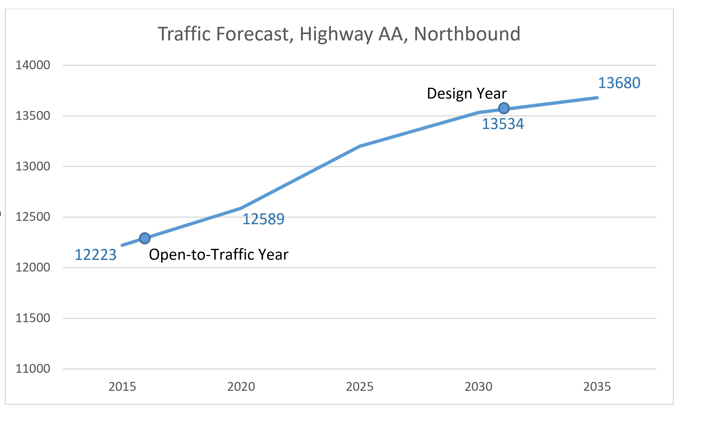

Objective
=========

The objective of this technique is to deal with inconsistencies that can arise when outputs of a travel model are for a forecast year that is different from the design year of the project.
This technique applies to forecasts that are interim and long-range. This technique applies to all geographic scopes.

Background
==========

Many regional travel forecasts are done in 5- or 10-year increments. The design year (or open for traffic year) for a project will not necessarily fall exactly on one of the forecast years for a regional model. Ideally, the regional model should be run for the forecast year of the project, but lead times and budgets do not always allow such custom runs that vary the forecast year. Interpolation may be used to resolve inconsistencies in forecast years.

Guidelines
==========

These guidelines apply to interpolating regional model volume forecasts.

-   A project alternative must be part of the forecast for each of the two years used in the interpolation.
-   Unless there is convincing evidence to do otherwise, interpolation should be linear (or straight-line).
-   There must not be any other (modeled) projects or actions that occur between the two forecast years that have a significant influence on traffic at or near the project.

Advice
======

Interpolated volumes should be refined, depending upon the needs of the forecast. Speeds and delays cannot be interpolated. Post-processing is required to obtain speeds and delays for interpolated volumes.

Example
=======

The figure below illustrates linear interpolation for a hypothetical repaving project on Highway AA. This segment of Highway AA is four-lane and it runs north and south, but only the traffic forecasts for the northbound lanes are shown. Of particular interest is the open-to-traffic year (2016) and the design-year (2031).

Figure: Interpolation Example, Highway AA

Neither the open-to-traffic year nor the design year fall exactly on the forecast years for the regional travel model. Linear interpolation requires summing the earlier-year forecast and a fraction of the difference between the later-year forecast and the earlier-year forecast. So for 2016 (open-to-traffic year), the earlier year forecast is 12223, the later year forecast is 12589, and the year 2016 is one-fifth of the time from 2015 to 2020. Therefore, the 2016 interpolated forecast is 12223 + (1/5)\*(12589 – 12223) = 12296 vpd. By similar logic, the 2031 design year forecast is 13563 vpd.

Items to Report
===============

-   Interpolated volumes (refined or otherwise)
-   Interpolated turning movements (refined or otherwise)
-   Post-processed speeds from interpolated volumes
-   Interpolated VMT or other MOEs

References
==========

NCHRP Report 765

