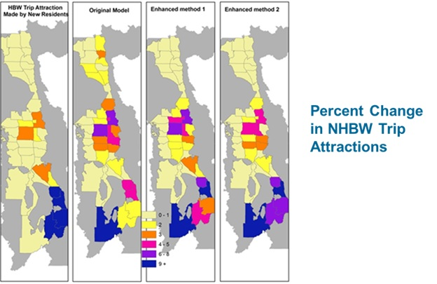

 This page is part of the Category \[.

In the context of daily travel, the choice of many destinations are made jointly or conditioned on the choice of other destinations. For example, the choice of where to get dinner on the way to home from university classes in the evening is strongly conditioned on not only the home location of the traveler but also their school location choice. Other destination choices are conditioned on other individual’s destination choices. For instance, when two friends decide to meet for lunch in the middle of their work days, the lunch destination is conditioned on both travelers work locations. Various frameworks can and have been used to reflect the conditioning or jointness of destination choices. These include the use of sequences or hierarchies of destination choices, the use of “rubber-banding” to calculate travel [impedance](Impedance) in terms of diversion or marginal travel cost, and the use of accessibility variables to capture agglomeration or convenience effects of destinations.

In traditional four-step travel models, all destination choices are assumed to be independent. This is reflected in the fact that gravity or destination choice models in this context are run in parallel and independently of each other. Both activity-based, hybrid, and advanced trip-based frameworks have developed different approaches to relaxing this assumption of independence. Each of these approaches in presented in summary below.

The Activity-Based Simulation Approach
--------------------------------------

Although there is variation in the details of various activity-based simulation approaches, they generally all share some common characteristics, owing to their common descent from the approach developed for early activity-based models in Portland and San Francisco.[^1][^2] The first is that long-term choices of mandatory activity locations such as work and school are modeled first and subsequent daily destination choices are conditioned on these. The second is that each tour is assumed to have a primary destination (which may be work or school or a location such as a retail store chosen that day), and intermediate stops locations are iteratively chosen by sequentially adding stops on the outbound or inbound half-tour on the way to or from the primary destination based on the marginal cost of adding that stop to the tour. This approach of using marginal travel costs for intermediate stop location choices is sometimes referred to as rubber-banding and is illustrated in the figure below.

''Sequential Choice of Intermediate Stop Locations with Rubber-banding

Two key ways that various activity-based model formulations differ is in their approach to [choice set formation](Destination_Choice_Set_Formation) and the use of [accessibility variables](Accessibility) in the utility function (whether logsums of other destination choices or proxies thereof). The disaggregate simulation framework of activity-based models conceptually allows the explicit representation of space time constraints to define the feasible choice set. However, these constraints can be binding or fuzzy to various degrees and computationally challenging to implement. Therefore, they are sometimes represented through the use of simpler, more easily computed proxy variables, for instance, giving some indication of “time pressure” based on general information about the daily activity pattern and/or tour. Some destination choice models (generally non-mandatory tour primary destination choices) include accessibility variables to indicate the convenience of the primary destination to potential intermediate or secondary stop locations, but precise utility formulations vary considerably, for instance whether accessibility variables are calculated for specific individuals, etc.

Through these various techniques, the activity-based approach can incorporate the jointness of destination choices, particularly for destinations on the same tour, including space-time constraints to with some degree of explicitness. Moreover, the approach has some behavioral plausibility in terms of schedule formation, particularly for mandatory tours. However, the assumption that all tours have a “primary” destination which anchors the tours and on which the other location choices are conditional (but not necessarily the converse) is a strong assumption that is not necessarily supported for many non-mandatory tours. For this reason, there is some variation in the heuristics used to identify a tour’s primary destination, some of which place more importance on duration of activity, others on distance from the home/work anchor, and others on an asserted hierarchy of activity purposes. The approach of building tours sequentially, adding one stop location at a time, also basically requires a simulation framework and fundamentally limits the applicability of the approach to aggregate modeling frameworks because the size of the matrices requires grows exponentially with the number of stops.

The Hybrid Approach
-------------------

An alternative approach for aggregate tour-based or hybrid models was developed for a model for the Knoxville region[^3][^4] and has subsequently been applied in roughly half a dozen other locations. In order to facilitate aggregate modeling and avoid the requirement of simulation and the variation it introduces, the approach is designed to evade the dimensional explosion of the solution space by partitioning the problem into two location choices, regardless of the number of stops on a tour. In the first stage, all stop locations (of a particular purpose, for a particular market segment) are chosen jointly based on their distance from the anchor location (home) and their accessibility to each other. In the second stage, each chosen destination for a trip is assigned an origin from which it is visited, with the constraint that the number of trips to each location must equal the number of trips from that location over the course of the day.

''Stop Location and Sequence Choices

This approach can represent the jointness of destination choices including agglomeration effects in stop location choice (Bernardin et al., 2009), and avoids the requirement of identifying a primary destination for all tours, but can only capture space-time constraints implicitly. Moreover, the second stage choice of origin or stop sequence can be challenging to interpret and is difficult to implement efficiently. For that reason, the following approach was developed.

The Advanced Trip-Based Approach
--------------------------------

A third alternative framework for representing the conditional nature of destination choices has also been applied in aggregate trip-based models[^5] in more than a half dozen states. The approach does not require a tour-based framework, but rather uses the traditional trip-based framework, simply shifting the choice of destinations for non-home-based trips to after and conditional on the choice of home-based trips.

''Conditional Non-Home-Based Models

This approach does not require any modification to existing home-based trip component models, and all choices remain easily interpretable. Like the hybrid approach, it can capture agglomeration effects in destination choices, but cannot explicitly represent space-time constraints. It has not been mathematically proven to result in trips consistent with tours with the same rigor as the hybrid approach, but it has been demonstrated to result in more consistent destination (and mode) choices in practical applications. The figure below illustrates how the advanced trip-based approach produces non-home-based-work trip locations consistent with home-based work locations for a new residential development in the far south of the Salt Lake City region in contrast with the traditional four-step model which predicts new non-home-based work trips in the far north of the region even though it predicts no new home-based work trips there.

''Salt Lake City Example from TMIP study

References
==========

[Content Charrette: Destination Choice Models](Content_Charrette_Destination_Choice_Models)

[^1]: Shiftan, Y. 1998. Practical Approach to Model Trip Chaining. Transportation Research Record, No. 1645, pp. 17-23.

[^2]: Bowman, J., M. Bradley, Y. Shiftan, T. K. Lawton, M. Ben-Akiva. 1998. Demonstration of an Activity-Based Model System for Portland. 8th World Conference on Transport Research, July 12-17, 1998, Antwerp, Belgium.

[^3]: Bernardin, V. 2008. A Trip-Based Travel Demand Framework Consistent with Tours and Stop Interaction. Dissertation. Northwestern University, Evanston, IL.

[^4]: Bernardin, V. and M. Conger, 2010. “From Academia to Application: Results from the Calibration and Validation of the First Hybrid Accessibility-based Model.” Transportation Research Record: Journal of the Transportation Research Board, No. 2176 (2010): p. 50-58.

[^5]: Bernardin, V. and J. Chen. 2016. New Methods for Improving Non-Home-Based Trips in Trip-Based Models. Presented at the 95th Annual Meeting of the Transportation Research Board, Washington, DC.

