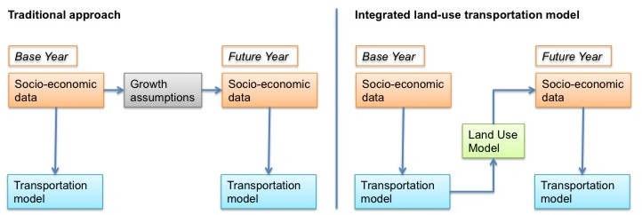
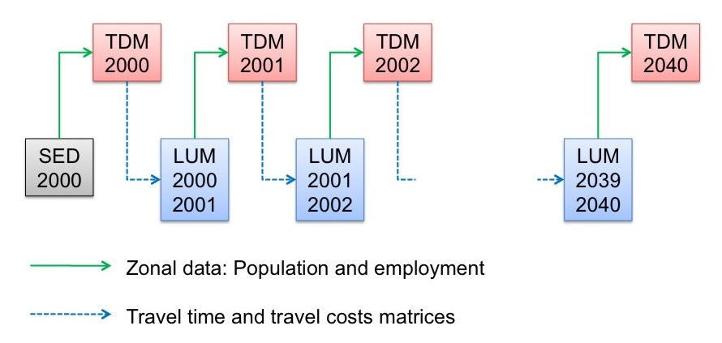

Summary
-------

Land use models can be integrated with travel demand models to reflect the interactions between the transportation system and land use development. Both households and businesses prefer locations with -everything else being equal- higher [accessibilities](Accessibility), and therefore, are influenced by travel times that are an output of transportation models. The location choices of households, businesses and developers, in turn, influences the location and scale of travel demand that is calculated by the travel demand model. The integration of land use with transportation models has proven to improve the model sensitivities in scenario analyses. Common [design principles](Design_principles_of_land_use_models) show how different elements of land-use models work together.

Introduction
------------

Traditionally, transportation models use static forecasts of [socio-economic data](Spatial_data). The left side of the figure below visualizes the [traditional approach](Scenario_Forecasting_for_Travel_Demand_Modeling). The forecast of socio-economic data is static and represents the *most likely* future allocation of households, jobs and other zonal data. The allocation of growth in the future year is determined exogenously and is not affected by information calculated endogenously in the model, such as accessibility. Sometimes, an alternative growth scenario is calculated exogenously to the travel modeling process to test a different allocation (such as a high-growth scenario in addition to the base scenario).

*Concept of traditional transportation (left) and integrated land use/transportation models (right)*

Empirical research, however, has shown that the transportation systems influences land-use decisions (compare for example Hansen 1959[^1] or Kreibich 1978[^2]), and therefore, the allocation of socio-economic data. While the static land-use forecast may be appropriate in the base scenario (often called business-as-usual scenario), the forecast of population and employment may be unrealistic in a certain policy scenario. For example, if the model is used to test the expansion of a rail line, households may decide to relocate because the rail line may make certain suburbs more attractive. The right side of the figure above visualizes this concept. A land use model is used to update the allocation of socio-economic data for a given model run.

Forecasting
-----------

The integration between land use and transportation models can be rather simple as shown in the graphic below. Starting with [socio-economic data](Spatial_data) (SED) in the base year (here shown as 2000 data), the transportation model runs for the same year, representing an *average day* of that year. The [skim matrices](Skim_Matrix) of the transportation model, usually provided for travel time and travel costs, are fed into the land use model that models the land use changes from 2000 to 2001 (or whatever the time increment is set to). The output of the land use model replaces the base year socio-economic data for the next model run of the transportation model.

*Common data flow between land use and transportation models*

In reality, however, most integrated land use/transportation models do not run every year, but rather every five or ten years. Long runtimes prohibit most integrated models to run every year. In some cases, the land use model runs every year, but the transportation model only runs every five to ten years. In other applications, both models run every five or every ten years.

The example in the figure above starts the model back in 2000. It is not uncommon to start land use models in a past year, which is also called back-casting (in contrast to forecasting). While this is less relevant to travel demand models, back-casting helps building confidence in model results of land use models. If the land use model output in 2020 is compared to census data in 2020, the model can be truly validated. Resembling census data in 2020 will increase the confidence in result of the land use model for future years.

Land Use/Transportation Feedback Cycle
--------------------------------------

The transportation and land use systems closely interact, as illustrated by the land use/transport feedback cycle (Wegener 2004[^3]).

*Land Use/Transportation Feedback Cycle (Wegener 2004[^3]: 130)*

Starting at the bottom of the cycle (Land Use), the locations of population and employment determine the origins and destinations of most trips in travel models (Activities). After the Transportation Model was run, and travel times were updated, Accessibilities can be calculated. Accessibilities describe for every zone how well accessible all other zones are. Accessibility shapes land use, as both households and businesses search for locations that are - among other location factors - well accessible.

A well-documented example of the significance of integrating land use with transportation has been published by [Conder and Lawton (2002)][^5]. According to their research, a Delphi Panel initially suggested substantial demand for new housing north of the Columbia River near Portland, OR. Testing this scenario in an integrated land use/transportation model revealed that not quite as many households decided to move north of the Columbia River because congestion on the four bridges across the river made commute travel times prohibitively long. Thereby, the authors have provided a classic example of the land use/transportation feedback cycle. Increased density north of the Columbia River led to additional travel demand, but the congestion reduced the accessibility of neighborhoods north of the Columbia River, which in turn limited the attractiveness of those areas for additional development.

A wide variety of land use models are in operation to date. The section [design principles of land use models](Design_principles_of_land_use_models) provides an overview of the most common land use model structures.

Enhanced Scenario Analysis
--------------------------

Adding a land use model to a travel demand model adds a large set of land use-related policy scenarios that can be tested. Such integrated model systems have been used extensively to model the impact of land-use policies, including the implementation of growth boundaries, implementation of transit-oriented development projects or tax incentives for promoting certain urban developments. If air quality or emissions are of interest, land use models allow adding emissions from dwellings and firms to traffic emissions. Oregon’s GreenSTEP model[^6] is an example for estimating emissions from fixed-point sources in a addition to vehicles' emissions.

Implementing a land use model may also improve the travel demand models by reflecting the land use/transportation feedback cycle. If changes in land use are modeled explicitly, the quality of a base forecast as well as the responsiveness of the travel demand model to alternative policies may improve significantly. Finally, demographic changes, such as a higher share of seniors traveling or the trend towards smaller household sizes, can be modeled explicitly.

Integrating land use models with transportation models not only increases the number of scenarios that can be analyzed but also may improve the outcome of the transportation model. By explicitly simulating the land use and transport interactions, travel behavior, household relocation, job change, shopping location choice, to name a few, may be modeled more realistically. It also creates consistency between land use and transportation forecasts, and the performance measures derived from them.

In summary, the benefits of integrated land-use/transportation modeling include

-   Capture land-use/transportation feedback cycle.
-   Implement land-use policies, such as urban growth boundaries, smart growth strategies, transit-oriented development, etc.
-   Improve pricing studies, as some households and businesses may change their location choice preferences under higher transportation costs.
-   Improve analysis of Greenhouse Gas Emissions, as residential buildings and firms contribute to emissions substantially.
-   Enable fiscal impact analyses of transportation policies, as location choice might be affected, which could alter the distribution of tax revenues.
-   Facilitate equity analyses, as land use models keep track of who lives where, and therefore, allow analyzing which parts of the population benefit or suffer under a scenario the most.

A Brief History
---------------

Ever since personal computers became available for academic research, land use/transportation models have been developed. The pioneering work of Herbert and Stevens[^7] in cooperation with Britton Harris was fundamental in exploring how computer models may be applied for urban analysis. Though aspatial in its design, the Theory of Urban Interaction developed by Forrester[^8] was a milestone in simulating businesses, dwellings and households explicitly. Yet more popularity gained the Lowry Model[^9]. Its relatively simple model structure allowed developing many applications, of which some are still in use today.

During the 1970s and 1980s, triggered among others by Lee's Requiem of Large Scale Models[^10],a general scepticism prevailed whether integrated models were able to represent complex real-world interactions. To a large extend, integrated modeling retreated to academic projects only.

In the 1990s, a new interest in integrated modeling arose. New model developments at dozens of Universities, improved hardware, better data availability and need of policy makers to understand long-term effects of decision-making promoted an increased acceptance of integrated modeling for urban and regional planning. The 21st century brought a push towards microsimulation aiming at simulating the interaction between individual actors.

This history of integrated land use modeling is described in more detail by Wegener[^11]. Some of the most influential models are shown in the table below.

| Early Pioneers                               | Revival in 1980's                     | 21st Century                |
|----------------------------------------------|---------------------------------------|-----------------------------|
| Forrester (early 1960s) → aspatial           | Anas 1980 (Chicago)                   | Waddell (2000) → UrbanSim   |
| Lowry (1964) → simple, but most popular ever | Kain, Apgar 1980 (Chicago, Pittburgh) | Miller (2001) → ILUTE       |
| Wilson (1967) → entropy model                | Wegener 1981 (Dortmund)               | Simmonds (2001) → DELTA     |
| Putman (1967) → DRAM/EMPAL model             | Jägemann 1981 (Frankfurt)             | Hunt (2003) → PECAS         |
| Echenique (1969) → spatial input/output      | de la Barra 1984 → TRANUS             | Wegener (2004) → ILUMASS    |
|                                              |                                       | Brian Gregor (2007) → LUSDR |
|                                              |                                       | Moeckel (2017) → SILO       |

Land Use Model Types
--------------------

As in any field of science that is developing over several decades, various different model designs have been proposed over the course of years. The predominant types are listed below, with examples of categories provided in parenthesis.

-   Aspatial (Forrester’s Urban Interactions)
-   Gravity (Lowry, DRAM/EMPAL)
-   Entropy (Wilson's Entropy Model)
-   Sketch planning (WhatIf, I-PLACE^3^S, U-PLAN, CommunityViz)
-   Discrete choice (DELTA, IRPUD)
-   Cellular Automata (LEAM)
-   Input/Output style (MEPLAN, TRANUS, PECAS)
-   Microsimulation (UrbanSim, SILO)

Even though Forrester's aspatial has not been applied widely, it was a milestone of urban modeling that stimulated the development of further land use models. The gravity model has been popular for its simplicity over decades, and some regions apply derivates of gravity models even today. Wilson's entropy model has been further developed many times, though it remained an academic exercise for most part. Sketch planning models are used widely as planning support systems to date. They commonly do not integrate with travel demand models, but rather serve to visualize various assumptions of growth distributions. Discrete choice models simulate spatial decisions (such as household move, business relocation or the location choice for a developer) explicitly, rather than estimating the emerging outcome on the aggregate. Cellular Automata models do the opposite. Those models estimate the change of raster cells based on characteristics of neighboring raster cells. The underlaying decisions of single households that may lead to population growth is commonly not analyzed by Cellular Automata.

The most prominent modeling concepts in operation today are models that follow the Input/Output model paradigm or are built as microsimulation models. It should be noted that there is some overlap between these categories. For example, many microsimulation land use models follow the discrete choice paradigm. Some Input/Output style models include microsimulations for selected aspects of the model. However, the majority of models can be grouped by these land use model types.

Although the basic design structure is similar for many land use models, there are at least three fundamental design features handled differently in various land use models:

### Behavioral or structure-explaining approach

Behavioral approaches aim at simulating the explicit behavior (such as marriage, birth, or re-location), whereas structure-explaining approaches attempt to simulate the outcome (such as population distribution) directly without dealing with the motivation that led population to be distributed in a certain way. Certainly, this distinction is simplifying and many models are somewhere between these two approaches. A common example for structure-explaining models is a Cellular Automata that simulates the state of a single raster cell based on the state of the surrounding raster cells. Cellular Automata models do not explain the change of a raster cell, but rather simulate the changed outcome. Another example are household evolution models and demographic models that frequently update a [synthetic population](Population_Synthesis) to a future year without dealing explicitly with choices that lead to a future population. Structure-explaining models tend to be less sensitive to policy scenarios because behavior is not represented explicitly in the model. Behavioral models, in contrast, aim at modeling the decision-making process of households, businesses, developers, among others, that may result in structural changes.

### Bid-rent or discrete choice approach

A classic distinction in land use models is the bid-rent approach and the discrete-choice approach. The bid-rent theory was first proposed by Alonso[^4]. According to this theory, every actor on the land use market makes bids for a piece of land, and the bidder with the highest offer gets the land. Because of transportation costs, actors are willing to make higher bids for land in more central locations. Because most office firms value transportation costs more than most households, the office employment makes the higher bids in the city center, whereas households bid higher in the suburbs. The [discrete-choice theory](Choice_models) commonly calculates [utilities](Utility) used to model decisions. The most popular discrete-choice approach is the [Logit Model](Choice_models), developed by Domencich and McFadden[^12]. Households, firms, and developers make choices among a finite set of alternatives. The utility of every choice is used to select one alternative; the higher the utility of a given alternative, the greater the probability this alternative will be selected. Not everyone chooses the best solution, but some deviation from the optimum distribution is realized.

An advantage of the bid-rent approach is that prices are simulated endogenously in the bidding process. A well-calibrated model generates realistic prices that represent well the highest bid made for every location. To reach the equilibrium price, the model needs to iterate until equilibrium prices are found and no one is willing to make a higher bid for any location. The bid-rent approach assumes market transparency and users who maximize their profit. The discrete-choice approach requires an additional land-price model, as prices are not updated automatically. Limited information is introduced explicitly in the discrete-choice approach by [logit models](Choice_models): owing to the lack of time and money to analyze all alternatives as well as the result of personal preferences, habits, and prejudices, some users make seemingly non-optimal choices in [logit models](Choice_models), which some argue is more realistic than the equilibrium outcome of bid-rent approaches. Overall, actors in the discrete-choice approach aim to satisfy their needs and not to maximize their profits.

Martinez (1992)[^13] has shown that the two approaches lead to similar model results. As a rule of thumb, bid-rent approaches work best in markets that are highly competitive and transparent. Discrete-choice approaches work better in markets that react with some time lag and in which users have to make decisions at a certain level of uncertainty.

### Aggregate or microscopic simulation

The third characteristic analyzed in this context is the distinction between aggregate and microsimulation land use models. Aggregate models cluster actors into certain groups, such as households by zone and by household type or firms by zone and by industry type. All actors in each group are assumed to have homogenous preferences. With a smaller number of groups, aggregate models store data efficiently and tend to have shorter run times. If more detail is added to the model, the handling of many groups may become cumbersome, and a disaggregated approach may become more appropriate. Disaggregate models store socio-economic data in a [synthetic population](Population_Synthesis) that defines every individual separately (usually, the unit of analysis is a household). Orcutt (1960)[^14] introduced microsimulation. In the following decades, land use, [travel demand](Activity_based_models) and network models have been developed that simulate every actor individually. The great advantage of microsimulation is the explicit simulation of the interaction between individuals. Hägerstrand (1967)[^15] showed in his theory of spatial diffusion how innovations are spread from a single actor to other actors who live in spatial proximity. Individuals who received the innovation become a sender themselves, further spreading this innovation at the microscopic level. Nobel Prize laureate Schelling (1978)[^16] showed with the self-forming neighborhood model how microscopically simulated households choose more segregated locations than the aggregate segregation desire would suggest.

Microsimulation models allow storing complex data sets more efficiently. Often, microscopic approaches are easier to communicate, as describing the behavior of single actors is less abstract than describing the homogenous behavior of groups. Because microscopic models simulate individual interaction explicitly, model results tend to be more coherent with urban theory.

However, model developments focused on adding ever more detail do not necessarily lead to the best models. By adding detail, model run times may suffer and in some cases the complexity of the model may exceed time and budget allocated to the model development. Microsimulation models require a random number generator to simulate choices. With different random numbers in each model run, the results in every run are slightly different due to the stochastic variation. This difference is insignificant if a very large number of actors are simulated (such as a location choice of 1 million households). Stochastic variation makes model output invalid if the output is analyzed at a detailed level (such as location behavior of a hundred households of household type 1 in neighborhood A), as the stochastic variation may exceed the scenario impact.

Further Materials
-----------------

TMIP provides a website with further materials on land use modeling available at <https://tmip.org/content/forecasting-land-use-activities>, including conference proceedings and published reports on this topic. An excellent introduction into land use modeling has been provided in an eight-part TMIP webinar, which is available at <https://tmip.org/content/forecasting-land-use-activities-1-evolving-state-practice>.

References
----------

[^1]: Hansen, Walter G. (1959) How accessibility shapes land use. In: Journal of the American Institute of Planners. Vol. 25. Pages 73-76

[^2]: Kreibich, Volker (1978) The successful transportation system and the regional planning problem: an evaluation of the Munich rapid transit system in the context of urban and regional planning policy. In: Transportation. Vol. 7. Pages 137-145

[^3]: Wegener, Michael (2004): Overview of Land use Transport Models. In: D. A. Hensher, K. J. Button, K. E. Haynes and P. R. Stopher (Eds.) *Handbook of Transport Geography And Spatial Systems*, vol. 5, Handbooks in Transport. Edited by D. A. Hensher and K. J. Button. Amsterdam: Elsevier. 127-146.

[^4]: Alonso, W. (1960) A theory of the urban land market. In: Papers and Proceedings of the Regional Science Association, Vol. 6, No. 1, pp. 149-157.

[^5]: Conder, Sonny and Keith Lawton (2002) Alternative Futures for Integrated Transportation and Land-Use Models Contrasted with Trend-Delphi Models. In: *Transportation Research Record: Journal of the Transportation Research Board* No. 1805. Pages 99-107. (<https://journals.sagepub.com/doi/10.3141/1805-12>)

[^6]: Gregor, Brian (2009) GreenSTEP Model Documentation. Oregon Department of Transportation, Salem.

[^7]: Herbert, John D. and Benjamin H. Stevens (1960) A model for the distribution of residential activity in urban areas. Journal of Regional Science 2: 21-36.

[^8]: Forrester, Jay W. (1969) Urban Dynamics. Cambridge (Massachusetts): The M.I.T. Press.

[^9]: Lowry, Ira S. (1964) A Model of Metropolis. Memorandum RM-4035-RC. Santa Monica: Rand Corporation.

[^10]: Lee Jr., Douglass B. (1973) Requiem for Large-Scale Models. In: Journal of the American Institute of Planners. Vol. 39 (3). 163-178.

[^11]: Wegener (2009): From Macro to Micro – How Much Micro is too Much? Paper presented at the International Seminar on Transport Knowledge and Planning Practice at the University of Amsterdam, 14-16 October 2009.

[^12]: Domencich, T.A. and D. McFadden (1975) Urban travel demand: a behavioral analysis. North-Holland Publishing, Amsterdam.

[^13]: Martinez, F.J. (1992) The bid-choice land-use model: an integrated economic framework. In: Environment and Planning A, Vol. 24, No. 6, pp. 871-885.

[^14]: Orcutt, G.H. (1960) Simulation of economic systems. In: American Economic Review, Vol. 50, No. 5, pp. 893-907.

[^15]: Hägerstrand, T. (1967) Innovation diffusion as a spatial process. The University of Chicago Press, Chicago.

[^16]: Schelling, T.C. (1978) Micromotives and macro behavior. W. W. Norton & Company, New York. Pages 147 ff.

