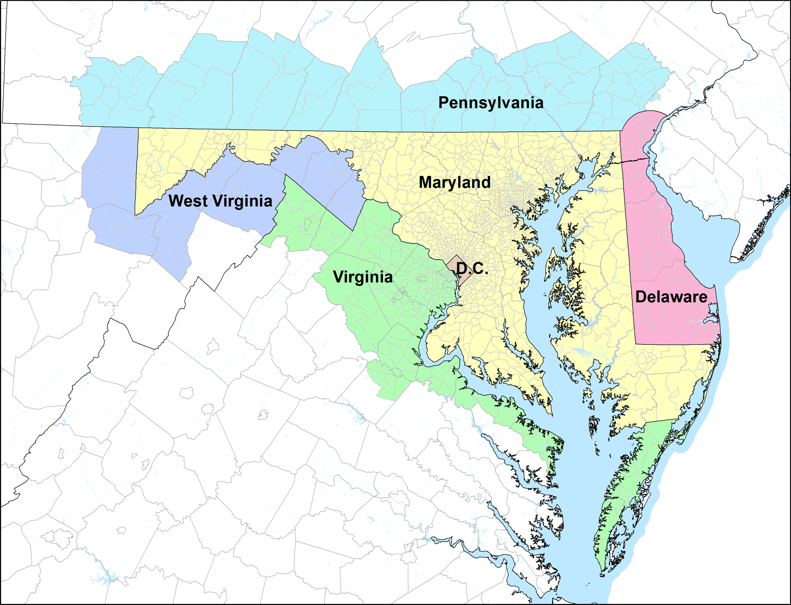
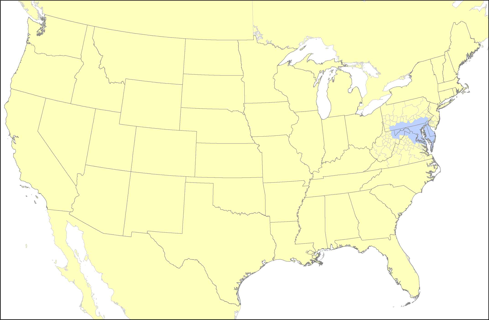
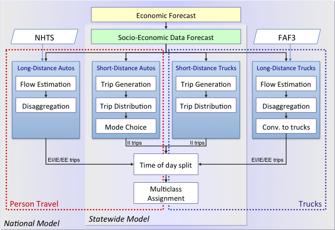

Introduction
------------

The Maryland Statewide Transportation Model (MSTM) is an advanced trip-based model that covers the State of Maryland plus surrounding areas at the *statewide layer* and the remainder of North America at the *regional layer*. Since 2006, the Maryland State Highway Administration (SHA) has developed the MSTM with support from the National Center for Smart Growth (NCSG) at the University of Maryland and Parsons Brinckerhoff, Inc. (PB). MSTM is a multi-level model that covers local trips and long-distance trips as well as person travel and freight. It has become a policy decision support tool that is applied extensively for scenario analysis, corridor studies, project forecasts and future transportation performance measurement.

The Study Area
--------------

The MSTM is designed as a multi-level model that currently works at two geographies. The statewide level covers not only the State of Maryland but also surrounding areas, including Washington, D.C., Delaware, and parts of New Jersey, Pennsylvania, Virginia and West Virginia. The geography has most detail in the urban areas of Baltimore and Washington, D.C., reflecting the centers of activity in this region. The statewide level has 1,588 zones, of which 1,151 zones are located within the state of Maryland.

*Study area: Statewide level*

The national layer covers Continental North America, including Canada and Mexico. This national layer accounts for all long-distance trips. There are 151 zones at the national level. The geography of this level has more detail in proximity to the statewide model area (smallest geography are counties) and less detail further away.

*Study area: National level*

Model Description
-----------------

The MSTM is a multi-layer trip-based model that covers both person and freight travel demand. Below a high-level flowchart of the MSTM is shown, where the box of red dots shows person travel and the box of blue dots shows truck travel. The model works at two geographic layers. Short distance trips are modeled for the statewide model study area, and long-distance trips include trips that have one or both trip ends at the national layer outside the statewide model study area.

''MSTM Flowchart

An economic forecast (yellow box) is used to project socio-economic data. Four submodels shown in blue boxes cover travel demand of different travel markets:

-   The long-distance auto model uses the long-distance element of the National Household Travel Survey (NHTS) from 2002, expands these data and disaggregates them from states to model zones.
-   The short-distance auto model is based on the trip-based model of the Baltimore Metropolitan Council (BMC), but has been revised in several respects. Non-motorized shares are estimated based on densities. Trip distribution is modeled with a logit-based destination choice model. A feedback loop from the assignment to destination choice has been implemented to achieve an equilibrium between destination choice, mode choice and travel times.
-   The short-distance truck model is an application of the Quick Response Freight Manual (QRFM), where trip rates were scaled down to better match truck count data.
-   The long-distance truck model uses freight flow data of the Freight Analysis Framework (FAF), disaggregates these flows to zones and converts tons into trucks. An empty truck model adds trucks traveling with less-than-payload.

Four time periods are distinguished (AM Peak, Midday, PM Peak and Night). A multi-class assignment assigns auto and trucks trips to the network.

The model has been used for a series of policy analysis studies, including alternative growth forecasts, expansion of the Port of Baltimore, network modifications, changes to transit, and others.

Further Information
-------------------

Further information on the MSTM can be found at the unofficial wiki <http://mstm.org>.

------------------------------------------------------------------------

