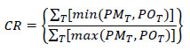

Trip Distribution/Destination Choice/Location Choice
----------------------------------------------------

This chapter discusses the validation of model components related to [destination choices, or the trip distribution step](Spatial_Interaction_Models) of four-step models. In activity-based models, relevant model components include regular workplace and school location models, tour-level (primary activity) destination choice models, and trip-level (intermediate stop) destination choice models. All of these types are referred to in this chapter as “trip distribution models.”

The most common format for trip distribution in four-step models is the gravity model, an aggregate model structure that estimates a production-attraction trip table from zone-level estimates of trip productions and attractions and measures of separation between zones. Separate models are developed for each trip purpose. In doubly constrained models, the model attempts to preserve the zonal input totals for both productions and attractions; in singly constrained models, it attempts to preserve the zonal input totals for productions only. “K-factors” are sometimes applied to improve the match between modeled and observed trip distribution patterns. Most often, K-factors are applied at a district level, where a district represents a subset of the zones within a modeled region.

In some four-step models, a multinomial logit destination choice model is used. The inputs include the same data as the gravity model, but other inputs may also be used, including socioeconomic characteristics of travelers or households and characteristics of production or attraction zones. A “size variable” corresponding to the attraction zone, generally the number of attractions or another measure of activity (such as a linear combination of employment by type and population or households) is used, usually in logarithmic form.

Multinomial logit is also the most common form of regular workplace location choice, school location choice, and primary activity destination choice in activity-based models. Logit destination choice models are singly constrained.

In activity-based models, or models with components that consider trip chaining, destination choice models for intermediate stops are used. These are also multinomial logit models that use size variables, impedance measures, and potentially characteristics of the trip maker or production/attraction zones. The main difference is that a “detour” impedance measure is used, which is the additional impedance to stop at the attraction zone compared to the impedance to travel directly between the origin and primary activity location.

This chapter is organized as follows: First, checks of the friction factors parameters that define the measure of separation in the gravity model (which is typically used for trip distribution in four-step models) are discussed in [Friction Factor Checks](#Friction_Factor_Checks). [19](#fn19) [Checks of Trip Distribution Model Results](#Checks_of_Trip_Distribution_Model_Results) presents the validation of the trip distribution model along with troubleshooting strategies that may be applied in the model estimation or calibration steps if model validation does not meet desired standards. Checks applicable to both four-step and activity-based trip distribution models are described in [Checks of Trip Distribution Model Results](#Checks_of_Trip_Distribution_Model_Results).

### Friction Factor Checks

This section discusses checks of friction factors used as parameters in gravity trip distribution models. In logit destination choice models, impedance variables are used directly.

Friction factors are used in the gravity model to represent the effects of travel impedance. Friction factors may be asserted for individual increments of impedance or computed from as a function of travel impedance, usually travel time. The most commonly used friction factor formula is the gamma function:

*F* = *a* &times; *t*^b^ &times; **e**^*ct*^

Where *F* is the friction factor; *t* is the travel impedance (usually time in minutes); *a*,*b*, *c* are model parameters; and **e** is the base of natural logarithms.

The gamma function reduces to two other commonly used functions for friction factors when either the b or c parameter is estimated to be zero. Specifically, the function reduces to the exponential function when the b parameter is zero, and to the power function when the c parameter is zero. As will be discussed below, both the b and c parameters should typically be negative (if nonzero), producing either a negative exponential function when the b parameter is zero or the inverse power function when the c parameter is zero.

Calibrated or asserted friction factors for individual increments of impedance not fitting a specific mathematical function may also be used. Such friction factors are individually calibrated so that a modeled trip length frequency distribution matches an observed trip length frequency distribution.

#### Sources of Data

The network data used for developing impedance measures are discussed in [Transportation Network Data (Model Inputs)](Model_Validation_and_Reasonableness_Checking/Model_Inputs#Transportation_Network_Data). If friction factors are not computed by a formula, they are usually derived from a household travel survey data set or transferred from another model. Some modeling software packages will estimate friction factors by trip purpose directly from a survey data set using the trip length frequency distribution.

#### Aggregate Checks

Friction factors should be monotonically decreasing from a peak that occurs at a very short travel time (e.g., five minutes or less) or its equivalent in nontime units. This assertion is based on the notion that, everything else being equal, travelers will try to reduce their travel time – traveling five minutes is more desirable than traveling six minutes if the need for travel can be satisfied at either time interval. If a formula such as the gamma function is used to compute the friction factors, this pattern is ensured if reasonable values for the parameters are chosen. The gamma function will be monotonically decreasing if both the b and c parameters are negative. If friction factors are derived directly from survey data, they should be checked to ensure monotonic decreases as travel times increase. While travel survey patterns usually show decreased trip frequency with high impedances, there may be places where the pattern is not “smooth.” Care should also be used to ensure that the minimum value for a friction factor is greater than zero; zero friction factors preclude any travel for the impedance range represented.

Periodically, model estimation might result in a positive value for either the b or c parameter. This result might be acceptable in some cases. For example, if the trip distribution model distributes all person trips in motorized vehicles, the function might increase for very small impedance values, such as less than five minutes of travel time, and then monotonically decrease. In other cases, the model might monotonically decrease until an inflection point at a very large value of the impedance (see, for example, the nonhome-based function for “Large MPO 3” in [Table 6.1](#Table-t6-1)). If that value is substantially larger than would ever be expected in the applications of the model for the region, the positive value for the parameter might be acceptable.

Parameters of formulas such as the gamma function may be checked for reasonableness by comparing them to those used in other models. [Table 6.1](#Table-t6-1) presents the “b” and “c” parameters used by six MPOs of varying sizes. The parameters show a relatively large variation. Since friction factors can be scaled without impacting the distribution, the parameters shown in [Table 6.1](#Table-t6-1) were scaled to be 1,000,000 at one minute of travel time. The resulting friction factor curves for the home-based work, home-based nonwork, and nonhome-based trip purposes are shown in Figures [6.1 through 6.3](#Figure6-1).

Table 5.1 Example Home-Based Nonwork Trip Production Model

Table 6.1 Trip Distribution Gamma Function Parameters

|                  |                     |                        |                    |
|------------------|---------------------|------------------------|--------------------|
|                  | 
            
                    **Home-Based Work**  
                                         
                    
            | 
               
                                          **Home-Based Nonwork**  
                                                                  
                                          
               | 
           
                                                                   **Nonhome- Based**  
                                                                                       
                                                                   
           |
| 
         
 **“b”**           
                   
 
         | 
            
                    **“c”**              
                                         
                    
            | 
               
                                          **“b”**                 
                                                                  
                                          
               | 
           
                                                                   **“c”**             
                                                                                       
                                                                   
           |
| 
         
 **Large MPO 1**   
                   
 
         | -0.503              | -0.078                 | -3.993             |
| 
         
 **Large MPO 2**   
                   
 
         | -1.65               | -0.0398                | -1.51              |
| 
         
 **Large MPO 3**   
                   
 
         | -0.156              | -0.045                 | -1.646             |
| 
         
 **Medium MPO 1**  
                   
 
         | -0.81203            | -0.03715               | -1.95417           |
| 
         
 **Medium MPO 2**  
                   
 
         | -0.388              | -0.117                 | -2.1               |
| 
         
 **Small MPO 1**   
                   
 
         | -0.265              | -0.04                  | -1.017             |

“Large MPO” population is greater than 1 million.

“Medium MPO” population is between 200,000 and 1 million.

“Small MPO” population is less than 200,000.

Note that the gamma function parameters shown in these examples were calibrated based on good approximations of travel times, considering observed levels of congestion, in the various urban areas. Generally, in the larger, more congested areas, this requires feedback of travel times from the highway assignment step. In the smaller areas where congestion is infrequent, the free flow times are reasonable approximations of the travel times experienced on the highway system, and feedback may not be used.

These parameters and graphs are provided as examples and are not intended to provide recommended or transferable friction factors. Differences in urban area geography and other characteristics make it difficult to determine “correct” friction factors for any particular context.

#### Disaggregate Checks

There are no applicable disaggregate checks friction factors.

#### Criteria Guidelines

There are no applicable criteria guidelines for checks of friction factors.

#### Reasonableness and Sensitivity Testing

Reasonableness checks have been presented as part of the aggregate checks presented in \[\[\#Aggregate Checks|Aggregate Checks\]. There are no applicable sensitivity checks of friction factors.

#### Troubleshooting Strategies

[Table 6.2](#Table-t6-2) shows some of the potential troubleshooting strategies for dealing with issues with friction factors.

Table 6.2 Troubleshooting Strategies for Issues with Friction Factors

|                                                                                                  |                                                                                       |
|--------------------------------------------------------------------------------------------------|---------------------------------------------------------------------------------------|
| 
                                                                                         
 **Issue**                                                                                         
                                                                                                   
 
                                                                                         | 
                                                                              
                                                                                                    **Potential Troubleshooting Strategies**                                               
                                                                                                                                                                                           
                                                                                                    
                                                                              |
| Friction factors do not monotonically decrease from a peak occurring at a very short travel time | -   Check parameters of friction factor formula (e.g., gamma function)                
                                                                                                    -   Check friction factor pattern for match with observed trip length frequency        
                                                                                                    -   Check to ensure that “smoothed” observed data pattern is monotonically decreasing  |

### Checks of Trip Distribution Model Results

Generally speaking, the types of models described in this chapter match production, origin, or home zones with the locations of trip attractions, destinations, or activities. For the trip distribution component of four-step models, these results are presented as trip tables. For components of activity-based models, the activity locations are modeled relative to the home location (or the work activity location in the case of a work-based subtour), but trip tables are not created; the results of other model components (e.g., daily activity patterns, intermediate stop models) are used so that trip tables are created later if needed. The outputs in these cases are matched origin and activity/destination locations. In the case of intermediate stop location models, the activity location is determined based on the locations of both a home/origin and a primary activity location. For simplicity, the results to be validated will be referred to as “trip tables” throughout this chapter.

#### Sources of Data

The main sources of data for validation include the following:

-   **Household travel/activity survey –** If such a survey is available, it is likely to have been the data source for model estimation. It is the best source for information on local origin-destination travel data for all person trips. It can be used to produce trip length frequency distributions and can be expanded to produce a trip table of all travel made by the residents of a modeled region. The expanded trip table will not be statistically valid at the zone level but can be used at a more aggregate (district) level.
-   **Census data –** Through the 2000 U.S. Census, the long form provided the information for the Census Transportation Planning Package (CTPP). The long form asked for information on the journey to work, including work location, departure time, and primary mode used. Since the long form has been eliminated for the 2010 Census, the Census Bureau has developed the American Community Survey (ACS), which is conducted continuously, not only at the time of the decennial census. The ACS also collects data on work location and travel.\
    Work travel is treated differently in the ACS compared to travel models. The ACS asks:
    -   Where each person worked “most last week”;
    -   The street address of the workplace;
    -   How the person “usually” traveled to work (single mode “used for most of the distance”);
    -   The “usual” auto occupancy;
    -   The “usual” departure time from home;
    -   The usual travel time in minutes; and
    -   Whether the person was temporarily absent from work due to layoff, vacation, illness, labor dispute, etc. Note that the responses to these questions differ from the way work travel may be treated in household surveys and models in several ways:
    -   A household survey asks about the respondent’s travel to work on the travel day, as opposed to where he or she usually worked over the past week;
    -   Mode is defined in more detail in travel surveys and models (e.g., park-and-ride as opposed to bus or auto);
    -   A household survey asks about stops on the way to or from work, whereas the ACS does not ask about stops on the way to work; and
    -   Home-based work trips in models include trips home from work as well as to work.
-   **National sources** – National data sources include the National Household Travel Survey (NHTS), NCHRP Report 365, Travel Estimation Techniques for Urban Planning, which is being updated (the update is expected to be available in 2010), and other documents (e.g., TCRP Report 73, Characteristics of Urban Travel Demand).

#### Aggregate Checks

There are two general types of aggregate checks of trip distribution model results: Trip length checks and origin-destination pattern checks, which are associated with base year scenarios. Scenario comparisons are an aggregate check appropriate for forecast and other types of alternative scenarios for which observed data may not be available and are discussed in [Reasonableness and Sensitivity Testing](#Reasonableness_and_Sensitivity_Testing).

##### Trip Length Checks

The main trip length checks for base year scenarios involve comparing average trip lengths and trip length frequency distributions between model results and observed data from the household travel survey. For home-based work trips, CTPP data are often a supplementary source for trip length information. Trip length checks should be performed separately for each trip, tour, or activity purpose – essentially for each separately estimated model.

Trip lengths should be checked as represented in both distance and time units. While the impedance measure may consist of other level of service elements, it is important to check (and easier to interpret) results for time and distance. However, “trip length” checks may be performed for the specific measure of impedance used in the model as a supplement to the time and distance checks.

Most travel surveys ask respondents to report departure and arrival times and therefore provide estimates of trip lengths. However, experience with trip length information from these surveys indicates that they do not provide reliable information for developing average trip lengths or trip length frequency distributions. It is easier for respondents to recall and report specific activities and locations than to do so for specific departure and arrival times. Even when the times are recalled accurately, many respondents round times to the nearest 5, 15, or 30 minutes. Travel times can vary significantly from day to day, and models use travel times based on average conditions, which are closer to what travelers assume in decision-making.

To address this issue, trip lengths are computed using the time and distance skims applied to the specific origins and destinations reported in the survey. Average trip lengths and trip length frequency distributions for the observed condition are computed directly from the trip table obtained from the expanded survey data and compared to trip table information obtained from applying the model. For the modeled trip tables, trip generation estimates must be available since they are necessary inputs to the trip distribution model (the same applies to the models providing inputs to activity-based location choice models).

The first check is to compare modeled to observed average trip lengths. These should be checked separately for each trip or activity purpose. It is also desirable to check trip lengths by market segment, with segments defined however possible given the model’s capabilities and the information available from the observed survey data. For example, if trips by different income levels are modeled separately, it would make sense to compare average trip lengths for each income level modeled. Another possible segmentation scheme is by geographic subregion or district. For a disaggregate activity-based model, market segments can be defined in numerous ways, limited only by the variables used in the definition of the synthetic population and the variables included in the survey.

It is insufficient to check only the average trip lengths; the frequency distribution of trip lengths must also be checked. Visual checks can be very useful; the observed and modeled trip length frequency distributions can be plotted on the same graph to see how closely the distributions match.

A more rigorous way of checking trip length frequency distributions is through the use of *coincidence ratios*. This is most easily understood as the area under both curves divided by the area under at least one of the curves, when the observed and modeled trip length frequency distributions are plotted. Mathematically, the sum of the lower value of the two distributions at each increment of time or distance is divided by the sum of the higher value of the two distributions at each increment. Generally, the coincidence ratio measures the percent of area that “coincides” for the two curves.

The procedure to calculate the coincidence of distributions is as follows:

where *CR* is the Coincidence Ratio; *PM~T~* is the proportion of modeled distribution in interval *T*; *PO~T~* is the proportion of observed distribution in interval *T*; and *T* is the histogram interval for time, distance, or other impedance measure (e.g., 0-4.9 minutes, 5.0-9.9 minutes, etc.)

The coincidence ratio lies between 0 and 1.0, where a ratio of 1.0 indicates identical distributions. [Figure 6.4](#Figure6-4) shows an example application of the coincidence ratio.

Note: ATL = Average Trip Length.\

##### Origin-Destination Pattern Checks

As discussed previously, it is impossible to estimate a statistically valid origin-destination trip table at the zone interchange level by expanding household surveys with typical sample sizes. It is therefore necessary to check origin-destination patterns at a more aggregate level. Generally, this is described as a *district*-level validation. The ideal number of districts is dependent on many factors, including the size of the modeled region, the number of zones, the amount of travel, the existence of political boundaries and travel barriers such as rivers, and the amount of market segmentation for which district-level analysis will be performed.

In most urban area models, the central business district is analyzed as a separate district or group of districts. It is also good practice to keep major political entities (states, counties, and large cities) in separate districts wherever possible. Many types of trips (e.g., school trips) can be affected by these political boundaries. Significant travel barriers, including major rivers or rail corridors with limited crossing opportunities, make good district boundaries. It may also make sense to align district boundaries with screenline or cutline locations (see [Traffic Assignment Checks (Assignment)](Model_Validation_and_Reasonableness_Checking/Assignment#Traffic_Assignment_Checks)) to better use information from highway assignment in validation of travel patterns.

As with other checks, district-level geographic checks should be performed separately for each trip or activity purpose. Additional market segmentation, such as by income level, should also be performed where the observed data exist and the model supports such segmentation.

Another check of origin-destination patterns is the *orientation ratio*. This ratio measures the propensity of trips from a production area (or zone) to the attraction area and is defined as follows:

-   The numerator is the trips to the attraction area from the production area divided by the sum of all trips to the attraction area; and
-   The denominator is all trips from the production area divided by all trips in the region.

For example, say that from district A to district B, there are 300 trips, and there are 800 total trips produced in district A, 100,000 total trips attracted to district B, and 750,000 total regional trips. The orientation ratio for district A to district B is computed as:

-   (300/100,000) / (800/750,000) = 2.81

An orientation ratio with a value of less than 1.0 indicates that the production area is less oriented to the attraction district than is the region as a whole. An example might be a low-income residential area located adjacent to a “tech center” area. Conversely, an orientation ratio with a value of greater than 1.0 indicates that the zone is more orientated to the attraction area than other zones in the region. The orientation ratio can be calculated on a zonal level or a mixed zonal and district level, as desired.

The orientation ratio can be useful for understanding the reasonableness of modeled distributions. If modeled distributions for selected areas are compared to observed distributions for validation purposes, the checks should be performed on a district basis due to the inherent sampling error associated with household surveys. As a district-level validation check, the observed and modeled orientation ratios can be calculated for each district-to-district interchange. Then, the ratios of the modeled to observed district-level orientation ratios can be estimated. The closer the ratios are to 1.0, the better the model is reproducing observed orientations. Likewise, the differences between the modeled and observed orientation ratios can be checked. Differences close to zero imply better reproduction of observed trip orientations.

Plots of orientation ratios can also be used to qualitatively check trip distribution results. [Figure 6.5](#Figure6-5) shows an example of modeled and observed orientation ratios estimated on a zonal basis (for the productions) to an attraction district (the CBD). The calculated ratios have been plotted. The results shown in [Figure 6.5](#Figure6-5) suggest that there might be too much modeled travel from the eastern part of the region to the CBD. The observed results in [Figure 6.5](#Figure6-5) also show the difficulty with using travel survey data on a zonal level. Aggregation of the modeled and observed results shown in [Figure 6.5](#Figure6-5) to a district-level structure might provide a clearer picture of differences in the modeled and observed orientations of trips to the CBD for this example.

Another geographic check of travel patterns is the amount of intrazonal travel. This depends greatly on the definition of zones and the level of detail of the model. The modeled percentage of intrazonal trips should be compared to the observed percentage of intrazonal travel from the expanded household survey. These checks should be done separately by trip purpose and market segment and may also be done at the district level.[20](#fn20)

#### Disaggregate Checks

Since the gravity model is an aggregate formulation, there are no applicable disaggregate checks. Logit models are disaggregately estimated (one record per trip/activity), and therefore disaggregate validation is needed for logit destination choice models, along with the aggregate checks described above.

Ideally, disaggregate validation of a model should be performed using a data set that is independent of the data set used for model estimation. For example, a survey data set might be divided in half, with one half used for model estimation and the other for model validation. As a practical matter, however, most urban area household travel surveys have such small sample sizes that the entire data set is needed for model estimation. In most cases, therefore, there is no independent model estimation data set available for validation.

Limited disaggregate validation can be performed using the same data set used for model estimation, but reporting the results by market segment. Logit model estimation software has the capability to apply the estimated model to a data set in the same form as the estimation data set. For example, a logit destination choice model could be applied to the data set used for estimation but the results may be reported by vehicle availability level. It might be found, for example, that zones in the CBD are not being chosen often enough in the model for households with zero vehicles.

Source: *Shining a Light Inside the Black Box*, TMIP webinar, March 11, 2008.\
Note: This figure is not critical in understanding the concept of orientation maps.

\
While it is good practice to perform disaggregate validation of logit destination choice models, it is often difficult to use the results. Since a destination choice model usually consists of zones, there are hundreds or thousands of alternatives, making the reports of the model application very long and time consuming to analyze. Furthermore, as discussed above, typically household survey sample sizes do not have large enough sample sizes to analyze results at the zone level. While disaggregate validation is a useful tool to identify systematic biases in the estimated models, there are often aggregate tests that are more practical. For example, model application results could be segmented by trip length category, but the aggregate trip length checks described in \[../FHWA-HEP-10-042/ch6.htm\#sect6-2-2 Section 6.2.2\] provide a much easier way of identifying whether modeled trip lengths are accurate.

#### Criteria Guidelines

The guidelines presented in this chapter are intended for use with the comparisons of base year modeled results to observed data shown in [Aggregate Checks](#Aggregate_Checks). As with criteria guidelines throughout the validation process, the figures presented in this chapter are guidelines and are not to be interpreted as absolute standards. Meeting every guideline does not ensure a validated model, nor does missing a guideline imply that the model is not validated.

Average trip lengths – Generally, the modeled average trip lengths for each trip purpose should be within five percent of observed for each trip purpose. In models with many trip purposes, some purposes may have relatively few trips, and so the five percent guideline can be relaxed in these cases.

Coincidence ratios – It is preferable for the coincidence ratio for each trip purpose to be at least 70 percent. The 70 percent guideline can be relaxed in models with many trip purposes since some purposes may have relatively few trips.

Intrazonal trip percentages – Some models have used guidelines where regionwide intrazonal trip percentages should be within three percentage points of observed for each trip purpose. For example, if a trip purpose had an observed intrazonal trip percentage of seven percent, the modeled percentage should be between 4 and 10 percent.

Orientation ratios – Orientation ratios are a relatively new measure and, as a result, no guidelines have been set. However, as described in [Aggregate Checks](#Aggregate_Checks), if the ratios of modeled to observed orientation ratios are calculated, values closer to 1.0 imply a better match of the modeled distribution to the observed distribution. Likewise, if the differences between the ratio are calculated, values closer to zero imply a better match of modeled to observed distributions.

#### Reasonableness and Sensitivity Testing

The reasonableness checks for trip distribution models are mainly the aggregate checks presented in [Aggregate Checks](#Aggregate_Checks).

Sensitivity testing can be performed for trip distribution models by varying model inputs and checking results for reasonableness. Model inputs that can be varied include level of service variables used in the trip distribution model (time/speed and cost) and the level of activity/number of trips in different parts of the region. Some example tests include the following:

-   Increasing or decreasing speeds by a fixed percentage regionwide or on a specific subset of highways (e.g., freeways);
-   Increasing/decreasing parking costs in the CBD by a fixed percentage;
-   Increasing/decreasing tolls by a fixed percentage or amount;
-   Increasing/decreasing travel times, headways, or fares by a fixed percentage;
-   Changing development patterns for forecast years by moving projected new activity among different parts of the modeled region (e.g., from suburbs to small urban centers or from outlying areas to infill); and
-   Reallocating the number of household by income level for a forecast year.

Due to a lack of experience with sensitivity testing for trip distribution models, developing standards for expected changes in trip lengths or distribution patterns based on changes in input variables is difficult. While elasticities of travel in response to changes in transportation level of service are generally well below 1.0 in absolute value, it is up to the experienced planner to determine whether the modeled changes are reasonable.

##### Scenario Comparison

For scenarios where there are no observed data for comparison, model results must be checked by comparing them to another previously validated scenario such as the validated base year scenario, another forecast scenario, or a “no build” scenario associated with the alternative policy/project scenario.

All of the checks listed previously in [Aggregate Checks](#Aggregate_Checks) can be used for these comparisons, including average trip lengths and trip length frequencies, district-level origin-destination flows, and orientation ratios. Orientation ratios can provide a good reasonableness and sensitivity check. Similar plots to those shown in [Figure 6.5](#Figure6-5) could be produced for trip distributions performed for base and alternative scenarios. Resulting changes in orientation ratios should be visible in a comparison of the plots.

The purpose of these comparisons is not to match the model results with those from the comparison scenario, but rather to determine whether the differences are reasonable. It is therefore important that those performing these checks include persons with knowledge of the modeled region as well as the models themselves.

#### Troubleshooting Strategies

Issues discovered during the model checks described in Sections [Aggregate Checks](#Aggregate_Checks), [Disaggregate Checks](#Disaggregate_Checks), and [Reasonableness and Sensitivity Testing](#Reasonableness_and_Sensitivity_Testing) may imply errors in trip distribution model parameters or input data (networks/skims or trip ends). [Table 6.3](#Table-t6-3) shows some of the typical problems that may be evident from these tests. Because it is a critical topic, one strategy, the use of K-factors, is discussed in more detail at the end of this chapter.

**Table 6.3 Troubleshooting Strategies for Issues with Trip Distribution Model Results**

|                                                                                 |                                                                                                                     |
|---------------------------------------------------------------------------------|---------------------------------------------------------------------------------------------------------------------|
| 
                                                                        
 **Issue**                                                                        
                                                                                  
 
                                                                        | 
                                                                                                            
                                                                                   **Potential Troubleshooting Strategies**                                                                             
                                                                                                                                                                                                        
                                                                                   
                                                                                                            |
| 1\. Average trip lengths too long or short                                      | -   Recalibrate friction factors or adjust parameters of friction factor formula or logit utility equations         
                                                                                   -   Recheck skim data and trip end inputs                                                                            
                                                                                   -   Check distribution patterns (see below)                                                                          |
| 2\. Coincidence ratio too low                                                   | -   Recalibrate friction factors or adjust parameters of friction factor formula or logit utility equations         |
| 3\. District-level origin-destination patterns inaccurate for some interchanges | -   Check trip lengths (see above)                                                                                  
                                                                                   -   Check travel impedances between affected districts                                                               
                                                                                   -   Introduce or adjust K-factors                                                                                    
                                                                                   -   Introduce impedance penalties on network links (e.g., bridge crossings)                                          |
| 4\. Too may or few intrazonal trips                                             | -   Adjust intrazonal travel times for types of zones with this issue                                               |
| 5\. Model too sensitive or insensitive to changes in level of service           | -   Adjust parameters for appropriate level of service variables in impedance/utility functions or friction factors |

Tests described here are not intended to be performed in isolation, and an iterative approach to testing may be necessary. For example, consider an urban area that includes parts of two states. If the model is predicting too much travel between the two states, the model may not be sufficiently sensitive to the reasons why interstate travel might be avoided for some purposes, or it could simply be overestimating longer trips (which may be biased toward interstate trips). It is necessary to check the results of both the district-level origin-destination summaries and the trip length frequency distribution comparison to determine the most likely causes for these model results and to suggest the best calibration methods. The best method could be the introduction of interstate K-factors, changes to the friction factors, or some combination of both of these.

##### K-Factors

K-factors correct for major discrepancies in trip interchanges, usually at the district level. They are typically justified as representing socioeconomic or other characteristics that affect trip making but are not otherwise represented in the model. Physical barriers, such as a river crossing, may also result in differences between observed and modeled trip patterns. For example, trip movements between zones separated by a bridge may not be as great as would be expected using only quantifiable measures. In this case, a planner could use either K-factors or artificial times on the bridge links to match the actual interchange of travel.

In a sense, K-factors are analogous to the alternative specific constants in logit models; they are intended to account for the choice factors that are not able to be included in the models. Since trip distribution models have relatively few input variables, it is reasonable to believe that other factors that affect location choice are not included in the models. In many cases they cannot be measured, quantified, or forecasted. K-factors provide a means for accounting for these factors, although they are then assumed to remain fixed over time and across all scenarios.

For this reason, K-factors must be used very cautiously. Because they can be used to provide nearly perfect matches between modeled and observed district-level origin-destination flows, it can be very tempting to apply K-factors to resolve differences in origin-destination flows without determining whether they are the best method to solve the problem at hand. The use of K-factors, therefore, should be considered “a last resort” after all other possible causes for error and calibration adjustments have been considered. Even when K-factors are introduced, they should be relatively small in magnitude – the closer to 1.0, the better.

A valid use of K-factors may occur when it is necessary to “zero out” trips between groups of zones. Consider the example of a trip distribution model of external-internal trips for the region depicted in [Figure 6.5](#Figure-f6-5). Because of the geography of the modeled region boundary, it is unlikely that trips would occur between External Station 2 and the zones in District A. Trips from the area outside the modeled region as shown in [Figure 6.5](#Figure-f6-5) would likely enter the modeled region via External Station 1 to travel to zones included in District A. However, internal-external trip productions from the zone representing External Station 2 in the travel model would not be precluded from “traveling” to zones in District A in a typical trip distribution process. So, introducing a K-factor of zero between External Station 2 and the zones in District A would ensure that these unlikely trips would not occur in the model.

------------------------------------------------------------------------

19&nbsp;Friction factors define the measure of separation based on travel impedances between TAZs. Checks of travel impedance skims for travel time, travel distance, and travel cost are discussed in [Network Skims and Path Building](Model_Validation_and_Reasonableness_Checking/Model_Inputs#Network_Skims_and_Path_Building). Those basic travel impedance skims are used for both trip distribution and mode choice modeling.

20&nbsp;Zone-level intrazonal percentages from the survey data set are not statistically significant in most cases.

------------------------------------------------------------------------

