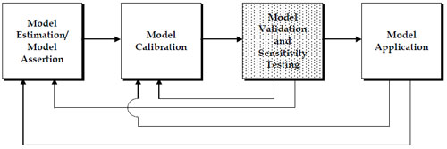

Introduction
------------

Essentially, all models are wrong, but some are useful…the practical question is how wrong do they have to be to not be useful. ([1](#fn1))

\_\_TOC\_\_

### Why Is Validation Important?

As stated in the introductory quote, "all models are wrong…" An obvious question that might be asked in response to that statement is, "Why?" The answer is relatively simple. Travel models are a closed system, distinguished by a set of mathematical formulae and relationships, being used in an attempt to reflect an open system – the real world populated by people who are responding to influences that are constantly changing, do not always make rational decisions, and whose responses to influences affecting travel are not always the same. Since travel models (and travel modelers) cannot be omniscient, there will always be missed information and abstractions resulting in less than perfect models. Thus, validation is important since it is the effort focused on answering the second part of the quote, the usefulness of the models.

The original *Travel Model Validation and Reasonableness Checking Manual* ([2](#fn2)) was published by the Federal Highway Administration (FHWA) Travel Model Improvement Program (TMIP) in 1997. Some of the reasons that manual was produced included:

> "…the lack of attention and effort placed on the validation phase of model development…models need to be able to replicate observed conditions within reason before being used to produce future-year forecasts…credibility of the process with decision-makers will depend largely on the ability of analysts to properly validate procedures and models used.
>
> "…travel modeling process has undergone many changes in the past few years in order to evaluate more complex policy actions…tradeoff between increasing confidence in the level of accuracy of the models and the cost of data collection and effort required to validate models."

Since the publication of the original manual, the need for quality model validation has increased. Resources for the construction of new facilities have become increasingly scarce, new funding mechanisms such as tolling have become popular, and new travel forecasting techniques focused more on the explanation of traveler behavior than travel patterns have been implemented in a number of regions. These issues have made well validated travel models increasingly important in order to provide decision-makers the assurance they need to confidently use the travel forecasts. However, as documented in the Transportation Research Board (TRB) Special Report 288, *Metropolitan Travel Forecasting, Current Practice and Future Direction* (*SR 288*),([3](#fn3)) the state of model validation has not necessarily kept pace with the need (*emphasis added*):

> **Validation Errors:** Validating the ability of a model to predict future behavior requires comparing its predictions with information other than that used in estimating the model. Perceived problems with model validation include *insufficient emphasis and effort* focused on the validation phase, the *unavailability of accurate and current data* for validation purposes, and the *lack of necessary documentation* The survey of Metropolitan Planning Organizations (MPOs) conducted for this study found that validation is hampered by a *dearth of independent data sources*.

### Background

This manual builds upon several efforts associated with improving the state of model validation and the resulting forecasts:

-   The 1990 FHWA publication, *Calibration and Adjustment of System Planning Models*, (FHWA-ED-90-015);
-   The 1997 FHWA *Travel Model Validation and Reasonableness Checking Manual*;
-   Numerous state publications on travel model validation, such as those by Michigan, Ohio, and Florida;
-   The March 11, 2008 TMIP webinar, Shining a Light Inside the Black Box: Model Testing;
-   The Federal Transit Administration (FTA) New Starts Workshops and New Starts guidance; and
-   The May 9, 2008 TMIP Peer Exchange on Travel Model Validation Practices.

The sources referenced above provide recommendations and guidance regarding travel model validation. However, some of the references are dated, and some have a relatively narrow focus. In addition, new travel forecasting techniques, such as synthesizing regional populations, activity- and tour-based modeling, dynamic traffic assignment, and simulation, are emerging as accepted modeling practices.

The TMIP has provided technical assistance to aid planning organizations in implementing best state-of-the-practice and state-of-the-art modeling methods. As part of the TMIP's efforts to improve travel modeling practice, this manual provides guidance on:

-   The development of model validation plans, including collection of proper validation data;
-   The role and specification of validation and reasonableness checks and criteria;
-   The role of model sensitivity testing in model validation; and
-   The development of validation documentation.

This manual focuses on both existing trip-based and emerging activity- and tour-based modeling processes. While it is impossible to specify the checks needed to validate every possible model, this manual describes families of checks and provides concrete examples of their application. The manual is being published as a web-based document with the goal of making it a living document with best practice updates as new issues or techniques emerge.

### Target Audience

This manual has been developed for technical staff charged with the development, maintenance, or application of travel models. Planners, practitioners, policy-level officials, and other stakeholders involved in the transportation process may find the concepts discussed in this manual useful in their evaluation of travel forecasts and the models used to produce those forecasts. The potential target audience includes:

-   Travel demand forecasting model development and application staff;
-   Planning and operations staff;
-   Staff of elected officials and other policy-makers; and
-   Staff of nongovernmental organizations concerned with transportation planning or policy issues.

Travel model validation and documentation efforts need to cover a wide range of interests and concerns. A primary goal of this manual is to provide information on validation processes useful for building confidence in the travel modeling process and resulting travel forecasts for the various target audiences. Indeed, at the May 9, 2008 TMIP Peer Exchange, the following definition of was developed for improved model validation *at a level of detail needed to support public decision-making*:

Steps to verify the ability of the model system to make reasonable predictions over a range of development patterns, transportation operations, and external factors.

### Overview of the Model Validation and Reasonableness Testing Process

#### Definitions

One confounding issue regarding model validation and reasonableness checking is the lack of a common definition of terms. The task referred to as model validation by one person might be referred to as model calibration by another. Throughout this manual, the following definitions will be employed:

-   **Estimation** is the use of statistical analysis techniques and observed data to develop model parameters or coefficients. While model estimation typically occurs at a disaggregate level without bias or correction factors, model estimation may also use statistical analysis procedures to analyze more aggregate data.
-   '''Assertion '''is the declaration of model forms or parameters without the use of statistical analysis of observed data. Model transfer from one region to another is a form of model assertion.
-   **Calibration** is the adjustment of constants and other model parameters in estimated or asserted models in an effort to make the models replicate observed data for a base (calibration) year or otherwise produce more reasonable results. Model calibration is often incorrectly considered to be model validation.
-   '''Validation '''is the application of the calibrated models and comparison of the results against observed data. Ideally, the observed data are data *not* used for the model estimation or calibration but, practically, this is not always feasible. Validation data may include additional data collected for the same year as the estimation or calibration of the model or data collected for an alternative year. Validation should also include sensitivity testing.
-   '''Sensitivity testing '''is the application of the models and the model set using alternative input data or assumptions. Sensitivity testing of individual model components may include the estimation of the elasticities and cross-elasticities of model coefficients. However, sensitivity testing should also include the application of the entire model set using alternative assumptions regarding the input demographic data, socioeconomic data, or transportation system to determine if the model results are plausible and reasonable.

The travel model development, validation, and application processes defined above can be viewed as shown in ([Figure 1.1](#Figure1-1)). Model validation and sensitivity testing may reveal the need to return to the model estimation or model calibration steps. The application of the model using future year conditions and policy options requires checking the reasonableness of projections, and also might reveal a need to return to the model estimation or calibration steps. Issues uncovered during model application never lead directly back to the validation step since it is not possible to improve the model or model forecasts through additional validation. In some cases, however, additional model validation might be helpful in confirming the veracity of forecasts.

The focus of this manual is the shaded model validation and sensitivity testing task. Some troubleshooting strategies will be provided for situations when satisfactory validations are not obtained. The troubleshooting strategies are applied as part of the model estimation or model calibration steps.

#### Recommended Model Validation Approach

##### Validation Process Elements

There are five primary model validation process elements that will be covered in this manual. Each of the elements is the subject of one or more chapters as outlined below:

| 
                                         
 **Validation Process Element**                    
                                                   
 
                                         | 
                                                                                                
                                                    **Discussed in Manual Chapter(s)**                                                                       
                                                                                                                                                             
                                                    
                                                                                                |
|--------------------------------------------------|---------------------------------------------------------------------------------------------------------|
| 1\. Model Validation Plan Specification          | [Validation Plan](Model_Validation_and_Reasonableness_Checking/Validation_Plan)              |
| 2\. Collection and Assessment of Validation Data | [Validation Plan](Model_Validation_and_Reasonableness_Checking/Validation_Plan)              |
| 3\. Validation of Model Components               | [Model Inputs](Model_Validation_and_Reasonableness_Checking/Model_Inputs)                    |
|                                                  | [SocioEconomic Models](Model_Validation_and_Reasonableness_Checking/Socioeconomic_Models)    |
|                                                  | [Amount of Travel/Activity](Model_Validation_and_Reasonableness_Checking/Amount_Of_Travel)   |
|                                                  | [Trip Distribution](Model_Validation_and_Reasonableness_Checking/Distribution)               |
|                                                  | [Mode Choice](Model_Validation_and_Reasonableness_Checking/Mode_Choice)                      |
|                                                  | [Time of Day](Model_Validation_and_Reasonableness_Checking/Time_Of_Day)                      |
|                                                  | [Assignment Procedures](Model_Validation_and_Reasonableness_Checking/Assignment)             |
| 4\. Validation of Model System                   | [Assignment Procedures](Model_Validation_and_Reasonableness_Checking/Assignment)             |
|                                                  | [Temporal Validation](Model_Validation_and_Reasonableness_Checking/Temporal_And_Sensitivity) |
| 5\. Documentation of Validation Results          | [Documentation](Model_Validation_and_Reasonableness_Checking/Documentation)                  |

One or more of the above elements is too often skipped, which can lead to inadequate model validation. For example, without a good model validation plan, necessary data may not be available for proper validation of model components or the model system. This can lead to over-reliance on matching observed traffic counts or transit boardings for model validation. Likewise, documentation is often overlooked. Yet quality documentation is key to providing planners, engineers, and decision-makers with a better understanding of the reliability of forecasts and the methods used to reproduce "observed" travel.

A critical point regarding model validation is that every component of a model must be validated, as well as the entire model system. For conventional four-step travel models, this includes the four major components – trip generation, trip distribution, mode choice, and mode specific trip assignment – along with the model input data and other components that might be part of the model system, such as vehicle availability, or time-of-day modeling processes. For a more complex model system, such as an activity-based modeling, there could be 10 to 20 model components requiring validation.

##### Validation Sequence

The recommendation to perform validation of both model components and the entire model system may result in a validation sequence conundrum. Specifically, a determination must be made regarding the amounts of time and resources to devote to component validation as the components are developed versus waiting until all components have been estimated and (initially) calibrated to perform component validation in conjunction with system validation. Both approaches can have benefits and costs. A simple example of the conundrum can be illustrated with trip generation models. Trip generation can be validated against calculated trip rates by comparing to expanded household survey data, but issues with underrepresentation of total trips by the household survey may not be realized until the system validation is performed and modeled versus observed vehicle-miles of travel comparisons are performed.

Validation sequence should be considered in the validation plan specification. It is impossible to complete the model system validation prior to the completion of the model component validations. Establishing a sequence, where a model component is initially validated and applied for an initial full system "validation" using existing model components for the subsequent steps, might be an efficient approach. It is inevitable that some iteration will be required in the validation sequence for model components and the overall model system.

##### Types of Validation Checks

Four broad categories of validation checks will be used in this manual:

1.  **Comparisons of base year model results to observations** might be considered "traditional" validation. The comparisons might be of model results to disaggregate data such as data from a supplementary survey not used for model estimation or to aggregate data such as traffic counts or transit boardings. Comparing base year model results to different aggregations of the data used to estimate or calibrate a model is not as sound of a validation practice as comparing to independent data. However, for some validation tests, the data used for model estimation or calibration are the only data available.
2.  **Temporal validation** is an important aspect of model validation since, by definition, it implies comparing model results to data not used in model estimation. Both backcasts and forecasts may be used for model validation. For example, if a model is estimated using 2007 survey data, the model could be used to backcast to 2000 conditions, and compared to year 2000 traffic counts, transit boardings, Census Transportation Planning Package (CTPP) data, or other historical data. Likewise, if a model was estimated or calibrated using 2005 survey data, a "forecast" validation could be performed against 2008 data.
3.  '''Model sensitivity testing '''includes several important types of checks including both disaggregate and aggregate checks. Disaggregate checks, such as the determination of model elasticities, are performed during model estimation. Aggregate sensitivity testing results from temporal validation. Sensitivity testing can also include model application using alternative demographic, socioeconomic, transportation supply, or policy assumptions to determine the reasonableness of the resulting travel forecasts.
4.  '''Reasonableness and logic checks '''include the types of checks that might be made under model sensitivity testing. These checks also include the comparison of estimated (or calibrated) model parameters against those estimated in other regions with similar models. Reasonableness and logic checks may also include "components of change" analyses and an evaluation of whether or not the models "tell a coherent story" as recommended by the FTA for New Starts analysis.

### Validation Considerations

#### Types of Travel Demand Forecast Model Applications

When travel demand forecasting models were first developed, the transportation planning questions that they were used to address were very different questions from today. The initial use of travel forecasts focused on highway design and location. The outputs from the models were typically used for elements such as roadway sizing, geometric design, and pavement design. Over time, the role of the model and forecasts have evolved to cover not only roadway design concerns, but also transit system planning, air quality issues in support of conformity analysis, evaluation of travel demand management (TDM) programs, highway noise abatement programs, as well as social policy and environmental justice.

While the demands on models may change, models are originally developed with the goal of providing information for specified types of analyses. The types of analyses to be addressed, the scope (or area covered) and level of detail for the anticipated analyses, and the types of information needed from the analyses should be considered when performing model validations.

##### Validation for the "Unknown"

Model validation must be driven by the intended uses of the models. Yet, travel forecasts are being used to provide input for the analysis of numerous and diverse transportation, environmental, financial, social, and land use issues that may not exist when the models are developed. For example, a model calibrated to adequately represent current ridership on a bus system carrying predominantly captive, walk-to-transit riders may be called upon to forecast choice responses to a significantly different transit system with park-and-ride facilities and/or "fast" transit service. Traveler response to congestion pricing is another example where many models may be called upon to forecast the unknown.

It is impossible to anticipate all of the questions that the models may be called upon to help address. When new questions are asked, model validation should become an ongoing effort to determine the appropriateness and sensitivities of models. The ongoing validations may require the collection of new data, may lead to revisions to the model, or may result in the conclusion that the travel model is not sensitive to the issue being considered.

##### Role of Temporal Validation

Most travel models are based on "snapshot" data, such as household survey data collected in a periodic, but infrequent, survey effort. The model relationships, parameters, and coefficients might be significant and accurately reproduce travel for the point in time represented by the model estimation data. However, the relationships may not hold true over time; the further one moves from the base year for validation, the more uncertain one should be regarding the veracity of the models. For this reason, good validation practice should include temporal validation for at least one year other than the base year for model estimation or calibration. The temporal validation should be for a year for which some validation data, such as traffic counts or transit boardings, are available.

#### Accuracy Requirements and Guidelines

Accuracy requirements and guidelines for model validation depend on the intended use of the model being validated. Models used for project design or comparing alternative projects might require tight matches between modeled and observed travel data for model validation. In other cases, such as the evaluation of alternative transportation policies, the correct sensitivity of the model might outweigh the need for a close match of observed data. The varying uses and requirements of travel models has led some MPOs to develop advanced modeling techniques such as activity-based or tour-based models in an effort to respond to a wider range of questions. Alternatively, the varying uses and requirements of forecasts could lead to the development of multiple models for a region or multiple application approaches for a single model.

The "close enough" point of view outlined above must be weighed against economic realities affecting many state Departments of Transportation (DOTs) and MPOs. Most users of the models and forecasts would like models that can respond to all issues and transportation options. Most DOTs and MPOs develop a single model for an area (referred to in this manual as the "modeled region") and use it to provide base forecasts for all analyses. The desire to use a single model might become even more prevalent as increasing infrastructure needs coupled with decreasing revenues result in shrinking modeling budgets. This calls for better guidance regarding good modeling and validation practices. Claiming acceptability for a model that fails to achieve specified values for metrics such as percent root mean square error, screenline crossings, and vehicle miles traveled ratios might seem irrational to a decision-maker if other agencies not using acceptable modeling and validation procedures publish better "validation" results based on a few selected metrics.

##### Role of Reasonable Validation Thresholds

Reasonable validation thresholds may be important in helping establish the credibility of a model and helping model developers and users determine when the model is "close enough." The definition of an acceptable threshold should be a local decision and needs to balance the resources and time available for model development with the decisions that will be supported by the travel forecast obtained using the model.

The term "threshold" rather than "standard" will generally be used throughout this manual. The term standard connotes a formal definition of acceptance: "The standard has been met, therefore the model is valid." While it is important to match base year observations for validation, simple matching of traffic counts, for instance, is not sufficient to establish the validity of a travel model. Quality model validation must test all steps of the travel model and also should test model sensitivity. If standards are set for models by agencies or model reviewers, it is beneficial that they not convey a formal definition of acceptance but, rather to help set boundaries or levels of confidence regarding the use of travel forecasts for studies.

##### Accuracy Requirements for Different Forecast Uses

There are different levels of transportation planning studies ranging from the simple traffic impact analyses to complex regional policy and planning studies. Each type of study may address a different timeframe, require different modeling tools, and be subject to different accuracy requirements. Accuracy requirements will generally decrease as the planning horizon moves increasingly into the future, as anticipate financial outlays decrease, and as planning issues become more ambiguous. As outlined above and covered in more detail in [Model Validation Plan](Model_Validation_and_Reasonableness_Checking/Validation_Plan), Model Validation Plan Specification, the uses of the model should be understood when developing and validating travel models.

##### Acceptable Methods for Achieving Validation Thresholds

The acceptability of methods for achieving validation thresholds will depend, in part, on the type of questions being addressed using the travel models. For example, NCHRP 255, Highway Traffic Data for Urbanized Area Project Planning and Design, describes post-model factoring procedures that can be used to adjust traffic forecasts. The procedures have been used frequently and have helped improve traffic forecasts for project planning and design. The techniques, however, are applied for a specific planning context and are not generally acceptable for all planning studies.

In general, the following guidelines should be used to determine acceptable methods for achieving improved match between modeled and observed travel characteristics:

-   The adjustments should reflect transportation supply or traveler behavior rather than simple arithmetic;
-   The adjustments should be reproducible; and
-   The reasons for adjustments should be clearly documented.

#### Level of Aggregation

The level of aggregation for model validation is an important consideration from two different standpoints. The first, obvious, issue of aggregation level relates to geographic aggregation. A model might be validated on a regional basis using regional criteria. However, for a subarea or corridor study, the regional validation criteria might be insufficient to demonstrate the veracity of the model for the smaller area.

The second aggregation issue relates to the validation tests and data. There is a continuum of checks ranging from validation using disaggregate data at the traveler or household level to aggregate results at the regional level. In the middle are validation checks using the models applied to zonal data. For state-of-the-art disaggregate models, the entire range of checks is needed to ensure that the models can reproduce not only the travel behavior of individual households, but also the resulting performance of the transportation system when all of the individual trips are aggregated over the entire modeled region. The two ends of the continuum are:

-   **Disaggregate validation** provides a means of exploring how well a candidate model fits the observed data at the household or individual level. It involves defining subgroups of observations, based, for example, on household size and income or auto ownership levels. Model predictions are compared with observed data to reveal systematic biases.
-   **Aggregate validation** provides a general overview of model performance through regional travel characteristics such as average trip rates, average trip lengths, average mode shares, and regional vehicle miles traveled (VMT). Travel models have traditionally been applied to aggregate data at the regional, county, district, or zonal level. Emerging travel modeling procedures may include population synthesizing techniques allowing travel models to be applied at the household or person level. Traffic assignment results are validated at a regional level, using screenline volumes, and then at a local level, using cutline and individual link volumes.

#### Sources of Error

There are a number of sources of error impacting travel models, including:

-   **Model specification error** is the error introduced by imperfect understanding or accounting for traveler behavior, traveler response to transportation system changes, and transportation supply.
-   '''Model aggregation error '''is the error introduced by the abstraction and aggregation inherent in travel models. Due to limitations in understanding and computer processing, models are aggregated over travelers (e.g., travelers may be aggregated over households or zones), traveler decisions (e.g., trip purposes), time periods, and transportation networks.
-   '''Model estimation data error '''is the error introduced through the collection and processing of data for model estimation. The error may be random error associated with the collection of survey data or it may be introduced through improper data collection, checking, or editing. Error introduced through improper data collection, checking, and editing may be correctable based on model validation findings and used to improve the model estimation or calibration.
-   '''Input data error '''includes mistakes in input data used by the models. This type of error may be reduced through the model validation process through the correction of transportation networks and network processing procedures, or through the correction of population and employment estimates.
-   '''Validation data error '''is similar to model estimation data error. As with model estimation data error introduced through improper data collection, checking, and editing, validation data error may be corrected based on model validation findings. However, correction of validation data error will not require a return to the model estimation or calibration.

A major concern for validation of travel models is error inherent in the collection of input data or historical data used for validation. Problems with input data or validation data can lead to erroneous corrections to models that, ultimately, will damage model performance, credibility, and results. For example, if daily traffic counts collected at screenlines are low due to incorrect collection methods, an analyst may attempt to increase auto occupancy rates or lower trip rates in order to match the screenlines. Thus, a good course of action for models that do not validate satisfactorily is to check for errors in model input or validation data prior to returning to the model estimation or calibration steps.

#### Validation Responsibilities

Responsibilities for model validation will vary from state to state and region to region. The following outlines typical or traditional responsibilities for model validation.

##### Agency Developing/Maintaining the Model

The responsibly for the model validation typically falls on the agency that develops and maintains the model. In many regions, this responsibility falls on the MPO for the region or on the state DOT.

##### Agencies Supporting/Using the Model

Many regional models are used by agencies that do not develop the models. For example, a transit agency may use the regional travel model developed and maintained by the MPO. Depending on the relationships of the agencies, model validation for directed uses of the model (e.g., transit ridership forecasts) may fall upon the agency using the model or the agency developing the model. Funding for additional model validation required by agencies using the model might be provided to the agency developing and maintaining the model for the region.

##### Model Developer

Frequently, a model might be developed for a region or agency by a consultant. Model validation responsibilities may be assigned to the model developer, to the agency sponsoring the model, or to another entity. Regardless of who is responsible for model validation, it is a good idea to include involvement by the model developer due to the developer's knowledge of the model estimation and calibration data and techniques.

##### Consultants

Consultants frequently use travel models to support private or public clients. While model validation responsibilities will be dictated by contractual relationships, consultants should be familiar with good validation practices in order to advise their clients on proper validation efforts required for a study.

##### Federal and State Agencies

Federal and state agencies often provide direction for model validation efforts. Direction may be provided directly through the development of validation manuals and guidelines such as this document or indirectly through approval of travel forecasts resulting from validated travel models.

### Organization of Manual

The remainder of this manual is divided into the following chapters:

-   **[Model Validation Plan](Model_Validation_and_Reasonableness_Checking/Validation_Plan)** discusses the development of a model validation plan to guide the model validation process and associated validation data collection tasks.
-   **[Model Inputs](Model_Validation_and_Reasonableness_Checking/Model_Inputs)** discusses the validation of model inputs and reasonableness checks for input data, including land use and socioeconomic data and transportation networks.
-   These sections discuss validation techniques and reasonableness checks for model parameters and outputs for individual model components. The individual chapters generally address components of travel following the trip-based travel modeling process. However, the chapters have been augmented to address emerging activity- and tour-based travel modeling techniques. Individual chapters address:
    -   [**Socioeconomic Models**](Model_Validation_and_Reasonableness_Checking/Socioeconomic_Models);
    -   [**Amount of Travel/Activity** (Activity Patterns, Trip/Tour Generation)](Model_Validation_and_Reasonableness_Checking/Amount_Of_Travel);
    -   [**Trip Distribution** (Destination Choice/Location Choice)](Model_Validation_and_Reasonableness_Checking/Distribution);
    -   [**Mode Choice and Auto Occupancy**](Model_Validation_and_Reasonableness_Checking/Mode_Choice);
    -   [**Time-of-Day Choice** (Time-of-Day Split/Directional Split Factors)](Model_Validation_and_Reasonableness_Checking/Time_Of_Day); and
    -   [**Assignment Procedures**](Model_Validation_and_Reasonableness_Checking/Assignment).
-   **[Temporal Validation and Sensitivity](Model_Validation_and_Reasonableness_Checking/Temporal_And_Sensitivity)** discusses the roles of temporal validation and sensitivity testing in the model validation process.
-   **[Documentation](Model_Validation_and_Reasonableness_Checking/Documentation)** discusses the importance of model validation documentation in the overall model validation process. This chapter includes suggestions regarding information to include in model validation documentation.

You will also find a list of [Figures](Model_Validation_and_Reasonableness_Checking/Figures) and [Tables](Model_Validation_and_Reasonableness_Checking/Tables) that link you back to the page and location where those appear.

### Acknowledgments

The second edition of the Travel Model Validation and Reasonableness Checking Manual (2010) is the basis for the initial TF Resource pages on model validation and reasonableness checking. The Wikitext version of the manual is based on the [HTML version](http://media.tmiponline.org/clearinghouse/FHWA-HEP-10-042) and was transcribed into TF Resource by Jeremy Raw who also made a small number of edits and corrections to the original text. These wiki pages are open to the public for editing, and readers seeking the published text should consult either the [PDF version](http://media.tmiponline.org/clearinghouse/FHWA-HEP-10-042/FHWA-HEP-10-042.pdf) or the [HTML version](http://media.tmiponline.org/clearinghouse/FHWA-HEP-10-042).

The second edition of the Travel Model Validation and Reasonableness Checking Manual (2010) updated the first edition published in 1997 ([4](#fn4)). The second edition was prepared by Cambridge Systematics under contract to FHWA. The work was performed under a task order administered by the Texas Transportation Institute (TTI), as part of its contract to provide outreach services for FHWA's Travel Model Improvement Program (TMIP).

Thomas Rossi and David Kurth of Cambridge Systematics were the principal authors of the 2010 published report. Sarah Sun of FHWA oversaw the report's development, and Gary Thomas of TTI oversaw the task order.

A panel of travel demand modeling practice experts reviewed the report and provided valuable comments to improve it. These experts included Paul Agnello of the Virginia Department of Transportation, Ken Cervenka of the Federal Transit Administration, Alan Horowitz of the University of Wisconsin, Milwaukee, Ken Kaltenbach of The Corradino Group, Guy Rousseau of the Atlanta Regional Commission, David Schmitt of AECOM, and Ed Weiner.

The authors express their sincere thanks to all of those who contributed their time and expertise to this effort.

------------------------------------------------------------------------

1&nbsp;George Box, Professor Emeritus of Statistics, University of Wisconsin, as quoted in *Project Traffic Forecasting, NCHRP 255 Review*, by Doug Laird, Travel Model Improvement Program (TMIP) Webinar on Project Planning Forecasts, September 25, 2008.

2&nbsp;*Travel Model Validation and Reasonableness Checking Manual*, Travel Model Improvement Program, Federal Highway Administration, February 1997.

3&nbsp;Special Report 288, *Metropolitan Travel Forecasting, Current Practice and Future Direction*, Transportation Research Board (TRB), 2007.

4&nbsp; *Model Validation and Reasonableness Checking Manual*, prepared by Barton-Aschman Associates, Inc. and Cambridge Systematics, Inc. for Federal Highway Administration Travel Model Improvement Program, February 1997.

------------------------------------------------------------------------

