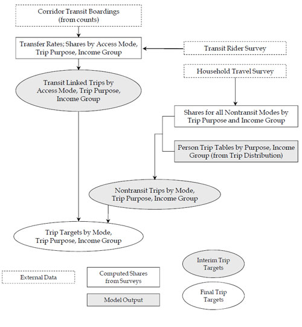
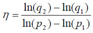

Mode Choice/ Vehicle Occupancy
------------------------------

\_\_TOC\_\_

This chapter discusses the validation of model components related to mode choices[21](fn21) including estimation of vehicle occupancy levels.&nbsp; In activity-based models, relevant model components include tour- and trip-level mode choice models.

The most common formats for mode choice models are the multinomial and nested logit models.&nbsp; The inputs always include level of service variables such as time, cost, and the number of transit transfers.&nbsp; Other input variables may also be used, including socioeconomic characteristics of travelers or households and characteristics of production or attraction zones.&nbsp; Mode choice is usually modeled separately for each trip or tour purpose.

The alternatives for logit mode choice models are the travel modes.&nbsp; **Auto modes** often include classifications by vehicle occupancy level, with the highest level being determined by analysis needs such as the need to distinguish between two and three person carpools for high occupancy vehicle (HOV) lane analysis.&nbsp; Some models also classify auto submodes by whether or not the path includes paying a toll.&nbsp; A simple model could have only one or two (drive alone versus carpool) auto submodes; a more complex model could have many auto submodes (drive alone-toll, drive alone-no toll, two person carpool-toll, etc.).

**Transit modes** are usually divided into walk access and auto access submodes if there are a significant number of transit riders who drive to or are dropped off at transit stops.&nbsp; Some models further separate the auto access submodes into park-and-ride and kiss-and-ride (drop-off) submodes.&nbsp; In areas with significant transit service that is not local or line-haul bus, the transit submodes may be further disaggregated into submodes defined by technology or operating characteristics.&nbsp; These submodes may include local bus, express bus, light rail, subway/elevated, commuter rail, and other modes.&nbsp; A more complex model might include many transit submodes defined by access mode and technology/ operation.

**Nonmotorized modes** include walking and bicycling.&nbsp; In nearly all cases, there is simply a single nonmotorized mode or two distinct modes, representing walk and bicycle.

Some regions might specify more complex travel models than are warranted based on existing travel choices represented in a travel survey.&nbsp; This is often the case for regions that anticipate testing new alternatives in the future.&nbsp; For example, a region that does not have HOV lanes in a base year might specify a model that stratifies the auto mode by group size rather than simply modeling drive alone and carpool trips.&nbsp; This would provide the capability for testing alternative carpool lane treatments.&nbsp; Likewise, an area without fixed guideway transit service may specify mode models that include walk and drive access (to estimate park-and-ride lot usage) and fixed guideway submodes in order to test future alternatives.

Vehicle occupancy estimates may be obtained from the mode choice model if drive alone and carpool submodes are modeled separately.&nbsp; However, in these cases, it is always necessary to make assumptions about vehicle occupancy for the submode representing the highest occupancy level.&nbsp; For example, if a model has three auto submodes – drive alone, two person carpool, and three or more person carpool – the vehicle occupancy level for the three or more person carpool mode must be assumed.&nbsp; The highest occupancy level, which may vary by trip or tour purpose, is typically estimated from household survey data.&nbsp; If there are not separate auto submodes for different occupancy levels, a separate vehicle occupancy model, usually separated by trip/tour purpose, may be applied to convert auto person trips to vehicle trips.&nbsp; This may be a simple model with inputs based on trip length.

This chapter is organized as follows.&nbsp; Validation of mode choice models is discussed in [Checks of Mode Choice Model Results](#Checks_of_Mode_Choice_Model_Results).&nbsp; [Checks of Vehicle Occupancy Results](#Checks_of_Vehicle_Occupancy_Results) presents the validation of vehicle occupancy levels, whether they are estimated in the mode choice model or through other means.

### Checks of Mode Choice Model Results

The outputs of mode choice models are trip tables, tours, or trips by mode.&nbsp; Since the inputs indicate the origins and destinations of the tours or trips, the geographic locations of the results are known.&nbsp; This allows geographic segmentation of the results for validation.

#### Sources of Data

The main sources of data for validation of mode choice models include the following:

-   **Transit ridership counts –** Transit ridership counts have the best information on the total amount of travel by transit, usually at the route level.&nbsp; It is important to recognize, however, that ridership (boarding) counts represent "unlinked trips," meaning that a person is counted each time he or she boards a new transit vehicle.&nbsp; So a trip that involves transit transfers is counted multiple times.&nbsp; Mode choice models generally consider "linked trips," where a trip including transfers counts as only one trip.&nbsp; Information on transfer rates is required to convert unlinked trips to linked trips; such information generally is obtained from transit on-board surveys.
-   **Transit rider survey –** A transit rider survey (typically an on-board survey) is an invaluable source of information for validation of the transit outputs of mode choice models but may have also been a data source for model estimation.&nbsp; A wealth of information that cannot be obtained from transit counts is available from on-board surveys, including:
    -   Transit trip origin-destination patterns by trip purpose;
    -   Access modes;
    -   Transit paths (surveys should ask riders to list all routes used in order for the linked trip);
    -   Transit submodes used (e.g., bus, light rail);
    -   Transit transfer activity; and
    -   Characteristics of the surveyed riders and their households. It should be noted that transit on-board surveys usually provide data only for individual transit trips, not tours, and so their use in estimating transit travel in tour-based models is limited.
-   **Household travel/activity survey –** If such a survey is available, it may have also been a data source for model estimation although data from other sources such as transit on-board surveys may also have been used in model estimation.&nbsp; The household survey is the best source for information on nontransit travel data since the number of observations for transit travel is usually small.&nbsp; The expanded household survey data can be used to produce observed mode shares for nontransit travel by purpose for a number of geographic and demographic market segments.
-   **Census data –** The Census Transportation Planning Package (CTPP) contains information on modes for work travel.&nbsp; As discussed in [Sources of Data (Distribution)](Model_Validation_and_Reasonableness_Checking/Distribution#Sources_of_Data), the Census Bureau now uses the American Community Survey (ACS), which is conducted continuously, to collect data on work location and travel (among other items).&nbsp; [Sources of Data (Distribution)](Model_Validation_and_Reasonableness_Checking/Distribution#Sources_of_Data) also discusses how work travel is treated differently in the ACS compared to travel models.&nbsp; The CTPP data are more consistent with tour-level work travel than trip level; however, data on travel only in the home to work direction are available.
-   **National sources –** National data sources include the National Household Travel Survey (NHTS), NCHRP Report 365, Travel Estimation Techniques for Urban Planning, which is being updated (the update is expected to be available in 2010), and other documents (e.g., TCRP Report 73, Characteristics of Urban Travel Demand).
-   **Highway usage data –** Data on highway usage such as toll road and high-occupancy vehicle lane use would be helpful validation data for models that include related modal alternatives.

#### Aggregate Checks (Mode Choice)

The most basic aggregate checks of mode choice model results are comparisons of modeled trips or tours by mode, or mode shares, to observed data by market segment.&nbsp; Market segments include trip or tour purposes as well as demographic segments, such as income or vehicle availability levels, and geographically defined segments.

Mode choice models are typically applied using trip tables (or their tour-based equivalents) as inputs.&nbsp; The mode choice model's results, therefore, are shares of the total trip table for each market segment that use each of the modal alternatives.&nbsp; Validation of the model's aggregate results involves checking the shares for the model's base year scenario results against observed mode shares.

A household survey is the only comprehensive data source covering all modes, and therefore is the only source for mode shares.&nbsp; However, mode shares for modes that are used relatively infrequently – notably transit modes – as well as mode shares for relatively small segments of the population (such as members of zero-vehicle, high income households) cannot be accurately estimated from household surveys due to small sample sizes.[22](#fn22) &nbsp;While it may be problematic to find an alternate source for some segments or modes (such as bicycle travel), transit trips and shares by segment may be estimated using data sources including ridership counts and transit rider surveys.

Transit ridership counts provide estimates of total transit *trips*, not mode shares.&nbsp; To convert these trips to shares, an estimate of the total trip table for each market segment is needed.&nbsp; Assuming good validation of the trip generation and distribution components (or their tour-based equivalents), the trip table outputs from the trip distribution model can provide this information.&nbsp; Basically, the transit trips by submode, access mode, trip purpose, and other segmentation level, segmented using the transit rider survey data, can be subtracted from the total trips represented in the trip table to obtain estimates of "observed" nontransit trips.&nbsp; The nontransit trips can be separated into trips by individual mode (auto and nonmotorized submodes) using information from the household travel survey.&nbsp; An example of how this could be done is presented below.

##### Example for Estimating Observed Travel By Mode

[Figure 7.1](#Figure7-1) shows a method for estimating observed travel by mode.&nbsp; Say that a trip-based mode choice model is to be validated for a market segment defined geographically (a particular corridor), temporally (a.m. peak period) and demographically (the lowest income group).&nbsp; It is assumed that the trip generation and trip distribution steps are segmented by time period and income group, for each trip purpose.&nbsp; Finally, say that the model has four modes: &nbsp;auto, transit-walk access, transit-auto access, and nonmotorized.

\
**Transit-walk access mode –** The transit ridership counts for the corridor for the a.m. peak period are obtained.&nbsp; These counts, which represent boardings, are adjusted using information from on-board survey data to represent "linked" trips (where a trip with a transfer is not counted twice), and the linked trips are separated by trip purpose.&nbsp; The share of transit trips that are walk access is estimated from the on-board survey data, as is the share of trips made by the lowest income group.&nbsp; (Note that this need not be a sequential process; the adjustments for transfers, trip purpose, access mode, and income level could be done in a combined way using the survey data.)&nbsp; The result is an estimate of a.m. peak period transit-walk access trips made by low income travelers in the corridor, stratified by trip purpose.

**Transit-auto access mode –** These trips are estimated in essentially the same way as the transit-walk access trips, except that transit-auto access travel data from the on-board survey are used.&nbsp; The result is an estimate of a.m. peak period transit-auto access trips made by low income travelers in the corridor, stratified by trip purpose.

'''Nonmotorized trips – '''The transit trips by purpose are subtracted from the total trips made by low income residents in the a.m. peak period the corridor, which are known from the outputs of trip distribution.&nbsp; The share of nonmotorized trips among nontransit trips for this market segment can be obtained from the household travel survey data.&nbsp; The result is an estimate of a.m. peak period nonmotorized trips made by low income travelers in the corridor, stratified by trip purpose.

**Auto trips –** The remaining trips in the corridor for this market segment must be by auto.&nbsp; The result is an estimate of a.m. peak period auto trips made by low income travelers in the corridor, stratified by trip purpose.

The results of the mode choice model for the segment can be compared to these estimates of observed travel for aggregate model validation.&nbsp; However, it is also a good idea to estimate results for the other segments – the other income groups for the time period – in the corridor and evaluate all the estimates of observed travel for reasonableness prior to performing the aggregate model checks.&nbsp; It might also be wise to stratify the estimates by interchange distance since nonmotorized trips are likely to vary substantially by distance.

##### Other Considerations

It is common practice to compare overall mode choice model results to the observed data for the region.&nbsp; It is important to recognize that this type of regional check is not sufficient to determine that the mode choice model is validated, any more than it would be sufficient to validate a highway assignment model simply by comparing total regional vehicle miles traveled (VMT) to observed VMT.&nbsp; Aggregate validation must also be performed for all relevant market segments for which information can be obtained.

The mode choice model validation process is tied in with the transit assignment validation process, which is described in [Transit Assignment Checks](Model_Validation_and_Reasonableness_Checking/Assignment#Transit_Assignment_Checks).&nbsp; Any calibration of the transit assignment process may lead to model changes that affect mode choice, whether they are network changes, revisions to path building or skimming, or other changes to the model.&nbsp; The mode choice models cannot be considered validated until the transit assignment model has also been validated.

##### Transit Trip Lengths

If observed data on transit trip lengths are available, modeled transit trip lengths should be compared to the observed data.&nbsp; While this is a check of both trip distribution and mode choice, the mode choice model must be run before this check can be performed.

Data on transit trip lengths is usually obtained from transit rider surveys.&nbsp; There are two levels at which observed transit trip length data may be available:

-   For the in-vehicle portion of transit trips (stop to stop); and
-   For entire trips (origin to destination).

Modeled trip lengths can be obtained for either level although the analyst should be careful to ensure that the model results are consistent with the observed data.&nbsp; For example, say a commuter rail survey yields data on the average length of trips on commuter rail.&nbsp; In this case, for modeled trips that include both commuter rail and bus segments, the length of the commuter rail segment must be considered when comparing to the observed data.

At either level, it is worthwhile for transit trip length comparisons to be segmented using available variables.&nbsp; If the survey data source can provide statistically significant information on trip lengths by trip purpose, traveler/household characteristics (e.g., income level), or subregional geography, it makes sense to perform the comparisons by market segment.

The increasing use of automated passenger counters (APCs) by transit operators might provide an alternate source of data for estimating the in-vehicle portion of observed transit trip lengths.&nbsp; Specifically, if the passengers on-board the transit vehicles between stops are known, the total passenger-miles of travel (PMT) can be estimated.&nbsp; The PMT divided by the total observed boardings provides an estimate of average passenger trip lengths for unlinked trips.&nbsp; This value could be estimated for the region, by service type, by corridor, or by route.&nbsp; Average passenger trip lengths determined using this process can be stratified only by type of service.&nbsp; Stratification by trip purpose or by passenger socioeconomic stratum is not possible.

#### Disaggregate Checks (Mode Choice)

As discussed in [Recommended Model Validation Approach](Model_Validation_and_Reasonableness_Checking/Validation_Plan#Recommended_Model_Validation_Approach), in disaggregate validation, model predictions are compared with observed data to reveal systematic biases.&nbsp; Disaggregate checks are appropriate for estimated models, as opposed to transferred models where the estimation data set would not be available.&nbsp; Logit models are disaggregately estimated (one record per trip/activity), and therefore disaggregate validation should be performed when logit mode choice models are estimated, along with the aggregate checks described above.

Generally, disaggregate validation is performed by applying the model using a data set with known choice results (such as a revealed-preference survey data set) and checking the results by one or more segmentation variables.&nbsp; Examples of segmentation variables include:

-   Income level;
-   Vehicle availability level;
-   Geographic segmentation (e.g., counties, area types); and
-   Trip length segments.

As discussed in [Disaggregate Checks (Distribution)](Model_Validation_and_Reasonableness_Checking/Distribution#Disaggregate_Checks), disaggregate validation of a model ideally should be performed using a data set that is independent of the data set used for model estimation.&nbsp; However, most urban area household travel surveys have such small sample sizes that the entire data set is needed for model estimation and so there is no independent model estimation data set available for validation.&nbsp; This is especially true for mode choice models, where the household survey itself is often inadequate for model estimation due to low incidence of transit travel.

Limited disaggregate validation can be performed using the same data set used for model estimation, but reporting the results by market segment.&nbsp; Logit model estimation software has the capability to apply the estimated model to a data set in the same form as the estimation data set.&nbsp; For example, a logit mode choice model could be applied to the data set used for estimation but the results may be reported by vehicle availability or income level.&nbsp; It might be found, for example, that transit with auto access is being chosen too often in the model by households with zero vehicles.

[Table 7.1](#Table-t7-1) presents an example of disaggregate model validation.&nbsp; This model has five modes, and the results of the application of the estimated model to the estimation data set are reported by vehicle availability level.&nbsp; The "number chosen" represents the choices in the observed data while the "number predicted" represents the model application results.&nbsp; A number predicted that is greater than the number chosen is shown in italics while the asterisks represent the number of standard deviations beyond one that the predicted number differs from the chosen (e.g., one asterisk means that the difference between the number chosen and number predicted is between one and two standard deviations).

Generally, it is desirable to see a good match between the number predicted and the number chosen for all cells.&nbsp; (In the format shown in [Table 7.1](#Table-t7-1), this would be represented by a small number of asterisks.)&nbsp; Where there is not a good match, patterns of underestimation or overestimation of demand should be noted.&nbsp; For example, in [Table 7.1](#Table-t7-1), the model underestimates nonmotorized demand, but the underestimation is greater for lower vehicle availability levels.&nbsp; One might consider adding a variable representing vehicle availability or revising coefficients of such variables to address this issue.&nbsp; Transit use is overestimated although the sample sizes for the individual vehicle availability levels are very small, making analysis of trends across vehicle availability levels problematic.&nbsp; It is best to perform disaggregate validation multiple times, with different segmentation schemes, to identify the most significant validation issues to address.

**Table 7.1&nbsp;&nbsp;&nbsp;&nbsp; Disaggregate Model Validation Example**

|                         |               |               |                |                 |           |
|-------------------------|---------------|---------------|----------------|-----------------|-----------|
| 
                
 **Mode Alternative**     
                          
 
                | 
      
                           **0 Vehicle**  
                                          
                           
      | 
      
                                           **1 Vehicle**  
                                                          
                                           
      | 
       
                                                           **2 Vehicles**  
                                                                           
                                                           
       | 
        
                                                                            **3+ Vehicles**  
                                                                                             
                                                                            
        | 
  
                                                                                              **All**    
                                                                                                         
                                                                                              
  |
| 
                
 **Nonmotorized**         
                          
 
                |               |
| 
                
 **Number chosen**        
                          
 
                | 94            | 210           | 540            | 318             | 1,162     |
| 
                
 **Standard deviation**   
                          
 
                | 15.0          | 28.0          | 53.0           | 38.0            | 72.6      |
| 
                
 **Number predicted**     
                          
 
                | 66            | 156           | 530            | 302             | 1,054     |
| 
                
 **Drive alone**          
                          
 
                |               |
| 
                
 **Number chosen**        
                          
 
                | 0             | 2532          | 8450           | 6466            | 1,7448    |
| 
                
 **Standard deviation**   
                          
 
                | 0.0           | 50.8          | 89.6           | 71.6            | 135.4     |
| 
                
 **Number predicted**     
                          
 
                | 0             | *2534*        | *8408*         | *6509*          | *17,451*  |
| 
                
 **Shared ride**          
                          
 
                |               |
| 
                
 **Number chosen**        
                          
 
                | 200           | 98            | 372            | 84              | 954       |
| 
                
 **Standard deviation**   
                          
 
                | 26.0          | 24.0          | 43.0           | 35.0            | 57.8      |
| 
                
 **Number predicted**     
                          
 
                | *212*         | *136*         | *392*          | *246*           | *986*     |
| 
                
 **Transit-walk access**  
                          
 
                |               |
| 
                
 **Number chosen**        
                          
 
                | 58            | 56            | 26             | 12              | 152       |
| 
                
 **Standard deviation**   
                          
 
                | 15.6          | 14.6          | 16.2           | 8.8             | 24.2      |
| 
                
 **Number predicted**     
                          
 
                | *72*          | *68*          | *54*           | *19*            | *213*     |
| 
                
 **Transit-auto access**  
                          
 
                |               |
| 
                
 **Number chosen**        
                          
 
                | 6             | 18            | 18             | 4               | 46        |
| 
                
 **Standard deviation**   
                          
 
                | 4.8           | 7.2           | 7.6            | 4.8             | 12.0      |
| 
                
 **Number predicted**     
                          
 
                | *8*           | *20*          | *22*           | *8*             | *58*      |
| 
                
 **Total**                
                          
 
                |               |
| 
                
 **Number chosen**        
                          
 
                | 358           | 2,914         | 9,406          | 7,084           | 19,862    |
| 
                
 **Number predicted**     
                          
 
                | 358           | 2,914         | 9,406          | 7,084           | 19,862    |

#### Criteria Guidelines

There are no applicable criteria guidelines for checks of mode choice.&nbsp; It is desirable to have the aggregate base year mode shares by market segment match the observed data, but it is important to recognize that the "observed" data are created only by combining different data sources such as traffic counts and household and transit on-board survey data, the latter of which represent relatively small samples of the population.

#### Reasonableness and Sensitivity Testing (Mode Choice)

##### Parameter Estimates

Mode choice model parameters, the coefficients and constants in the utility functions, may be estimated using local data, transferred from another model, or asserted.&nbsp; An important reasonableness check is that all mode choice model parameters should be of reasonable sign and magnitude.

Estimated parameters should be checked not only for reasonableness, but also for statistical significance.&nbsp; A complete set of statistical tests should be performed as part of the model estimation process.[23](#fn23)&nbsp; While this testing is not described in detail here, those checking the reasonableness of estimated parameters should be aware of the statistical significance of the estimates.

It is important to distinguish between generic coefficients, which have the same value for all alternatives, and alternative-specific, or mode-specific, coefficients, which are different for every alternative.&nbsp; Generally, if a variable has the same value for a particular traveler/‌trip for every alternative (for example, number of autos owned, in a mode choice model), it must be mode-specific (with the coefficient equal to zero for one alternative).&nbsp; It is possible to constrain the coefficients for mode-specific coefficients to be the same for a group of alternatives, but not for all alternatives.&nbsp; A generic coefficient may be used when the value of the variable is not the same for all alternatives (and may be viewed as different variables for each mode).&nbsp; For example, in-vehicle time has different values depending on whether the mode is auto, transit, etc.

For parameters that are mode-specific, the sign should be positive if the variable represents a characteristic that is positively correlated with the use of the mode, and vice versa.&nbsp; For example, if a transit mode utility has a variable that is equal to one if the household owns no vehicles and zero otherwise, the variable should have a positive coefficient (assuming that auto mode utilities do not also have this variable).

It is important to recognize that the values of mode-specific coefficients are relative to those in the utility functions for other modes.&nbsp; The correct sign for a coefficient may be positive if the coefficient of one mode is zero (this is often referred to as the "base" mode) while the correct sign may be negative with a different base mode.&nbsp; An example for a multinomial logit model with three modes is shown in [Table 7.2](#Table-t7-2).

**Table 7.2&nbsp;&nbsp;&nbsp;&nbsp; Example of Equivalent Logit Model Coefficients**

|                                           |            |            |            |
|-------------------------------------------|------------|------------|------------|
| 
                                  
 '''Coefficient Set[a](#t7-2_a)  
                                            
 
                                  | 
   
                                             **Mode A**  
                                                         
                                             
   | 
   
                                                          **Mode B**  
                                                                      
                                                          
   | 
   
                                                                       **Mode C**  
                                                                                   
                                                                       
   |
| 1                                         | 0          | 1.5        | -1.0       |
| 2                                         | -1.5       | 0          | -2.5       |
| 3                                         | 1.0        | 2.5        | 0          |

a&nbsp;If each coefficient set represents the coefficients for the same variable for the three modes in the model, coefficient sets 1, 2, and 3 represent equivalent models.

\
The determination of "reasonable" requires experience and judgment.&nbsp; One common way of examining reasonableness is to compare the magnitude of model coefficients to those used in other models.&nbsp; However, the values of model parameters depend on model structure, the presence or absence of other variables, and the context of the area being modeled.&nbsp; It is not valid, for example, to assume that the coefficients in a model with three variables would be the same as the coefficients for the same variables in a model with those variables plus three others.&nbsp; It would also be unreasonable to assume that, for example, a cost variable coefficient in a model, which represents the sensitivity of mode choice to, say, one dollar of travel cost, would be the same in another model for an area with a significantly higher cost of living, or even in another model estimated for the same area five or ten years earlier.

Level of service coefficients should always be negative in sign since higher values of the variables (time, cost) for a mode represent a worse level of service.&nbsp; These coefficients represent the sensitivity of mode choice to particular components of level of service.&nbsp; Therefore, they might be expected to have similar values for all mode choice models, at least those structured similarly, since it would seem unlikely that travelers in one urban area are far more or less sensitive to, say, wait time than they are in another area.

Some studies have shown consistency among parameter estimates for various mode choice models in the U.S.&nbsp; [Tables 7.3 through 7.5](#Table-t7-3) compare parameters from models estimated from the late 1970s through 1990s.[24](#fn24)&nbsp; The coefficients for the different models show some consistency, especially for time variables in home-based work models, but also some significant differences.&nbsp; It is unknown how much the differences in coefficients are due to actual differences in travel behavior across different urban areas (and years), and how much are due to model estimation related issues.&nbsp; Many of the models reviewed contained a variety of other variables whose presence in the models could be affecting the estimated values of level of service coefficients.&nbsp; It is important to consider the effects of other variables in the model when evaluating the reasonableness of model coefficients.

**Table 7.3&nbsp;&nbsp;&nbsp;&nbsp; Comparison of Home-Based Work Model Parameters**

|                                  |           |                    |                    |                              |                       |                       |                             |                             |                                 |                       |
|----------------------------------|-----------|--------------------|--------------------|------------------------------|-----------------------|-----------------------|-----------------------------|-----------------------------|---------------------------------|-----------------------|
| 
                         
 **Model**                         
                                   
 
                         | 
  
                                    **Year**   
                                               
                                    
  | 
           
                                                **Auto IVT (Min)**  
                                                                    
                                                
           | 
           
                                                                     **Auto OVT (Min)**  
                                                                                         
                                                                     
           | 
                     
                                                                                          **Auto Operating Cost (\$)**  
                                                                                                                        
                                                                                          
                     | 
              
                                                                                                                         **Parking Cost (\$)**  
                                                                                                                                                
                                                                                                                         
              | 
              
                                                                                                                                                 **Transit IVT (Min)**  
                                                                                                                                                                        
                                                                                                                                                 
              | 
                    
                                                                                                                                                                         **Transit Walk Time (Min)**  
                                                                                                                                                                                                      
                                                                                                                                                                         
                    | 
                    
                                                                                                                                                                                                       **Transit Wait Time (Min)**  
                                                                                                                                                                                                                                    
                                                                                                                                                                                                       
                    | 
                        
                                                                                                                                                                                                                                     **Transit Transfer Time (Min)**  
                                                                                                                                                                                                                                                                      
                                                                                                                                                                                                                                     
                        | 
              
                                                                                                                                                                                                                                                                       **Transit Cost (\$)**  
                                                                                                                                                                                                                                                                                              
                                                                                                                                                                                                                                                                       
              |
| Composite[a](#t7-3_a) | &nbsp;    | -0.025             | -0.050             | -0.400                       | -1.200                | -0.025                | -0.050                      | -0.050                      | -0.050                          | -0.500                |
| Dallas                           | 1984      | -0.030             | -0.055             | -0.460                       | -1.160                | -0.030                | -0.055                      | -0.055                      | -0.055                          | -0.460                |
| Denver                           | 1985      | -0.018             | -0.093             | -0.350                       | -0.950                | -0.018                | -0.054                      | -0.028                      | -0.059                          | -0.440                |
| Detroit                          | 1965      | -0.046             | -0.260             | -0.650                       | -0.650                | -0.046                | -0.064                      | -0.117                      | -0.038                          | -0.650                |
| Los Angeles                      | 1991      | -0.021             | &nbsp;             | -0.296                       | -0.296                | -0.021                | -0.053                      | -0.053                      | -0.053                          | -0.296                |
| Milwaukee                        | 1991      | -0.016             | -0.041             | -0.450                       | -0.450                | -0.016                | -0.041                      | -0.041                      | -0.041                          | -0.450                |
| Philadelphia                     | 1986      | -0.042             | &nbsp;             | -0.260                       | -0.260                | -0.011                | -0.032                      | -0.051                      | -0.051                          | -0.115                |
| Pittsburgh                       | 1978      | -0.047             | -0.069             | -2.100                       | -2.100                | -0.047                | -0.069                      | -0.069                      | -0.069                          | -2.100                |
| Portland                         | 1985      | -0.039             | -0.065             | -1.353                       | -1.353                | -0.039                | -0.065                      | -0.040                      | -0.090                          | -1.353                |
| Sacramento                       | 1991      | -0.025             | -0.038             | -0.279                       | -0.279                | -0.025                | -0.038                      | -0.038                      | -0.038                          | -0.279                |
| St. Louis                        | 1965      | -0.023             | -0.057             | -1.170                       | -1.170                | -0.023                | -0.057                      | -0.057                      | -0.057                          | -1.170                |
| Tucson                           | 1993      | -0.018             | &nbsp;             | -0.184                       | -0.184                | -0.018                | -0.040                      | -0.040                      | -0.040                          | -0.184                |
| Average                          |           | -0.029             | -0.085             | -0.687                       | -0.805                | -0.027                | -0.052                      | -0.053                      | -0.054                          | -0.682                |

a&nbsp;Schultz, G., Memorandum to Seattle Metro Files, March 5, 1991.

\

**Table 7.4&nbsp;Comparison of Home-Based Nonwork Model Parameters**

|                                  |           |                    |                    |                              |                       |                       |                             |                             |                                 |                       |
|----------------------------------|-----------|--------------------|--------------------|------------------------------|-----------------------|-----------------------|-----------------------------|-----------------------------|---------------------------------|-----------------------|
| 
                         
 **Model**                         
                                   
 
                         | 
  
                                    **Year**   
                                               
                                    
  | 
           
                                                **Auto IVT (Min)**  
                                                                    
                                                
           | 
           
                                                                     **Auto OVT (Min)**  
                                                                                         
                                                                     
           | 
                     
                                                                                          **Auto Operating Cost (\$)**  
                                                                                                                        
                                                                                          
                     | 
              
                                                                                                                         **Parking Cost (\$)**  
                                                                                                                                                
                                                                                                                         
              | 
              
                                                                                                                                                 **Transit IVT (Min)**  
                                                                                                                                                                        
                                                                                                                                                 
              | 
                    
                                                                                                                                                                         **Transit Walk Time (Min)**  
                                                                                                                                                                                                      
                                                                                                                                                                         
                    | 
                    
                                                                                                                                                                                                       **Transit Wait Time (Min)**  
                                                                                                                                                                                                                                    
                                                                                                                                                                                                       
                    | 
                        
                                                                                                                                                                                                                                     **Transit Transfer Time (Min)**  
                                                                                                                                                                                                                                                                      
                                                                                                                                                                                                                                     
                        | 
              
                                                                                                                                                                                                                                                                       **Transit Cost (\$)**  
                                                                                                                                                                                                                                                                                              
                                                                                                                                                                                                                                                                       
              |
| Composite[a](#t7-4_a) |           | -0.008             | -0.020             | -0.800                       | -2.000                | -0.008                | -0.020                      | -0.020                      | -0.020                          | -1.000                |
| Dallas                           | 1984      | -0.004             | -0.007             | -0.230                       | -0.580                | -0.004                | -0.007                      | -0.007                      | -0.007                          | -0.230                |
| Denver                           | 1985      | -0.012             | -0.076             | -1.310                       | &nbsp;                | -0.012                | -0.076                      | -0.076                      | &nbsp;                          | &nbsp;                |
| Detroit                          | 1965      | -0.007             | &nbsp;             | -9.960                       | -9.960                | -0.007                | -0.011                      | -0.018                      | -0.018                          | -9.960                |
| Los Angeles                      | 1991      | -0.024             | -0.061             | -0.216                       | -0.216                | -0.024                | -0.061                      | -0.061                      | -0.061                          | -0.216                |
| Milwaukee                        | 1991      | -0.009             | -0.069             | -1.330                       | -1.330                | -0.009                | -0.069                      | -0.069                      | -0.069                          | -1.330                |
| Philadelphia                     | 1986      | -0.020             | &nbsp;             | -0.100                       | -0.100                | -0.001                | -0.002                      | -0.002                      | -0.002                          | -0.012                |
| Pittsburgh                       | 1978      | -0.017             | -0.079             | -1.450                       | -1.450                | -0.017                | -0.079                      | -0.079                      | -0.079                          | -1.450                |
| Portland                         | 1985      | -0.033             | -0.086             | -0.399                       | -0.399                | -0.033                | -0.086                      | -0.086                      | -0.086                          | -0.399                |
| Sacramento                       | 1991      | -0.021             | -0.055             | -0.557                       | -0.557                | -0.021                | -0.055                      | -0.055                      | -0.055                          | -0.557                |
| St. Louis                        | 1965      | -0.024             | -0.060             | -2.430                       | -2.430                | -0.024                | -0.060                      | -0.060                      | -0.060                          | -2.430                |
| Tucson                           | 1993      | -0.024             | &nbsp;             | -0.250                       | -0.250                | -0.024                | -0.054                      | -0.054                      | -0.054                          | -0.250                |
| Average                          |           | -0.020             | -0.068             | -1.855                       | -1.855                | -0.018                | -0.053                      | -0.054                      | -0.054                          | -1.845                |

a&nbsp;Schultz, G., Memorandum to Seattle Metro Files, March 5, 1991.

\

**Table 7.5&nbsp; Comparison of Nonhome-Based Model Parameters**

|                                  |           |                    |                    |                              |                       |                       |                             |                             |                                 |                       |
|----------------------------------|-----------|--------------------|--------------------|------------------------------|-----------------------|-----------------------|-----------------------------|-----------------------------|---------------------------------|-----------------------|
| 
                         
 **Model**                         
                                   
 
                         | 
  
                                    **Year**   
                                               
                                    
  | 
           
                                                **Auto IVT (Min)**  
                                                                    
                                                
           | 
           
                                                                     **Auto OVT (Min)**  
                                                                                         
                                                                     
           | 
                     
                                                                                          **Auto Operating Cost (\$)**  
                                                                                                                        
                                                                                          
                     | 
              
                                                                                                                         **Parking Cost (\$)**  
                                                                                                                                                
                                                                                                                         
              | 
              
                                                                                                                                                 **Transit IVT (Min)**  
                                                                                                                                                                        
                                                                                                                                                 
              | 
                    
                                                                                                                                                                         **Transit Walk Time (Min)**  
                                                                                                                                                                                                      
                                                                                                                                                                         
                    | 
                    
                                                                                                                                                                                                       **Transit Wait Time (Min)**  
                                                                                                                                                                                                                                    
                                                                                                                                                                                                       
                    | 
                        
                                                                                                                                                                                                                                     **Transit Transfer Time (Min)**  
                                                                                                                                                                                                                                                                      
                                                                                                                                                                                                                                     
                        | 
              
                                                                                                                                                                                                                                                                       **Transit Cost (\$)**  
                                                                                                                                                                                                                                                                                              
                                                                                                                                                                                                                                                                       
              |
| Composite[a](#t7-5_a) |           | -0.020             | -0.050             | -0.600                       | -1.600                | -0.020                | -0.050                      | -0.050                      | -0.050                          | -0.800                |
| Dallas                           | 1984      | -0.012             | -0.024             | -0.440                       | -0.700                | -0.012                | -0.024                      | -0.024                      | -0.024                          | -0.440                |
| Denver                           | 1985      | -0.013             | -0.033             | -1.330                       | &nbsp;                | -0.013                | -0.033                      | -0.033                      | &nbsp;                          | &nbsp;                |
| Detroit                          | 1965      | -0.016             | -0.355             | -4.670                       | -4.670                | -0.016                | -0.023                      | -0.039                      | -0.039                          | -4.670                |
| Los Angeles                      | 1991      | -0.050             | -0.126             | -0.453                       | -0.453                | -0.050                | -0.126                      | -0.126                      | -0.126                          | -0.453                |
| Milwaukee                        | 1991      | -0.011             | -0.074             | -0.310                       | -0.310                | -0.011                | -0.074                      | -0.074                      | -0.074                          | -0.310                |
| Philadelphia                     | 1986      | -0.004             | -0.009             | -0.046                       | -0.114                | -0.007                | -0.017                      | -0.017                      | -0.017                          | -0.086                |
| Pittsburgh                       | 1978      | -0.012             | -0.195             | -3.050                       | -3.050                | -0.012                | -0.195                      | -0.195                      | -0.195                          | -3.050                |
| Portland                         | 1985      | &nbsp;             | -0.127             | &nbsp;                       | &nbsp;                | &nbsp;                | -0.127                      | -0.127                      | -0.127                          | &nbsp;                |
| Sacramento                       | 1991      | -0.035             | -0.082             | -1.103                       | -1.103                | -0.035                | -0.082                      | -0.082                      | -0.082                          | -1.103                |
| St. Louis                        | 1965      | -0.023             | -0.058             | -2.350                       | -2.350                | -0.023                | -0.058                      | -0.058                      | -0.058                          | -2.350                |
| Tucson                           | 1993      | -0.014             | &nbsp;             | -0.151                       | -0.151                | -0.014                | -0.031                      | -0.031                      | -0.031                          | -0.151                |
| Average                          |           | -0.020             | -0.128             | -1.517                       | -1.525                | -0.021                | -0.081                      | -0.083                      | -0.083                          | -1.522                |

a&nbsp;Schultz, G., Memorandum to Seattle Metro Files, March 5, 1991.

\

It is important to consider the coefficients not only individually, but also the relationships between them.&nbsp; In nearly all mode choice models, coefficients for variables representing out-of-vehicle time – including wait, walk access/egress, and transfer time – are greater in absolute value than in-vehicle time coefficients.&nbsp; This relationship implies that time spent waiting or walking is considered more onerous than time spent in a vehicle, usually sitting.&nbsp; As Tables 7.2 through 7.4 show, the ratios of out-of-vehicle time coefficients to in-vehicle time coefficients are about 2 to 3 for home-based work trips with some higher values estimated for nonwork trips.&nbsp; (Note that in some models, different components of out-of-vehicle time have different coefficients.)

Another relationship that can be checked is the value of (in-vehicle) time, which is represented by the ratio of the in-vehicle time coefficient to the cost coefficient.&nbsp; Represented in dollars per hour, the values of time range from about \$2 to \$5 per hour for work trips, and 50 cents to \$5 per hour for nonwork trips with a few outliers for each trip purpose and greater variation for nonwork trips.&nbsp; (It should be noted that cost coefficients and values of time represent the specific base years for which the models were estimated, and the tables have not normalized the cost coefficients to represent the same year's dollar value.)

The row labeled "Composite" in Tables 7.2 through 7.4 shows coefficient values derived by Schultz in 1991[25](#fn25) as cited by Cambridge Systematics, Inc. and Barton-Aschman Associates, Inc.[26](#fn26)&nbsp; Schultz used coefficients from mode choice models estimated in the 1970s to develop composite coefficients for use in other areas.&nbsp; As Tables 7.2 through 7.4 show, most of the "composite" coefficients are within the range of experience from the more recent models cited in the tables, and many of them are close to the averages of the coefficients shown in the tables.

Schultz's work helped inform the development of guidelines by the Federal Transit Administration (FTA) for ridership forecasts for Section 5309 New Starts projects.&nbsp; At a workshop in June 2006, [27](#fn27) FTA presented guidelines for mode choice coefficient values, including the following:

-   A typical range for the value of the in-vehicle time coefficient for home-based work trips is ‑0.03 and ‑0.02.&nbsp; If the coefficient falls outside the range, FTA says that "some further analysis (is) appropriate."
-   In-vehicle time coefficient for nonhome-based trips should approximately be the same as the in-vehicle time coefficient for home-based work trips.
-   A typical range for the in-vehicle time coefficient for home-based other nonwork trips is 0.1 to 0.5 times the in-vehicle time coefficient for home-based work trips.
-   A typical range for the coefficient of out-of-vehicle time is 2 to 3 times the corresponding coefficient for in-vehicle time.&nbsp; FTA believes that "compelling evidence" is needed to justify ratios outside this range.

If a nested logit mode choice formulation is used, a logsum variable is included in the model specification for each nest of modal alternatives.&nbsp; The coefficients of these variables are estimated or asserted.&nbsp; While there are no specific reasonableness checks of logsum variable coefficients, especially asserted coefficients, the coefficients' validity must be checked with respect to two rules:

-   Logsum coefficients must be between zero and one.&nbsp; The coefficients should be statistically different from both zero and one (although statistical significance can be checked only for estimated coefficients, not for asserted coefficients).
-   The logsum coefficient for a nest should be lower than the logsum coefficient for any higher level nest of which the nest is a component.

Mode-specific constants are also model parameters that should be checked for reasonableness.&nbsp; Checks of constants are discussed in [Troubleshooting Strategies (Mode Choice)](#Troubleshooting_Strategies_(Mode_Choice)).

##### Sensitivity Testing

Sensitivity testing can be performed for mode choice models by varying model inputs and checking results for reasonableness.&nbsp; Model inputs that can be varied include level of service variables used in the trip distribution model (time/speed and cost) and the demographic- or zone-level variables that are used as model inputs.&nbsp; Some example tests include:

-   Increasing or decreasing highway or transit travel times by a fixed percentage regionwide;
-   Increasing/decreasing parking costs in the CBD by a fixed percentage;
-   Increasing/decreasing headways on selected transit routes or submodes by a fixed percentage or amount;
-   Increasing/decreasing fares on selected transit submodes by a fixed percentage;
-   Changing development patterns for forecast years by moving projected new activity among different parts of the modeled region (e.g., from suburbs to small urban centers or from outlying areas to infill); and
-   Reallocating the number of households by income level for a forecast year.

The resultant changes in demand due to changes in a model input variable reflect the sensitivity to the variable; the sensitivity level is determined by the coefficient of the variable in the utility function.&nbsp; Simple "parametric" sensitivity tests can be performed by introducing small changes in the input variable or in the parameter itself and checking the results for reasonableness.

The changes in demand for a modal alternative (or group of alternatives) with respect to a change in a particular variable can be expressed as arc elasticities.&nbsp; Arc elasticity may be calculated as:

Where:

-   *&eta;* = Arc elasticity;
-   *q*~1~ = Value of result (demand) for base condition;
-   *q*~2~ = Value of result (demand) for change condition;
-   *p*~1~ = Value of variable for base condition; and
-   *p*~2~ = Value of variable for change condition.

While there are some rules of thumb for what constitute reasonable elasticities,[28](#fn28) there are not yet specifically defined ranges of reasonable elasticities.&nbsp; Generally, experience has shown that elasticities of transit demand with respect to level of service variables are usually well under 1.0 in absolute value.&nbsp; The "Simpson-Curtin Rule" indicates that the elasticity of transit demand with respect to fare is about ‑0.3.&nbsp; It is important to recognize that since the logit formulation is nonlinear, the elasticities of modal demand are not constant.&nbsp; The elasticity calculated for one particular "point" (say, a specific market segment defined geographically, demographically, and temporally) will not be equal to the elasticities computed at other points.

#### Troubleshooting Strategies (Mode Choice)

Issues discovered during the model checks described in Sections [Aggregate Checks (Mode Choice)](#Aggregate_Checks_(Mode_Choice)), [Disaggregate Checks (Mode Choice)](#Disaggregate_Checks_(Mode_Choice)), and [Reasonableness and Sensitivity Testing (Mode Choice)](#Reasonableness_and_Sensitivity_Testing_(Mode_Choice)) may imply errors in mode choice model parameters, input data (networks/skims or trip tables), or highway or transit path building procedures.&nbsp; [Table 7.6](#Table-t7-6) shows some of the typical problems that may be evident from these tests.&nbsp; Note that while four-step model terminology (e.g., "trip distribution") is used in the table, if a mode choice model that is part of an activity-based model system is being validated, the corresponding components (e.g., tour- and trip-level destination choice) should be used.

The types of actions shown in [Table 7.6](#Table-t7-6) show some similar themes for each mode.&nbsp; If the modeled base year demand for a mode within a market segment (defined by a combination of geographic, temporal, and/or demographic segmentation) is too high or too low compared to the observed demand estimate, it is important to make sure that the total demand for the segment is correct.&nbsp; For example, if a corridor has too much modeled transit demand for the a.m. peak period, the total demand in the corridor should be checked.&nbsp; Say the observed transit demand estimate is 1000 and the total modeled demand for the segment is 2000.&nbsp; The analyst should determine whether it is reasonable for the transit share to be 50 percent for the segment.&nbsp; If not, and the observed transit demand estimate is accurate, then it is likely that the total modeled demand from the trip distribution process is inaccurate.&nbsp; In this case, calibration procedures focused on mode choice will not only be ineffective, but they may also possibly be counterproductive, introducing counterbalancing errors to offset the trip distribution error.&nbsp; While this may "fix" the base year results, sensitivities for future year forecasts may be adversely impacted.

**Table 7.6&nbsp; Troubleshooting Strategies for Issues with Mode Choice Model Results**

|                                                                                                                                                                                                                                                              |                                                                                                                                                                    |
|--------------------------------------------------------------------------------------------------------------------------------------------------------------------------------------------------------------------------------------------------------------|--------------------------------------------------------------------------------------------------------------------------------------------------------------------|
| 
                                                                                                                                                                                                                                                     
 **Issue**                                                                                                                                                                                                                                                     
                                                                                                                                                                                                                                                               
 
                                                                                                                                                                                                                                                     | 
                                                                                                                                                           
                                                                                                                                                                                                                                                                **Potential Troubleshooting Strategies**                                                                                                                            
                                                                                                                                                                                                                                                                                                                                                                                                                                    
                                                                                                                                                                                                                                                                
                                                                                                                                                           |
| 1\. Transit demand for specific market segments is too high or low                                                                                                                                                                                           | -   Check trip distribution to determine if overall travel in the market is correct                                                                                
                                                                                                                                                                                                                                                                -   Check implied transit share for market (observed transit demand divided by the total travel in market from trip distribution) to determine if it is reasonable  
                                                                                                                                                                                                                                                                -   Recheck transit skim data related to the market (for appropriate geographic scope and time periods)                                                             
                                                                                                                                                                                                                                                                -   Consider revisions to logit model structure                                                                                                                     
                                                                                                                                                                                                                                                                -   Consider adding or removing indicator variables related to the market, or adjusting the coefficients of existing indicator variables (see discussion below)     
                                                                                                                                                                                                                                                                -   Consider revisions to alternative specific constants (see discussion below)                                                                                     |
| 2\. Nonmotorized mode shares for specific market segments are too high or low                                                                                                                                                                                | -   Check trip distribution to determine if overall travel in the market is correct                                                                                
                                                                                                                                                                                                                                                                -   Recheck skim data (usually distance skims) related to the market (for appropriate geographic scope and time periods)                                            
                                                                                                                                                                                                                                                                -   Consider adding or removing indicator variables related to the market, or adjusting the coefficients of existing indicator variables (see discussion below)     
                                                                                                                                                                                                                                                                -   Consider revisions to alternative specific constants (see discussion below)                                                                                     |
| 3\. Auto submode (e.g., toll versus nontoll) shares for specific market segments are too high or low (note that vehicle occupancy checks are discussed separately in [Checks of Vehicle Occupancy Results](#Checks_of_Vehicle_Occupancy_Results)) | -   Check trip distribution to determine if overall travel in the market is correct                                                                                
                                                                                                                                                                                                                                                                -   Check implied mode share for market (observed modal demand divided by the total travel in market from trip distribution) to determine if it is reasonable       
                                                                                                                                                                                                                                                                -   Recheck skim data related to the market (e.g., toll cost skims for toll road corridors, for appropriate geographic scope and time periods)                      
                                                                                                                                                                                                                                                                -   Consider adding or removing indicator variables related to the market, or adjusting the coefficients of existing indicator variables (see discussion below)     
                                                                                                                                                                                                                                                                -   Consider revisions to alternative specific constants (see discussion below)                                                                                     |
| 4\. Mode choice too sensitive or insensitive to level of service changes                                                                                                                                                                                     | -   Adjust parameters for appropriate level of service variables in utility functions                                                                              |

If the validation issues are found to be most likely associated with the mode choice model, the best calibration method may not immediately be apparent from among several possibilities.&nbsp; The best strategy for addressing the issue might lie in:

-   Revisions to input data or the procedures to create them (e.g., skimming);
-   Changes to model parameters (utility equation coefficients or alternative specific constants);
-   Changes to the model structure (e.g., nesting);
-   Changes to modal alternative definition; or
-   Changes to market segmentation in the model.

The tests described in [Table 7.6](#Table-t7-6) are not intended to be performed in isolation, and an iterative approach to testing may be necessary.&nbsp; For example, consider a model where both modeled transit and modeled nonmotorized mode shares are too low.&nbsp; Adjustments that increase the transit shares may further decrease the nonmotorized mode shares; when calibration actions are taken to increase the nonmotorized mode shares, the transit shares may be affected further.&nbsp; If it is found that overall trip distribution issues are responsible for mode choice validation issues, they will affect all modes.

##### Mode-Specific Constants

The interpretation of a mode-specific constant is that it represents the part of the modal utility that is not considered by the variables in the utility function.&nbsp; The variables represent measurable characteristics of the trip/tour, the traveler, and the area on which the trip/tour is made that affect the choice of mode.&nbsp; The constant, therefore, represents the sum of items that affect the choice that are not included in the variables.&nbsp; These items may include reliability, comfort, convenience, safety, and many other factors.

In model estimation, the original values of constants are estimated.&nbsp; The constants can easily be revised so that modeled mode shares match targets.&nbsp; It is evident that the "correct" values for modal constants are unknown since they represent factors affecting choice that could not be quantified sufficiently to be included in other mode variables.&nbsp; It would be incorrect, however, to assume that all validation issues are the result of these unknown factors.&nbsp; As is the case with K-factors, as discussed in [Troubleshooting Strategies (Distribution)](Model_Validation_and_Reasonableness_Checking/Distribution#), simple adjustments to modal constants estimated using weighted samples should be considered "a last resort" after all other possible causes for error and calibration adjustments have been considered, and so this is why they are listed as the last items in each box in [Table 7.6](#Table-t7-6).&nbsp; Because constants can be revised to provide nearly perfect matches between modeled and observed mode shares, it can be very tempting to revise modal constants to resolve differences in shares without determining whether it is the best method to solve the problem at hand.

It should be noted that mode choice constants that are estimated from nonweighted data sets do not reflect the maximum likelihood estimates of the observed behavior and therefore should be adjusted after model estimation.&nbsp; Similarly, if constants are transferred from another model, they will need to be adjusted since they do not represent the observed behavior in the application context.&nbsp; The "last resort" nature of adjusted constants applies only to models estimated using weighted data sets.

The values of mode-specific constants, whether estimated or revised during calibration, should be checked for reasonableness.&nbsp; One way of doing this is to compare the value of a constant relative to the constants of other modal alternatives to the values of other parameters.&nbsp; For example, the difference between the rail and bus constants could be divided by the in-vehicle time coefficient to express the different in units of minutes of in-vehicle time.&nbsp; If the difference between two constants was -0.5 (with the rail constant higher), and the in-vehicle time coefficient was the same for the two modes and equal to -0.025, the difference in the constants is equivalent to -0.5/-0.025 = 20 minutes of in-vehicle time.&nbsp; This implies that all other things being equal, a traveler would be indifferent between a bus trip and a rail trip that is 20 minutes longer.

The interpretation of differences between constants can be muddied somewhat by modal availability issues.&nbsp; For example, it is common to see transit constants that are so much lower than auto constants that it is implied that a traveler would be indifferent between a transit trip and an auto trip that is several hours longer.&nbsp; However, many travelers may not have the auto mode available while others do not consider transit as a viable mode.

##### Market Segment Indicator Variables

Indicator variables, or dummy variables, take values of zero or one depending on whether the trip/tour or traveler belongs to a particular market segment.&nbsp; Indicator variables may include variables that represent:

-   Whether the traveler belongs to a particular demographic group (income level, number of vehicles available to household, etc.);
-   Whether the trip or tour is to, from, or through a particular type of area, such as the central business district (CBD);
-   Whether the trip or tour has a particular characteristic related to the transportation service provided, such as transit transfers or transfer mode; or
-   Whether the trip or tour is for a particular subpurpose.

Since the value of the indicator variable is the same for each market segment represented, it effectively changes the constant term for that market segment by the amount of the indicator variable's coefficient.&nbsp; For example, if a mode has a constant of -0.5, and the traveler is a member of a segment with an indicator variable coefficient of 1.0, the effective modal constant for the traveler is +0.5.&nbsp; The set of effective mode-specific constants for a traveler who is a member of one segment might be quite different than the set for a traveler in another segment.

One check of the coefficients of indicator variables that are ordered, such as income or vehicle availability levels, is that they have a logical progression in the utility of a mode.&nbsp; For example, if there were variables representing households with 0 vehicles, 1 vehicle, 2 vehicles, and 3 or more vehicles, one would usually expect that the coefficient of the 0-vehicle variable in the utility of a mode such as bus with walk access would be the highest of the four, with the coefficients decreasing as the vehicle availability level increases.

There might be some modes for which the highest coefficient might not be representing one of the extreme category values.&nbsp; For example, a "bus with auto access mode" might have a higher coefficient for 1-vehicle households than for 0, 2, or 3+ vehicle households.&nbsp; In such a case, however, the coefficients should be consistently decreasing from the highest value, or increasing from the lowest, on both sides of the maximum (or minimum).&nbsp; If the 1-vehicle coefficient is highest, then the 3+ vehicle coefficient should be lower than the 2-vehicle coefficient.

It is important to recognize that indicator variables, especially those that represent categories of continuous or near-continuous variables, such as area types or income levels, may be susceptible to the "cliff" problem described in [Network Skims and Path Building](Model_Validation_and_Reasonableness_Checking/Model_Inputs#Network_Skims_and_Path_Building).&nbsp; A small change in income or a change in trip origin/destination across an area type boundary could result in a large change in utility for a mode.&nbsp; It is better to use continuous variables where possible although it is not always feasible – for example, the survey data used for model estimation or validation may have reported income only for a small number of categories.

It is just as easy to revise coefficients of indicator variables as it is to revise mode-specific constants, and it is just as tempting to make such revisions to attempt to match aggregate observed mode shares for specific market segments by doing so.&nbsp; It is therefore also considered a "last resort" to make such changes in model calibration.

#### Forecasting Checks (Mode Choice)

Mode choice forecasts should be compared to base year estimates for reasonableness.&nbsp; Specifically, mode shares by market segment as well as overall regional shares for the forecast year should be compared to the base year.&nbsp; As is the case with the aggregate checks described in [Aggregate Checks (Mode Choice)](#Aggregate_Checks_(Mode_Choice)), market segments should include trip or tour purposes as well as demographic segments, such as income or vehicle availability levels, and geographically defined segments.

It is not necessarily the case that forecasted mode shares should be similar to modeled base year shares.&nbsp; The most obvious reason for differences might be changes to the transportation system in the forecast year, such as new or extended (in space or time) transit service that would increase transit mode shares.&nbsp; However, it is equally important to consider the effects of changes in land use patterns or demographic changes for residents of the modeled region.&nbsp; For example, if new development is concentrated in outlying areas not served by transit, regional mode shares may decrease while mode shares in the part of the region served by transit remain stable.&nbsp; If income or vehicle availability levels are projected to increase in the future, transit shares may decline.

By performing the aggregate comparisons for a variety of segmentation schemes, it should be possible to obtain a "picture" of the reasons for changes in forecasted mode shares.&nbsp; The examples above demonstrate the value of performing these checks for a comprehensive set of segmentation schemes.

Some checks may reveal an issue with the mode choice model that might require additional testing with the base year scenario.&nbsp; For example, say that the transit share declines substantially while income and vehicle availability increase slightly.&nbsp; This may indicate that the model is too sensitive to one or both of these variables.&nbsp; Additional sensitivity checks using the base year scenario, where all other variables can be kept constant, could be valuable in identifying the problem and suggesting corrective actions.

As discussed above, the mode choice model validation process is tied in with the transit assignment validation process.&nbsp; It is worthwhile to consider performing forecasting checks of both mode choice and transit assignment before determining the best actions to take to address any issues identified.

### 7.2 Checks of Vehicle Occupancy Results

Vehicle occupancy levels can be either results of mode choice models where occupancy levels are alternatives (single occupant, two occupants, etc.) or exogenously derived factors applied to auto person trips or tours.&nbsp; In either case, the numbers should be checked for reasonableness and compared to observed data.&nbsp; Usually, vehicle occupancy is considered separately by trip or tour purpose.

It should be noted that even for mode choice models with alternatives corresponding to specific occupancy levels, an exogenously derived factor must be applied to the auto person trips corresponding to the highest occupancy level modeled.&nbsp; For example, if the highest level modeled is "three or more persons," an exogenously derived factor must be used to convert these trips (or tours) to auto vehicle trips (tours).&nbsp; This factor must be greater than or equal to three and reflects an assumed number of vehicles with three persons, four persons, five persons, etc.

Therefore, in mode choice models with separate vehicle occupancy-level alternatives, the shares for each occupancy level should be validated in the same way that other mode choice results are validated, as described in [Checks of Mode Choice Model Results](#Checks_of_Mode_Choice_Model_Results), and the exogenously derived factors for the highest levels should be checked as well.&nbsp; For models in which only exogenous derived (i.e., nonmodeled) vehicle occupancy factors are used, the factors derived from other sources are checked during validation.

In activity-based models, the specific definitions of tour-level modes are important in determining vehicle occupancy levels.&nbsp; Most tour-level mode choice models include separate alternatives at least for single occupant and multiple occupant vehicle tours, with some models including separate alternatives for higher numbers of occupants.&nbsp; Most commonly, a tour is defined as single occupant only if there is only one occupant (the driver) for the entire tour.&nbsp; If a passenger is picked up or dropped off during the tour, the tour is defined as multiple occupant.&nbsp; Most activity-based models have an "escort" tour purpose; the single occupant mode is by definition unavailable for escort tours.

#### 7.2.1 Sources of Data

The main sources of data for validation of vehicle occupancy levels include the following:

-   **Household travel/activity survey –** If such a survey is available, it may have also been a data source for model estimation.&nbsp; The expanded household survey data can be used to produce observed vehicle occupancy levels by purpose for a number of geographic and demographic market segments.
-   **Census data –** The CTPP, now based on the ACS, contains information on modes for work travel.&nbsp; As discussed in [Sources of Data](#Sources_of_Data), these data are more consistent with tour-level work travel than trip level, and data on travel only in the home to work direction are available.
-   **National sources –** Perhaps the most comprehensive source for vehicle occupancy data is NHTS.&nbsp; The 2010 update to NCHRP Report 365, Travel Estimation Techniques for Urban Planning, will also provide information on vehicle occupancy levels for specific urban area types.
-   **Field observations –** While observed vehicle occupancy data are usually available only for a few locations, they may be useful in some cases.&nbsp; One example is observed data at external stations, which may be used in models where external person trips are modeled.

#### 7.2.2 Aggregate Checks (Occupancy)

The aggregate checks for vehicle occupancy are checks of the shares of person trips or tours falling into each occupancy category, if the categories are modeled as alternatives in mode choice, and checks of the overall vehicle occupancy levels, including the levels for the highest categories appearing as alternatives in the mode choice model.

It is important to understand the correct way to compute vehicle occupancy and to do so consistently for the model results and the observed data to which they are compared.&nbsp; The vehicle occupancy level is obvious at the disaggregate level; it is simply the number of persons in each vehicle.&nbsp; The average vehicle occupancy for a group of travelers, however – say all home-based work trips – may be computed in more than one way.&nbsp; Consider an example where there are six vehicles:&nbsp; three with one person, two with two persons, and one with three persons.&nbsp; This means that three persons are in single occupant vehicles, four are in two occupant vehicles, and three persons are in three occupant vehicles.&nbsp; The shares represented in a mode choice model of person trips would be 30 percent single occupant, 40 percent two occupant, and 30 percent three occupant.&nbsp; This implies an average vehicle occupancy of 2.0, which is clearly incorrect:&nbsp; there are 10 persons in six vehicles, and the actual vehicle occupancy is 1.67.

In other words, the incorrect average vehicle occupancy is obtained when one multiplies the number of person trips for each occupancy level by the occupancy level and divides the sum of these trips by the total number of person trips.&nbsp; The correct method is to estimate the implied vehicle trips by dividing the number of person trips for each occupancy level by the occupancy level and sum the result over all occupancy levels.&nbsp; The average vehicle occupancy level is then computed by dividing the total person trips by the implied vehicle trips.&nbsp; For the example above, the implied number of vehicle trips is given by:

(3 pers trips / 1 pers/veh) + (4 pers trips / 2 pers/veh) + (3 per trips / 3 pers/veh)

which yields 6 implied vehicle trips.&nbsp; The average vehicle occupancy is 10 person trips divided by 6 implied vehicle trips, or 1.67.

In person-based or person trip-based models, person trips or tours are generated and eventually converted to vehicle trips.&nbsp; If a vehicle trip-based model is being used, there is no conversion required; if one wanted to compute the number of person trips from the number of person trips, the vehicle-based occupancy level would be used.

##### Occupancy-Level Shares

The most basic check is to compare the modeled base year model shares of trips made by vehicle occupancy, both by trip or tour purpose and for all trips/tours, to observed shares.&nbsp; In most cases the best (or only) source of observed occupancy levels is from the household survey data.&nbsp; The modeled occupancy levels should match the observed data closely as the percentage error in vehicle occupancy results in the same level of error in the number of vehicle trips.&nbsp; For example, if the overall vehicle occupancy level is too low by five percent, the number of vehicle trips is too high by five percent.&nbsp; (It should be noted, of course, that there is error inherent in the observed data, which is based on a sample, even though it is impossible to precisely know the level of error in the survey data set.)

When a sufficient household survey data set is not available, modeled occupancy levels may be compared to representative data from another data set, such as the NHTS.&nbsp; In these cases, of course, the survey data do not truly represent observed data for the modeled area, and so a precise match is not necessary.&nbsp; The comparison represents more of a reasonableness check.

##### Average Vehicle Occupancy

Traditionally, average vehicle occupancies have been reported by trip purpose.&nbsp; However, it is important to recognize that the trip or activity purposes of all passengers in a vehicle are not necessarily the same.&nbsp; For example, in one region, the home-based work average vehicle occupancy has been reported as 1.14 persons per vehicle.&nbsp; Such a report is not strictly correct since the trip purposes of the other passengers in the vehicles may not be home-based work.&nbsp; The correct report is that home-based work person trips are made in vehicles with an average of 1.14 persons per vehicle.

Overall vehicle occupancy should be checked for all person-based models, by trip/tour purpose and for all trips/tours.&nbsp; The average vehicle occupancy should be computed by dividing the total person trips for each market segment by the implied number of vehicles used for those trips.

#### 7.2.3 Disaggregate Checks (Occupancy)

If a mode choice model with alternatives corresponding to specific occupancy levels has been estimated, disaggregate validation of the logit model should be performed as part of the validation of the estimated model, as described in [Disaggregate Checks (Mode Choice)](#Disaggregate_Checks_(Mode_Choice)).

#### 7.2.4 Criteria Guidelines

There are no applicable criteria guidelines for checks of vehicle occupancy.

#### 7.2.5 Reasonableness and Sensitivity Testing (Occupancy)

The reasonableness checks for vehicle occupancy are the comparisons to traffic or person trip counts, as discussed in \[\[\#Aggregate Checks (Occupancy)|Aggregate Checks (Occupancy)\].

Sensitivity testing of vehicle occupancy can be performed for a mode choice model with alternatives corresponding to specific occupancy levels.&nbsp; The types of tests discussed in [Reasonableness and Sensitivity Testing (Mode Choice)](#Reasonableness_and_Sensitivity_Testing_(Mode_Choice)) can be performed, using available model variables that may affect vehicle occupancy, such as household size and HOV lane travel times.

#### 7.2.6 Troubleshooting Strategies (Occupancy)

[Table 7.7](#Table-t7-7) shows some typical issues with vehicle occupancy results and suggested strategies for dealing with them.

**Table 7.7&nbsp; Troubleshooting Strategies for Issues with Vehicle Occupancy Results**

|                                                                                                |                                                                                                                                                                                                                                                               |
|------------------------------------------------------------------------------------------------|---------------------------------------------------------------------------------------------------------------------------------------------------------------------------------------------------------------------------------------------------------------|
| 
                                                                                       
 **Issue**                                                                                       
                                                                                                 
 
                                                                                       | 
                                                                                                                                                                                                                                                      
                                                                                                  **Potential Troubleshooting Strategies**                                                                                                                                                                                                                       
                                                                                                                                                                                                                                                                                                                                                                 
                                                                                                  
                                                                                                                                                                                                                                                      |
| 1\. Modeled vehicle occupancy by trip/tour purpose differs significantly from observed levels. | -   Check observed data for errors                                                                                                                                                                                                                            
                                                                                                  -   If a mode choice model with alternatives corresponding to specific occupancy levels is being used, check sensitivity to mode choice model input variables and consider adjusting logit model parameters                                                    
                                                                                                  -   Consider adding or removing indicator variables related to the market, or adjusting the coefficients of existing indicator variables (see discussion in [Troubleshooting Strategies (Mode Choice)](#Troubleshooting_Strategies_(Mode_Choice)))  
                                                                                                  -   Consider revisions to alternative specific constants (see discussion in [Troubleshooting Strategies (Mode Choice)](#Troubleshooting_Strategies_(Mode_Choice)))                                                                                  |
| 2\. Overall modeled vehicle occupancy differs significantly from observed levels.              | -   Compare modeled shares of trips/tours by purpose to observed                                                                                                                                                                                              |

#### 7.2.7 Forecasting Checks (Occupancy)

Forecasted vehicle occupancy levels and averages should be compared to base year values for reasonableness.&nbsp; In mode choice models with alternatives corresponding to specific occupancy levels, the forecasted vehicle occupancy levels may differ slightly from the base year values due to changes in the values of forecast year input variables, including household size and levels of congestion on general purpose roadways when HOV facilities are present.&nbsp; In models where fixed vehicle occupancy factors are used, there will be no change in vehicle occupancy levels for the segments (such as trip purposes) over which the actors are applied although there might be small changes in overall vehicle occupancy if the relative numbers of trips in each segment change over time.

------------------------------------------------------------------------

21&nbsp;If a model is vehicle-trip based (i.e., if vehicle trips rather than person trips are generated and distributed), there is no need for mode choice or vehicle occupancy modeling capabilities.&nbsp; The information presented in this chapter is unnecessary for validation of such models.

22&nbsp;Some household surveys are designed to over-sample small segments of the general population in order to address these issues.&nbsp; The surveys must be carefully designed and administered to reduce sample bias.

23&nbsp;See, for example, Ben-Akiva, Moshe and Steve Lerman, *Discrete Choice Analysis, Theory and Application to Travel Demand*, The MIT Press, December 1985; or Koppelman, Frank and Chandra Bhat, *A Self Instructing Course in Mode Choice Modeling:&nbsp; Multinomial and Nested Logit Models*, prepared for the Federal Transit Administration, 2006.

24&nbsp;Rossi, T. F., and M. L. Outwater, "How Valid Is It to Transfer Mode Choice Model Parameters?"&nbsp; proceedings of the Seventh National Conference on Transportation Planning Applications, Transportation Research Board, 1999.

25&nbsp;Schultz, G., Memorandum to Seattle Metro Files, March 5, 1991.

26&nbsp;Cambridge Systematics, Inc., and Barton-Aschman Associates, Inc., *Short-Term Travel Model Improvements*, prepared for the U.S. Department of Transportation Travel Model Improvement Program, October 1994.

27&nbsp;Federal Transit Administration, "Travel Forecasting for New Starts Proposals," Minneapolis, Minnesota, June 15-16, 2006.

28 See, for example, TCRP Report 95, Traveler Response to Transportation System Changes, Transportation Research Board, Washington, D.C.

------------------------------------------------------------------------

