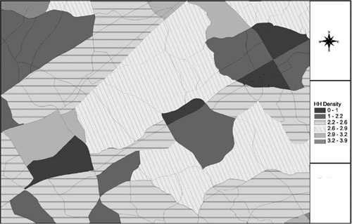
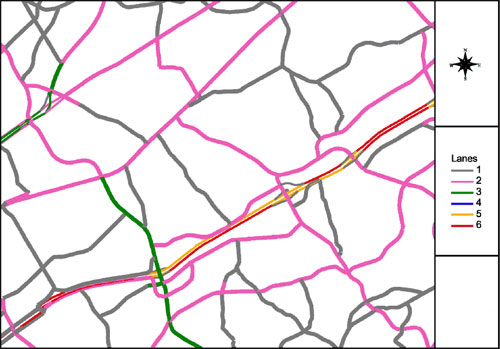
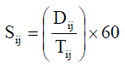

### Validating Model Inputs

\_\_TOC\_\_

There are two broad types of data required for any travel- or activity-based modeling process: socioeconomic data and transportation network data. These two broad types of data are the basic building blocks used along with the travel models to estimate or forecast travel in a region, ultimately expressed as traffic on roadways or riders on transit services. Good base year socioeconomic and network data impact model estimation, model calibration, and model validation. Reasonable future year travel forecasts require reasonable future year socioeconomic and network data forecasts. Thus, the success or failure of the modeling process rests on the input data. The old adage "garbage in, garbage out" is appropriate.

The term "[socioeconomic data](Spatial_Data#Land_Use/Demographic/Socio-economic_Data)" is used in this chapter to represent the bases for generating the demand for travel or activity generation. In this chapter, socioeconomic data may be interpreted to include inputs such as population, households, group quarters population, and employment. For [land use-based models](Land_Use-Transport_Modeling), the term may be expanded to include the area or gross square feet of different land uses or counts such as the number of dwelling units or number of seats in an entertainment venue. In some models, the basic input data may be stratified by different characteristics; households may be stratified by income group or employment stratified by employment type.

Socioeconomic data are typically compiled and coded to transportation analysis zones (TAZs, sometimes called traffic analysis zones). In the past, it has not been feasible to represent every household, place of employment, shopping center, and other activity as a separate point so the data were aggregated into TAZs. Some modern models are beginning to use parcel-based land use data. Regardless of how the data are stored in the travel models, procedures should be in place to aggregate the data to larger geographic units such as districts or into political units such as cities or counties. [Table 3.1](#Table-t3-1) provides an example of socioeconomic data used in a typical travel model using TAZs. Many models will have more or different data items than those shown in this table.

Transportation network data are the basic descriptors of the available transportation supply. Networks include roadway (often referred to as highway networks), transit, and in some emerging model systems, nonmotorized mode networks. Roadway networks may include representations of roadways designated for general purpose, single-occupant vehicle (SOV), high-occupancy vehicle (HOV), and/or truck use. These uses are usually represented in one composite transportation network through a special link type variable. Then, for trip distribution and mode choice, mode specific paths and skims are created by using the appropriate network specified using link types. For example, HOVs can travel on HOV links in addition to all SOV links. An example of roadway network data used in a typical travel model is shown in [Table 3.2](#Table-t3-2). Many model networks will have more data items or different data items than those shown in this table.

Table 3.1 Example Socioeconomic Data for Travel Models

|                |                                                                         |
|----------------|-------------------------------------------------------------------------|
| 
       
 **Data Item**   
                 
 
       | 
                                                                
                  **Description/Use**                                                      
                                                                                           
                  
                                                                |
| TAZ            | Transportation Analysis Zone Identifier                                 |
| DISTRICT       | District designation for summaries                                      |
| JURISDICTION   | Political jurisdiction for summaries                                    |
| AREA           | TAZ                                                                     |
| HH\_POP        | Total household population (excluding group quarters population)        |
| MEDINC         | Median household income (1999 dollars)                                  |
| HHOLDS         | Total households                                                        |
| LOWINC\_HH     | Number of low income households (bottom 11%)                            |
| MEDINC\_HH     | Number of medium income households (middle 64%)                         |
| HIGHINC\_HH    | Number of high income households (top 25%)                              |
| PROD/DIST\_EMP | Total production and distribution employment (NAICS Codes 11-42, 48-49) |
| RETAIL EMP     | Total retail employment (NAICS Codes 44-45)                             |
| SERVICE EMP    | Total service employment (NAICS Codes 51-92)                            |

Table 3.2 Example Input Roadway Network Data for Travel Models

|                |                                                      |
|----------------|------------------------------------------------------|
| 
       
 **Data Item**   
                 
 
       | 
                                             
                  **Description/Use**                                   
                                                                        
                  
                                             |
| ANODE          | From node of link                                    |
| BNODE          | To node of link                                      |
| LENGTH         | Length of link                                       |
| DIRECTION      | Direction code:&nbsp; 0, 1 (two-way, one-way A to B) |
| TYPE           | |               |                                 |  
                  |---------------|---------------------------------|   
                  | **Link Type** | **Description**                 |   
                  | 1             | Standard roadway link           |   
                  | 2             | Transit only link (bus or rail) |   
                  | 98            | Walk or bicycle only link       |   |
| FACILITY\_TYPE | |                      |                         |   
                  |----------------------|-------------------------|    
                  | **Type of facility** | **Description**         |    
                  | 1                    | Freeway                 |    
                  | 2                    | Major regional arterial |    
                  | 3                    | Principal arterial      |    
                  | 4                    | Minor arterial          |    
                  | 5                    | Collector               |    
                  | 6                    | Ramp                    |    
                  | 9                    | TAZ centroid connector  |    |
| LANES          | Number of through lanes                              |
| HOV            | High-occupancy vehicle code                          |
| &nbsp;         | |          |                      |                  
                  |----------|----------------------|                   
                  | **Type** | **Description**      |                   
                  | 1        | General purpose lane |                   
                  | 2        | 2+ HOV lane          |                   
                  | 3        | 3+ HOV lane          |                   |
| SPDLMT         | Speed limit                                          |
| FFSPD          | Free-flow (zero-volume) speed                        |
| BNODE\_CTL     | Intersection control at B-node                       |
| &nbsp;         | |             |                 |                    
                  |-------------|-----------------|                     
                  | **Control** | **Description** |                     
                  | 0           | No control      |                     
                  | 1           | Yield sign      |                     
                  | 2           | Stop sign       |                     
                  | 3           | Traffic signal  |                     |
| SCREENLINE     | Screenline number for summaries                      |
| AWDT           | Average weekday traffic count data                   |

Transit networks may include separate network data for local buses, express buses, bus rapid transit (BRT), light-rail transit (LRT), heavy-rail transit (HRT), commuter rail (CR), and in some larger regions, high-speed rail (HST). Transit networks are, in some ways, more complicated than roadway networks. They are represented by links and by itineraries. For buses operating in mixed flow, the state-of-the-practice uses the roadway network to represent mixed flow transit links in order to ensure consistency between maximum speeds used for buses and congested roadway speeds. The roadway network may be supplemented with nonroadway transit links to represent bus only links and lanes as well as links for modes operating on fixed guideways. Transit itineraries list the sequence of transit (roadway) network nodes traversed by each route, whether or not the node represents a transit stop, and headway information for the route.

Nonmotorized mode networks generally represent walk and bicycle modes. These modes may be represented by the roadway network with facilities prohibiting pedestrians and bicycles removed and pedestrian or bicycle only facilities added for the path building and skimming process. The networks and skimming process are commonly based on shortest distances. Nonmotorized travel times for mode choice are commonly estimated using a constant speed for each appropriate nonmotorized mode.

This chapter is organized as follows. The section [Socioeconomic Data](#Socioeconomic_Data) discusses checks of socioeconomic data. [Transportation Network Data](#Transportation_Network_Data) describes checks of transportation network data, while [Network Skims and Path Building](#Network_Skims_and_Path_Building) discusses checks of network skims and path building.

### Socioeconomic Data

#### Sources of Data

The main sources of data for validation of input socioeconomic data are, primarily, the same sources of data used to develop the data. Few regions have multiple sources of the same socioeconomic data for a particular year. The main sources of socioeconomic data are:

-   **Census data –** The decennial U.S. Census provides information on the full set of persons and households in the country and can be summarized at a fine level of geographic resolution, such as the zone level or below. Data from Summary File 3 (SF3) can be used for univariate distributions of household and population data such as households by household size, households by income group, households by structure type, households by auto ownership, and population in households.
-   **American Community Survey ([6](#fn6)) –** The decennial Census of Population and Housing collects data about the number of people residing in the United States and their relationship within a household, age, race, Hispanic origin (ethnicity), and sex. It also collects information about the number, occupancy status, and tenure (ownership status) of the nation's housing units. In the censuses of 1980, 1990, and 2000, information about topics such as income, education, employment status, disability status, housing value, housing costs, and number of bedrooms were asked on the "long form." Since there is no long form associated with the censuses starting in 2010, data on these topics will come from the American Community Survey (ACS). The ACS is conducted continuously by the Census Bureau, not only at the time of the decennial census, and provides the information formerly included in the long form. The following are some of the data useful to travel forecasting that are available in the ACS:
    -   Demographic Characteristics:
        -   Age;
        -   Sex; and
        -   Relationship to Householder (e.g., spouse).
    -   Economic Characteristics:
        -   Income;
        -   Labor Force Status;
        -   Industry, Occupation, and Class of Worker;
        -   Place of Work and Journey to Work;
        -   Work Status Last Year; and
        -   Vehicles Available.
    -   Financial Characteristics:
        -   Tenure (Owner/Renter);
        -   Housing Value;
        -   Rent; and
        -   Selected Monthly Owner Costs.

The decennial census collected detailed population and household data from about one in every six households every 10 years using the long census form. This process is being replaced by the ACS, which samples about one in every 40 addresses every year, or 250,000 addresses every month. This allows the Census Bureau to produce data every year rather than every decade. For areas with large populations (65,000 or more), survey estimates are based on 12 months of ACS data. For all areas with populations of 20,000 or more, the survey estimates are based on three years of ACS data. The Census Bureau is planning to produce estimates for all areas, down to the census tract and block group levels, based on five years of ACS data. The U.S. Census plans to release more ACS data each year as shown in [Table 3.3](#Table-t3-3).\

Table 3.3 ACS Data Releases

|                  |                                       |                             |
|------------------|---------------------------------------|-----------------------------|
| 
         
 **Data Product**  
                   
 
         | 
                              
                    **Population Threshold**               
                                                           
                    
                              | 
                    
                                                            **Planned Year of Release**  
                                                                                         
                                                            
                    |
|     |                          | 
                    
                                                            **2009**                     
                                                                                         
                                                            
                    |
| 1-year Estimates | 65,000+                               | 2008                        |
| 3-year estimates | 20,000+                               | 2006-2008                   |
| 5-year Estimates | All areas ([a](#t3-3-fna)) | –                           |

Source: U.S. Census Bureau.

a&nbsp;Five-year estimates will be available for areas as small as census tracts and block groups.

With the use of the long form in the decennial census ending, Census Transportation Planning Package (CTPP) data are planned to be a product based on the ACS. In addition to providing information on the place of work of residents and the journey to work noted above, the CTPP also provides cross-classifications of socioeconomic data for households at the zone level. An example cross-classification is the number of households by household size by household income.

While the Census Bureau is planning to produce estimates for all areas down to the census tract and block group levels, the estimates will be based on about a 12.5 percent sample of addresses collected over a five-year period. As such, they may not be appropriate for developing or validating input data on a TAZ level, but should provide good summary data for validation checks more aggregate levels. The ACS data may be especially useful for input data validation checks between decennial censuses.

-   **Utility hook-up data –** It is sometimes possible to obtain information on households from local utility companies. Data from these sources must be used with care since there is no guarantee that a housing unit is occupied even if it is hooked up to a utility provider, some multiple-unit housing does not have separate utility hook-ups, and it might not always be possible to distinguish households from businesses.
-   **School enrollment data –** School enrollment data from public and private schools might be obtained for travel models that explicitly model school related travel such as home-based school and home-based college/university trips or tours.
-   **Local land use data and parcel files –** Regions using land use-based travel models must have access to land use data or parcel files. Many jurisdictions have property tax records on-line. With the increasing reliance on Geographic Information System (GIS)-based data storage, such files are becoming more readily available and easier to process. Typically, they are obtained from cities, counties, and other taxing districts.
-   **Quarterly Census of Employment and Wages (QCEW) Data –** Employment data are the most difficult data component to collect. One primary source of employment data is the QCEW collected by state Departments of Labor (DOL) for the U.S. DOL. These data have replaced the U.S. DOL Employment, Wages, and Contributions, ES-202 file. Care must be used processing data from this file since the address information shown in the file may not reflect the true work locations of employees. For example, some franchises may list all of the employees at one single location for this file. It might be necessary to sign a confidentiality agreement in order to obtain the data.
-   **Market Research Listings –** Many market research firms offer commercial listings of all (or major) employers and number of employees by county and city. The listings may show business locations by P.O. boxes as well as by street addresses. Commercial listings offer these data on a subscriber basis with a range of access and purchase options.
-   '''Local Area Population and Employment Data – '''Many jurisdictions collect and record some type of population data. But few areas record employment data other than a broad listing of the employers with the highest number of employees locally. Chambers of Commerce often publish lists of member businesses.
-   **Aerial Photography and Existing Land Use –** Often aerial or satellite photographs available at several locations on the web can be used to update or validate existing land uses. The resolution of the photography can be good enough to differentiate many residential and nonresidential areas. When compared with the aerial photographs, each land use can be associated with a particular land use type (e.g., residential dwelling units, retail and industrial) for each building. It is crucial to know the date of the imagery (when the pictures were taken) prior to using it for land use updates.

#### Aggregate Checks

The primary aggregate validation checks for socioeconomic data are the summation of TAZ data to different geographic areas and comparison to observed data. Summation of data such as population and households to political divisions such as cities and counties is particularly important, especially if the base year for the input data is close to the decennial census. However, with the release of the ACS data for regions, it will be possible to compare socioeconomic data to Census estimates for areas with 65,000 or more residents every year, areas with 20,000 or more residents based on three-year summaries and averages, and all areas based on five-year summaries and averages. In addition to being able to check aggregate totals of data such as population and households, the ACS data will provide the means to check information such as median incomes and income distributions, household size distributions, and vehicle availability distributions.

The ACS will also provide a means to check employment data. The check will probably be most accurate at the regional level with decreasing levels of confidence for smaller geographic areas. Resident labor force information regarding industry, occupation, and class of worker, coupled with place of work information, can be compared with employment (from establishments) at the regional or subregional level. That is:

-   EstEmpType = EmpResType + EmpNonResType

Where:

-   EstEmpType = The estimated employment by type for the region or subregion;
-   EmpResType = Residents reporting place of work in the region or subregion by type from the ACS; and
-   EmpNonResType = Nonresidents of the region reporting place of work in the region or subregion by type from the ACS.

The employment by type estimated from the ACS data using the above formula should approximately equal the employment estimates for the same geography from the input socioeconomic data. The application of the above check will be easier for more isolated MPOs since the impact of nonresidents of the region working in the region will be minimized.

It is also important to compare regional employment with regional workers. Employment estimates are developed from employer surveys, QCEW data, and other sources focused on businesses and other establishments. Workers are estimated from census data or other sources focused on the residents of the region. While the estimates of employment and workers do not have to exactly match for a region, there should be some consistency between the estimates.

#### Disaggregate Checks

Multiple independent sources of disaggregate socioeconomic data are not generally available. This may change as five-year ACS estimates of socioeconomic data become more readily available. In some regions, estimates of socioeconomic data for years between census years are made through incremental annual updates to the most recent census data for the region. In those areas, the five-year ACS estimates of the socioeconomic data can be used as independent estimates of the socioeconomic data on a TAZ-by-TAZ basis. However, since the ACS data will be estimates based on an effective 12.5-percent sample of addresses collected over a five-year period, discrepancies between the ACS data and the local estimate of the socioeconomic data might be related to sampling error associated with the ACS data just as easily as an error in the local estimate of the data.

Spot checks of input dwelling unit and household data might also be made using aerial photograph data. While households are not exactly equivalent to dwelling units due to unoccupied units and multiple households living within what appears to be a single unit, there is a high correlation these two variables. To perform the spot check, a random sample of TAZs could be drawn and the dwelling units in the TAZs counted using recent aerial photographs. TAZs with large numbers of multifamily units would need to be skipped due to the difficulty of counting the numbers of dwelling units from aerial photographs. The match between input household data and the counted dwelling units for the sample of TAZs would provide a level of confidence in the coded input data.

Disaggregate checks of employment data can be performed if independent data are available. For example, if the input employment data are developed from QCEW data, detailed checks of the input data might be made using files purchased from a commercial vendor.

#### Criteria Guidelines

There are no applicable criteria guidelines for aggregate or disaggregate checks of input socioeconomic data.

#### Reasonableness and Sensitivity Testing

Several types of reasonableness and sensitivity checks for socioeconomic data can be performed. On an aggregate level, a number of regional rates should be calculated and compared to historical data for the modeled region. Tables [3.4](#Table-t3-4) and [3.5](#Table-t3-5) show some national demographic trends over the past 40 years. Similar demographic statistics and trends should be developed for the modeled region. Newly-developed socioeconomic data should fit reasonably well with the trends for the region.

Table 3.4 Summary of Demographic Trends from the NPTS

|                              |           |
|------------------------------|-----------|
| 
                     
 **Statistic**                 
                               
 
                     | 
  
                                **Year**   
                                           
                                
  |
| 
                     
 **1969**                      
                               
 
                     | 
  
                                **1977**   
                                           
                                
  |
| Persons per household        | 3.16      |
| Vehicles per household       | 1.16      |
| Workers per household        | 1.21      |
| Vehicles per worker          | 0.96      |
| Vehicles per licensed driver | 0.70      |

Source: 1969, 1977, 1983, 1990, 2001, and 2008 NPTS.

Table 3.5 Percent of Households by Vehicles Available

|                        |           |
|------------------------|-----------|
| 
               
 **Vehicles Available**  
                         
 
               | 
  
                          **Year**   
                                     
                          
  |
| 
               
 **1969**                
                         
 
               | 
  
                          **1977**   
                                     
                          
  |
| No vehicles            | 20.6%     |
| One vehicle            | 48.4%     |
| Two vehicles           | 26.4%     |
| Three or more vehicles | 4.6%      |

Source: 1969, 1977, 1983, 1990, 2001, and 2008 NPTS.

A second type of reasonableness check is the preparation of GIS plots. Almost any district-level or TAZ-level data can be effectively displayed using a GIS. Example zonal socioeconomic data which can be checked using a GIS include population, households, average household size, proportions of households by socioeconomic stratum (e.g., income level or auto ownership), employment, and employment by category.

Two types of checks which can be performed with a GIS include:

-   Calculate densities and plot using thematic mapping. Calculate population and employment density in persons per acre (or square mile). Densities should be grouped to produce a reasonable number (e.g., four to six) equal area or equal number of zones categories for the region. Color or shading can be used to convey densities. An example is shown in [Figure 3.1](#Figure-f3-1).
-   Compare existing to most recent year, or forecast year to current year totals by zone or district and plot changes. Plot so that positive and negative changes can be easily identified.

#### Troubleshooting Strategies

[Table 3.6](#Table-t3-6) shows some of the typical issues that might be found from tests of input socioeconomic data.

Table 3.6 Troubleshooting Strategies for Issues with Input Socioeconomic Data

|                                                                                                                   |                                                                                                                                                       |
|-------------------------------------------------------------------------------------------------------------------|-------------------------------------------------------------------------------------------------------------------------------------------------------|
| 
                                                                                                          
 **Issue**                                                                                                          
                                                                                                                    
 
                                                                                                          | 
                                                                                                                                              
                                                                                                                     **Potential Troubleshooting Strategies**                                                                                                               
                                                                                                                                                                                                                                                                            
                                                                                                                     
                                                                                                                                              |
| 1\. Aggregated socioeconomic data are significantly different from independent data sources                       | -   Check data aggregation procedures to ensure that TAZs were not skipped or double counted                                                          
                                                                                                                     -   Check for differences between coverage areas for socioeconomic data and independent data                                                           
                                                                                                                     -   Determine which data set is likely to be more accurate                                                                                             |
| 2\. Overall aggregate rates (e.g., average household size) are different from observed data or trends             | -   Recheck observed data for processing errors                                                                                                       
                                                                                                                     -   Perform checks for smaller geographic areas to isolate problems or determine if the difference is general in nature                                |
| 3\. Coded input data do not match independent data at a disaggregate level                                        | -   Recheck coded input data for processing errors                                                                                                    
                                                                                                                     -   Check trends in independent data (especially ACS data) over time for consistency                                                                   |
| 4\. Inconsistency (not necessarily inequality) between number of workers and number of jobs at the regional level | -   For base year, determine which data source is more reliable and adjust data from the less reliable source to be consistent with it                
                                                                                                                     -   For forecast year, determine which variable has more reasonable growth rate and adjust growth rate for the variable with the less reasonable rate  |

#### Forecasting Checks

Forecasting checks of input socioeconomic data are focused on comparisons to the most recent base year data. The checks should be similar to those described under [Reasonableness and Sensitivity Testing](#Reasonableness_and_Sensitivity_Testing).

A basic check is the growth rate in aggregate variables such as population, households, and employment. Typical annual growth rates in population can vary but are usually in the range of zero to two percent and are seldom greater than four percent. [Table 3.7](#Table-t3-7) summarizes annual population growth rates for 368 Metropolitan Statistical Areas ([7](#fn7)) (MSAs) based on U.S. Census data from 2000 to 2007, classified by region of the country and population range. Not surprisingly, areas in the Northeast and Midwest are growing more slowly than areas in the south and west. On average, larger areas are growing a bit faster than smaller areas. Some other findings from this data set include:

-   Fifty-nine of the 368 MSAs lost population from 2000 to 2007. More than one-half of these areas had populations of less than 200,000.
-   Eighty-three percent of MSAs had annual growth rates under two percent.
-   Only two MSAs had annual growth rates of greater than 5 percent, and they were among the smallest MSAs (the annual rate of 10.7 percent was for the smallest MSA). However, high growth MSAs were found in all population ranges, with three of the top 11 growth rates occurring in MSAs with populations of more than 1,000,000.

Table 3.7 Average Annual Population Growth, 2000-2007, U.S. MSAs

|                            |                      |                       |
|----------------------------|----------------------|-----------------------|
| 
                   
 **Region**                  
                             
 
                   | 
             
                              **Population Range**  
                                                    
                              
             | 
              
                                                     **All**                
                                                                            
                                                     
              |
|               | 
             
                              **&gt; 1,000,000**    
                                                    
                              
             | 
              
                                                     **500,000-1,000,000**  
                                                                            
                                                     
              |
| 
                   
 **Average Growth Rates**    
                             
 
                   |                      |
| 
                   
 **California**              
                             
 
                   | 1.3%                 | 2.0%                  |
| 
                   
 **Midwest**                 
                             
 
                   | 0.7%                 | 0.6%                  |
| 
                   
 **Northeast**               
                             
 
                   | 0.3%                 | 0.4%                  |
| 
                   
 **Other West**              
                             
 
                   | 2.5%                 | 2.1%                  |
| 
                   
 **South Central**           
                             
 
                   | 2.1%                 | 1.6%                  |
| 
                   
 **Southeast**               
                             
 
                   | 1.5%                 | 2.0%                  |
| 
                   
 **All**                     
                             
 
                   | 1.3%                 | 1.3%                  |
| 
                   
 **Ranges of Growth Rates**  
                             
 
                   |                      |
| 
                   
 **California**              
                             
 
                   | 0.2%–3.5%            | 0.8%–2.7%             |
| 
                   
 **Midwest**                 
                             
 
                   | -0.3%–1.5%           | -0.7%–1.9%            |
| 
                   
 **Northeast**               
                             
 
                   | -0.5%–1.4%           | -0.3%–1.2%            |
| 
                   
 **Other West**              
                             
 
                   | 1.2%–4.5%            | 0.5%–3.6%             |
| 
                   
 **South Central**           
                             
 
                   | 1.2%–3.8%            | 0.7%–3.4%             |
| 
                   
 **Southeast**               
                             
 
                   | 0.7%–3.3%            | 0.8%–4.7%             |
| 
                   
 **All**                     
                             
 
                   | -0.5%–4.5%           | -0.7%–4.7%            |

It is also critical to check that growth rates for variables, such as population, households, workers, autos, and employment, are consistent with one another. The statistics shown in [Table 3.4](#Table-t3-4) can be computed and compared regionwide for the base and forecast years. Large differences should be checked; if correct, there should be some logical explanation for the difference. The growth rates for workers and employment should be very close, unless there is some mitigating factor (such as a combination of high growth in commercial development inside the modeled region and high growth in residential development outside the region).

Spreadsheets and thematic maps can also be useful in checking growth rates in socioeconomic data for reasonableness. Maps such as the one shown in [Figure 3.1](#Figure-f3-1) can be developed for growth rates in variables between the base and forecast year.

### Transportation Network Data

#### Sources of Data

In contrast to socioeconomic data which is relatively volatile over time (at least on a TAZ level), transportation network data remain relatively stable over time. Most models have existing transportation networks that must simply be updated to reflect new roadways, increases in roadway capacity (e.g., through the addition of travel lanes), or new transit services. Thus, the main sources of validation data for checking input transportation network data are not the same sources of data used to develop the data. The main sources of transportation network data are:

-   **Topologically Integrated Geographic Encoding and Referencing (TIGER) files –** The TIGER database produced by the Census Bureau contains shapefiles that can be used to create a roadway network. The data file contains visible linear features such as roads, railroads, and hydrography, as well as nonfeature edges, and nonvisible Current boundaries. Additional attribute data associated with the linear features found in the All Lines shapefiles are available in relationship files. The amount of detail available in these databases is more than is necessary for the topology of the model network. Consequently, the user must take care to filter out unwanted detail, such as local streets\
    .
-   **Commercial vendors –** With the almost universal use of GIS, easy to use, commercial digitized map files are available from many vendors. Many of these are simply enhanced TIGER files, which save the user the time and effort of editing census TIGER files, but others may provide additional information that can be used to check the roadway network. Examples of data augmenting TIGER files include characteristics such as street width, posted speed, and facility type.
-   **Aerial photography –** Often aerial or satellite photographs available at several locations on the web can be used to update or validate roadway networks. The resolution of the photography can be good enough to differentiate network connectivity (e.g., grade separations as opposed to intersections), number of lanes, and locations and types of intersection control (stop signs and signals). Street-level views being offered on some web sites provide an added level of detail in some areas. In these street-level views, channelization elements (pavement markings, islands and signs) are usually visible. Features of traffic control devices, including stop signs and signal heads are often visible.
-   **Transit route maps and schedules –** The primary source for transit network data is the route maps and schedules provided by the transit operators. This information may be used for both transit network coding and network validation. Transit schedules and route maps are typically used to develop route itineraries and headways input to the travel models. They may also be used to help develop relationships between bus speeds and roadway speeds for buses operating in mixed flow or transit travel times for transit vehicles operating on exclusive guideways. The data may also be used for validation. For example, modeled end-to-end travel times for bus routes operating in mixed flow may be compared to scheduled times.
-   **Transit operation summaries –** Transit operations departments for transit operators typically maintain summaries of their operations including statistics such as number of service vehicle-miles operated by route, number of vehicle-hours operated by route.

#### Aggregate Checks

As with socioeconomic data, the primary validation checks for input transportation network data are the aggregation of coded network data by various strata for comparison to independently summarized data for the same strata. For example, the coded lane-miles of roadway could be summed by facility type, by speed limit, or by geographic area and compared to similar summaries from available GIS data. For the transit network, coded vehicle-miles and vehicle-hours by route can be estimated from coded routes, headways, and periods of operation and compared to transit operator estimates of the actual service provided. [Table 3.8](#Table-t3-8) shows an example of comparisons of model results to transit operator summaries for a modeled region.

Table 3.8 Example Regional Transit Network Coding Check

|                      |                         |                         |                          |
|----------------------|-------------------------|-------------------------|--------------------------|
| 
             
 **Service Type**      
                       
 
             | 
                
                        **Daily Vehicle Trips**  
                                                 
                        
                | 
                
                                                  **Daily Service Miles**  
                                                                           
                                                  
                | 
                 
                                                                            **Average Route Length**  
                                                                                                      
                                                                            
                 |
| 
             
 **Regional Summary**  
                       
 
             | 
                
                        **Model Results**        
                                                 
                        
                | 
                
                                                  **Regional Summary**     
                                                                           
                                                  
                | 
                 
                                                                            **Model Results**         
                                                                                                      
                                                                            
                 |
| Local                | 4,229                   | 4,197                   | 57,975                   |
| Express              | 461                     | 470                     | 6,970                    |
| Regional             | 75                      | 78                      | 2,520                    |
| LRT                  | 248                     | 248                     | 4,740                    |

#### Disaggregate Checks

Comprehensive disaggregate checks of transportation networks are not generally feasible since they would, in effect, require the development of a second transportation network from independent data sources. Thus, disaggregate transportation network checks may rely on spot checks of the data. A random sample of coded network links could be selected and certain characteristics verified using aerial photographs.

Visual checks of networks are listed under [Reasonableness and Sensitivity Testing](#Reasonableness_and_Sensitivity_Testing), Reasonableness and Sensitivity Testing, since such checks rarely individually compare all coded network links in the modeled region to the actual network. However, it is feasible to check all links in the region for "exceptional" characteristics. For example, a color coded plot of all coded one-way links in the modeled region with directional arrows shown could be produced. Since there should be a limited number of one-way links in the region, detailed checking could be performed in most areas..

It is also possible to perform checks comparing detailed coding to reasonable ranges. For example, coded link lengths can easily be compared to straight line distances calculated from the coordinates of end nodes of the links. Any links with differences outside of a reasonable tolerance accounting for curves could be flagged and checked for reasonableness.

#### Criteria Guidelines

There are no applicable criteria guidelines for aggregate or disaggregate checks of input transportation network data.

#### Reasonableness and Sensitivity Testing

Most travel demand modeling software has GIS or GIS-like capabilities for displaying transportation network data. The first level of reasonableness testing is to produce color-coded plots of network characteristics to check for continuity and reasonableness. Examples of network characteristics to plot include facility type, number of lanes, and speed limits. An example is shown in [Figure 3.2](#Figure-f3-2).

As discussed in [Disaggregate Checks](#Disaggregate_Checks), all links coded as one-way should be checked visually. A map using color coding and/or arrows to indicate directions of one-way roadways should be produced. All links coded as one-way should be verified as one-way roadways, and the direction of each link should be verified..

Transit networks should also be plotted and checked. In addition to plotting routes, it might be possible to aggregate route information to links in order to plot information such as transit speeds and number of transit vehicles per hour.

Note: This figure is not critical in understanding the concept of visually checking highway networks..

It is also worthwhile to build and plot selected paths through the transportation network. For the roadway network, both shortest free-flow time paths and shortest distance paths can be built. ([8](#fn8)) In addition to checking the paths for reasonableness, the paths can be checked against web-based programs that build shortest paths based on their representations of the transportation network. Likewise, some transit operators have web-based applications to build the best transit routes for specified interchanges. Thus, the paths built using the coded transit network can be compared to the transit paths suggested by the transit operator.

#### Troubleshooting Strategies

[Table 3.9](#Table-t3-9) shows some of the typical issues that might be found from tests of input transportation network data.

Table 3.9 Troubleshooting Strategies for Issues with Input Transportation Network Data

|                                                                                                      |                                                                                                                                                                                                                                   |
|------------------------------------------------------------------------------------------------------|-----------------------------------------------------------------------------------------------------------------------------------------------------------------------------------------------------------------------------------|
| 
                                                                                             
 **Issue**                                                                                             
                                                                                                       
 
                                                                                             | 
                                                                                                                                                                                                                          
                                                                                                        **Potential Troubleshooting Strategies**                                                                                                                                                                                           
                                                                                                                                                                                                                                                                                                                                           
                                                                                                        
                                                                                                                                                                                                                          |
| 1\. Aggregated transportation network data are significantly different from independent data sources | -   Check data aggregation procedures to ensure that coded network links were not skipped or double counted                                                                                                                       
                                                                                                        -   Check for differences between coverage areas for coded transportation network data and independent data                                                                                                                        
                                                                                                        -   Determine which data set is likely to be more accurate                                                                                                                                                                         |
| 2\. Selected test paths through the network are illogical                                            | -   Recheck connector links                                                                                                                                                                                                       
                                                                                                        -   Check travel time/speed/distance variables for links along the illogical path and for competing paths                                                                                                                          
                                                                                                        -   Recheck connectivity of network for unconnected roadway network nodes at same location (i.e., creating a grade separation rather than an intersection); for transit, check to ensure transfers are permissible between routes  |
| 3\. Coded input data do not match aerial photographs at a disaggregate level                         | -   Recheck coded input data for processing errors                                                                                                                                                                                
                                                                                                        -   Check dates for aerial photographs for consistency with coded network                                                                                                                                                          
                                                                                                        -   Double check for through lanes versus parking lanes                                                                                                                                                                            |

#### Forecasting Checks

Forecasting checks of input network data will need to be against most recent base year data. The checks should be similar to those described under [Reasonableness and Sensitivity Testing](#Reasonableness_and_Sensitivity_Testing). Thematic maps (such as [Figure 3.2](#Figure-f3-2)) can be particularly useful when showing only the changes between the base and forecast years. Any differences that appear on a map can be checked to ensure that they truly represent changes in the roadway network, such as highway upgrades or widenings, new roads, etc. Lists of planned projects from sources such as the region's Transportation Improvement Program or Regional Transportation Plan can be used to ensure that any appropriate highway or transit network changes appear in the forecast year networks.

### Network Skims and Path Building

[Impedance](Impedance) is used as a variable in model components such as trip distribution (discussed in [Distribution](Model_Validation_and_Reasonableness_Checking/Distribution)) and mode choice (discussed in [Mode Choice](Model_Validation_and_Reasonableness_Checking/Mode_Choice)). Impedance is a measure of the "cost" to travel between the origin and destination. It is usually a combination of time, monetary cost, and distance related variables (generally referred to as "level of service" variables). Impedance can range from a very simple measure, such as auto in-vehicle travel time, to a "composite impedance" measure, which can be a combination of time, cost, and distance variables by a variety of modes. The choice of an appropriate impedance measure is critical in obtaining accurate models. A simple measure may be sufficient for modeling trip distribution in a smaller modeled region where nearly all trips are made by automobile, but a more complex variable may be needed in mode choice models for regions with substantial use of alternative transportation modes.

#### Sources of Data

The network data used for skims are discussed in [Transportation Network Data](#Transportation_Network_Data). A household survey data set, if available, is valuable for validation of highway network skims. In regions with significant transit use, a transit on-board survey data set is a vital source of information for transit skim validation, as well as for mode choice, time-of-day, and transit assignment models. Using a recent on-board survey consistent with base year travel patterns is strongly encouraged in these cases.

#### Aggregate Checks

Checks of the networks themselves are discussed in [Transportation Network Data](#Transportation_Network_Data). This section discusses checks of skims and path building.

##### Highway Skims

Whether time, distance, or both are used in impedance measures, it is recommended that skims of both distance and time be created. If toll roads are included in the highway network, cost skims should also be created. Note that some models may explicitly separate drive alone and carpool modes (perhaps multiple carpool modes representing different auto occupancy levels), and there will be skims for each variable for each auto mode. Some models also include separate toll and nontoll alternatives, requiring even more highway skims.

The first tests check the reasonableness of the skims as a whole. Frequency distributions of skims for each variable can be created over all zone interchanges.([9](#fn9)) The key items to review in this distribution are any extremely high or low times, distances, or costs. The extreme values should be similar to those found in the household survey data set. Some interchanges may have observed travel time data to compare with skim values.

Several other reasonableness checks can be performed to ensure that the highway skims include realistic values. The implied speeds for each zone-to-zone interchange can be estimated by dividing the skimmed highway distance by the skimmed highway travel time and converting for units:

 (3.2)

Where:

-   Sij = Implied speed from zone i to zone j in miles per hour;
-   Dij = Skimmed distance from zone i to zone j in miles;
-   Tij = Skimmed time from zone i to zone j in minutes; and
-   60 = Conversion of minutes to hours.

Once the above calculations are made, several items can be checked, including the minimum and maximum speed by interchange or from a group of zones (e.g., area type), and a simple frequency distribution of speeds on all interchanges. Again, the key items to review in this distribution are the extremes – any very slow or very fast interchange speeds. Some interchanges may have observed average speed data to compare with skim values.

The highway distances can be compared to the straight line distances between zone centroids, computed from the centroids' X-Y coordinates. Generally, the network distances should be somewhat longer, but not much more than 1.5 times as long. Any larger differences may indicate network problems such as connectivity, and paths between such zone interchanges should be manually checked. ([10](#fn10))

These checks should be done for each scenario to which the model is applied. Comparing skims to another "base" scenario – for example comparing forecast year skims to the base year or a "build" scenario to a "no build" – should also be performed. Differences should be directly attributable to the differences in the scenarios' assumptions (e.g., network changes from base to forecast year, specific highway projects in one scenario and not the other).

##### Transit skims

The transit network is skimmed for all variables used in the impedance measure. It is also necessary to check transit skims used in mode choice that may not be used in trip distribution, and it is helpful to check all skims used throughout the model at the same time. Depending on the number of variables in the model and the number of modal alternatives in the mode choice model, many transit skims may be needed. Transit modes, where available, might include:

-   Local bus with walk access;
-   Local bus with auto access (park-and-ride, kiss-and-ride);
-   Premium bus with walk access;
-   Premium bus with auto access;
-   Rail with walk access; ([11](#fn11))
-   Rail with auto access;
-   Bus and rail (both modes used in path) with walk access; and
-   Bus and rail (both modes used in path) with auto access.

Variables skimmed for transit networks may include:

-   In-vehicle time;
-   Transit fare;
-   Parking cost (for park-and-ride trips);
-   Number of transfers;
-   Auto access time (and in some cases, auto egress time);
-   Walk access/egress time;
-   Wait time;
-   Transfer walk time; and
-   Transfer wait time.

The last four items comprise "out-of-vehicle time." It is rare for a mode choice model to include all of the variables listed above, but some measures of in-vehicle time, out-of-vehicle time, and cost are typically present.

As with highway skims, the first tests of transit skims are to check their reasonableness. Frequency distributions of the skims for each mode and variable can be created over all zone interchanges. Once again, the key items to review in this distribution are the extremes – any very high or low times, numbers of transfers, or costs. Two additional checks for in-vehicle time are to check skims against route timetables (for present or "backcast" year scenarios) and to compare bus speeds and times to auto speeds and times (from the highway skims). Generally, bus speeds should be somewhat slower than auto speeds due to the need for stops, but speeds might be comparable for express buses. Bus prioritization schemes or exclusive bus lanes may result in higher bus speeds than auto.

As with the highway skims, these checks should be done for each scenario for which the model is applied. Comparison of skims for a scenario to another "base" scenario should be done, and differences should be directly attributable to the differences in the scenarios' assumptions.

#### Disaggregate Checks

There are no applicable disaggregate checks of highway network skim data. However, transit on-board survey can be used for disaggregate validation of transit skims and path building. The paths reported by survey respondents can be compared to paths used in the skimming process. It may not be feasible to individually examine all survey responses, but a sample of survey responses that collectively use all transit routes in the model might be examined. Exact matches between modeled and observed paths are not required; in fact, the survey may reveal many reported transit paths for the same origin-destination pair. The paths between the model and survey may not agree due to:

-   Multiple reasonable paths between an origin and destination;
-   Differences between individual respondents' sensitivities to components of level of service (e.g., values of time) and the average values assumed by the model;
-   Differences between the true starting and ending points of reported trips and the zone centroid locations in the model;
-   Unusual paths taken by respondents due to errors they make or unreported circumstances that might change paths (such as changes in travel plans en route); and
-   Survey reporting or processing errors.

The modeler should be able to explain any differences based on the above list.

A more automated disaggregate check of transit path-building can be performed if detailed on-board survey data are available. Specifically, the modeled number of boardings for an interchange can be posted on each surveyed trip record. The modeled and reported numbers of boardings can be compared for each survey record and aggregated into a "prediction-success" table. Tables [3.11](#Table-t3-11) and [3.12](#Table-t3-12) show results from a validation effort performed by the Denver Regional Council of Governments. [3.11](#Table-t3-11) summarizes results for a specific subgroup of trip interchanges. Observations on the diagonal of the matrix signify trip interchanges where the modeled number of boardings matches the observed number of boardings. [3.12](#Table-t3-12) summarizes the results of the prediction success tables for all surveyed trips (linked trips) tested. As can be seen, the transit network and transit path-builder was successful in reproducing the reported numbers of boardings (transfers) for about 67 percent of the surveyed trips.

Table 3.11 Transit Path-Building Prediction Success Table

|                                             |                       |
|---------------------------------------------|-----------------------|
| 
                                    
 **PM Period Work Trips Using Walk to Rail**  
                                              
 
                                    | 
              
                                               **Modeled Boardings**  
                                                                      
                                               
              |
|                                |          |
| 
                                    
 **Reported Boardings**                       
                                              
 
                                    | 
              
                                               **No Path**            
                                                                      
                                               
              |
| 
                                    
 **1**                                        
                                              
 
                                    | 7                     |
| 
                                    
 **2**                                        
                                              
 
                                    | 1                     |
| 
                                    
 **3+**                                       
                                              
 
                                    | 0                     |

Source: Kurth, et al., Transit Path-Building: "To Multipath or Not to Multipath," 11th TRB National Transportation Planning Applications Conference, Session 15, May 2007.

Table 3.12 Transit Path-Building Prediction Success Results – Simple Path-Builder

|                  |                            |                                     |
|------------------|----------------------------|-------------------------------------|
|                  | 
                   
                    **Number of Linked Trips**  
                                                
                    
                   | 
                            
                                                 **Percent with Skimmed Boardings:**  
                                                                                      
                                                 
                            |
|     |               | 
                            
                                                 **= Reported Boardings**             
                                                                                      
                                                 
                            |
| 
         
 **All Trips**     
                   
 
         | 1,278                      | 67%                                 |
| 
         
 **Walk Access**   
                   
 
         | 854                        | 67%                                 |
| 
         
 **Drive Access**  
                   
 
         | 424                        | 67%                                 |

Source: Kurth, et al., Transit Path-Building: "To Multipath or Not to Multipath," 11th TRB National Transportation Planning Applications Conference, Session 15, May 2007.

#### Criteria Guidelines

There are no applicable criteria guidelines for checks of skim data.

#### Reasonableness and Sensitivity Testing

Reasonableness checks have been presented as part of the aggregate checks presented in [Aggregate Checks](#Aggregate_Checks). There are no applicable sensitivity checks of skim data.

#### Troubleshooting Strategies

Issues with skim data discovered during the checks described in [Aggregate Checks](#Aggregate_Checks) are usually indicative of issues with either the networks themselves or the path building procedures (skim settings). [Table 3.13](#Table-t3-13) shows some of the typical problems encountered with highway skims and potential troubleshooting strategies. [Table 3.14](#Table-t3-14) shows the same for transit skims.

Table 3.13 Troubleshooting Strategies for Issues with Highway Network Skims

|                                                                                                                  |                                                                                                                 |
|------------------------------------------------------------------------------------------------------------------|-----------------------------------------------------------------------------------------------------------------|
| 
                                                                                                         
 **Issue**                                                                                                         
                                                                                                                   
 
                                                                                                         | 
                                                                                                        
                                                                                                                    **Potential Troubleshooting Strategies**                                                                         
                                                                                                                                                                                                                                     
                                                                                                                    
                                                                                                        |
| 1\. Very long highway trip lengths for some zone interchanges                                                    | -   Check highway network for improperly coded link distances, times, or speeds (check that units are correct)  
                                                                                                                    -   Check paths for reasonableness                                                                               
                                                                                                                    -   If paths are circuitous, check links that "should" be traversed for improper coding or lack of connectivity  |
| 2\. Highway speeds not reasonable                                                                                | -   Check highway network for improperly coded link distances, times, or speeds                                 |
| 3\. Highway distances much longer than straight line distances between zone centroids for some zone interchanges | -   See checks for Issue 1 above                                                                                |
| 4\. Paths for some zone interchanges are too circuitous                                                          | -   Check links that "should" be traversed for improper coding or lack of connectivity                          |

Table 3.14 Troubleshooting Strategies for Issues with Transit Network Skims

|                                                                                     |                                                                                                                        |
|-------------------------------------------------------------------------------------|------------------------------------------------------------------------------------------------------------------------|
| 
                                                                            
 **Issue**                                                                            
                                                                                      
 
                                                                            | 
                                                                                                               
                                                                                       **Potential Troubleshooting Strategies**                                                                                
                                                                                                                                                                                                               
                                                                                       
                                                                                                               |
| 1\. Very long transit trip lengths for some zone interchanges                       | -   Check transit network for improperly coded link/route distances, times, or speeds (check that units are correct)   
                                                                                       -   Check paths for reasonableness                                                                                      
                                                                                       -   If paths are circuitous, check links/routes that "should" be traversed for improper coding or lack of connectivity  |
| \\                                                                                  
 2. Bus speeds not reasonable or inconsistent with highway speeds                     | -   Check bus network for improperly coded link/route distances, times, or speeds                                      
                                                                                       -   Incorporate or revise relationship between bus and highway speeds                                                   |
| 3\. Paths for some zone interchanges are too circuitous                             | -   Check links/routes that "should" be traversed for improper coding or lack of connectivity                          |
| 4\. Paths from model do not match paths from survey well for some zone interchanges | -   Check model paths for reasonableness                                                                               
                                                                                       -   Check survey paths for reasonableness                                                                               
                                                                                       -   If paths are circuitous, check links/routes that "should" be traversed for improper coding or lack of connectivity  |

------------------------------------------------------------------------

6&nbsp;http://www.census.gov/acs/www/Downloads/ACSPUMS.pdf

7&nbsp;The New Orleans MSA is excluded from this analysis.

8&nbsp;Shortest distance paths can also be built using the valid nonmotorized mode network.

9&nbsp;If the modeling software cannot create this distribution directly, it may be necessary to create a matrix of "1s" and perform a trip length frequency distribution for this "dummy" trip table.

10&nbsp;It is important to account for the fact that the distances associated with the centroid connectors might not be the same as the implied average network distances to reach the highway network from points in the zone.

11&nbsp;Note that there may be several different rail modes in a region, such as commuter rail, subway/‌elevated, and light rail, that may be modeled separately in mode choice

------------------------------------------------------------------------

