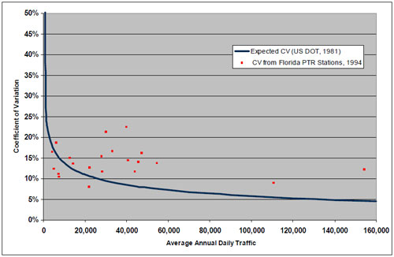

## Assignment Procedures

Assignment is often viewed as the culmination of any modeling process, be it a traditional four-step modeling process or an activity-based modeling process.&nbsp; Many models now include feedback loops to "equilibrate" assigned travel speeds with travel speeds used for prior modeling steps such as [trip distribution](Spatial_Interaction_Models), [destination choice](Destination_Choice_Models), and mode choice.&nbsp; Nevertheless, the modeling process typically ends with the assignment step.

The assignment step includes both highway and transit assignments of vehicle and person trips respectively.&nbsp; While there are emerging assignment procedures such as dynamic traffic assignment (DTA) and regional simulation procedures, research into the integration of these emerging procedures and travel demand models is just now occurring.

Assignment validation is generally inseparable from the rest of the modeling process.&nbsp; This is especially true for traffic assignment since it is not feasible to collect sufficient survey data to construct an observed trip table for traffic assignment.&nbsp; For transit assignment, observed transit trip tables might be constructed from comprehensive on-board surveys such as those performed for the FTA New Starts analyses.[31](#fn31)

Assignment validation is an important step in validating not only the assignment process but the entire modeling process.&nbsp; Assignment validation typically benefits from a wealth of independent validation data including traffic counts and transit boardings collected independently of household or other survey data used for model estimation and, increasingly, from independent traffic speed and travel time studies.&nbsp; In addition, due to established traffic and transit counting programs in many regions, traffic and transit count data can be used for temporal validation of travel models (see [Temporal Validation and Sensitivity](Model_Validation_and_Reasonableness_Checking_Temporal_And_Sensitivity)).

Unfortunately, as the culmination of the modeling process and due to the wealth of independent validation data, the assignment of trips to the network often becomes the primary basis for validating the a travel model's ability to replicate observed travel.&nbsp; In effect, assignment validation becomes a "super" data point defining a successful validation for many modelers and planners.&nbsp; While it is important that assignment validation be reasonable, highly accurate traffic and transit assignments in terms of matching observed traffic and transit volumes are _not_ sufficient for proving the validity of travel models.&nbsp; In some cases, the over-emphasis on matching observed traffic volumes and transit boardings has led to poor model adjustments such as link specific changes to the network speeds and capacities and "fine-tuning" of connector links for better match between modeled and observed traffic volumes or transit boardings.

Since assignment techniques are not wedded to a specific modeling process, this chapter will be structure slightly differently from the other chapters in this manual.&nbsp; Specifically, it will focus first on traffic assignment validation and then on transit assignment validation.

### Traffic Assignment Checks

Both traditional and emerging traffic assignment procedures may be used for assignment. &nbsp;Traditional techniques may be characterized as procedures that represent trips on each interchange as being omnipresent on all links reasonably serving the interchange.&nbsp; Traditional techniques include static equilibrium assignment, other capacity-restrained assignment, stochastic multipath assignment, and all-or-nothing assignment.&nbsp; Static equilibrium assignment is probably the most frequently used traditional traffic assignment technique.

Capacity-restrained traffic assignment techniques rely on volume-delay functions to estimate increases in individual link traversal times as assigned traffic volumes approach the estimated traffic carrying capacity for the link.&nbsp; The Bureau of Public Roads (BPR) curve has often been used to estimate link travel times resulting from the assigned volumes.&nbsp; In recent years, a number of enhancements have been made to the process, due in part to increases in computing power.&nbsp; Volume-delay functions have been developed for different facility types (freeway versus arterial for example) and in some regions, intersection-based techniques mimicking Highway Capacity Manual (HCM) intersection delay estimation techniques have been implemented.&nbsp; The detail of the coding of networks has also increased dramatically, along with an associated reduction in the size of the traffic analysis zones.&nbsp; Most traffic assignment programs also provide an option for class-based traffic assignment so that single-occupant vehicles (SOV), high-occupant vehicles (HOV), and trucks can be assigned simultaneously, interacting on general purpose links, but also being able to travel on links restricted by vehicle class (e.g., HOV lanes).

Emerging traffic assignment techniques include DTA and regional traffic simulation.&nbsp; A key to the emerging techniques is that they explicitly account for the actual time to travel between an origin and destination for an interchange.&nbsp; In addition, the emerging techniques can account for traffic queues backing up to impact other links in the network.&nbsp; The emerging traffic assignment techniques may be more suitable for use with activity-based modeling techniques although some have been applied using the results of traditional four-step models.

The focus of this section is the validation of traffic assignments.&nbsp; Many of the validation techniques relate to link-based traffic volumes and travel times.&nbsp; The validation tests can be applied regardless of whether the assignment results were produced by a traditional assignment technique or an emerging technique.

#### Sources of Data (Highway)

##### Traffic Counts

Traffic count data are the primary data used for the validation of traffic assignment procedures.&nbsp; Most traffic count data are obtained from various traffic count programs used for monitoring of traffic or collected for the Highway Performance Monitoring System (HPMS).

Traffic count data are an important independent validation data set.&nbsp; Nevertheless, traffic count data are often afforded more credence than they deserve.&nbsp; Counts are often collected from multiple sources such as state Departments of Transportation, toll authorities, counties, cities, and private contractors with each using various counting techniques.&nbsp; For example, counts from permanent traffic recorders, 48-hour or 24-hour counts performed using tube counters, and ancillary counts such as manual intersection counts may all be stored in the same database.&nbsp; Counts may be stored as raw counts or factored counts, such as average annual daily traffic (AADT).&nbsp; In addition, counts from multiple years surrounding a base year for model validation may be included for a validation in order to maximize the count data available.

In light of the above, the development of a validation database is a significant undertaking.&nbsp; In establishing the database, the data forecast by the regional travel model should be considered.&nbsp; Most regions develop travel models to provide forecasts of travel for an average weekday.&nbsp; Thus, the traffic count validation data should also reflect average weekday traffic (AWDT) for consistency.&nbsp; In addition to ensuring consistency of counts, the development of the traffic count database should also include consideration of geographic coverage, adequate representation of different functional classes, and completeness of screenlines.&nbsp; Inclusion of classification count data should be considered, especially if the travel model produces (and the region is concerned with) forecasts of high occupancy vehicles or truck volumes.

The variation of the count data should also be a concern in the development of the traffic count validation database.&nbsp; A traffic count for a facility is, in effect, a single sample of the set of daily traffic counts that occur on the link over a period of time.&nbsp; Thus, a single traffic count or a set of traffic counts for a single facility represent a sample for the link subject to sampling error.&nbsp; In 1981, the U.S. Department of Transportation published the Guide to Urban Traffic Counting, which included a figure depicting the expected coefficient of variation in daily counts.&nbsp; In 1997, a study of the variability of traffic count data included information from 21 permanent traffic recording (PTR) stations in Florida.[32](#fn32) The curve depicting the original estimation of coefficient in variation of traffic counts and the observed data from Florida are shown in [Figure 9.1](#Figure9-1).

Sources:&nbsp;&nbsp;&nbsp;&nbsp; U.S. Department of Transportation, Guide to Urban Traffic Counting, 1981; and Wright, Tommy, et al., *Variability in Traffic Monitoring Data, Final Summary Report*, prepared for Oak Ridge National Laboratory, August 1997, Table 5, Page 10.\
Since coefficient of variation is defined as the standard deviation divided by the mean, the standard deviation of an observed traffic volume can be easily estimated.&nbsp; Approximately 95 percent of the randomly collected counts for a facility should fall within &plusmn;1.96 standard deviations of the mean.&nbsp; [Figure 9.2](#Figure9-2) shows the error ranges (&plusmn;1.96 standard deviations) for the Florida data along with lines representing &plusmn;20 percent of the average traffic count.&nbsp; As can be seen in [Figure 9.2](#Figure9-2), substantial variation in daily traffic counts should be assumed.&nbsp; This suggests that traffic count data based on one or two day counts may be substantially different than the "true" average daily traffic for a link, even when the traffic count data are adjusted for day of week and seasonal variation.&nbsp; These results suggest that link counts for subclassifications such as time-of-day or vehicle classification are also subject to substantial variation.

Source:&nbsp; Wright, Tommy, et al., *Variability in Traffic Monitoring Data, Final Summary Report*, prepared for Oak Ridge National Laboratory, August 1997, Table 5, Page 10.\

##### HPMS Data

Regional vehicle-miles of travel (VMT) are estimated from traffic counts for the HPMS.&nbsp; The regional VMT estimates can provide a target for modeled VMT.&nbsp; However, prior to using the observed regional VMT based on the HPMS data, the consistency of the HPMS data and the modeled data should be verified.&nbsp; The consistency checks should include:

- The HPMS area covered versus area covered by the travel model;
- The facilities included in HPMS VMT (e.g., local street VMT) versus facilities included in model; and
- Whether VMT estimates are based on average annual daily traffic or average annual weekday traffic.

##### Travel Time and Speed Studies

Many regions have initiated the collection of travel times and speeds.&nbsp; These studies typically identify a number of corridors in the region each served by a single functional class such as freeway, expressway, principal arterial, or minor arterial.&nbsp; A number of travel time runs are then made through the specified corridors at various times of day to collect travel time, and thus, average travel speed information.&nbsp; The data collected can vary from simple end-to-end travel times to the components of the end-to-end travel times including run times, cruise times and signal delay times, delay times due to incidents, and in some studies, coincident traffic counts on the facilities traversed.

If traffic count data are collected along with the detailed travel time data, it may be possible to use the data to validate (or even to estimate) the volume-delay functions used in the traffic assignment process.&nbsp; Some regions have used detailed travel time and traffic count data to develop volume delay functions that result in validated traffic counts and traffic speeds being produced directly by the assignment process.&nbsp; Other regions use one set of volume-delay functions to produce validated traffic counts and a second set in an assignment post-processing step to estimate traffic speeds for air quality modeling.

As with traffic count data, travel time and speed studies may be subject to substantial variation depending on the day or days the data are collected.&nbsp; Nevertheless, the data collected can be quite useful in validating congested speeds produced by the travel model.&nbsp; With the strong connection between travel models and air quality models, the validation of congested speeds produced by the traffic assignment procedure is an important consideration.

Some regions also collect spot speed study data.&nbsp; These data may be useful for validation of modeled speeds for facilities uninterrupted by intersections such as freeways and expressways.&nbsp; Spot speed data are of limited use for arterials and other facilities with traffic control devices at intersections since delays resulting from the traffic control devices are not considered in the speed studies.

#### Aggregate Checks (Highway)

A good approach to the validation of the traffic assignment procedure is to start with the most general aggregate checks and progress toward more detail.&nbsp; Aggregate checks should be generally applicable for both traditional traffic assignment procedures and for emerging techniques.

As mentioned previously, assignment is the culmination of the modeling process and, in effect, validates the entire modeling process.&nbsp; The aggregate [VMT](#Vehicle-Miles_Of_Travel) and [Volume-to-Count Ratio](#Volume-to-Count_Ratio) checks provide this overall modeling process check more than subsequent tests that will be described later in this chapter.&nbsp; Different information regarding the modeling process can be inferred from each level of the summaries:

- Regional summaries provide an indication of the reasonableness of the overall level of travel.&nbsp; The results help confirm that the trip generation, trip distribution, and mode choice models, or their activity-based modeling corollaries, as well as the assignment process, are performing reasonably.
- Summaries by facility type provide an overall indication of the operation of the assignment procedures.&nbsp; These results of these summaries might indicate issues with free-flow speeds, link capacities, or volume-delay functions.
- Summaries by geographic area may be useful for uncovering geographic biases in the modeling process.&nbsp; These biases might relate to previous steps in the modeling process.&nbsp; GIS plots of errors or percent errors by geographic area may facilitate this analysis.
- Summaries by combinations of the above strata may provide additional diagnostic information if one of the above summaries indicates a validation problem.

##### Vehicle-Miles Of Travel

As noted in [HPMS Data](#HPMS_Data), the base year VMT produced by the model can be compared to observed VMT estimates from HPMS.&nbsp; For comparisons with HPMS VMT estimates, modeled traffic for all network links should be considered.

The VMT checks should be made for the region and by market segment.&nbsp; Markets may include facility type, area type, or geographic subdivision (e.g., county or super-district).&nbsp; It is important when comparing VMT estimates to ensure that the lane miles covered by the model are consistent with lane miles from HPMS, and the total lane miles for each region and market segment should be reported along with the VMT statistics.&nbsp; [Table 9.1 (a)](#Table-t9-1a) provides an example of VMT summaries by facility type.

**Table 9.1 (a)&nbsp; Example VMT Validation Summary by Facility Type**

|                     |                |                                          |                                         |                  |
|---------------------|----------------|------------------------------------------|-----------------------------------------|------------------|
|
 **Facility Type**
             |
                       **Lane Miles**
                              |
                                        **VMT**

                                                                      |
                                                                                   **Error**

                                                                                                                  |
                                                                                                                             **Distribution**

                                                                                                                                    |

| &nbsp; | &nbsp; |
**Estimated** ([a](#t9-1a_a))

                                                                       |
                                                                                   **Observed** ([b](#t9-1a_b))

                                                                                                                |
                                                                                                                             **Difference**

                                                                                                                                    |

| Freeways | 112 | 23,342,838 | 24,078,537 | -735,699 |
| Expressways | 33 | 3,477,618 | 3,306,422 | 171,196 |
| Principal Arterials | 264 | 19,508,011 | 18,578,391 | 929,620 |
| Minor Arterials | 351 | 7,125,530 | 7,257,875 | -132,345 |
| Collectors | 399 | 8,911,433 | 9,178,980 | -267,547 |
| Total | 1159 | 62,365,430 | 62,400,204 | -34,774 |

a&nbsp;Estimated is the VMT produced by the model.

b&nbsp;Observed is from the HPMS estimates of VMT.

##### Volume-to-Count Ratio

One limitation of the [VMT](#Vehicle-Miles_Of_Travel) aggregate checks is that the HPMS data used as a target is generally collected on a rolling basis over a number of years and assembled to a consistent basis using a variety of interpolation strategies (see the FHWA Traffic Monitoring Guide, <http://www.fhwa.dot.gov/policyinformation/travelmonitoring.cfm>, and the HPMS Field Manual, <http://www.fhwa.dot.gov/policyinformation/hpms/fieldmanual/>, for details). Many agencies feel that because of the intrinsic "fuzziness" in HPMS data, the performance of the model is better evaluated by limiting aggregate comparisons to locations for which counts have been collected in the model base year (or over a period that better reflects the detailed conditions the base year model is designed to reproduce).

While it may seem intuitive to perform a VMT comparison on just the links with quality counts (taking the observed and modeled counts, multiplying each by the link length on which the count was collected, and adding up the resultant "VMT"), the resulting statistics prove to be a poor basis for evaluating model performance. The difficulty lies in the fact that there is no independent standard for deciding what the "correct" link length should be (or, in other words, how many lane miles the count should be applied to). Note that when validating against VMT from HPMS, there _is_ an independent standard - specifically the inventory of lane miles maintained in HPMS itself.

Practically, the difficulty with "partial VMT" is that if the same modeled and observed counts are evaluated with different sets of link lengths, the resulting statistics can be very different (even though the model is performing equivalently in both cases). To illustrate with a concrete example, consider a case where several river bridge crossings are each coded as a single long link, versus the same model with the bridges each divided into two shorter links (as might happen if a jurisdiction boundary follows the river and the model is required to produced VMT estimates by jurisdiction). If the model is doing a relatively poor job on cross-river trip distribution, the error will be magnified (relative to the other links that are aggregated into the result) if the bridge is coded as one long link, and minimized if the bridge is coded as two links but the count only placed on one link. Note that while one might attempt to get equivalent results by placing the same count on both links, doing so will wreak havoc with the link based statistics such as %RMSE described in [Traffic Volume-Related Checks](#Traffic_Volume-Related_Checks).

Because the link length coding is essentially arbitrary if using a subset of count locations, the statistical difficulty of variable link lengths can be neatly circumvented by applying a standard length to each count location (so that each count is equally "weighted" in relation to the other counts). The numerical consequences of the arbitrary lengths can be entirely removed if one uses the ratio of modeled and observed VMT to compare modeled and observed results (so the actual units of length cancel out). Because the standard length is arbitrary (but the same for all count locations) and does not appear in the final statistic, it is standard practice to consider it a unit value ("1 count length"). As a result, the ratio of modeled and observed "VCLT" (Vehicle Count Lengths Traveled) reduces numerically to its simpler mathematical equivalent: the ratio of (Modeled) Volumes to (Observed) Counts. Likewise, whereas in a VMT comparison one would report the number of lane miles evaluated, in Volume-to-Count comparisons one should report the sum of "count lengths" which (because we are using a "unit count length" at each location) is numerically equivalent to the number of count locations.

Checks of Volume-to-Count ratio should be made for the region and by market segment.&nbsp; Markets may include facility type, area type, geographic subdivision (e.g., county or super-district), or (if the data are available) time-of-day (e.g., morning peak period, afternoon peak period, mid-day and night). Volume-to-Count comparisons may also be useful for evaluating [Screenlines, Cutlines, and Cordon Counts](#Screenlines,_Cutlines,_and_Cordon_Counts).

[Table 9.1 (b)](#Table-t9-1b) provides an example of Volume-to-Count summaries by facility type.\

**Table 9.1 (b)&nbsp; Example Volume-to-Count Validation Summary by Facility Type**

|                     |                                        |                                         |                                                |
|---------------------|----------------------------------------|-----------------------------------------|------------------------------------------------|
|
 **Facility Type**

             |
                       **Volumes**

                                                    |
                                                                **Error**

                                                                                               |
                                                                                                          **Count Locations**

                                                                                                                                                |

| &nbsp; |
**Modeled** ([a](#t9-1b_a))

                                                      |
                                                                **Observed** ([b](#t9-1b_b))

                                                                                               |
                                                                                                          **Mean Difference** ([c](#t9-1b_c))

                                                                                                                                               |

| Freeways | 2,623,122 | 2,705,795 | -1,687 |
| Expressways | 379,816 | 361,118 | 2,337 |
| Principal Arterials | 1,724,786 | 1,642,594 | 2,005 |
| Minor Arterials | 515,707 | 525,286 | -639 |
| Collectors | 368,211 | 379,266 | -582 |
| Total | 5,611,642 | 5,614,059 | -18 |

a&nbsp;Estimated is the sum of model volumes at count locations on that facility type.

b&nbsp;Observed is sum of observed counts at the count locations.

b&nbsp;Mean difference is the total difference between modeled and observed counts divided by the number of count locations.

\

##### Traffic Volume-Related Checks

Traffic volume related checks compare modeled to observed traffic volumes on a link-by-link basis.&nbsp; Consequently, the amount of difference between the modeled and observed traffic for each link contributes directly to the overall measure of closeness even when the results are aggregated in different ways.&nbsp; This is in contrast to the VMT checks described above where a positive difference on one link can cancel a negative difference on another link.

The traffic volume related checks described in this chapter focus on traditional measures that are scalable and easily explained:&nbsp; root mean squared error (RMSE), percent RMSE (%RMSE), correlation (R), and coefficient of determination (R2).&nbsp; There are other measures similar to the measures covered in this section, such as mean absolute error (MAE), that may be used or preferred by some.&nbsp; The key to the measures is that they are scalable.&nbsp; For example, an RMSE of 1000 is one-half as large as an RMSE of 2000 for a given set of links.

"Pass-fail" validation tests are not recommended or discussed in this section since they imply an unwarranted level of confidence in the results (and in the observed data) and do not provide useful information regarding the goodness of fit of the model.&nbsp; These measures can be characterized as "the results are ‘valid' if the value obtained for the validation test is less than five."

##### Root Mean Squared Error and Percent Root Mean Squared Error

RMSE and %RMSE for a set of links can be calculated using the following formulae:

and

Where:

- Count~i~ = The observed traffic count for link _i_;
- Model~i~ = The modeled traffic volume for link _i_; and
- N = The number of links ([33](#fn33)) in the group of links including link _i_.

RMSE and %RMSE are both measures of accuracy of the traffic assignment measuring the average error between the observed and modeled traffic volumes on links with traffic counts.&nbsp; As such, RMSE and %RMSE should be summarized by facility type (or functional class) or by link volume group.&nbsp; Summarizing the measures by geography can provide good validation information, especially if the measures continue to be stratified by facility type or volume group.&nbsp; While the measures can be calculated for more aggregate groups or the region as a whole, the measure becomes less useful for determining the quality of the assignment process.&nbsp; In effect, at too gross a level of aggregation, the RMSE or %RMSE measures can easily be interpreted as pass-fail measures:&nbsp; "The regional %RMSE is 32 percent so, obviously, the model is…"&nbsp; Such statements have little validity or usefulness for model validation.

If the traffic assignment process used for a region uses a look-up table to estimate link capacity (e.g., stratified by area type and facility type), it is useful to summarize RMSE by the same strata.&nbsp; In this way, the average error on links can be compared to the estimated capacities of the links to determine if the average error is, say, more or less than one-half lane of capacity.&nbsp; If the RMSE is based on more than a one-hour assignment, as would typically be the case, the RMSE can be adjusted to reflect a one-hour period through the use of a peak hour factor.&nbsp; For example, suppose the RMSE for freeways in a suburban area type was 10,000 based on daily traffic counts and the modeled daily traffic volumes.&nbsp; If eight percent of the daily traffic occurred in the peak hour, the average error represented in the peak hour could be estimated as 0.08 x 10,000, or 800 vehicles.&nbsp; If the modeled capacity for freeway links in the suburban area was 2,200 vehicles per hour per lane, the implied average error would be equivalent to a little over one-third of a lane.

##### Correlation Coefficient or Coefficient of Determination

Pearson's product-moment correlation coefficient (R) is a standard statistical measure available in spreadsheet programs and other readily available statistical software packages.&nbsp; R is a dimensionless index that ranges from -1.0 to 1.0 inclusive that reflects the extent of a linear relationship between two data sets.&nbsp; It is calculated as follows:

Where _Count~i~_, _Model~i~_, and _N_ are as defined for the calculation of RMSE.

The coefficient of determination, R2, which is simply the square of R, is typically interpreted as the proportion of the variance in a dependent variable, y, attributable to the variance in an independent variable, x.&nbsp; This traditional interpretation does not hold for traffic assignment validation since the modeled traffic assignment is not dependent on the traffic count, or vice-versa.

These two measures have been frequently used in the past in validation.&nbsp; They measure the strength of the (linear) relationship between the assigned volumes and traffic counts.&nbsp; In effect, R2 has been assumed to be a measure of the amount of variation in traffic counts "explained" by the model.&nbsp; The measures must be used with caution.&nbsp; An R2 for all links in the region simply says that links with high capacities (e.g., freeways) can, and usually do, carry more traffic than links with low capacities (e.g., local streets).&nbsp; As such, R2 probably tells more about the coding of facility type and number of lanes than about how the model and assignment is performing.&nbsp; Thus, achieving a regional R2 of 0.88, as has been suggested as a "standard" for determining a model's validity, has little if any meaning.

If used carefully, R2 can be a useful measure for comparing model results to other iterations when calibrating travel models and traffic assignments since the bases (i.e., the sets of links considered) for calculating the measure should be the same between iterations.&nbsp; The R2 statistics should be calculated for links with similar characteristics such as facility type or volume group.&nbsp; As an example, if the R2 statistics for each facility type were consistently higher for Iteration "X" of a travel model calibration as compared to the results for other iterations, the model used for Iteration X _might_ be considered to be the best.&nbsp; Of course, all modifications made to the model for Iteration X should be considered prior to ranking the final results of the various iterations.

##### Scatterplots

Scatterplots of modeled traffic volumes versus the observed traffic volumes are useful validation tools and should be combined with the R2 summaries.&nbsp; [Figure 9.3](#Figure9-3) shows two scatterplots with identical R2 values.&nbsp; Even though the R2 values are identical, the scatterplots tell very different stories regarding the modeled volumes.&nbsp; In [Figure 9.3(a)](#Figure9-3a), the modeled volumes are randomly distributed around the observed traffic counts within a constant band.&nbsp; Such results might suggest that the volume-delay functions are having relatively little effect in the traffic assignment.&nbsp; In [Figure 9.3(b)](#Figure9-3b), the scatterplots suggest that the amount of error in the modeled volumes is proportional to the traffic count or, in effect, to the capacity of the link.

**Figure 9.3&nbsp; Scatterplots of Modeled Traffic Volumes Versus Observed Traffic Counts**

\(a) Probable Constant Error

\(b) Probable Error Proportional to Volume

##### Range Checks

Analysis of outliers can be a good method for finding and correcting network or assignment errors.&nbsp; Some outliers, links with high observed volumes and very low assigned volumes or vice-versa, can be identified from the scatterplots.&nbsp; An alternative method for identifying outliers is to simply list or plot the links with the largest differences between modeled and observed traffic volumes.&nbsp; It is also worthwhile to identify and investigate links with zero assigned volumes.

##### Screenlines, Cutlines, and Cordon Counts

Comparison of modeled volumes to observed counts for critical links (see the detailed discussion in [Volume-to-Count Ratio](#Volume-to-Count_Ratio)), especially along screenlines, cutlines, and cordon lines, is useful for assessing model quality:

- Screenlines extend completely across the modeled area from boundary cordon to boundary cordon.&nbsp; Screenlines are often associated with physical barriers such as rivers or railroads, although jurisdictional boundaries such as county lines that extend through the study area may also be used as screenlines.&nbsp; [Figure 9.4](#Figure9-4) shows example screenlines for a region.

\

- Cutlines extend across a corridor containing multiple facilities.&nbsp; They should be used to intercept travel along only one axis.&nbsp; [Figure 9.5](#Figure9-5) shows example cutlines for multiple corridors a region.&nbsp; Cutlines 3, 6, 7, and 8 might be also considered screenlines if the entire modeling area is shown in [Figure 9.5](#Figure9-5).

\

- Cordon lines completely encompass a designated area.&nbsp; For example, a cordon around the central business district is useful in validating the "ins and outs" of the CBD related traffic demand.&nbsp; Over or under estimates of trips bound for the CBD could indicate errors in the socioeconomic data (employment data for the CBD) or errors in the trip distribution or mode choice model.

##### Detailed Difference Plots

Detailed plots of absolute or relative differences between modeled traffic volumes and observed traffic counts can provide useful diagnostic information for model validation.&nbsp; [Figure 9.6](#Figure9-6) shows an example of such a difference plot.&nbsp; Detailed difference plots are more appropriate for validation of models for corridor studies or diagnosis of problems.&nbsp; Typically, there is too much information at a regional level, although the data may be filtered to show only differences greater than a specified threshold value.

\
Since difference plots are comparing modeled volumes and observed counts on individual links, care should be exercised in the review.&nbsp; As noted in [Sources of Data (Highway)](#Sources_of_Data_(Highway)), there can be substantial "sampling" error in traffic counts.&nbsp; Thus, a large difference between modeled traffic volumes and observed traffic counts might reflect a problem with the traffic count rather than the modeled volume.&nbsp; The other aggregate tests described in this chapter are somewhat dependent on the sampling error associated with traffic counting being distributed around a reasonable mean.&nbsp; In other words, the other aggregate tests are dependent on over-counts for links of a specific group canceling under-counts for the group.

##### Speed Checks

Speed checks compare modeled speeds to observed data from travel time studies or, possibly, spot speed data for facilities not affected by intersection controls.&nbsp; The modeled speeds may be output directly from the traffic assignment process or they may be output from an assignment post-processor.&nbsp; The speed checks are focused on time-of-day or peak hour assignment results.&nbsp; While they can be easily calculated from VMT and vehicle-hours of travel (VHT) summaries for links, 24-hour average speeds are not very meaningful.

It is somewhat more difficult to define validation tests focused on speeds than it is to define traffic volume related validation checks.&nbsp; While modeled speeds can easily be calculated for each link, the modeled speeds are directly impacted by the quality of the assignment results.&nbsp; Thus, errors in assigned speeds might result from errors in the estimation of speeds or from errors in assigned traffic volumes.&nbsp; This issue might be addressed by filtering the links included in the test to include only those links where the assigned traffic volume is within, say, &plusmn;20 percent of the observed traffic count.

##### Scatterplots

An initial validation check of modeled speeds can be prepared by producing scatterplots of modeled versus observed speeds.&nbsp; The scatterplots might look like the examples shown in [Figure 9.3](#Figure9-3) with "Observed Speed" and "Modeled Speed" replacing "Traffic Count" and "Modeled Volume."&nbsp; The scatterplots should be produced by facility type and, if possible, by link volume group within the facility type grouping.&nbsp; The stratification by volume group would address two primary issues:

- It is probably more desirable to match traffic speeds on high volume links than on low volume links; and
- Speeds on low volume links should be close to free-flow speeds; if the free-flow speeds do not match reasonably, the veracity of the volume delay functions or the free-flow speed inputs can be questioned especially if the speeds for high volume links match closely.

##### Speed Versus Volume/Capacity Ratio Comparison Plots

Both observed and modeled speeds can be plotted against volume/capacity ratios.&nbsp; The observed speeds should be plotted against the volume/capacity ratio for the observed traffic count at the time the speed information was collected.&nbsp; The modeled speeds should be plotted against the modeled volume/capacity ratio.&nbsp; The plots should be produced by facility type.&nbsp; [Figure 9.7](#Figure9-7) shows an example of such a plot.

The comparison plot shown in [Figure 9.7](#Figure9-7) is a method for verifying volume delay functions for the assignment.&nbsp; It is just as valid to plot the modeled speeds using the specified volume-delay function for a specified facility type.&nbsp; The comparison plots remove the impacts of differences in modeled traffic volumes and observed traffic counts inherent in the scatterplots of modeled versus observed speeds.&nbsp; The plot shown if [Figure 9.7](#Figure9-7) suggests that the modeled speeds do not decrease quite quickly enough as the volume/capacity ratio increases.

\
===== Travel Time Run Comparison =====
This test can be implemented when speed and travel time surveys (i.e., "speed runs") have been performed for specific corridors.&nbsp; The test is implemented by comparing the modeled travel times over a specific route to the observed travel times for the same route.&nbsp; The test provides a general assessment of the overall quality of the traffic assignment and speed processing.&nbsp; Since slow speeds on some links in the route considered can cancel high speeds for other links, the test is not a rigorous test.&nbsp; Nevertheless, general trends can be observed if there are multiple speed runs for the same or for different corridors.

With the increased use of global positioning system (GPS) units for household travel surveys, there will be an increase in "speed run" data for model validation.&nbsp; Since one of the assumptions underlying static-based equilibrium traffic assignment is that no traveler can reduce his or her travel time by switch travel paths, it should be increasingly possible to compare travel times on interchanges for selected times of day to modeled travel times for the same interchanges for comparable time periods.&nbsp; These comparisons will provide general information regarding the reasonableness of modeled travel speeds.

#### Disaggregate Checks (Highway)

Disaggregate validation checks are focused on emerging traffic assignment techniques such as DTA and traffic simulation.&nbsp; As such, validation methods are also emerging and may require data that are not readily available.&nbsp; The following outlines two possible tests for the emerging techniques.

##### Route Choice

If household or other travel survey data have been collected using GPS units, it might be possible to compare modeled to observed paths for selected trips.&nbsp; A measure of accuracy such as the percent of modeled links used matching observed links used might be useful.

##### Traffic Flow

Aggregate tests such as link speed comparisons and traffic volume comparisons described above are useful for validation of the emerging techniques.&nbsp; However, additional tests might be appropriate, especially if GPS data are available.&nbsp; Specifically, for specific trips, it might be possible to compare the components of travel time for a selected route (e.g., stop delay time and travel time in motion).&nbsp; Alternatively, if traffic engineering data are available, modeled level of service measures (e.g., intersection delay) might be compared to observed data.

#### Criteria Guidelines (Highway)

##### Aggregate Validation Checks

In the Peer Exchange on Travel Model Validation Practices held in Washington, D.C. on May 9, 2008, a general consensus of participants was:

There was some agreement that setting validation standards for matching traffic counts, transit boardings, and screenline crossings can be a double-edged sword.&nbsp; While standards can be used to help determine relative model accuracy, they also can encourage over-manipulation to meet the standards.&nbsp; This can be especially true if project rankings or construction funds are based on absolute values rather than relative results.&nbsp; While almost any travel model can be manipulated to attain a specified validation standard, it is important to emphasize the use of appropriate methods to meet the standard.&nbsp; Methods used to achieve a reasonable match between modeled and observed traffic volumes can be as important as the reasonableness of the match itself.&nbsp; Therefore, model validation should focus on the acceptability of modeling practices in addition to attaining specified standards.&nbsp; A model validation that matches specified trip assignment standards within a reasonable range using valid modeling procedures is better that a model that matches observed volumes with a tighter tolerance using questionable modeling procedures. ([34](#fn34))

Based on the above, this chapter reports some guidelines that have been used by various states and agencies.&nbsp; Specifically, [Table 9.2](#Table-t9-2) lists some example guidelines used for the match between modeled and observed VMT for Ohio and Florida.&nbsp; [Figure 9.8](#Figure9-8) summarizes %RMSE guidelines used in Ohio, Florida, and Oregon.&nbsp; The Michigan Department of Transportation (MDOT) has targets of 5 percent and 10 percent for screenlines and cutlines, respectively, for percent differences in observed and estimated volumes by screenline.&nbsp; [Figure 9.9](#Figure9-9) shows the maximum desirable deviation in total screenline volumes according to the observed screenline volume originally cited in _Calibration and Adjustment of System Planning Models_, produced by the FHWA in December 1990, and referenced in a number of documents, including the NCHRP Report 255, and the 1997 version of this manual.&nbsp; **The guidelines in this section should _not_ be construed as standards; matching or exceeding the guidelines is _not_ sufficient to determine the validity of a model.**

**Table 9.2&nbsp;&nbsp;&nbsp;&nbsp; Example VMT Guidelines by Functional Class and Area Type**

|                          |                                   |
|--------------------------|-----------------------------------|
|
 **Stratification**

                  |
                            **Modeled Versus Observed VMT**

                                                   |

| &nbsp; |
'''Ohio ([a](#t9-2_a))

                                                  |

|
**Functional Class**

                |                                   |

|
**Freeways/Expressways**

                | &plusmn;7%                        |

|
**Principal Arterials**

                | &plusmn;10%                       |

|
**Minor Arterials**

              | &plusmn;10%                       |

|
**Collectors**

                 | &plusmn;15%                       |

|
**All Links**

               |                                   |

|
**Area Type**

                |                                   |

|
**CBD**

                | &plusmn;10%                       |

|
**Fringe**

                | &plusmn;10%                       |

|
**Urban**

                | &plusmn;10%                       |

|
**Suburban**

                | &plusmn;10%                       |

|
**Rural**

                | &plusmn;10%                       |

\

(a)&nbsp;&nbsp; Giaimo, Gregory, Travel Demand Forecasting Manual 1 – Traffic Assignment Procedures, Ohio Department of Transportation, Division of Planning, Office of Technical Services, August 2001.

(b)&nbsp;&nbsp; FSUTMS-Cube Framework Phase II, Model Calibration and Validation Standards:&nbsp; Model Validation Guidelines and Standards, prepared by Cambridge Systematics, Inc., for the Florida Department of Transportation Systems Planning Office, December 31, 2007, Table 3.9, page 3-16.

(c)&nbsp;&nbsp; The FHWA Travel Model Improvement Program Workshop over the Web, The Travel Model Development Series:&nbsp; Part I–Travel Model Estimation, prepared by Cambridge Systematics, Inc., June 9, 2009, Slide 11, [http://tmip.fhwa.dot.gov/‌sites/‌default/‌files/‌presentation\_8\_‌with\_‌notes](http://tmip.fhwa.dot.gov/‌sites/‌default/‌files/‌presentation_8_‌with_‌notes).‌pdf, accessed November 29, 2009.\

Sources:&nbsp; Ohio:&nbsp; Giaimo, Gregory, Travel Demand Forecasting Manual 1–Traffic Assignment Procedures; Florida:&nbsp; FSUTMS-Cube Framework Phase II, Model Calibration and Validation Standards:&nbsp; Model Validation Guidelines and Standards; and Oregon:&nbsp; FSUTMS-Cube Framework Phase II, Model Calibration and Validation Standards, Draft Technical Memorandum 1.\
\

Source:&nbsp; Calibration and Adjustment of System Planning Models, FHWA, December 1990.\

##### Disaggregate Validation Checks

There are no specific criteria guidelines associated with disaggregate traffic assignment checks described above.

#### Reasonableness and Sensitivity Testing (Highway)

Reasonable ranges of VMT per household are 40 to 60 miles per day for large urban areas and 30 to 40 miles per day for small urban areas.&nbsp; The 1990 NPTS reported an average of 41.37 vehicle miles traveled per household daily.&nbsp; The average increased to 58.05 vehicle miles of travel in the 2001 NHTS (although differences in the survey methods account for some of the increase).&nbsp; Reasonable ranges of VMT per person are 17 to 24 miles per day for large urban areas and 10 to 16 miles per day for small urban areas.

Traffic assignment techniques vary from region to region.&nbsp; Based on a review of the model documentation of assignment procedures used by 40 different MPOs throughout the country:

- About 70 percent use time-of-day traffic assignment procedures;
- 75 to 80 percent perform class-based assignment techniques; and
- 20 to 30 percent perform speed equilibration for some of the assigned time periods.

[Table 9.3](#Table-t9-3) summarizes the ranges of coefficients and exponents of BPR-like volume delay functions as reported by 18 of the MPOs.&nbsp; The BPR-like function estimates the congested travel time on a link using the following formula:

Where:

- _Time~final~_ is the final, congested travel time on a link;
- _Time~initial~_ is the initial, or free-flow, travel time on a link;
- _V_ is the assigned volume on a link;
- _C_ is the capacity of the link (at level of service E); and
- _&alpha;_ and _&beta;_ are model coefficients

\

**Table 9.3&nbsp; Range of Reported BPR-Like Assignment Parameters (18 MPOs)**

|                   |             |             |
|-------------------|-------------|-------------|
|
 **Facility Type**

         |
                     **&alpha;**

                      |
                                   **&beta;**

                                     |

| &nbsp; |
**Minimum**

                     |
                                   **Maximum**

                                     |

| Freeways | 0.10 | 1.20 |
| Arterials | 0.15 | 1.00 |

\
Sensitivity testing of traffic assignment procedures can be performed by making changes to the networks or input trip tables used for assignment.&nbsp; Several approaches are as follows:

- **Regional sensitivity** - Check reasonableness in change in VMT to changes in total trips.&nbsp; Increase (factor) trips by a factor (e.g., 1.5) and check to see that total VMT changes by a similar factor.&nbsp; If there is little congestion in the region, VMT should increase by a similar factor.&nbsp; If there is substantial congestion, VMT should increase by more than the factor.
- **Localized sensitivity** - Modify key network elements and review assignment results for changes and reaction to network elements (using a fixed trip table).&nbsp; For example, remove a key bridge or limited access facility and review the impact on traffic using volume difference plots between the original and modified alternatives.
- **Over-sensitivity** - For congested networks, make a minor change to a network (e.g., add a lane of traffic to a minor arterial link) and reassign a fixed trip table using same number of iterations and closure criteria.&nbsp; Review the impact on traffic using volume difference plots between the original and modified alternatives.&nbsp; Traffic impacts should be very localized.

#### Troubleshooting Strategies (Highway)

Since traffic assignment is the culmination of the modeling process, issues can easily be related to previous steps in the modeling process.&nbsp; It is, however, always valid to start the troubleshooting with the traffic assignment step and work backwards through the modeling process.&nbsp; [Table 9.4](#Table-t9-4) provides some troubleshooting strategies for common issues that might occur with a traffic assignment.

**Table 9.4&nbsp; Troubleshooting Strategies for Issues with Traffic Assignment**

|                                                                                         |                                                                                                                                                                                 |
|-----------------------------------------------------------------------------------------|---------------------------------------------------------------------------------------------------------------------------------------------------------------------------------|
|
 **Issue**

                                                                                 |
                                                                                           **Potential Troubleshooting Strategies**

                                                                                                                                                                                                                                                                   |

| 1\. Low, high, or unrealistic base year modeled link volumes compared to traffic counts | - Check network coding (speeds, capacities, etc.) on these links, nearby/adjacent links, and links on competing paths - Check TAZ connections and loading at centroids - Check traffic count data |
| 2\. Uneven facility loading on parallel competing routes | - Review centroid connections - Review facility and area type coding and input starting speeds for assignments - Review zone structure and number of zones – may need to have finer spatial resolution - Review final congested speeds and volume-delay functions |
| 3\. Travel times not representative of observed data | - Review facility and area type coding and input starting speeds for assignments - Review final congested speeds and volume-delay functions |
| 4\. Links with zero assigned volume | - Check network coding (including nearby or competing links) for continuity, stub links, centroid connector locations, and attributes such as free-flow speeds and capacities |
| 5\. Links with very high assigned volume/‌capacity ratios | - Check network coding (including nearby or competing links) for centroid connector locations and attributes such as free-flow speeds and capacities |

\
==== Forecast Checks (Highway) ====
The forecast year validation checks for traffic assignment should concentrate on comparisons of the forecast year model results to the base year model results.&nbsp; The base year observed data are no longer directly considered.&nbsp; Unlike the base year comparisons, however, the objective is not to achieve a close match between the forecast and base year results, but rather to ensure that the differences and trends are reasonable.&nbsp; For example, it may be reasonable to expect that VMT per capita increases somewhat over time especially in congested regions due to increased circuitry of travel.

The main comparisons are similar to the comparisons previously done between base year model results and observed data.&nbsp; These may include regional, subregional, and corridor specific checks.&nbsp; Examples of regional and subregional checks include:

- VMT per capita;
- Total VMT by functional class;
- Average congested speeds by functional class;
- Changes in VMT by functional class; and
- Changes in volumes crossing screenlines, cutlines, and cordon lines.

Examples of corridor-level checks include:

- Difference plots of future versus base year traffic; and
- Comparisons of speeds on facilities.

Traffic for specific facilities should not always be expected to increase.&nbsp; Facilities that are congested in the base year may not be able to handle significantly more traffic in the future or capacity improvements or new roadways in other areas might minimize increases in traffic on specific facilities.

### Transit Assignment Checks

Traditional transit assignment procedures have focused on the assignment of peak and off-peak period trips in production-attraction format in an effort to reproduce daily transit boardings by line and, in many cases, the ridership at maximum load points along the line.&nbsp; For regional travel forecasts, the output of transit assignments may be somewhat less rigorous than the requirements for traffic assignments.&nbsp; The regional assignments have been used to determine information such as the number of transit vehicles required based on the frequency of service required to serve the forecast transit demand.

The amount of scrutiny received by transit assignments may increase substantially when a region applies for FTA Section 5309 New Starts funds.&nbsp; The FTA encourages rigorous checking of transit networks, transit path-building procedures, and transit assignment results.

Generally available transit assignment procedures include all-or-nothing, all shortest paths, and a number of multipath assignment procedures.&nbsp; The multipath transit assignment procedures are heuristic procedures used to represent the optional path choices and path use in robust transit systems rather than transit path-switching due to capacity constraints.&nbsp; Capacity constrained transit assignment techniques are rarely required.&nbsp; Few regions reach crowding to an extent that people switch from one transit path or mode to another to avoid the over-crowding.&nbsp; In cases where this does occur, ad hoc techniques such as "shadow pricing at park and ride lots" are used to "move" transit ridership to different lines.

Some regions developing activity-based travel models have moved from peak and off-peak transit assignments in production-attraction format to true time-of-day assignments in origin-destination format.&nbsp; This change can be considered to be evolutionary; not revolutionary.&nbsp; The transit assignment validation checks for origin-destination-based transit assignments are similar to those used for more tradition transit assignments in production-attraction format.

As discussed in [Mode Choice](Model_Validation_and_Reasonableness_Checking_Mode_Choice), transit assignment validation is closely related to mode choice model validation, as it regards transit mode choices.&nbsp; Issues identified during checks of transit assignment results may be caused by issues with the mode choice model, and vice versa, and issues with both model components may be related to transit path building and network skimming procedures.

#### Sources of Data (Transit)

The primary source of data for transit assignment validation is the transit operator.&nbsp; The most generally available data are count data such as boardings by line and park-and-ride lot utilization counts.&nbsp; Some regions will also have on-board survey data available for validation.

##### Boarding Count Data

Most transit operators collect boarding count data by line on a continuous basis through the use of recording fare boxes or the performance of periodic counts.&nbsp; In some cases, the data may be available by time-of-day.&nbsp; Route-level boarding count data can be easily aggregated by mode or by corridor.

Some transit operators are installing Automated Passenger Counters (APCs) on their transit vehicles or perform periodic "boarding and alighting" counts on transit lines.&nbsp; If both the numbers of boardings and the numbers of alightings by transit stop are available, route profiles can be constructed for the lines.&nbsp; Detailed boarding and alighting data at bus stops also provide the means for developing route profiles; screenline, cutline, and cordon line counts; and estimates of passenger-miles of travel (PMT).

##### Park-and-Ride Lot Utilization

Regions that have an established park-and-ride system may collect parking lot utilization data for the various lots.&nbsp; The data collected may range from number of spaces used on a daily basis to the number of vehicles parking at the lot on a daily basis to license plate surveys of parking lots.&nbsp; Vehicle counts at park-and-ride lots are superior to counts of used parking spaces since the vehicle counts provide a clearer picture of park-and-ride lot demand.

##### Transit Rider Survey Data

Transit rider survey data, often collected as on-board survey data, provide a wealth of information for detailed transit assignment validation including transfer rates, numbers of linked trips, and access and egress modes.&nbsp; Survey data that represent all transit service in the modeled region provide the information necessary to develop "observed" transit trip tables.&nbsp; The development of the observed trip tables requires careful expansion of the on-board survey data to match boarding counts.

When observed trip tables are available, it is possible to focus the validation on the actual transit assignment procedures since the validation will not be impacted by the veracity of the trip tables produced by the rest of the modeling process.&nbsp; This is in contrast to the traffic assignment validation process where it is not possible to collect sufficient data to develop observed auto trip tables for a general validation of the traffic assignment process.

Transit operators who have received FTA New Starts funding are required to perform on-board surveys before and after the construction to determine who is using and benefiting from the new system.&nbsp; The availability of before and after trip tables provides unique data for transit assignment validation, including the ability to perform temporal validations.

##### Other Data

In some areas, operators may have other useful data available, especially where automated passenger counting or fare collection is performed.&nbsp; For example, transit systems that use "smart cards" or similar technology may have information on boarding and alighting stations of passengers, which could be compared to model results.

#### Aggregate Checks (Transit)

Aggregate data checks may be performed using trip tables resulting from the modeling process through mode choice and, possibly, time-of-day modeling, or using transit trip tables from comprehensive on-board survey.&nbsp; If observed trip tables are available, tests should be performed using those tables since differences between modeled and observed transit validation measures can be more fully attributed to the transit networks and transit assignment process.

##### Boarding Count Checks

Most aggregate transit assignment checks begin with the comparison of modeled to observed transit boardings.&nbsp; In addition to total system boardings, these comparisons may include boardings by line and by mode.&nbsp; The checks may be performed by time-of-day.&nbsp; Validation checks typically consist of comparing absolute and relative differences between modeled and observed boardings by line.&nbsp; Since most regions have relatively few transit lines, checks by line are typically reported for each line.&nbsp; The reports may be stratified by percent difference to facilitate diagnosis of transit assignment problems.

Comparison of modeled to observed boardings at major transfer points provides another set of validation checks.&nbsp; The major transfer points may include park-and-ride lots, fixed guideway transit stations (e.g., light-rail stations), and bus transit centers or "pulse-points."

The assignment of an "observed" transit trip table (based on expanded data from a transit rider survey) can be valuable in providing an "in-between" data point for transit assignment validation.&nbsp; If the modeled boardings resulting from the assignment of the "observed" transit trip table match the observed boardings reasonably well, but the modeled boardings resulting from the assignment of the transit trip table from the mode choice model do not match up well with the observed boardings, issues with the mode choice model (or preceding models such as trip distribution) may be indicated.&nbsp; If the results from assignments using both trip tables ("observed" and from the mode choice model) match each other well but not the observed boardings, there may be issues with the transit network or path building procedures (although checks of the observed data, boardings and transit survey, should also be performed).

##### Boarding- and Alighting-Based Checks

If detailed boarding and alighting data are available, it is possible to construct observed transit route profiles such as the example shown in [Figure 9.10](#Figure9-10).&nbsp; This information provides the means to compare modeled to observed volumes along transit lines.&nbsp; Modeled line profiles may be compared to observed profiles for selected lines.

\

Line profiles can be used to determine observed transit riders on transit screenlines, cutlines, and cordon lines.&nbsp; Comparison of modeled transit volumes on screenlines, cutlines, and cordon lines resulting from the assignment of modeled trip tables to observed volumes is useful in determining the quality of the trip distribution and mode choice procedures.&nbsp; If transit volumes resulting from the assignment of observed trip tables are compared to the observed volumes, the results might demonstrate improper diversions to alternative transit paths in robust transit systems.&nbsp; Such results might lead to modifications of the transit path-building and assignment parameters or the transit network coding.

Modeled PMT for the region, by line, by mode, by access mode, or by time-of-day can be compared to observed PMT when detailed boarding and alighting counts are available.

##### Transit Rider Survey-Based Checks

If a transit rider survey is available, the regional transfer rate or boardings per linked trip can be estimated.&nbsp; This information can also be estimated from boarding counts provided the operator provides transfers and records boardings by fare payment type.&nbsp; Modeled boardings per linked trip can be estimated from the transit assignment results.&nbsp; As with previous aggregate checks, this comparison can be made based on the assignment of observed transit trip tables or based on the assignment of modeled trip tables.

#### Disaggregate Checks (Transit)

The following checks must be performed using data collected in a comprehensive transit rider survey.&nbsp; The following checks are not truly disaggregate as defined for discrete choice models, but are substantially more detailed than the aggregate checks described above.&nbsp; In effect, these checks involve comparisons of transit paths reported by travelers in the survey to modeled paths.&nbsp; The disaggregate checks are based on the analysis of individually reported transit trips rather than the assignment of an observed transit trip table for the region.

The reported trips should be compared to transit paths build using procedures consistent with the transit assignment process.&nbsp; For example, if transit trips using walk access are forecasted by the mode choice model and assigned separately for local bus and rail, individually reported trips for travelers using walk access to local bus only should be compared to the modeled walk access to local bus transit path information.&nbsp; Likewise, the individually reported trips for travelers using rail in their transit trip should be compared to the modeled walk access to rail transit path information. &nbsp;Conversely, if the mode choice model forecasts only total walk access trips, the individually reported trips for all travelers using walk access should be compared to the modeled walk access to transit path information.&nbsp; In this case, it might be worthwhile to check the prediction success of boardings by mode (e.g., local bus and rail for this example) rather than total boardings on the interchanges.

Comparison of modeled to reported transit paths can be used to prepare prediction success tables of the transit path-builder and path-building parameters used for the assignment process.&nbsp; While modeled paths could be compared to reported paths and the results summarized in "pass-fail" form, such an approach could be extremely time consuming.&nbsp; The process can be automated to summarize key variables.&nbsp; [Table 9.5](#Table-t9-5) is an example of a prediction success table for modeled to reported boardings on individual transit paths and [Table 9.6](#Table-t9-6) shows a summary of the results.

**Table 9.5&nbsp; Example Prediction Success Table for Transit Assignment**

|                                        |                                                 |
|----------------------------------------|-------------------------------------------------|
| &nbsp;                                 |
                                          **Skimmed Boardings for Reported Interchanges**

                                                                                  |

| &nbsp; |
**No Path**

                                                                                  |

|
**On-Board Survey Reported Boardings**

                                | &nbsp;                                          |

| &nbsp; |
**No Path**

                                                                                  |

| &nbsp; |
**1**

                                                                                  |

| &nbsp; |
**2**

                                                                                  |

| &nbsp; |
**3+**

                                                                                  |

\

**Table 9.6&nbsp; Example Prediction Success Table Summary for Transit Assignment**

|                |                              |                                     |
|----------------|------------------------------|-------------------------------------|
|
 **Assignment**

        |
                  **Number of Linked Trips**

                                       |
                                                 **Percent with Skimmed Boardings:**

                                                                             |

| &nbsp; |
**Equal Reported Boardings**

                                       |
                                                 **Greater Than Reported Boardings**

                                                                             |

| Walk Access | 854 | 67% |
| Drive Access | 424 | 67% |
| All Trips | 1,278 | 67% |

\

#### Criteria Guidelines (Transit)

##### Aggregate Validation Checks

The same caveat regarding setting guidelines for aggregate traffic assignment validation checks can be made for aggregate transit validation checks.&nbsp; Setting guidelines is double-edged sword that may lead to over-manipulation of transit assignment procedures.&nbsp; Consequently, this chapter reports some guidelines that have been used by various states and agencies.&nbsp; **The guidelines in this section should _not_ be construed as standards; matching or exceeding the guidelines is _not_ sufficient to determine the validity of a model.**

It should be noted that the FTA does not specify guidelines for the New Starts program other than that the overall modeling process should "tell a coherent story."&nbsp; The FTA focus is on reasonable reproduction of the transit network and transit travel times and reasonableness of predicted changes between current and future ridership coupled with reasonableness of changes between future base and future build alternatives.

What is being validated must be considered.&nbsp; If observed trip tables from a comprehensive transit rider survey are being assigned and used as a basis for the validation, much more emphasis is being placed on transit assignment procedures (although there is some consideration of the veracity of the "observed" trips tables and expansion factors).&nbsp; In this case, a "tight" validation might be desired.&nbsp; Alternatively, if a modeled trip tables from mode choice and transit time-of-day processing is being assigned to provide the modeled transit boardings and transit flows for validation, the validation actually covers the entire modeling process to that point in addition to the validation of the transit assignment process.&nbsp; In this case, desired criteria might be less stringent.

Example transit assignment validation results for several areas are shown in [Tables 9.7 through 9.10](#Table-t9-7).&nbsp; Tables [9.9](#Table-t9-9) and [9.10](#Table-t9-10) show example transit screenline validation results and guidelines.

PMT for transit assignment is analogous to VMT for traffic assignment.&nbsp; As a result, any regional VMT guideline set for traffic assignment results might be used for regional modeled PMT to observed PMT.&nbsp; For example, if regional guidelines suggest that regional VMT be within &plusmn;5 percent of the observed VMT, the same guideline might be considered for the transit assignment.

##### Disaggregate Validation Checks

There are no specific criteria guidelines associated with disaggregate transit assignment checks described above.

**Table 9.7 Example Transit Validation Results for Sacramento Region**

|                                                                 |                                            |                   |                       |
|-----------------------------------------------------------------|--------------------------------------------|-------------------|-----------------------|
|
 **Type of Trip or Boarding**

                                                         |
                                                                   '''1999 Observed ([a](#t9-7_a))

                                                                                                      |
                                                                                                                **SACMET01 2000**

                                                                                                                          |
                                                                                                                                    **Validation Ratios**

                                                                                                                                                  |

|
**Peak**

                                                         |
                                                                   **Off-Peak**

                                                                                                      |
                                                                                                                **Total**

                                                                                                                          |
                                                                                                                                    **Peak**

                                                                                                                                                  |

|
**Transit Linked Trips**

                                                         |                                            |

|
**Walk (RT Only)**

                                                         | 26,258                                     | 22,890            | 49,148                |

|
**Drive (RT Only)**

                                                         | 8,738                                      | 2,331             | 11,069                |

|
**RT Subtotal**

                                                         | 34,996                                     | 25,221            | 60,217                |

|
'''Other Bus ([b](#t9-7_b), [c](#t9-7_c))

                                                         | N/A                                        | N/A               | 5,583                 |

|
**Total**

                                                         | N/A                                        | N/A               | 65,800                |

|
**Transit Boardings by Bus/LRT**

                                                         |                                            |

|
**LRT**

                                                         | 15,244                                     | 11,673            | 26,917                |

|
**RT Bus**

                                                         | 33,081                                     | 25,442            | 58,523                |

|
**RT Subtotal**

                                                         | 48,325                                     | 37,115            | 85,440                |

|
'''Other Bus ([b](#t9-7_b))

                                                         | N/A                                        | N/A               | 6,978                 |

|
**Total**

                                                         | N/A                                        | N/A               | 92,418                |

|
**LRT Boardings (By Access Mode at Production End of Trip)**

                                                         |                                            |

|
**Transfer**

                                                         | 4,332                                      | 4,404             | 8,736                 |

|
**Walk**

                                                         | 4,006                                      | 5,394             | 9,400                 |

|
**Drive**

                                                         | 6,905                                      | 1,876             | 8,781                 |

|
**Total LRT Boardings**

                                                         | 15,243                                     | 11,674            | 26,917                |

|
**Bus Boardings (By Access Mode at Production End of Trip)**

                                                         |                                            |

|
**Transfer (RT Only)**

                                                         | 8,997                                      | 7,491             | 16,488                |

|
**Walk (RT Only)**

                                                         | 22,252                                     | 17,496            | 39,748                |

|
**Drive (RT Only)**

                                                         | 1,833                                      | 455               | 2,288                 |

|
**RT Subtotal**

                                                         | 24,085                                     | 17,951            | 58,524                |

|
'''Other Bus ([b](#t9-7_b))

                                                         | N/A                                        | N/A               | 6,978                 |

|
**Total Bus Boardings**

                                                         | N/A                                        | N/A               | 65,502                |

Sources:&nbsp;&nbsp;&nbsp;&nbsp; DKS Associates, 2002; and _Sacramento Regional Travel Demand Model Version 2001 (SACMET 01)_, prepared by DKS Associates for Sacramento Association of Governments, prepared by DKS Associates, March 8, 2002, Table 43.

a&nbsp;&nbsp; RT numbers based on 1999 On-Board Surveys conducted by RT and SACOG for RT system only.&nbsp; Other bus operators based on total boardings estimates provided by operators.

b&nbsp;&nbsp; Includes Yolobus, Roseville Transit, Placer County Transit, Folsom Transit, El Dorado Transit.&nbsp; Excludes free or near-free operators (Unitrans, CSUS Shuttle)

c&nbsp;&nbsp; Trips for other bus computed from boardings, using data from 1994 On-Board Transit Survey.

\

**Table 9.8&nbsp; Example Transit Validation Results for Seattle Region**

|                                       |                            |                             |
|---------------------------------------|----------------------------|-----------------------------|
|
 **Transit Operator**

                               |
                                         **2000 Modeled Boardings**

                                                            |
                                                                      **2000 Observed Boardings**

                                                                                          |

| &nbsp; |
**AM**

                                                            |
                                                                      **MD**

                                                                                          |

| King County Metro | 92,940 | 77,627 |
| Pierce Transit | 9,987 | 11,440 |
| Community Transit and Everett Transit | 10,070 | 7,662 |
| Kitsap Transit | 4,403 | 3,967 |
| Washington State Ferries | 11,372 | 2,114 |
| Sound Transit | 10,006 | 8,900 |
| Total | 138,778 | 111,710 |

Source:&nbsp;&nbsp;&nbsp;&nbsp; _PSRC Travel Model Documentation (for Version 1.0) – Updated for Congestion Relief Analysis_, prepared by Cambridge Systematics, Inc., for Washington State Department of Transportation and Puget Sound Regional Council, September 2007.

Notes: &nbsp;&nbsp;&nbsp;&nbsp; Observed boardings are from the National Transit Database (NTD).&nbsp; Sound Transit boardings were reported in NTD under other operators, King County Metro, Pierce Transit, and Community Transit.\

**Table 9.9&nbsp; Example Transit Assignment Validation Guideline for State of Florida**

|                                                            |                |
|------------------------------------------------------------|----------------|
|
 **Validation Statistic**

                                                    |
                                                              **Benchmarks**

                                                                     |

| &nbsp; |
**Acceptable**

                                                                     |

| Regional Estimated-over-Observed Transit Trips (Boardings) | &plusmn; 9% |
| Transit Screenlines | &plusmn;20% |
| Transit Line Ridership:&nbsp; &lt;1,000 Passengers/Day | &plusmn;150% |
| Transit Line Ridership:&nbsp; 1,000-2,000 Passengers/Day | &plusmn; 100% |
| Transit Line Ridership:&nbsp; 2,000-5,000 Passengers/Day | &plusmn; 65% |
| Transit Line Ridership:&nbsp; 5,000-10,000 Passengers/Day | &plusmn; 35% |
| Transit Line Ridership:&nbsp; 10,000-20,000 Passengers/Day | &plusmn; 25% |
| Transit Line Ridership:&nbsp; &gt;20,000 Passengers/Day | &plusmn; 20% |

Source:&nbsp; _FSUTMS-Cube Framework Phase II – Model Calibration and Validation Standards:&nbsp; Model Validation Guidelines and Standards_, prepared by Cambridge Systematics, Inc., for Florida Department of Transportation Systems Planning Office, December 31, 2007.\

**Table 9.10&nbsp; Example Transit Screenline Results for Seattle Region**

|                                   |                   |                  |                |                        |
|-----------------------------------|-------------------|------------------|----------------|------------------------|
|
 **Screenline Location**

                           |
                                     **1999 Observed**

                                               |
                                                         **2000 Modeled**

                                                                  |
                                                                            **Difference**

                                                                                   |
                                                                                             **Percent Difference**

                                                                                                            |

| 132nd SW, Snohomish County | 5,825 | 6,883 | 1,058 | 18% |
| Snohomish County Line West | 10,590 | 11,449 | 859 | 8% |
| Snohomish County Line East | 2,010 | 1,582 | -428 | -21% |
| Ship Canal Bridges | 65,970 | 56,160 | -9,810 | -15% |
| Lake Washington Bridges | 20,670 | 21,999 | 1,329 | 6% |
| Newport Eastside | 3,430 | 4,948 | 1,518 | 44% |
| South Spokane Street | 60,100 | 32,347 | -27,753 | -46% |
| West Seattle Bridges | 21,500 | 20,752 | -748 | -3% |
| South 188th Street, King County | 21,170 | 10,703 | -10,467 | -49% |
| Pierce County Line | 6,860 | 4,780 | -2,080 | -30% |
| 40th Street, Tacoma | 9,300 | 2,544 | -6,756 | -73% |
| Eastside, North of I‑90 | 9,850 | 3,916 | -5,934 | -60% |
| Eastside, East of I‑405 (E-W | 2,760 | 2,258 | -502 | -18% |
| Eastside, North of Kirkland | 8,100 | 6,602 | -1,498 | -18% |
| Eastside, North of Renton | 2,630 | 3,209 | 579 | 22% |
| South King County (E-W Movements) | 10,260 | 3,433 | -6,827 | -67% |
| Subtotals | &nbsp; | &nbsp; | &nbsp; | &nbsp; |
| King County – Seattle | 199,670 | 145,394 | -54,276 | -27% |
| King County – Eastside | 26,770 | 20,932 | -5,838 | -22% |
| Pierce County | 16,160 | 7,324 | -8,836 | -55% |
| Snohomish County | 18,425 | 19,914 | 1,489 | 8% |
| All Screenlines | 261,025 | 193,564 | -67,461 | -26% |

Source:&nbsp; _PSRC Travel Model Documentation (for Version 1.0) – Updated for Congestion Relief Analysis_, prepared by Cambridge Systematics, Inc., for Washington State Department of Transportation and Puget Sound Regional Council, September 2007.\

#### Reasonableness and Sensitivity Testing (Transit)

Perhaps the best reasonableness test that can be applied to transit assignment results is the application of the "tell a coherent story" philosophy to the transit assignment.&nbsp; In effect, the transit assignment process should "tell a coherent story" regarding how transit riders behave.&nbsp; Beyond that suggestion, there are several reasonableness checks that can be made:

- Are the transit path-building parameters used for the transit assignment consistent with the mode choice model coefficients?
- Does the number of boardings per linked trip (or transfer rate) make sense?&nbsp; Boardings per linked trip are typically in the range of 1.2 to 1.6 with the higher rates in regions with grid-based bus systems and fixed guideway transit modes (e.g., light rail, heavy rail, or bus rapid transit).
- Do maximum load point locations make sense (even if observed locations for maximum load points are not available)?&nbsp; For example, maximum load points for radial transit lines focused on a central business district or some other major generator should be reasonably near the major generator.&nbsp; For cross-town routes, the maximum load point should probably be closer to the central portion of the route.

Sensitivity testing of transit assignment procedures can be performed by making changes to the networks or input trip tables used for assignment.&nbsp; Some approaches include:

- '''Regional sensitivity – '''Check the reasonableness in changes in total boardings to changes in total trips.&nbsp; Increase trips by a factor (e.g., 1.5) and check to see that total boardings change by a similar factor.
- '''Localized sensitivity – '''Modify speeds or headways on selected routes and observe the changes in boardings (especially in areas where there is "competition" among transit routes).&nbsp; Do faster or more frequent routes attract more riders?&nbsp; Remove routes and observe change in ridership on other routes.
- '''Mode sensitivity – '''If walk to rail (or walk to premium transit) is assigned separately from walk to local bus, increase rail trips on specific interchanges that must use background bus to access rail by a known number of linked trips.&nbsp; Verify that rail boardings increase by at least (or exactly) the increase in the number of linked trips.

#### Troubleshooting Strategies (Transit)

Transit assignment, like traffic assignment, is the culmination of the modeling process.&nbsp; As a result, issues can easily be related to previous steps in the modeling process.&nbsp; However, unlike traffic assignment, it might be possible to isolate transit assignment issues to the transit assignment process if an observed transit trip table from an on-board survey is available.&nbsp; [Table 9.11](#Table-t9-11) provides some troubleshooting strategies for common issues that might occur with a traffic assignment.&nbsp; Also refer to [Table 7.6](Model_Validation_and_Reasonableness_Checking_Mode_Choice#Table-t7-6), which presents the analogous strategies for the mode choice model.

**Table 9.11&nbsp;&nbsp; Troubleshooting Strategies for Issues with Transit Assignment**

|                                                                      |                                                                                                                    |
|----------------------------------------------------------------------|--------------------------------------------------------------------------------------------------------------------|
|
 **Issue**

                                                              |
                                                                        **Potential Troubleshooting Strategies**

                                                                                                                                                                                   |

| 1\. Low or high boardings/ridership compared to route/stop boardings | - Check network coding (stops, etc.) on the affected routes/stops, nearby/adjacent routes, and competing routes - Check transit access links - Check run times, speeds, and/or dwell times for routes - Check level of zonal resolution and transit walk access percentages - Check trip tables for consistency between trips in corridor and observed boardings - Modify path-building/assignment parameters - If using multi-path assignment procedures, investigate changes in route "combination" factors - Investigate changes to transfer penalties - Investigate changes to relationships between wait time, out-of-vehicle time, in-vehicle time, and transit cost |
| 2\. Low or high boardings per linked trip | - Review walk network assumptions - Investigate changes to transfer penalties - Modify assignment procedures - Increase market segmentation - Modify path-building/assignment parameters - If using multi-path assignment procedures, investigate changes in route "combination" factors - Investigate changes to transfer penalties - Investigate changes to relationships between wait time, out-of-vehicle time, in-vehicle time, and transit cost |

\

#### Forecast Checks (Transit)

Certain basic statistics such as the number of boardings per linked trip and PMT per linked trip should remain relatively constant between the base year and a future year unless, of course, the transit system has been modified in such a way that it directly impacts one of those statistics.&nbsp; For example, the introduction of light-rail transit in a region would probably increase the boardings per linked trip and the introduction of commuter rail might increase the PMT per linked trip.

The FTA has suggested a number of checks that should be used when producing ridership forecasts for a Section 5309 New Starts analysis, but these suggestions would be applicable for any future transit assignment (regardless of whether it is for a New Starts project).&nbsp; Figures 9.11a and 9.11b summarize the FTA suggestions for forecast checks.

**Figure 9.11&nbsp;&nbsp;&nbsp; FTA New Starts-Based Forecasting Checks**

\

**(a)&nbsp;Demonstrating Reasonable Predictions of Change**

\
\* Models should provide reasonable predictions of change

- - Between today and a future no-build condition
  - Between a future no-build condition and a realistic alternative (i.e., a change in the transportation system)
- To be useful, tests of reaction to change must be done through applications of the model in full production mode
  - Findings can highlight problems not prevalent in base year conditions

**(b)&nbsp;Common Tests for Reasonable Forecasts**

\

|     |     |     |     |     |
| --- | --- | --- | --- | --- |

|
**No.**

|
**Compare model results from…**

                                     |
                                               **…to the results from…**

                                                                 |
                                                                           **This compares the…**

                                                                                                                              |
                                                                                                                                        **The results are different because of …**

                                                                                                                                                                                                 |

| 1 | Previously validated year | Base year validation | Past to the present | Changes in demographics and employment and transportation supply |
| 2 | Base year validation | Future year no-build | Present to the future | Demographic and employment forecasts |
| 3 | Future year no-build | Future year TSM | The future to a modestly-changed future | Transportation supply (modest) |
| 4 | Future year TSM | Future year Build | The modestly-changed future to a future with a big project | Transportation supply (major) |

Source:&nbsp;_Shining a Light Inside the Black Box (2):&nbsp; Model Testing_, Travel Model Improvement Program Webinar, March 11, 2008, presentation slides 33 and 34, <http://tmip.fhwa.dot.gov/sites/tmip.fhwa.dot.gov/files/presentation_bb2.pdf>, accessed October 5, 2009.

---

31&nbsp;The use of observed transit trip tables for transit assignment validation is covered in this chapter.&nbsp; However, it is also important for validating transit networks (see [Model Inputs](Model_Validation_and_Reasonableness_Checking_Model_Inputs)) and for inputs for validating trip distribution ([Distribution](Model_Validation_and_Reasonableness_Checking_Distribution)) and mode choice ([Mode Choice](Model_Validation_and_Reasonableness_Checking_Mode_Choice)).

32&nbsp;Wright, Tommy, et al., Variability in Traffic Monitoring Data, Final Summary Report, prepared for Oak Ridge National Laboratory, August 1997.

33&nbsp;Some analysts prefer using "(N-1)" in the denominator of the RMSE calculation for an unbiased estimate of RMSE.&nbsp; Practically, this adjustment to the equation has decreasing impact as the number of observations increases.&nbsp; With N=10 links, the "unbiased" formula increases the value of RMSE about five percent over the formula shown above.&nbsp; With N=50, the unbiased RMSE is about one percent higher than the above formula, and with N=100, the unbiased RMSE is about 0.5 percent higher.&nbsp; The form of the RMSE equation shown above is consistent with the 1997 version of this manual.&nbsp; The choice of the formula is up to the analyst.

34&nbsp;*Peer Exchange on Model Validation Practices White Paper*, prepared by Cambridge Systematics, Inc., for the Federal Highway Administration, December 18, 2008, page 5, <http://tmip.fhwa.dot.gov/sites/tmip.fhwa.dot.gov/files/presentation_bb2.pdf>, accessed September 28, 2009.

---
