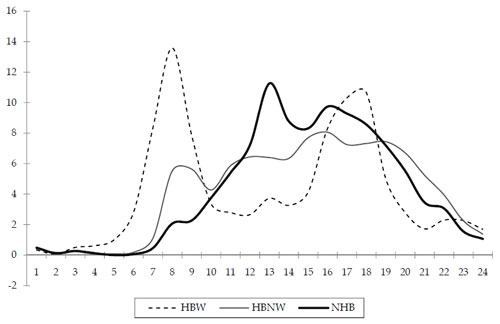

Time of Day
-----------

Many travel demand models have a time-of-day component.  It is typical for models to start by estimating daily travel.  In a four-step model, the trip generation model is typically applied to estimate average weekday trips.  In an activity-based model, one of the first steps is typically a daily activity pattern model, also for weekdays.

It is desirable for many reasons to estimate travel by time of day, including the need for temporally varying model outputs (for example, speeds by time of day for air quality conformity analysis) and to enhance model accuracy (shortest travel paths or transit service may vary between peak and off-peak periods).  To do this, daily travel measures are converted to measures by time of day at some point in the modeling process.  In most models, a discrete number of time periods are used.  Typically, a four-step model with time-of-day modeling uses three to five periods (for example, a.m. peak, mid-day, p.m. peak, evening) while an activity-based model uses more periods, often an hour or half hour (or shorter) in length.

It is important to consider how to determine the period in which a trip or half tour occurs, especially if it begins in one period and ends in another.  The three basic ways to assign a trip to a time period are:

1.  Based on the departure time;
2.  Based on the arrival time; and
3.  Based on the temporal midpoint of the trip.

The specific definition usually makes little difference in the percentages of trips occurring in each period, but the definition must be known in order to estimate and validate the model.

#### Fixed Factor Methods

The most common method of time-of-day modeling in four-step models is simple factoring.  At some point in the modeling process, fixed factors specific to trip purpose and direction are applied to daily trips to obtain trips for each time period.  While this method is relatively easy to implement and to apply, it is not sensitive to varying transportation levels of service, limiting its usefulness in analyzing policy changes or congestion management activities.

The ways in which fixed time-of-day factors may be applied within the four-step process ([29](#fn29)) are:

-   In **pre-distribution** application, the daily trips are factored between the trip generation and trip distribution steps of the model process.  The data required include factors representing the percentage of trips by purpose during each hour and for each direction, production-to-attraction or attraction-to-production as well as directional split factors.  It should be noted, however, that the directional split factors cannot be applied until after both ends of trips have been determined, i.e., after trip distribution.  An advantage of this method is that differences in travel characteristics by time of day can be considered in both trip distribution and mode choice.  In models with feedback loops, this method can provide a "clean" way to feed back travel times from one iteration to the next; trip distribution, mode choice, and trip assignment can be run separately for each time period, since the factors are applied prior to these steps.
-   In **post-distribution** application the factors are applied between the trip distribution and mode choice steps.  The data required for this approach to splitting includes factors representing the percentage of trips by purpose during each period and for each direction, production-to-attraction or attraction-to-production.  This process also provides an opportunity to consider that some trips are in the attraction-to-production direction and to use skims that reflect correct directionality.  However, the modeler should decide whether the additional complexity introduced by doing so is worthwhile.
-   In **post-mode choice** application, the factors are applied to daily trips between mode choice and the assignment steps.  The data required include factors representing the percentage of the trips by purpose and mode during each time period and for each direction, production-to-attraction or attraction-to-production.  An issue with this approach is that the transit path building procedures may not be consistent between mode choice and transit assignment, since mode choice would be done on a daily basis while transit assignment would be done by time period.
-   In **post-assignment** application, the factors are applied to loaded trips after the assignment step is complete.  The data required include factors that represent the percentage of daily traffic or transit ridership for each time period on a link and can also include directional split factors depending on how the link-level factor is represented.  The main limitation of this type of procedure is that equilibrium highway assignment on a daily basis is much less meaningful than assignment for shorter, more homogeneous periods.  Also, changes in land use that could affect temporal distribution of traffic are not considered when using fixed link-based factors.

#### Time-of-Day Choice Models

As mentioned above, a shortcoming of fixed factoring methods is that time-of-day choice is insensitive to transportation level of service.  There has been research into time-of-day choice models that include variables representing level of service, but their success when used with four-step models has been limited.  It is difficult to model time-of-day choice where individual trips are modeled independently of all other trips (for example, when the timing of the trip from work cannot be linked to the timing of the trip to work).

Tour- and activity-based models provide a much better way to understand temporal choices and the ways in which relationships between trips can affect these choices.  In modern activity-based models, time of day is modeled at a more disaggregate level, for periods of an hour or half hour (or even shorter), than for typical fixed factor models although these shorter periods are often aggregated to a smaller number of longer periods for trip assignment.  Time-of-day choice models can take advantage of a variety of person, household, and trip characteristics that affect time-of-day choice as well as information about entire tours or activity patterns.  For example, the time of travel to work is surely related to the time of travel home from work, and a tour-based model can use information on both directions of the tour in estimating time of day.

In these advanced models, time of day is estimated at the tour level, usually using a multinomial logit model.  Each alternative is a combination of the beginning and ending times, often defined as the start and end times for the primary activity of the tour.  This would imply that the combination of ARRIVAL time for the trip TO the primary activity and the DEPARTURE time for the trip FROM the primary activity is being modeled.  This type of model can have hundreds of alternatives.  In many models, the times of intermediate stops to and from the primary activity are also estimated, again using multinomial logit formulations.

#### Period to Hour Conversion Factors

It is customary to express capacity as a highway network attribute in terms of vehicles per hour.  In models where daily (weekday) travel is modeled without time-of-day considerations be modeling explicitly, it is necessary to attain consistency between the daily vehicle trip tables and the hourly capacity estimates when performing traffic assignment, since volume-capacity relationships are generally used to estimate travel times under congested conditions.  This is most commonly done using factors that can be applied to convert the hourly capacity to effective daily capacity (or, conversely, to convert daily trips to hourly trips, which is equivalent mathematically).  These factors consider that travel is not uniformly distributed throughout the day and that overnight travel demand is low.  The conversion factors are therefore often in the range of 8 to 12, as opposed to 24, which would be the theoretical maximum for an hourly to daily factor.

These conversion factors continue to be needed in models where time periods greater than one hour in length are used, but they convert the hourly capacity to the capacity for the appropriate time period.  For example, if an a.m. peak period is defined as 6:00 a.m. to 9:00 a.m., the conversion factor will convert hourly capacity to capacity for the three hour period.  It is still important to consider that travel is not uniformly distributed throughout the three hour period although it is likely to be more evenly distributed over a shorter time period, especially a peak period which is likely to be relatively congested throughout.  The theoretical maximum for the factor is the number of hours in the period (three, in this example), and in a period where there is roughly uniform congestion throughout the peak period, the factor could be close to 3.  Typical factors would range from 2 to 3.  The factors for longer off-peak periods would likely be well lower than the theoretical maximum.

### Sources of Data

The basic data required for estimating time-of-day models of any type are household survey data, specifically the reported beginning and ending times of activities, tours, and trips ([30](#fn30)). The survey data are processed for the specific type of model being estimated (fixed factor, logit, etc.) and are used separately by trip/tour purpose.  These survey data (in expanded form) are also valuable for time-of-day model validation although, as is the case anytime when the estimation data set is used for validation, the data must be used with caution.

For areas without local household survey data, factors from other sources, such as the National Household Travel Survey (NHTS) or NCHRP Report 365 or its update may be transferred.  However, as discussed below, time-of-day distributions vary significantly by area, and so significant checking is required when using transferred time-of-day data.

Diurnal travel distributions are typically represented as percentages (for hours or shorter periods) of the total daily travel by purpose, perhaps by mode. Figure 8.1 provides an example of diurnal distributions for three purposes:  home-based work (HBW), home-based nonwork (HBNW), and nonhome-based (NHB). However, while distributions such as those shown in Figure 8.1 are typical, they may vary significantly among urban areas that might be considered similar. Table 8.1 shows the percentage of daily travel by purpose occurring during two periods – 7:00 to 9:00 a.m. and 3:00 to 6:00 p.m. – for nine urban areas with populations of approximately 1 million according to the 2000 U.S. Census. While the averages presented in this table, based on data from the 2001 NHTS, have associated statistical error ranges not presented here, it is clear that the percentages for some areas differ significantly from those for other areas. For example, the reported percentage of daily home-based work travel between 3:00 and 6:00 p.m. was nearly twice as high in Providence as in Memphis.

Source:  NCHRP Report 365.

**Table 8.1  Time-of-Day Percentages for Urban Areas of Approximately 1 Million in Population**

City | HBW | HBW | HBNW | HBNW | NHB | NHB | All Trips | All Trips
--- | --- | --- | --- | --- | --- | --- | --- | ---
| 7-9 a.m. | 3-6 p.m. | 7-9 a.m. | 3-6 p.m. | 7-9 a.m. | 3-6 p.m. | 7-9 a.m. | 3-6 p.m.
Austin | 32.3% |	20.8% |	12.5%	| 23.8%	| 6.9% | 24.6% | 13.6%	| 23.7%
Buffalo | 23.7% |	26.7% |	9.3%	| 23.6%	| 5.9% | 23.6% | 9.7%	| 23.8%
Greensboro | 30.3% |	24.0% |	12.2%	| 25.6%	| 8.1% | 26.7% | 12.7%	| 25.8%
Jacksonville | 29.6% |	24.7% |	10.4%	| 24.4%	| 9.1% | 27.1% | 11.6%	| 25.3%
Hartford | 26.0% |	29.5% |	9.2%	| 25.3%	| 7.2% | 20.5% | 10.4%	| 24.3%
Memphis | 35.0% |	18.2% |	13.6%	| 25.6%	| 6.9% | 27.2% | 13.5%	| 25.4%
Nashville | 32.7% |	23.8% |	10.1%	| 24.9%	| 7.5% | 24.7% | 10.4%	| 24.7%
Providence | 28.9% |	33.7% |	11.8%	| 24.9%	| 7.9% | 16.3% | 11.8%	| 22.4%
Raleigh | 32.4% |	26.3% |	12.0%	| 26.5%	| 8.0% | 19.1% | 12.2%	| 24.0%
Average | 30.1% |	25.3% |	11.2%	| 25.0%	| 7.5% | 23.3% | 11.8%	| 24.4%

Source: 2001 National Household Travel Survey.

Besides survey data, the other main data source for validation of time-of-day models is traffic volume data by time of day.  These data can be disaggregated for the periods used in the model and can provide estimates of total demand by time period.  These data are useful for aggregate checks over all travel purposes (since the count data do not distinguish purposes).  The most useful checks using traffic count data are those done following trip assignment.  Transit ridership data provide a source for aggregate checks of the results of transit assignment by time of day.

### Aggregate Checks

The main aggregate checks for time-of-day models include person trip/activity percentages, traffic volume checks, transit boarding checks, and activity duration checks.

##### Person Trip/Activity Percentages

Modeled percentages of person trips or activities by purpose and time period may be compared to observed percentages obtained from the expanded household survey data.  This may be done by market segment to the extent segmentation is available in the model.  For example, in all models, segmentation by geographic subarea is possible since the zones or parcels representing trip end locations can be aggregated.  Geographic segmentation may use the same types of districts as used in trip distribution validation (see [Aggregate Checks (Distribution)](Model_Validation_and_Reasonableness_Checking_Distribution#Aggregate_Checks)).  Another possible segmentation variable is income level.  However, fixed time-of-day factors are usually not estimated separately by market segment.

For activity-based models, this type of check is performed by tour or activity purpose and includes both primary activities and intermediate stops on tours.  For tours, the checks should include comparisons of tour arrival times, departure times, and the combination of the two since they represent the alternatives in the model.

The logit time-of-day choice models used in activity-based models, which include a number of variables, may lend themselves more readily to validation and calibration by market segment.  These models typically include person- and/or household-level variables that could be used for segmentation and can also be checked using geographic segmentation.  It should be noted that since these models usually have more time periods, and for tours the combination of arrival and departure times must be validated, the observed data are stretched thinner.  The error ranges associated with the observed percentages will therefore be greater than those for longer, more aggregate periods.

It is worth discussing the use of data from the Census Transportation Planning Package (CTPP) in time-of-day model validation.  The CTPP data are relevant only for the home-based work purpose.  However, the American Community Survey (ACS), on which the CTPP data are based, asks, "What time did this person usually leave home to go to work LAST WEEK?"  This differs from what a time-of-day model for home-based work travel simulates.  For example, if every person in a particular market segment left for work at 7:00 a.m. four out of five times and at 8:00 a.m. the fifth time, the CTPP would record answers of 7:00 a.m. for all respondents, but the model would simulate 80 percent of the travelers leaving at 7:00 a.m. and 20 percent leaving at 8:00 a.m.  It is also important to note that ACS records only about trips to work, not home from work, the latter of which are also included in home-based work trips in four-step models.  This also means that the return times for work tours are not reported, and so the data are insufficient for validating tour-based time-of-day choice models.  The CTPP/ACS data also do not distinguish between trips made directly between home and work and those made with stops, which are often treated as more than one trip in four-step models.  Another important point to consider is that the ACS records departure time while the time-of-day model may measure arrival or midpoint time.

National data sources such as NHTS should be used only as general guidelines for checks of time-of-day percentages for person trips.  As the data in [Table 8.1](#Table-t8-1) showed, there is significant variation in temporal distributions of travel even among urban areas of similar size, and so calibrating factors for a specific area to match national distributions may be inaccurate.

##### Traffic Volume Checks

Following trip assignment, another source of data becomes available for validation, namely traffic count data.  Often, traffic count data are available at an hourly (or finer) level, which is usually less aggregate than the periods used in highway assignment.  It is usually not difficult, therefore, to aggregate count data to match the time periods used in highway assignment.

It is recommended that, even when highway assignment is done for separate time periods, the average daily assignment results (the sum of the assignment results for the various time periods) be validated and calibrated before any time-of-day validation is performed.  Once the daily modeled volumes have been validated, the volumes by time period can be checked.  While the values for the various guidelines may differ – for example, percentage root mean square errors would likely be higher for the lower peak period volumes than for daily volumes – the same basic checks performed for daily assignment results (see [Traffic Assignment Checks](Model_Validation_and_Reasonableness_Checking_Assignment#Traffic_Assignment_Checks)) are performed for each time period for which assignment is run.

Probably the first basic check for time-of-day assignments is total modeled vehicle miles traveled (VMT) by time period compared to observed VMT.  Assuming the daily assignment results have already been validated, it is easy to compare the percentage of daily modeled VMT occurring during each period to the observed percentages.  Other assignment checks that can be performed by time period include screenline volume checks and checks of volumes on key roadways.

##### Transit Boarding Checks

In a model with significant transit demand and a time-of-day model component, it is important to check the transit assignment results by time-of-day.  This is done by comparing the modeled unlinked transit trips by time period to observed boardings by time period.  Naturally, this assumes that transit ridership information by time-of-day is available.  As is the case with highway trips, it is best to first validate the daily transit assignment (as described in [Transit Assignment Checks](Model_Validation_and_Reasonableness_Checking_Assignment#Transit_Assignment_Checks)) before validating the transit assignment by time period.  The level of aggregation of transit routes for validation can be the same for time-of-day assignments as for daily assignments.

##### Activity Duration Checks

For activity-based models, the activity durations are implied by the modeled activity start and end times, or arrival and departure times.  These implied activity durations can be compared to the actual activity durations from the household survey data on an aggregate basis.  For example, the modeled versus observed activity durations can be compared by activity purpose, demographic segment, and/or geographic segment, depending on data availability.  This can be done for both primary activities and activities occurring at intermediate stops on tours.

### Disaggregate Checks

Disaggregate time-of-day model checks can be performed only for the logit time-of-day choice models usually associated with activity-based models.  Fixed factor methods are aggregate and cannot be checked disaggregately.

As discussed in [Disaggregate Checks (Mode Choice)](Model_Validation_and_Reasonableness_Checking_Mode_Choice#Disaggregate_Checks_(Mode_Choice)), logit models are disaggregately estimated, and therefore disaggregate validation is needed for logit time-of-day choice models, along with the aggregate checks described above.  Most urban area household travel surveys have such small sample sizes that the entire data set is needed for model estimation.  In most cases, therefore, there is no independent model estimation data set available for validation.

Limited disaggregate validation can be performed using the same data set used for model estimation, but reporting the results by market segment, using the "apply" function in the logit model estimation software. A logit time-of-day choice model could be applied to the data set used for estimation but the results may be reported by, for example, worker status.  It might be found, for example, that the model inaccurately estimates peak period shopping trips for part-time workers.

### Criteria Guidelines

While it is not difficult to statistically estimate error ranges or confidence intervals for time-of-day percentages, these values would vary significantly based on survey sample sizes and trip/activity purpose definitions.  It would be possible, though, to compute such intervals and determine whether modeled time-of-day percentages fall within an acceptable range (say a 90- percent confidence interval).  This has not been done often in practice, perhaps in part because in many cases the confidence intervals would be so large as to be essentially meaningless.  A similar issue arises for the comparison of modeled time percentages from assignment results to traffic or transit ridership counts.  The error ranges for an individual traffic count can be quite high compared to the value of the count itself.

Because there is no standard practice, no specific criteria guidelines for the aggregate checks described in [Disaggregate Checks](#Disaggregate_Checks) are presented. The modeler must judge whether the modeled percentages are "close enough," based on the statistical validity of the observed data and the need for accuracy in model results.

### Reasonableness and Sensitivity Testing

Some reasonableness checks for time-of-day models can be done.  It is logical for home-based work trips to have pronounced morning and evening peaks and for nonhome-based trips to have a mid-day peak.  When time-of-day factors or models are applied, the resulting split of home-based production-to-attraction trips and attraction-to-production trips should be even.  It might be reasonable, however, for the trips for individual home-based trip purposes to differ from a 50-50 split between directions.  For example, in most cases, there are more stops made on the way home from work, implying that there are likely more production-to-attraction trips than attraction-to-production trips.  However, this should be offset by a greater number of attraction-to-production trips for other home-based trip purposes.

Sensitivity testing is not relevant for fixed factor models, which, by their use of fixed factors, are insensitive to variables related to transportation level of service or household or person demographics.  Sensitivity testing can be performed for time-of-day choice models by varying model inputs and checking results for reasonableness.  Model inputs that can be varied include level of service variables used in the model (e.g., distance, delay) and demographic variables.  Some example tests include:

-   Increasing or decreasing travel times/delays for a specific time period or periods by a fixed percentage regionwide to determine the change in peak demand (this would represent "peak spreading" in the case of increased peak travel times); and
-   Reallocating the number of households or person by a specific input variable for a forecast year.

Due to a lack of experience, developing specific criteria guidelines for expected changes in temporal distribution patterns based on changes in input variables is difficult.  Once again, it is up to the experienced planner to determine whether the modeled changes are reasonable.

### Troubleshooting Strategies

The list below summarizes some of the issues that might be discovered during the validation checks described above and potential strategies to address them.

1. Modeled percentages of trips by purpose and time period poorly match observed survey data
   - For fixed factor models, recheck factor application in the model
   - Check for consistency between application data (trip tables) and estimation data (survey)
   - For time-of-day choice models, recalibrate time period constants
2. Modeled percentages of assigned trips by time period poorly match independent observed data (traffic/transit counts)
   - For fixed factor models, consider revising factors to achieve a better match
   - For time-of-day choice models, if issues are regionwide, consider recalibrating time period constants or other parameters
   - For time-of-day choice models, if issues are mode-specific, consider revisions to mode-specific parameters
3. Model results by geography or socioeconomic strata differ from percentages based on expanded household survey data
   - For fixed factor models, consider whether factors could be varied by geography or other appropriate market segment
   - For time-of-day choice models, consider adding segmentation variables or calibrating coefficients for existing variables

### Forecasting Checks

The basic forecasting checks for time-of-day models are comparisons between percentages of travel by time of day between the base and forecast years.  All of the checks discussed in [Aggregate Checks](#Aggregate_Checks) can be performed comparing the base and forecast year scenarios.

The comparisons are not likely to show much useful information for fixed factor models.  The percentages of person trips by purpose for each time period are fixed and therefore must be equal for all scenarios.  The percentages of total travel across purposes, including person trips and assigned vehicle and transit trips, may vary between the base and forecast years since the distribution of daily trips among trip purposes may differ, due to land use and demographic changes.  These differences in the temporal distribution of overall travel can be checked for reasonableness, but the differences are likely to be small.

A potential problem in areas of high growth is that forecasted peak demand may exceed capacity in some locations.  Since fixed factor models do not provide a direct way to consider peak spreading, the highway assignment may result in some roadways being assigned volumes well over capacity.  If these results are too unrealistic, it may be necessary to address peak spreading using a post processor that reallocates trips from peak to off-peak periods.  It is important, however, to consider that unrealistically high levels of congestion in forecasts may be due to other issues with the model, such as network coding problems, highway assignment parameters, or issues with feedback procedures.

For time-of-day choice models, the aggregate checks discussed above (for tours and trips as appropriate), plus checks of activity durations, should be performed comparing the base and forecast years.  Because these models should be sensitive to levels of congestion, peak spreading may be revealed by these comparisons.  A good reasonableness check would be to see if peak spreading has occurred in very congested locations, and that little change has occurred in uncongested areas.  When doing these checks, however, care should be taken to consider changes in temporal distributions that may be due to other variables, such as person and household demographics.  Perhaps the simplest way to consider the results of the comparisons for time-of-day choice models would be to discover an explanation for significant changes in temporal distribution, whether it is due to changes in demographics, levels of congestion, or other variables.

------------------------------------------------------------------------

  29 Time-of-Day Modeling Procedures State-of-the-Art, State-of-the-Practice, TMIP, U.S. Department of Transportation, October 1997, Page ES-3.

  30 An exception is for post-assignment techniques, where diurnal distributions of traffic volumes and/or transit riders by time of day are used.

------------------------------------------------------------------------
