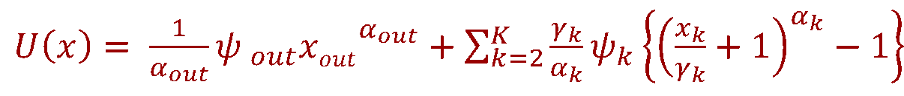
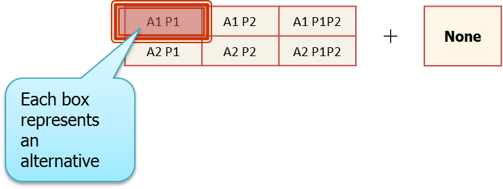

Introduction
------------

The field of travel modeling is characterized by the need to predict choices that people exercise with respect to their activity-travel patterns, residential and work location choices, and vehicle ownership. Discrete choice models, such as the multinomial logit model, nested logit model, and the ordered probit model, are often used to predict the alternative that an individual will choose from among a choice set of alternatives. In situations where a continuous budget is allocated to different alternatives, the fractional split or amount allocated to each alternative may be modeled using a fractional logit model. In many instances, however, individuals are faced with choices that involve multiple discrete alternatives with each alternative consumed to a different extent. In such cases, individuals choose one or more alternatives from the choice set and then consume each of the alternatives chosen to a different degree. Thus there is multiple discreteness in the choice process, with a continuous dimension defined by the amount of consumption. Because the fractional logit model does not quite accommodate multiple discreteness and does not adequately handle corner solutions where some alternatives are not chosen or consumed at all, a need arose for a multiple discrete-continuous choice model that is computationally tractable. Such choice phenomena cannot be modeled using traditional single discrete choice models because the number of mutually exclusive composite alternatives explodes as the number of alternatives in the choice set becomes large. The multiple discrete-continuous extreme value (MDCEV) model was developed by Bhat (2005, 2008) to address this need and the model has become quite popular as the modeling methodology of choice when dealing with multiple discrete-continuous choice phenomena. The methodology offers appealing behavioral features, a closed form expression for the likelihood function, and computational tractability that are all contributing to its increased application in models in practice. This page describes the basic formulation, structure, and estimation of the MDCEV model.

Utility Formulation
-------------------

The functional form of the utility function for the MDCEV model is as follows (Bhat, 2008):

where

*ψ*~*k*~ represents the baseline utility

*α*~*k*~ accounts for satiation effects (diminishing marginal utility)

*γ*~*k*~ governs the level of satiation and also enables corner solutions

*x*~*k*~ is the consumption quantity of alternative *k*

The choice-maker is assumed to consume a bundle of alternatives to maximize the random utility function given by the equation above subject to a linear budget constraint wherein the budget allocated to each alternative, *t*~*k*~, satisfies the condition:

where

*T* is the total budget

*t*~*k*~ = *p*~*k*~*x*~*k*~, where *p*~*k*~ is the unit price of a good.

The Lagrangian function for obtaining optimal budget allocations may be written as follows (Bhat, 2008):

The Kuhn-Tucker first order conditions to solve the Lagrangian are as follows:

Bhat (2008) specified the independently and identically distributed (iid) extreme value error structures and derived the MDCEV model probabilities where an individual consumes and allocates the available budget to the first M of the K available alternatives as:

where

*t\**~*k*~ is the optimal budget allocated to alternative *k*

*σ* is the scale parameter

The Jacobian (|J|) for the case of no price variation across alternatives is:

The probability expression shown above collapses to a standard multinomial logit model probability expression in the special case where an individual chooses only one alternative and dedicates the entire continuous budget to that single alternative (*M*=1), diminishing marginal utility is ignored (*α*~*k*~=1 for all *k*), and the Jacobian (continuous component) drops out because the entire budget is allocated to one good.

Behavioral Aspects and Role of Parameters
-----------------------------------------

The utility formulation of the MDCEV model incorporates a number of appealing behavioral features by virtue of the role and interpretation of different parameters in the utility function. The parameters may be described as follows:

The **baseline utility** (*ψ*~*k*~) represents the marginal utility at the point of zero consumption. For goods with the same unit prices, a higher value of *ψ*~*k*~ for a good implies that an individual will increase his or her overall utility by consuming more of good k relative other goods.

The **translation parameter** (*γ*~*k*~) allows for both interior and corner solutions, with corner solutions accommodating the possibility that one or more alternatives may not be consumed or chosen at all by an individual. It also serves as a linear satiation parameter. A higher value of *γ*~*k*~ implies a lower satiation effect, and hence a higher amount of consumption of good *k*.

The **satiation parameter** (*α*~*k*~) accounts for diminishing marginal utility with increasing consumption of good k. Lower values of *α*~*k*~ imply a higher rate of satiation and hence a lower amount of consumption of good *k*.

The **baseline utility** (*ψ*~*k*~), the **translation parameter** (*γ*~*k*~), and the **satiation parameter** (*α*~*k*~) can be further parameterized to reflect the impacts of observed and unobserved attributes on various behavioral aspects defining the choice phenomenon under investigation. To reflect the effects of socio-economic, built environment, and other explanatory variables on the multiple discrete-continuous choice variable of interest, the baseline utility (*ψ*~*k*~) is parameterized according to the following functional form:

where

*z*~*k*~ is a set of attributes characterizing the alternative *k*

*ε*~*k*~ is an idiosyncratic error term capturing the influence of random unobserved attributes.

The MDCEV Model With and Without an Outside Good
------------------------------------------------

There are two versions of the MDCEV model. The versions are as follows:

-   MDCEV model with no outside good
-   MDCEV model with outside good

An outside good is an alternative that every individual in the sample or population of interest consumes. While other alternatives in the choice set may not necessarily be chosen by 100 percent of the sample, an outside good is one that is chosen by every member of the sample or population of interest. If the choice set includes such an alternative, then the MDCEV model with the presence of an outside good should be estimated. If every alternative in the choice set has at least one observation that did not choose it, then the MDCEV model with no outside good should be estimated. The two versions of the model result in differences in the model formulation. While the formulation presented in the earlier section corresponds to that of the MDCEV model with no outside good, the following depicts the utility formulation in the case where an outside good is present.

where

*ψ*~*out*~ represents the baseline utility of the outside good

*α*~*out*~ represents satiation effects (diminishing marginal utility) for the outside good

*x*~*out*~ is the consumption quantity of the outside good

Alternative Configurations (Profiles) of the MDCEV Model
--------------------------------------------------------

There are several configurations of the MDCEV model based on the specification used and the parameters that are fixed for identification purposes. It should be recalled that both α (satiation parameter) and γ (translation parameter) capture satiation effects, i.e., diminishing marginal utility with increasing consumption. Because both of these parameters are related to measuring satiation, identification issues arise; the parameters cannot be uniquely and separately identified and estimated. Hence, one of the two parameters needs to be fixed in order to estimate a behaviorally robust MDCEV model that can be interpreted clearly.

For the "no-outside good" case, the following configurations may be specified:

-   Config = 1: Separate α values are estimated for all goods, and γ values are constrained to be equal to 1 for all alternatives
-   Config = 4: The α values are fixed to be equal to zero for all goods, and separate γ values are estimated for all alternatives
-   Config = 7: The α values are fixed to be equal to zero for all goods, and γ values for all goods are constrained to be equal to 1

The table below shows the formulation of the MDCEV model with no outside good for the three different configurations described above.

For the MDCEV model with outside good, there is no translation parameter (γ) for the outside good because it is consumed by everybody (no corner solution needed for the outside good). Then, the following configurations may be specified:

-   Config = 1: Separate α values are estimated for all goods, including the outside good. The γ values for all goods (except the outside good) are constrained to be equal to 1.
-   Config = 4: The α values of all goods (including the outside good) are fixed to be equal to zero, and separate γ values are estimated for all goods (except the outside good).
-   Config = 5: The α values of all goods (including the outside good) are constrained to be equal and estimated, and separate γ values are estimated for all goods (except the outside good).
-   Config = 6: The α value is estimated for the outside good, α values for all other goods are fixed to be equal to zero, and separate γ values are estimated for all goods (except the outside good).
-   Config = 7: The α values of all goods (including the outside good) are fixed to be equal to zero, and γ values of all goods (except the outside good) are constrained to be equal to 1.

The table below summarizes the utility specifications for the different configurations of the MDCEV model with an outside good.

Illustration of the Computational Efficiency Provided by the MDCEV Model
------------------------------------------------------------------------

The MDCEV model offers considerable gains in computational efficiency in the context of modeling behavioral phenomena where multiple alternatives may be chosen and consumed to different extents. In conventional discrete choice frameworks, the need to generate mutually exclusive alternatives results in an explosion in the number of alternatives - especially when the number of choice options is large. The following is an example that illustrates the tremendous gains in computational efficiency and choice set representation that the MDCEV model may offer.

Consider activity engagement patterns of households members. Individuals in a household may engage in activities alone or jointly with other household members. In addition, they may engage in different activity purposes (again, either alone or with others in the household). Consider a simple example of a two-member household (persons P1 and P2) with two possible activity purposes or types (activities A1 and A2). The total number of possible alternatives (representing household activity engagement patterns) is 64, as shown in the figure below (Source: Bhat).

This exhaustive enumeration of all possible combinations of choice alternatives leads to the explosion of the size of the choice set in the traditional discrete choice model. The MDCEV, on the other hand, allows households to select and consume multiple alternatives in the choice set. Hence, it is sufficient to represent the choice set as shown below for the MDCEV model. Households can choose multiple options and consume any combination, thus representing the full range of possible activity patterns that a household may adopt (Source: Bhat).

It can be seen that, whereas the traditional discrete choice model would have required the identification and exhaustive enumeration of 64 possible alternatives, the MDCEV model is able to capture the behavioral phenomenon of interest with just 7 alternatives. The gain in efficiency in representation of choice sets becomes far more dramatic as the number of household members and the number of activity types increases. For example, even if a simple case of 4 household members and 3 activity types, the traditional discrete choice model would entail the exhaustive enumeration of 3.52 x 10^13^ alternatives! The corresponding number for the MDCEV model is just 45.

Application of the MDCEV Model in Forecasting Mode
--------------------------------------------------

The MDCEV model may be applied in forecasting mode to predict choices and consumption patterns under a wide range of scenarios in future years. The estimation of the MDCEV model is generally more straightforward than its application in forecasting mode. The application of the MDCEV model for a forecast year requires the prediction of a total budget to be allocated among the chosen discrete alternatives. While the budget is generally available from observed survey data in estimation mode, the budget is not available for a future year. For example, the total household mileage or total time spent outside the home may be treated as budget values. However, these values are not available for a future year and must be estimated. Hence, it is necessary to combine the MDCEV model with a budget prediction model. Because budgets are continuous quantities, linear regression or log-linear regression or polynomial regression modeling techniques may be used to model budget quantities. More recently, Pinjari et al (2016) show how the stochastic frontier modeling methodology may offer a more flexible means of calculating budget because it incorporates a buffer that allows consumption to increase even if the stochastic frontier budget remains constant.

The MDCEV model may be applied in forecasting mode using the computationally efficient forecasting algorithms developed by Pinjari and Bhat (2011). The algorithms take advantage of the properties of the model to predict consumption quantities using analytical expressions that can be computed without the need for iterative procedures. Even in the case of more general utility forms that fall within the class of additively separable utility functions, the methodology may be applied in an iterative fashion to forecast consumption quantities.

Extensions of the MDCEV Model
-----------------------------

Similar to the traditional multinomial logit model, a number of extensions and advances have been made to the basic MDCEV model formulation. Bhat (2008) presents the formulation for a Mixed MDCEV model. The basic MDCEV model does not accommodate random taste variations and assumes a single equal scale parameter for the error terms. In the Mixed MDCEV (MMDCEV) model, the error term is assumed to comprise two components. The first component is independently and identically distributed (iid) according to the Gumbel distribution with a constant scale parameter, σ, while, the second component is allowed to be correlated across alternatives and has a heteroscedastic scale. Moreover, it is assumed to follow a multivariate normal distribution, leading to the mixing of distributions. In addition, random taste variations may be introduced through the use of random coefficients on the independent variables as well as the satiation and translation parameters. Another extension of the MDCEV model that accounts for correlated alternatives is the nested version of the MDCEV model that is dubbed the multiple discrete-continuous nested extreme value (MDCNEV) model (PInjari and Bhat, 2010). The model allows correlations among alternatives within mutually exclusive subsets or nests of alternatives.

Just as the multinomial probit (MNP) model offers considerable flexibility over the traditional multinomial logit (MNL) model, but is more computationally challenging to estimate, the multiple discrete-continuous probit (MDCP) model offers considerable flexibility over the simple MDCEV model. By assuming a multivariate normal distribution for the random error terms of the utility functions of the alternatives, the MDCP model is able to account for correlated alternatives and random taste variations. It is computationally more challenging to estimate a MDCP model due to the need to evaluate multidimensional integrals of the multivariate normal distribution. Bhat et al (2013) present the formulation of the MDCP model and, more importantly, demonstrate the computational efficiency and the efficacy of the maximum approximate composite marginal likelihood (MACML) approach in estimating model parameters.

The MDCEV model and its extensions have offered behaviorally and econometrically robust methods to model multiple discrete-continuous choice phenomena, leading to a surge in the use of this approach in both research and practice.

Availability of Code/Software to Estimate and Apply the MDCEV Model
-------------------------------------------------------------------

A number of codes have been developed to estimate the MDCEV model and its variants. Gauss codes to estimate MDCEV models with and without outside good have been developed and made available by Bhat at The University of Texas at Austin [1](http://www.caee.utexas.edu/prof/bhat/CodeRepository/MDCEV.html). Gauss codes to apply the MDCEV model in forecasting mode are also available [2](http://www.caee.utexas.edu/prof/bhat/CodeRepository/MDCEV_Forecasting.html). The Mobility Analytics Research Group (MARG) at Arizona State University translated these Gauss codes into R and made them available to the community online [3](http://www.mobilityanalytics.org/r-codes-for-travel-modeling.html). Code to estimate MDCEV models has also been developed for PythonBiogeme [4](https://groups.yahoo.com/neo/groups/biogeme/conversations/topics/1680).

Code is also available to estimate extensions of the MDCEV model. Gauss code has been prepared and made available by Pinjari to estimate a nested version of the MDCEV model, called the Multiple Discrete-Continuous Nested Extreme Value (MDCNEV) model [5](https://abdulpinjari.weebly.com/uploads/9/6/7/8/9678119/mdcnev_estimation_code_data.zip). Another extension that involves the use of the normal distribution to represent the random error term distributions as opposed to the extreme value distribution, referred to as the Multiple Discrete-Continuous Probit (MDCP) model, may be estimated using Gauss code made available by Bhat [6](http://www.caee.utexas.edu/prof/bhat/CodeRepository/MDCP.html).

Development of a New "True" MDCEV Formulation
---------------------------------------------

At about the 10 year anniversary of his original formulation and detailed presentation of the MDCEV model (Bhat, 2008), Bhat presented a new "true" MDCEV formulation (Bhat, 2017) that addressed some of the issues associated with the original MDCEV formulation. The original formulation of the MDCEV model tightly couples the decisions related to the choice of discrete alternatives and the continuous consumption quantities. As a result, the classic MDCEV model generally estimates the continuous consumption quantities well, but not the discrete choice decisions. An increase in the probability of choosing a discrete alternative is simultaneously associated with an increase in the consumption quantity for that alternative, which may not necessarily hold true in all choice contexts - leading to potentially erroneous forecasts. Bhat (2017) suggests that the original MDCEV model formulation is likely better characterized as a multiple continuous (MC) model because it estimates the continuous consumption quantity accurately at the expense of the discrete alternatives. Moreover, the classic MDCEV model does not offer a mechanism to just predict the choice of multiple discrete alternatives from a choice set without the need for information about continuous consumption quantities. The new formulation offers this ability, thus eliminating the need for data about a continuous budget and its allocation among multiple alternatives in the choice set. In the new robust and flexible "true" MDCEV model, Bhat (2017) uses a linear utility function for the first outside good and employs separate baseline utilities for the discrete and continuous consumption decisions. The model is applied to predicting activity and time use patterns of individuals, and found to offer superior predictions for both discrete and continuous choice decisions over the earlier MDCEV model.

References
==========

Bhat, C.R. (2005) A multiple discrete-continuous extreme value model: formulation and application to discretionary time-use decisions. Transportation Research Part B, 39(8), pp. 679-707. [7](http://www.sciencedirect.com/science/article/pii/S0191261504001274)

Bhat, C.R. (2008) The multiple discrete-continuous extreme value (MDCEV) model: role of utility function parameters, identification considerations, and model extensions. Transportation Research Part B, 42(3), pp. 274-303. [8](https://www.sciencedirect.com/science/article/pii/S0191261507000677)

Bhat, C.R., M. Castro, and M. Khan (2013) A New Estimation Approach for the Multiple Discrete-Continuous Probit (MDCP) Choice Model. Transportation Research Part B, Vol. 55, pp. 1-22. [9](https://www.sciencedirect.com/science/article/pii/S0191261513000738)

Bhat, C.R. (2017) A "True" Multiple Discrete-Continuous Extreme Value (MDCEV) Choice Model, Technical paper, Department of Civil, Architectural and Environmental Engineering, The University of Texas at Austin, Austin, TX. [10](http://www.caee.utexas.edu/prof/bhat/ABSTRACTS/New_MDCEV.pdf)

​Pinjari A.R. and C.R. Bhat (2010) A Multiple Discrete-Continuous Nested Extreme Value (MDCNEV) Model: Formulation and Application to Non-worker Activity Time-use and Timing Behavior on Weekdays. Transportation Research Part B, 44(4), 562-583. [11](http://www.sciencedirect.com/science/article/pii/S019126150900099X)

Pinjari, A.R. and C.R. Bhat (2011) Computationally Efficient Forecasting Procedures for Kuhn-Tucker Consumer Demand Model Systems: Application to Residential Energy Consumption Analysis. Technical paper, Department of Civil & Environmental Engineering, University of South Florida, Tampa, FL. [12](http://www.caee.utexas.edu/prof/bhat/ABSTRACTS/Pinjari_Bhat_MDCEV_Forecasting_July21_2011.pdf)

Pinjari, A.R., B, Augstin, A. Faghih Imani, V. Sivaraman, N. Eluru, and R.M. Pendyala (2016). Stochastic Frontier Estimation of Budgets for Kuhn-Tucker Demand Systems: Application to Activity Time-Use Analysis. Transportation Research Part A: Policy and Practice, Vol. 88, 117-133. [13](https://www.sciencedirect.com/science/article/pii/S0965856416302567)

