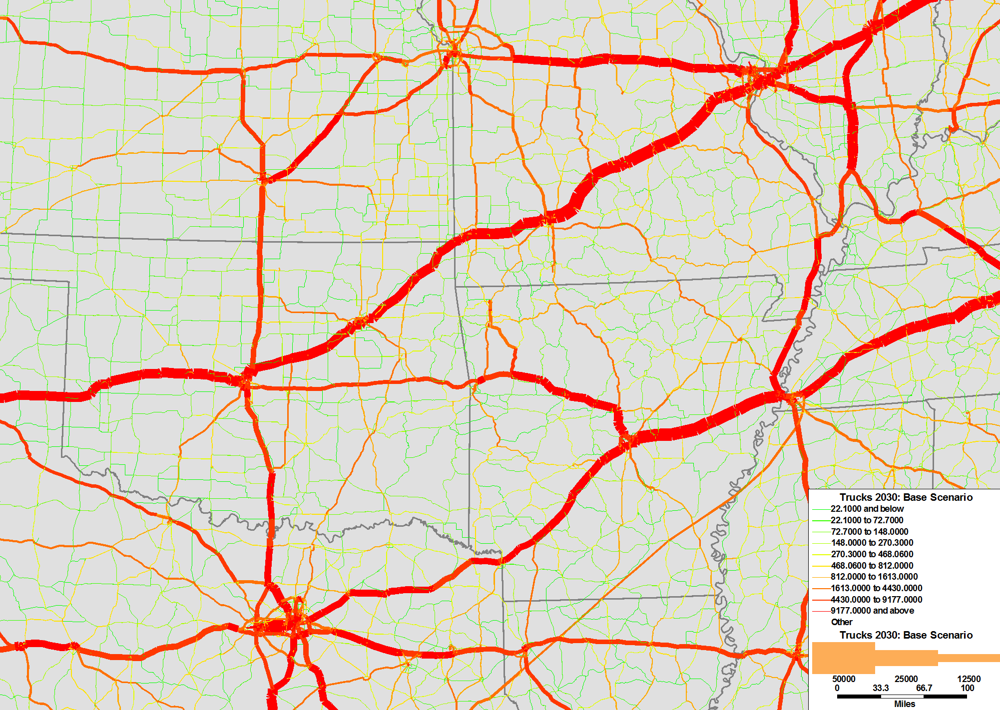

<PagesInCategory category="Network Assignment" />

What is Network Assignment?
---------------------------

In the metropolitan transportation planning and analysis, the network assignment specifically involves estimating travelers’ route choice behavior when travel destinations and mode of travel are known. Origin-destination travel demand are assigned to a transportation network in order to estimate traffic flows and network travel conditions such as travel time. These estimated outputs from network assignment are compared against observed data such as traffic counts for [model validation](Model_Validation_and_Reasonableness_Checking_Assignment).

Network assignment is a mathematical problem which is solved by a solution algorithm through the use of computer. It is usually resolved as a travel cost optimization problem for each origin-destination pair on a model network. For every origin-destination pair, a path is selected that typically minimizes travel costs. The simplest kind of travel cost is travel time from beginning to end of the trip. A more complex form of travel cost, called generalized cost, may include combinations of other costs of travel such as toll cost and auto operating cost on highway networks. Transit networks may include within generalized cost weights to emphasize out-of-vehicle time and penalties to represent onerous tasks. Usually, monetary costs of travel, such as tolls and fares, are converted to time equivalent based on an estimated value of time. The shortest path is found using a [path finding algorithm](Path_Finding_Algorithm).

The surface [transportation network](Transportation_Networks) can include the auto network, bus network, passenger rail network, bicycle network, pedestrian network, freight rail network, and truck network. Traditionally, passenger modes are handled separately from vehicular modes. For example, trucks and passenger cars may be assigned to the same network, but bus riders often are assigned to a separate transit network, even though buses travel over roads. Computing traffic volume on any of these networks first requires estimating network specific origin-destination demand. In metropolitan transportation planning practice in the United States, the most common network assignments employed are automobile, truck, bus, and passenger rail. Bicycle, pedestrian, and freight rail network assignments are not as frequently practiced.

Role of Network Assignment in Travel Forecasting
------------------------------------------------

The urban travel forecasting process is analyzed within the context of four decision choices:

-   Personal Daily Activity
-   Locations to Perform those Activities
-   Mode of Travel to Activity Locations, and
-   Travel Route to the Activity Locations.

Usually, these four decision choices are named as [Trip Generation](Trip_Generation), [Trip Distribution](Spatial_Interaction_Models), [Mode Choice](Mode_Choice), and Traffic Assignment. There are variations in techniques on how these travel decision choices are modeled both in practice and in research. Generalized cost, which is typically in units of time and is an output of the [path-choice step](Path_Finding_Algorithm) of the network assignment process, is the single most important travel input to other travel decision choices, such as where to travel and by which mode. Thus, the whole urban travel forecasting process relies heavily on network assignment. Generalized cost is also a major factor in [predicting socio-demographic](Land_Use_Transport_Modeling) and [spatial](Spatial_Data) changes. To ensure consistency in generalized cost between all travel model components in a congested network, travel cost may be fed back to the earlier steps in the model chain. Such feedback is considered “best practice” for urban regional models. Outputs from network assignment are also inputs for estimating mobile source emissions as part of a review of metropolitan area transportation plans, a requirement under the Clean Air Act Amendments of 1990 for areas not in attainment of the National Ambient Air Quality Standard.

A roadway transportation network in the assignment is represented by a set of links and nodes. A link represents a segment of roadway and includes physical characteristics such as estimated capacity, posted speed limit, distance, and number of lanes. A node represents the starting or ending points of a link. A node can be shared between multiple links and therefore represents connectivity between links. This concept is extended to public transit networks, where links represent a segment of a bus or rail line and nodes represent stop or stations.

Overview of Methods for Traffic Assignment for Highways
-------------------------------------------------------

This topic deals principally with an overview of static traffic assignment. The [dynamic traffic assignment](Dynamic_Traffic_Assignment) is discussed elsewhere.

There are a large number of traffic assignment methods, but they all have at their core a procedure called “all-or-nothing” (AON) traffic assignment. All-or-nothing traffic assignment places all trips between an origin and destination on the shortest path between that origin and destination and no trips on any other possible path (compare [path finding algorithm](Path_Finding_Algorithm) for a step-by-step introduction). Shortest paths may be determined by a well-known algorithm by Dijkstra; however, when there are turn penalties in the network a different algorithm, called [Vine building](vine_building), must be used instead.

All-or-nothing Assignments
--------------------------

The simplest assignment algorithm is the all-or-nothing traffic assignment. In this algorithm, flows from every origin to every destination are assigned using the [path finding algorithm](Path_Finding_Algorithm), and travel time remains unchanged regardless of travel volumes.

All-or-nothing traffic assignment may be used when delays are unimportant for a network. Another alternative to the user-equilibrium technique is the [stochastic traffic assignment](Stochastic_Traffic_Assignment) technique, which assumes variation in link level travel time.

One of the earliest, computationally efficient stochastic traffic assignment algorithms was developed by Robert Dial.[^1] More recently the k-shortest paths algorithm has gained popularity.

The biggest disadvantage of the all-or-nothing assignment and the stochastic assignment is that congestion cannot be considered. In uncongested networks, these algorithms are very useful. In congested conditions, however, these algorithm miss that some travelers would change routes to avoid congestion.

Incremental assignment
----------------------

The incremental assignment method is the simplest way to (somewhat rudimentary) consider congestion. In this method, a certain share of all trips (such as half of all trips) is assigned to the network. Then, travel times are recalculated using a [volume-delay function](Delay_Estimation_in_Trip_Based_Models), or VDF. Next, a smaller share (such as 25% of all trips) is assigned based using the revised travel times. Using the demand of 50% + 25%, travel times are recalculated again. Next, another smaller share of trips (such as 10% of all trips) is assigned using the latest travel times.

A large benefit of the incremental assignment is model runtime. Usually, flows are assigned within 5 to 10 iterations. Most user-equilibrium assignment methods (see below) require dozens of iterations, which increases the runtime proportionally.

In the incremental assignment, the first share of trips is assigned based on free-flow conditions. Following iterations see some congestion, on only the very last trip to be assigned will consider true congestion levels. This is reasonable for lightly congested networks, as a large number of travelers could travel at free-flow speed.

The incremental assignment works unsatisfactorily in heavily congested networks, as even 50% of the travel demand may lead to congestion on selected roads. The incremental assignment will miss the fact that a portion of the 50% is likely to select different routes.

Brief History of Traffic Equilibrium Concepts
---------------------------------------------

Traffic assignment theory today largely traces its origins to a single principle of “user equilibrium” by Wardrop [^2] in 1952. Wardrop’s “first” principle simply states (slightly paraphrased) that at equilibrium not a single driver may change paths without incurring a greater travel [impedance](Impedance). That is, any used path between an origin and destination must have a shortest travel time between the origin and destination, and all other paths must have a greater travel impedance. There may be multiple paths between an origin and destination with the same shortest travel impedance, and all of these paths may be used.

Prior to the early 1970’s there were many algorithms that attempted to solve for Wardrop’s user equilibrium on large networks. All of these algorithms failed because they either did not converge properly or they were too slow computationally. The first algorithm to be able to consistently find a correct user equilibrium on a large traffic network was conceived by a research group at Northwestern University (LeBlanc, Morlok and Pierskalla) in 1973. [^3] This algorithm was called “Frank-Wolfe decomposition” after the name of a more general optimization technique that was adapted, and it found the minimum of an “objective function” that came directly from theory attributed to Beckmann from 1956.[^4] The Frank-Wolfe decomposition formulation was extended to the combined distribution/assignment problem by Evans in 1974.[^5]

A lack of extensibility of these algorithms to more realistic traffic assignments prompted model developers to seek more general methods of traffic assignment. A major development of the 1980s was a realization that user equilibrium traffic assignment is a “variational inequality” and not a minimization problem.[^6] An algorithm called the method of successive averages (MSA) has become a popular replacement for Frank-Wolfe decomposition because of MSA’s ability to handle very complicated relations between speed and volume and to handle the combined distribution/mode-split/assignment problem. The convergence properties of MSA were proven for elementary traffic assignments by Powell and Sheffi and in 1982.[^7] MSA is known to be slower on elementary traffic assignment problems than Frank-Wolfe decomposition, although MSA can solve a wider range of traffic assignment formulations allowing for greater realism.

A number of enhancements to the overall theme of Wardop’s first principle have been implemented in various software packages. These enhancements include: faster algorithms for elementary traffic assignments, stochastic multiple paths, OD table spatial disaggregation and multiple vehicle classes.

Calculating Generalized Costs from Delays
-----------------------------------------

Equilibrium traffic assignment needs a method (or series of methods) for calculating [impedances](Impedance) (which is another term for generalized costs) on all links (and nodes) of the network, considering how those links (and nodes) were loaded with traffic. Elementary traffic assignments rely on [volume-delay functions](Delay_Estimation_in_Trip_Based_Models) (VDFs), such as the well-known “BPR curve” (see NCHRP Report 365),[^8] that expressed travel time as a function of link volume and link capacity. The 1985 US Highway Capacity Manual (and later editions through 2010) made it clear to transportation planners that delays on large portions of urban networks occur mainly at intersections, which are nodes on a network, and that the delay on any given intersection approach relates to what is happening on all other approaches. VDFs are not suitable for situations where there is conflicting and opposing traffic that affects delays. Software for implementing trip-based models are now incorporating more sophisticated delay relationships from the Highway Capacity Manual and other sources, although many MPO forecasting models still use VDFs, exclusively.

Challenges for Highway Traffic Assignment
-----------------------------------------

Numerous practical and theoretical inadequacies pertaining to Static User Equilibrium network assignment technique are reported in the literature. Among them, most widely noted concerns and challenges are:

-   Inadequate network convergence;
-   Continued use of legacy slow convergent network algorithm, despite availability of faster solution methods and computers;
-   Non-unique route flows and link flows for multi-class assignments and for assignment on networks that include delays from opposing and conflicting traffic;
-   Continued use of [VDFs](Delay_Estimation_in_Trip_Based_Models), when superior delay estimation techniques are available;
-   Unlikeness of a steady-state network condition;
-   Impractical assumption that all drivers have flawless route information and are acting without bias;
-   Every driver travels at the same congested speed, no vehicle traveling on the same link overtakes another vehicle;
-   Oncoming traffic does not affect traffic flows;
-   Interruptions, such as accidents or inclement weather, are not represented;
-   Traffic does not form queues;
-   Continued use of multi-hour time periods, when finer temporal detail gives better estimates of delay and path choice.

Transit Assignment
------------------

Most [transit network assignment](Transit_Network_Assignment) in implementation is allocation of known transit network specific demand based on routes, vehicle frequency, stop location, transfer point location and running times. Transit assignments are not equilibrium, but can be either all-or-nothing or stochastic. Algorithms often use complicated expressions of generalized cost which include the different effects of waiting time, transfer time, walking time (for both access and egress), riding time and fare structures. Estimated transit travel time is not directly dependent on transit passenger volume on routes and at stations (unlike estimated highway travel times, which are dependent on vehicular volumes on roads and at intersection). The possibility of many choices available to riders, such as modes of access to transit and overlaps in services between transit lines for a portion of trip segments, add further complexity to these problems.

Latest Developments
-------------------

With the increased emphasis on assessment of travel demand management strategies in the US, there have been some notable increases in the implementation of [disaggregated modeling](Activity_Based_Models) of individual travel demand behavior. Similar efforts to simulate travel route choice on dynamic transportation network have been proposed, primarily to support the much needed realistic representation of time and duration of roadway congestion. Successful examples of a shift in the network assignment paradigm to include [dynamic traffic assignment](Dynamic_Traffic_Assignment) on a larger network have emerged in practice. Dynamic traffic assignments are able to follow UE principles. An even newer topic is the incorporation of travel time reliability into path building.

References
----------

[^1]: Dial , Robert Barkley, Probabilistic Assignment; a Multipath Traffic Assignment Model Which Obviates Path Enumeration, Thesis (Ph.D.), University of Washington, 1971.

[^2]: Wardrop, J. C., Some Theoretical Aspects of Road Traffic Research, Proceedings, Institution of Civil Engineers Part 2, 9, pp. 325–378. 1952.

[^3]: LeBlanc, Larry J., Morlok, Edward K., Pierskalla, William P., An Efficient Approach to Solving the Road Network Equilibrium Traffic Assignment Problem, Transportation Research 9, 1975, 9, 309–318.

[^4]: Beckmann, M. J., McGuire, C. B. and Winsten, C. B., Studies in the Economics of Transportation, Yale University Press, New Haven, Connecticut. 1956, (full text: <http://cowles.econ.yale.edu/archive/reprints/specpub-BMW.pdf>)

[^5]: Evans, Suzanne P., Derivation and Analysis of Some Models for Combining Trip Distribution and Assignment, Transportation Research, Vol 10, pp 37–57 1976.

[^6]: Dafermos, S.C., Traffic Equilibrium and Variational Inequalities, Transportation Science 14, 1980, pp. 42-54.

[^7]: Powell, Warren B. and Sheffi, Yosef, The Convergence of Equilibrium Algorithms with Predetermined Step Sizes, Transportation Science, February 1, 1982, pp. 45-55.

[^8]: Martin, William A. and McGuckin, Nancy A., Travel Estimation Techniques for Urban Planning, National Cooperative Highway Research Program Report 365, 1998 (full text: <http://ntl.bts.gov/lib/21000/21500/21563/PB99126724.pdf>).

