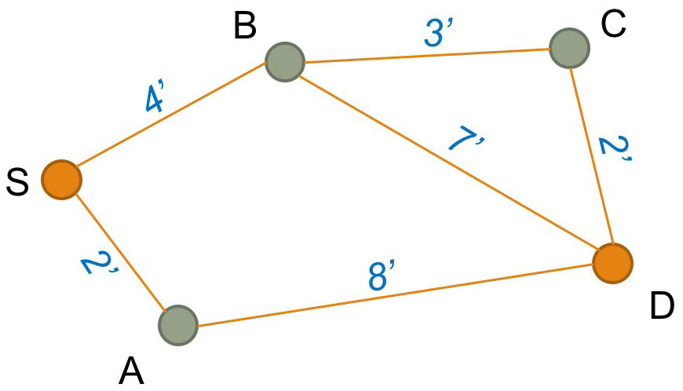
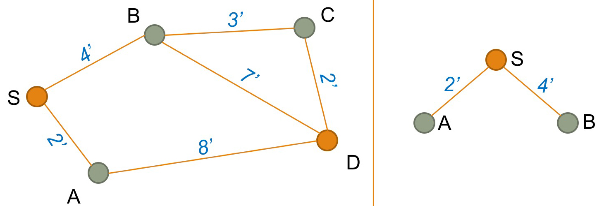
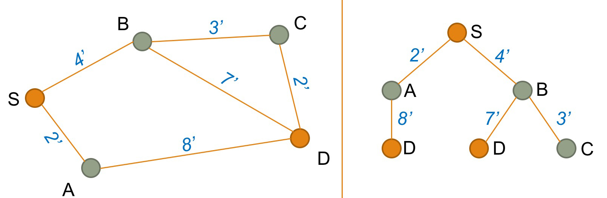
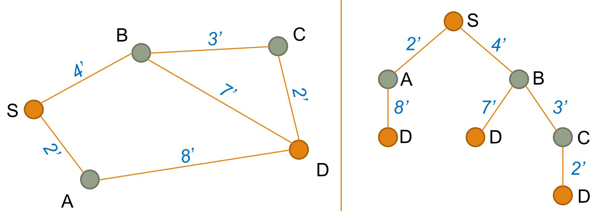

**Summary**

This page describes the method to find a path on a network. Travel costs used in path finding are discussed, and a simple example in five steps visualizes how the shortest path is found.

Path finding problem
--------------------

To assign traffic volumes to a highway network (compare [Network Assignment](Network_assignment)), a path needs to be chosen for every origin-destination pair. A path consists of a series of links that minimize travel costs from an origin to a destination.
See an example from Open Street Map below.\
\
(Source: \[<http://www.openstreetmap.org/#map=16/38.9033/-77.0461>| OpenStreetMap.org\])\

Travel costs
------------

The shortest path minimizes travel costs. Travel costs may be defined as a combination of several path attributes:

-   Travel time (the most common representation of travel costs)
-   Travel distance (travelers have a tendency to choose the shorter path in distance, even if this path is slightly longer in time
-   Types of maneuvers required (travelers tend to prefer paths with fewer turning movements)
-   Monetary costs for fuel or tolls
-   Reliability of travel time
-   Signposting and road works
-   Number of transfers and crowding (for transit)
-   Scenery

In practice, a combination of time, distance and costs are used for the highway assignment. If monetary costs of travel are included, costs in are converted to equivalent minutes based on an assumed value of time. Converting costs into equivalent minutes ensures that monetary costs and time are handled in the same unit (here: minutes).

Path finding in 5 steps
-----------------------

For the human eye, it is trivial to find the shortest path on a simple network. In reality, however, networks tend to be much more complicated:

-   Often there are several competing paths with small differences in travel costs.
-   Travel speed on various links may be different, which may make a visually longer path using highways shorter in travel time than using local roads.
-   Adding more vehicles to a link increases congestion, and thereby, slows down travel speed. A detour that avoids the worst congestion may be the fastest path.

In travel demand modeling, a path finding algorithm is used to select the shortest path that minimizes travel costs.\
\
A simple example visualizes how the path with minimum travel costs is chosen. While this is a simplistic example, the same concept applies to complicated networks. For a more complex example, [this website has a good visualization](http://www.nealbohling.com/code/dijkstra/) of how Dijkstra's works with a grid network.\
\
This graphic shows a network with five nodes and six links. The blue numbers represent travel time in minutes, the only costs considered in this path-finding example. The task is to identify the shortest path from start node S to destination node D.

### Step 1

Initially, create a list of distances between the origin S and all other nodes. The distance to node S is set to 0 (d~S~ = 0). The distance to all other nodes is set to infinity (&infin;), or a very large number that is greater than any distance in the network.

| Distance list    |
|------------------|
| d~S~ = 0 minutes |
| d~A~ = &infin;   |
| d~B~ = &infin;   |
| d~C~ = &infin;   |
| d~D~ = &infin;   |

### Step 2

Next, create a tree that shows all nodes that are linked directly to Origin S (here, this is nodes A and B). For each node, look up the travel costs (here, 2 and 4 minutes).

Based on this tree, you need to update the distance list. The new distance list will be:

| Distances from node S           |
|---------------------------------|
| d~S~ = 0 minutes                |
| d~A~ = <s>&infin;</s> 2 minutes |
| d~B~ = <s>&infin;</s> 4 minutes |
| d~C~ = &infin;                  |
| d~D~ = &infin;                  |

We also need to keep a list of loose ends, that is nodes at the end of the tree shown above. In this case, we have 2 loose ends (nodes A and B).

| Loose-end table |
|-----------------|
| Node A          |
| Node B          |

For each loose end, we also note the "predecessor" node. In this case, the predecessor to both A and B is node S.

| Predecessor list |
|------------------|
| P~A~ = S         |
| P~B~ = S         |

### Step 3

Select the first node from the loose-end table (here node A).

| Loose-end table |
|-----------------|
| <s>Node A</s>   |
| Node B          |

 Using the network, find the next link that connects to node A (here the link from A to D). Add this link to the tree structure shown on the right. Update the predecessor list by adding the predecessor for D:

| Predecessor list |
|------------------|
| P~A~ = S         |
| P~B~ = S         |
| P~D~ = A         |

Next, update the distance list from S to D (2 + 8 = 10 minutes). Mathematically, the distance is calculated by following the tree from S to A to D.

| Distances from node S           |
|---------------------------------|
| d~S~ = 0 minutes                |
| d~A~ = 2 minutes                |
| d~B~ = 4 minutes                |
| d~C~ = &infin;                  |
| d~D~ = <s>&infin;</s>10 minutes |

Because D is our destination node, we do not need to add D to the loose-end table.

### Step 4

Select the next node from the loose-end table (here node B).

| Loose-end table |
|-----------------|
| <s>Node A</s>   |
| <s>Node B</s>   |

 Using the network, find the links that connects to node B (here the link from B to C and the link from B to D). Add these links to the tree structure as shown on the right. Update the predecessor list by adding the predecessor for C:

| Predecessor list |
|------------------|
| P~A~ = S         |
| P~B~ = S         |
| P~C~ = B         |
| P~D~ = A         |

Update the distance list from S to C (4 + 3 = 7 minutes) by following the tree structure. The distance to C is added to the distance list:

| Distances from node S           |
|---------------------------------|
| d~S~ = 0 minutes                |
| d~A~ = 2 minutes                |
| d~B~ = 4 minutes                |
| d~C~ = <s>&infin;</s> 7 minutes |
| d~D~ = 10 minutes               |

We also found another path to node D. The travel costs from S via B to D is 11 minutes (4 + 7). This is more than the travel time from S via A to D (10 minutes). The previously found path is faster, and the longer path S-to-B-to-D is ignored.

Finally, we need to update the loose-end table by adding C as another loose end in the tree structure:

| Loose-end table |
|-----------------|
| <s>Node A</s>   |
| <s>Node B</s>   |
| Node C          |

### Step 5

Select the next node from the loose-end table (here node C).

| Loose-end table |
|-----------------|
| <s>Node A</s>   |
| <s>Node B</s>   |
| <s>Node C</s>   |

 Using the network, find the next link that connects to node C (here the link from C to D). Add this links to the tree structure shown on the right.

Calculate the distance list from S via B and C to D (4 + 3 + 2 = 9 minutes) by following the tree structure. The distance S-to-B-to-C-to-D is shorter than the distance S-to-A-to-D (which was 10 minutes). Therefore, the distance list is updated:

| Distances from node S      |
|----------------------------|
| d~S~ = 0 minutes           |
| d~A~ = 2 minutes           |
| d~B~ = 4 minutes           |
| d~C~ = 7 minutes           |
| d~D~ = <s>10</s> 9 minutes |

Accordingly, the predecessor list is updated. Using the predecessor C on the way to D is the new fastest route to travel from S to D:

| Predecessor list  |
|-------------------|
| P~A~ = S          |
| P~B~ = S          |
| P~C~ = B          |
| P~D~ = <s>A</s> C |

All final nodes in the tree structure are D nodes and the predecessor list is empty. The fastest path from S to D has been found.

Node selection order
--------------------

This simple example selected nodes in the order they were added to the loose-end table. Moore (1957)[^1] showed that the algorithm works faster if not the first node but the last node in the loose-end table is chosen next.

Dijkstra (1959)[^2] proposed two years later that instead of selecting the first or the last link in the loose-end table, the fastest solution if found if the closest node to start node S is selected next. The famous Dijkstra algorithm has become the standard in path finding.

References
----------

[^1]: E.F. Moore (1957) The shortest path through a maze. In: Proceedings of an International Symposium on the Theory of Switching, 2–5 April 1957. Also published in: <i>Annals of the Computation Laboratory of Harvard University</i>, 1959, Volume 30, Pages 285–292.

[^2]: E. W. Dijkstra (1959): A note on two problems in connexion with graphs. In: <i>Numerische Mathematik</i>, December 1959, Volume 1, Issue 1, Pages 269–271.

