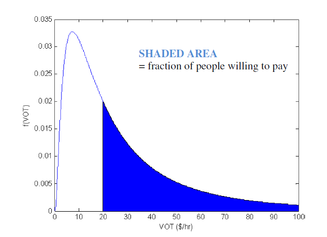

# Pricing Travel

The continued growth in travel demand, worsening congestion, coupled with significant reduction in transportation funding available from traditional sources has motivated agencies with planning and programming responsibilities to consider tolling and pricing solutions as a means of funding new capacity and better managing system operations.

## Attributes of Pricing

This page considers methods and strategies for incorporating both pricing and tolling in travel models. **Tolling strategies** involve the imposition of fees for the use of a roadway facility; examples include fixed fees that motorists pay—usually based on the number of axles or vehicle weight—to cross a bridge or tunnel or drive on a tolled highway facility. Tolling strategies are used primarily as a revenue source to finance and expedite the implementation of needed transportation improvements.

::: tip
Pricing regimens are invariably comprised of a combination of attributes.
:::

Pricing specifically refers to strategies that vary toll rates by time of day or traffic volume level to manage congestion or use of that facility. Pricing is used as a tool to influence travel behavior, reduce congestion, maximize vehicle throughput and provide new transportation options.or use of that facility.

**Pricing regimens** are invariably comprised of a combination of attributes. As they move through the different phases of the evaluation process, pricing concepts are normally defined at greater and greater levels of resolution. During early stages of planning, pricing concepts are likely to be described by a few basic characteristics. At advanced stages of planning and design, careful review of their effects on traffic services, projects revenues, implementation cost, and financial feasibility will typically be important.

This page considers any analytical treatment of monetary cost in models, whether for revenue generation of congestion management, as relevant to the overall disucsison of pricing and valuation considerations in travel models.

### Forms of Pricing

Pricing level and structure are frequently the first set of considerations associated with any pricing initiative at early stages of decision-making. These considerations closely relate to the physical project alternatives. Second-order considerations involve further refinements such as pricing differentiation, eligibility by vehicle type and occupancy. These normally come into play at later stages of decisionmaking, when different pricing policies are examined for each physical design.

In certain cases—such as the conversion of HOV lanes to HOT operation—second-order pricing considerations are considered immediately. Pricing level and lane eligibility by vehicle type generally remains an open issue. Different vehicle classification schemes may require evaluation—from a two-class car-and-truck system, to a four-class system including motorbikes and light commercial vehicles. The identification of the most appropriate classification will depend on local conditions and the expected mix of traffic.[1]

## Traveler Response to Pricing Strategies

Pricing is represented in travel models as changes in usage costs- including road, parking, and transit fees. Although traveler response to pricing may vary widely, certain patterns have emerged from research: [2]

- Transport pricing impacts can vary, including changes in trip generation, mode, destination, route, vehicle type and parking location.
- Pricing of one mode or service can affect demand of others.
- Pricing impacts tend to increase over time
- Higher value travel, such as business and commute travel, tend to be less price sensitive than lower value travel.
- Wealthy people tend to be less sensitive to pricing and more sensitive to service quality than lower-income people.
- Travel tends to be more price sensitive if travelers have better travel options.
- Motorists tend to be particularly sensitive to road tolls and parking fees.
- In general, people place a higher value on time savings that arise from reductions in congestion levels than on time savings from other types of system changes, such as the introduction of shorter-distance routes or closer destinations [3]

Policy makers are often faced with difficult questions about the role that fuel taxes, parking fees, road toll and transit fare changes will have for achieving mobililty, revenue, and equity objectives. Consequently, methodological improvements - focused specifically on improved fidelity and sensitivity for pricing analysis - have emerged through research and model deployments. A number of noteworthy advancements are described below.

#### Congestion and Road Pricing

The number of agencies either planning or deploying pricing alternatives has increased dramatically. Projects that rely on tolling (the assessment of a fixed fee for the use of a roadway) and/or pricing (varying toll, parking, and other components of transportation supply by time of day or volume of traffic) has increased substantially. Several states have enacted legislation that requires new capacity to be funded by revenues derived from tolling and/or pricing alternatives.

Driver response to congestion and road pricing is an essential element to forecasting the future use of roadway systems and estimating the effect that pricing has on demand and route choice. Revenue studies are routinely done for proposed toll roads and offer a source for insight about the [behavioral basis](Travel_Behavior 'wikilink') for forecasts.

Congestion pricing can be applied at a systems, corridor, or faility level. The identification of suitable technical methods will depend on both the spatial and temporal extent of the pricing strategy. Illustrative examples of both sub-area and corridor-specific modeling methods are provided in the applications section below.

Previous research identifies three major aspects of highway driving time that influence behavior and are perceived as important components of highway level of service (LOS):

- quantity: duration of time in the vehicle
- quality: amount of stress or pleasure caused by the particular driving conditions
- reliability: level of uncertainty with respect to travel time and congestion levels
- and other things

Each of these three travel time aspects and travel cost are likely to influence travel choices differently, although the corresponding effects are often intertwined (discussed under [Methodological Condiderations](#Methodological_Considerations 'wikilink'))

#### Parking Pricing

Parking pricing means that motorists pay directly for using parking facilities. Parking Pricing may be implemented as a TDM strategy (to reduce vehicle traffic), as a Parking Management strategy (to reduce parking problems), to recover parking facility costs, to generate revenue for other purposes or for a combination of these objectives.

Even modest parking fees can affect vehicle travel patterns. The price elasticity of vehicle travel with respect to parking price ranges from –0.1 to –0.3 (a 10% increase in parking charges reduces vehicle trips by 1-3%), depending on demographic, geographic, travel choice and trip characteristics. . Parking Management strategies are increasingly viewed as tools to to address local traffic and parking problems,where rates are higher during peak periods. Implemented as a a regional TDM strategy, parking pricing may shift travel from one location - or mode - to another

#### Transit Pricing

Dozens of fare elasticity studies have been completed over the past view decases; the track records with these studies has been mixed. Some have suffered from analytical shortcomings, while others have been overly complicated. Fare elasticities are commonly estimated on specific routes for specific transit systems, are are difficult to generalize. Many smaller and medium-sized transit operators have used a simple 'rule of thumb' value of -.33 for all transit routes during all times of the day. This method is referred to as the Simpson Curtin formula, and is generally though of as inadequate to meet the information needs for determining fare policies. [4]

### Travel Behavior

Possible behavioral responses to network pricing can be categorized temporally, and encompass short term, medium, and long term adjustments in travel behavior. The extent to which modeling methods will need to account for each level of behavior will typically vary based on the planning stage and impacts of highest interest for decision-making [5]

> Traveler Responses

### Modeling Methods for Pricing

While some model features that are absolutely essential to pricing studies in the very beginning of analysis, other more advanced features may be reserved for subsequent stages of project development (detailed feasibility and investment grade studies). The more advanced features, however, may become extremely relevant even early on, if a corresponding pricing strategy is included in the range of options included in the scope of the particular study, and a robust and consistent analysis of it is required to compare with other more easily modeled alternatives. Both essential and advanced modeling features may still belong in the category of short-term improvements and arenot explicitly distinguished here between 4-step (trip-based) and activity based frameworks in this classification. .[6]

> Pricing Methods

Travel models applied for highway pricing and valuation are typically organized into the following classes; a summary of strengths and weaknesses for evaluating pricing impacts is provided below :[7]

#### Aggregate Trip-Based Demand Models

Although these [models](Trip-Based_Models 'wikilink') offer a limited framework for incorporating congestion and pricing effects, some of the main features of the highway utility function can be incorporated by including a generalized cost measure in the mode choice utilities for highway modes. The mode choice model should differentiate highway modes by three to four occupancy categories and toll or nontoll route, which would result in six to eight highway modes. After adequate segmentation by trip purpose, income groups, and time-of-day, several hundred trip tables may be generated; additional segmentation by using person, household, or land use characteristics or adding additional choice models is not possible.

#### Activity-Based Models

These [models](Activity-Based_Models 'wikilink') are characterized by a fully disaggregate structure and rely on individual microsimulation of households and persons. They take full advantage of a detailed level of segmentation by household and person characteristics and can include complicated decision-making chains and behavioral mechanisms. The suggested form of the highway utility can be fully implemented, including route-type, mode, and TOD choices. Variables such as income and parameters like VOT can be continuously distributed to account for unobserved heterogeneity (situational variation).

#### Static Traffic Assignment

The incorporation of travel time reliability measures in this framework can only be enable through "simplified proxies"; for example, the perceived highway time concept can be readily incorporated on both the demand and network simulation sides. Improvements to the current state of the practice that minimize aggregation bias issues can be achieved with a [multiclass assignment](Network_Assignment 'wikilink') in which vehicle classes are defined by occupancy, route type, and (possibly) VOT-based groups. This practice, however, may result in more than 20 vehicle classes and long run times for large regional networks.

#### Dynamic Traffic Assignment (DTA)

These [ models](Benefits_of_dynamic_network_models 'wikilink') are characterized by a fully disaggregate structure and rely on individual microsimulation of vehicles. Similar to activity models, they can take full advantage of a detailed level of segmentation by household and person characteristics linked to each vehicle, and they can also incorporate probabilistically distributed VOT to account for unobserved user heterogeneity. With the new technical features described in this study, these models can incorporate the suggested O-D measures of travel time reliability in route choice, as well as generate reliability skims to feed back to the demand model.

## Modeling Enhancements for Pricing

The Strategic Highway Research Program completed a study [ (C04)](SHRP2_C04_-_Improving_Our_Understanding_of_How_Highway_Congestion_and_Pricing_Affect_Travel_Demand 'wikilink') that provides mathematical descriptions of the full range of highway user behavioral responses to congestion, travel time reliability, and pricing. Critical modeling issues are organized in the following topic areas:

- Variation in VOT across highway users;
- Income and willingness to pay;
- Auto occupancy or group travel and willingness to pay;
- Constraints on TOD shifting (carpools and single-occupant vehicles);
- Importance of VOR and its relationship to VOT;
- Effect of travel distance on VOT and VOR;
- Evidence of negative toll bias;
- Hierarchy of likely responses to change in tolls and congestion;
- Summary of user segmentation factors;
- Avoiding simplistic approaches to forecasting; and
- Data limitations and GPS-based data collection methods.

The top five entries related to the treatment of value of time, value of reliability, and willingness to pay in models. Studies comparing estimed and observed data have relevealed a strong correlation with [forecast accuracy](http://onlinepubs.trb.org/onlinepubs/nchrp/nchrp_syn_364.pdf). Key observations that related to each are summarized here:

#### **Value of Reliability**

Travelers tend to value variation in travel time reliability (day-to-day variability) at least as highly as they value variations in the usual travel time. Various ways of specifying the variability were tested (under C04), but the measure that produced the most consistent results was the standard deviation of travel time divided by journey distance.

##### _Implications for Modeling_

[ CO4 Recommendations](SHRP2_C04_-_Improving_Our_Understanding_of_How_Highway_Congestion_and_Pricing_Affect_Travel_Demand 'wikilink'): Although models can be estimated using measures of day-to-day travel time variables from real and simulated highway networks, further progress is needed before this method is feasible for most travel demand forecasts, particularly in terms of widespread collection of data for actual levels of travel time variability at the O-D level. Certain technical issues must also be resolved on the network simulation side, specifically the incorporation of travel time reliability in route choice and the generation of O-D travel time distributions instead of average travel times. In the near term, this method may be most applicable to corridor- and facility-level forecasts. Some simplified implicit measures of reliability (such as perceived highway time by congestion levels, as explained below) can be applied with the existing model structures and network simulation procedures.

#### **Income and Willingness to Pay**

The C04 research discovered a strong non-linear relationship between houseold income, VOT and willingness to pay. To account for the income effect, cost variables in travel models - including tolls - should be divided by household income, raised to a power in the range 0.6 to 0.8 depending on the trip purpose (e.g., for a power of 0.7, doubling income increases VOT by 62%; halving income decreases VOT by 38%)

##### _Implications for Modeling_

[ CO4 recommendations](SHRP2_C04_-_Improving_Our_Understanding_of_How_Highway_Congestion_and_Pricing_Affect_Travel_Demand 'wikilink'): Forecasting models typically use income either in a simplified linear form to scale travel costs or as a segmentation variable, with different cost coefficients in different income ranges. Neither approach seems entirely appropriate. The assumption of linearity with income seems too strong, particularly in higher income ranges, and the piecewise linear approach often results in strong nonlinearities or discontinuities in the effect of income that do not have a strong statistical or behavioral basis. The recommended approach is empirically justified across a wide body of evidence and provides a smooth response surface for forecasting.

 -->

Proportion of payers with lognormal distribution for VOT for a toll of \$20.

##### Representing Value of Time in Travel Models [8]

> Most models used for travel demand forecasting have assumed a single Value of Time. Only occasionally have different cost coefficients been used for different income groups and vehicle occupancy levels.Differentiation of VOT is even less typical in network simulation procedures. These practices result in significant aggregation biases that affect the accuracy of traffic and revenue forecasts.Whenever possible, random coefficients should be used to estimate the distribution of VOT across the population. For general use, newer activity-based forecasting models that use a microsimulation approach can simulate a different VOT for each person and trip, providing the most disaggregate treatment of VOT, and thus avoiding one important source of possible errors and biases in the forecasts.

#### Model Deployment Research (SHRPII C10)

The most promising long-term direction for DTA modeling is the [integration of an activity-based demand model with DTA](Integrated_Travel_Demand_and_Network_Models 'wikilink'), in which both models are implemented in a fully disaggregate microsimulation fashion with enhanced typological, temporal, and spatial resolution.

The Strategic Highway Research Program's C10 project seeks to develop integrated, advanced travel-demand model with a fine-grained, time-dependent network (integrated activities and networks). The \[\[Integration of Travel Demand and Network Models|integrated models\] dynamically evaluate the interplay of traveler behavior and transportation network conditions, including mode options. The software is available via an open source license; manuals and documentation are included. Implementation is expected to begin in 2014. Model sets are available for Jacksonville, FL, Sacramento, CA, and Burlington, VT.

Model deployment pdates, technical reports, and interim and final versions of open-source software are available at the project's [communication portal](http://www.shrp2c10.org/SHRPC10Portal/Home.aspx).

## Application Experience

### Congestion Pricing in San Francisco (SFCTA)

The San Francisco County Transportation Authority's Mobility, Access and Pricing Study [(MAPS)](http://www.sfcta.org/transportation-planning-and-studies/congestion-management/mobility-access-and-pricing-study-home) explores the feasibility of managing congestion, reducing greenhouse gases, and supporting sustainable growth through congestion pricing. Congestion pricing involves charging drivers a user fee to drive in specific, congested areas or corridors, and using the revenue generated to fund transportation improvements, such as better transit service, road improvements, and bicycle and pedestrian projects. Our analyses indicate that a feasible "right-sized" program can be designed for San Francisco that enhances mobility and access to the downtown while maintaining economic vitality.

The SFCTA’s travel demand model [“SF-CHAMP”](SFCTA's_Experience_Using_its_SF-CHAMP_Activity-Based_Model 'wikilink') was one of the first activity-based travel demand models used in practice in the U.S., and has undergone a number of updates to support project and long range planning needs. Although the SF-CHAMP mode was deemed suitable for most applications, it lacked the toll and time-of-day sensitivity and geographic breadth necessary for evaluating the congestion pricing strategies put forth by the MAPS Study Team. Subsequently, a new travel demand model (based on SF-CHAMP) was developed for the purpose of this study. The improved model, named the Nine-County Regional Pricing Model (RPM-9), produced many of the metrics used to evaluate each congestion pricing scenario compared to a future baseline scenario.

More information can be found [here.](http://www.sfcta.org/sites/default/files/content/IT/SFCHAMP/PDFs/RPM9_MAPS_july31FINAL.pdf)

### Dynamic Pricing in a Managed Corridor: I36 Corridor, Denver

A congestion-responsive dynamic pricing algorithm and [dynamic traffic assignment (DTA)](Network_Assignment 'wikilink') modeling framework was implemented in Denver, Colorado to evaluate the feasibility of a managed lane on U.S. 36 as part of an application for the USDOT’s 20 Transportation Investment Generating Economy Recovery (TIGER) Grant, which was awarded to the state of Colorado. The purpose of this application was to provide an operational analysis for the expansion of U.S. 14 36 from west of the I-25 interchange in the Denver metro area through to Boulder, CO. The 15 proposed project would implement congestion-responsive pricing on the roadway to manage the new facility. CDOT chose to use DynusT to assess the regional operational impacts a congestion-responsive facility would have.

More information can be found [here.](http://www.coloradodot.info/programs/high-performance-transportation-enterprise-hpte/projects/us-36-hpte-projects/us36tiger/AnalysisTechnicalMemo%20_draft_editedforgrant.pdf)

## References

[1] Asessing Highway Tolling and Pricing Impacts, NCHRP Report \#722, v1

[2] Understanding Transport Demands and Elasticities, Todd Litman

[3] Improving Our Understanding of How Highway Congestion and Pricing Affect Travel Demand, SHRPII C04

[4] Fare Easticity and It's Application for Travel Demand Forecasting; American Transit Association

[5] Assessing Highway Tolling and Pricing Options and Impacts, Vol 2; NCHRP 08-57

[6] Asessing Highway Tolling and Pricing Impacts, NCHRP Report \#722, v2

[7] Improving Our Understanding of How Highway Congestion and Pricing Affect Travel Demand, SHRPII C04

[8] Improving Our Understanding of How Highway Congestion and Pricing Affect Travel Demand, SHRPII C04
