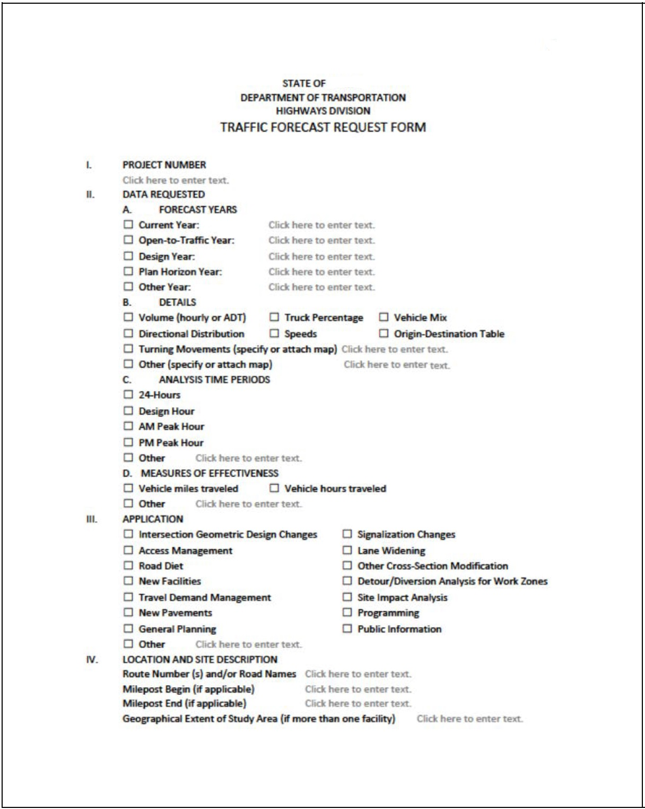
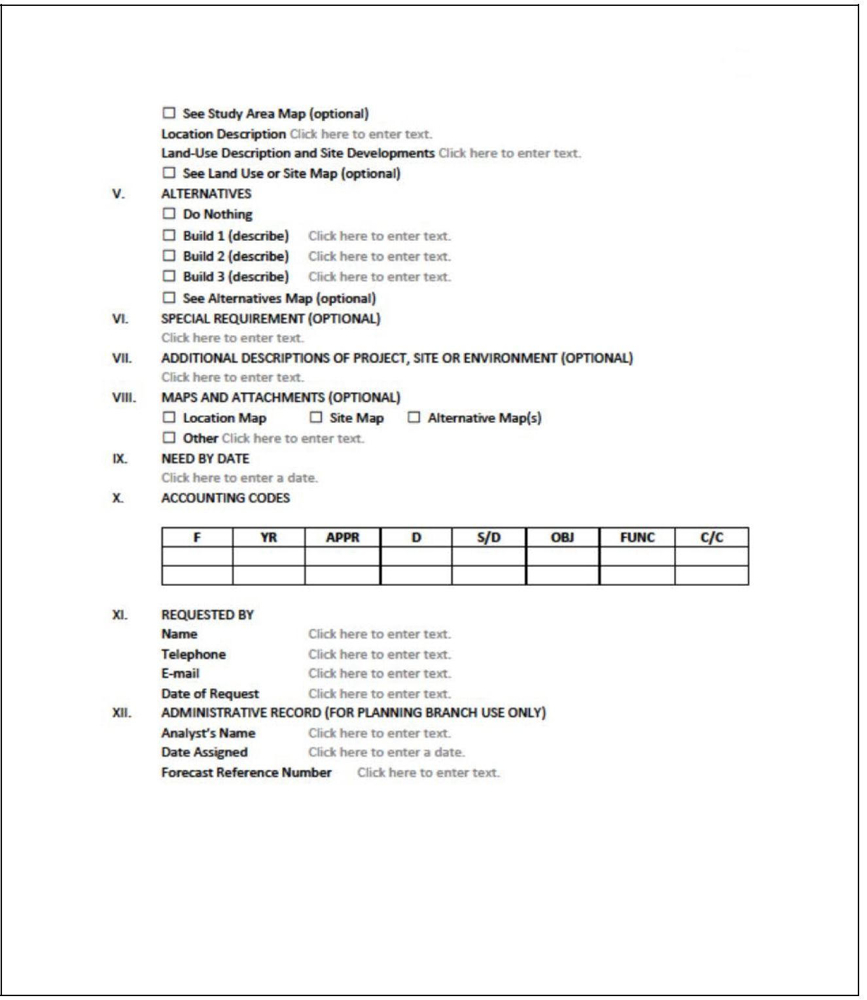
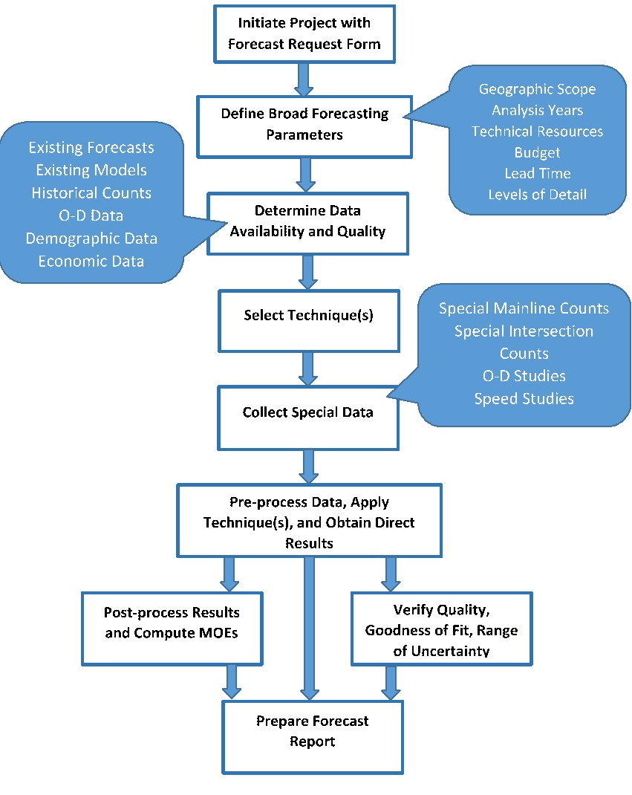

Go to [Project-level traffic forecasting](Project-level_traffic_forecasting) topic page.

Requesting a forecast
---------------------

The form shown below may be used for requesting a forecast and is typical. The request must contain the following information (adapted from the [“Ohio Certified Traffic Manual”](https://www.dot.state.oh.us/Divisions/Planning/SPR/ModelForecastingUnit/Documents/OH_Cert_Traffic_Manual.pdf) and Hawaii’s “Traffic Assignment Work Order” form):

-   Project identifier;
-   Description of the project;
-   Open-to-traffic year and design year;
-   Requested design values;
-   Other requirements;
-   Map(s) showing project limits;
-   List of intersections requiring turning movements, if any;
-   List of any other facilities needing special attention;
-   Required time periods of analysis (24 hours, PM peak hour, etc.);
-   Details of planned developments or other known factors which may impact the project; and
-   Need by date.

Forecasting process flow diagram
--------------------------------

The figure below summarizes the major steps in the project-level traffic forecasting process.

References
==========

