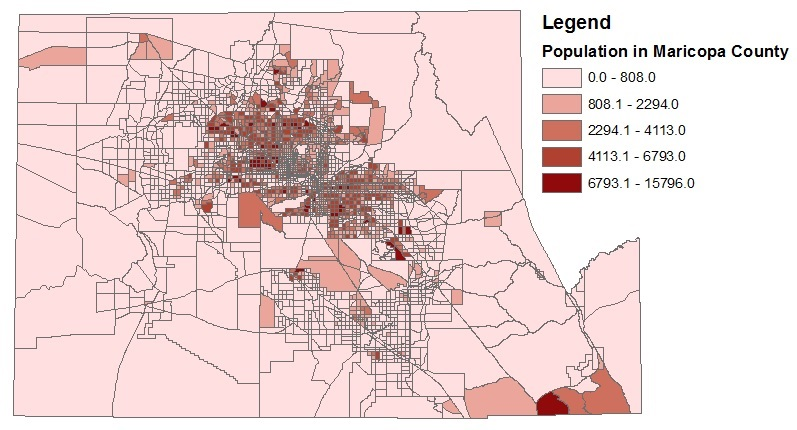

<CategoryList category="Spatial Data" />

Learn more about this circle at [Spatial Data](Spatial_Data).

Spatial data is largely comprised of data elements for which spatial or location coordinates exist, thus facilitating the development of spatial relationships across the elements that comprise the data set. Spatial data is critical to transportation planning and modeling because travel models are inherently concerned with analyzing behavioral phenomena that occur in space. This page provides an overview of the different types of spatial data that is encountered in transportation modeling along with a few possible sources for such data.

Spatial data may come in a variety of forms:

-   Point data: Point data is often associated with XY coordinates or latitude/longitude information. Nodes, intersections, and locations of trip origins and destinations are examples of point data.
-   Line data: Line data has a linear referencing system that allows the determination of spatial proximity using measures such as length, distance, travel time, speed, and capacity. Links in a highway or transit network constitute examples of line data.
-   Polygon data: Polygon data represents spatial units such as block groups or census tracts. In travel modeling, traffic analysis zones (TAZ) constitute examples of polygon data. In polygon data, it is important to represent boundaries of the spatial unit which may come in any shape or size.

Geographic Information Systems (GIS) are software packages that allow the management, manipulation, editing, visualization, and analysis of spatial data. The field of "transport geography" is an important and emerging domain of inquiry that is merging principles of spatial science with the analysis and modeling of travel demand.

Types of Spatial Data in Travel Analysis
----------------------------------------

There are a variety of spatial data sets used in transportation modeling and forecasting applications. Any data element that has spatial coordinates (such as XY coordinates, latitude/longitude) may be considered spatial data. Data elements that have location coordinates attached to them can be related to one another in a variety of ways. For example, in the simplest form, it is possible to define the distance between two points in space if the location coordinates of each of the two points are known. In a more advanced context, it is possible to establish spatial relationships such as spatial correlation, and explore spatial phenomena such as spatial heterogeneity, using spatial data. The analysis of spatial relationships and spatial phenomena has been gaining increasing attention in the travel modeling domain due to the key spatial influences underlying traveler behavior and values and population evolution. This section presents a brief overview of the different types of spatial data sets typically encountered in travel modeling.

##### Land Use/Demographic/Socio-economic Data

Land use data provides detailed information about the land cover in a region. Land use data may be available at a variety of geographic or spatial resolutions. This includes data available at the detailed parcel level with information about the specific use, economic value, and characteristics of the building stock (if any) in each parcel. Land use data may also be available at the level of the census block, block group, or census tract, with each of these spatial units providing increasingly aggregate levels of information. In travel modeling applications, land use data is often aggregated to the level of the traffic analysis zone (TAZ) with each zone described by a number of characteristics including such items as land area, centroid location (coordinates), shape of zonal boundary, land cover information, area type, population composition, building stock and use, and employment makeup. Land use data serves as a critical input to the transportation modeling process. In integrated land use - transport models, land use characteristics change over time in response to changes in transport network accessibility.

*Sources of Land Use Data*: Census Bureau, County Assessor's Office, Dun and Bradstreet, InfoUSA, Bureau of Land Management

A special form of socio-economic data is a [Synthetic Population](Synthetic_Population), which stores every agent individually. Rather than providing, for example, number of households by zone, a synthetic population provides a record for every household with all its attributes (such as home TAZ, household size, household income, etc.).

##### Network Data

Network data includes detailed information about multimodal [Transportation Networks](Transportation_Networks) in a region. Transportation models typically include data about highway networks and transit networks, although increasing interest in the use of non-motorized modes of transportation (bicycle and walk) is motivating the development of bicycle and pedestrian network data as well. Network data is typically comprised of nodes and links with every node located in space through the use of XY coordinates, and links connecting consecutive nodes. Virtually all model networks include centroid connectors that capture the

Highway networks may include thousands of nodes and links. Nodes often represent interchanges, signalized or unsignalized intersections, or other points where transitions in traffic can take place. In addition to XY coordinates, nodes may be characterized by turn restrictions or penalties, type of intersection control, and signal control configuration (if a traffic signal is present). Links are often described by length, capacity, number of lanes, posted speed, and freeflow speed. The congested speed on any link may be calculated through the use of an appropriate volume-delay function (VDF).

[Transit networks](Transit_networks) are also comprised of nodes and links. Nodes generally comprise bus or rail stops along transit routes and are spatially located by XY coordinates. Stop attributes may be attached to a node to describe the characteristics of the stop, typical dwell times, and frequency of vehicle arrivals at the stop. Links on the transit network connect consecutive stops. Links are described by distance, travel time, and transit vehicle speed. In addition to the spatial data, transit network data includes information about the service frequency and schedule which provides for the accurate representation of transit use and ridership in the travel demand model. Other spatial data elements associated with transit networks include the locations and capacity of park-n-ride facilities, and access and egress legs or links for each zone. Intra- and intermodal transfer locations are also identified in transit networks.

*Sources of Highway Network Data*: TIGER/Line Files (Census Bureau), Navteq, Tele Atlas, OpenStreetMap, Cities and Counties, Google Maps, ArcGIS

*Sources of Transit Network Data*: Transit agencies, Google Transit Feed

##### Travel Survey Data

[Travel Survey Data](Travel_surveys) offers information about all of the trips and activities (usually outside the home) that individuals undertake over the course of a day or more (multiday travel surveys capture travel information for a number of days). Travel surveys are typically administered through the phone or internet (although mail-based surveys are still in existence), and technology is enabling the administration of travel surveys through mobile technology such as Smartphones. Global Positioning System (GPS) based travel surveys are gaining increasing acceptance in the transportation planning profession as they allow the passive tracking of travelers through networks while obtaining very detailed spatial and temporal information about all trips that an individual undertook over the course of a day ([Czerniak, 2002](http://onlinepubs.trb.org/onlinepubs/nchrp/nchrp_syn_301.pdf)). Regardless of the type of travel survey conducted, travel survey data sets include information about home locations for households, work and school locations for individuals, and origins and destinations of all trips. At the most detailed resolution, these locations may be identified by XY coordinates (latitude/longitude); when concerns about privacy need to be addressed or if such detailed point location information was not collected in the survey data, then locations in a travel survey data set may be geocoded to more aggregate spatial units such as a traffic analysis zone (TAZ), tract, zip code, block group, or block. Geocoded trip information allows tracing the movements of people through time and space, quantifying action spaces and time-space prisms, and visualizing trip chaining patterns. By combining land use data with travel survey data, it is possible to establish relationships between the built environment, network accessibility, and traveler behavior.

*Sources of Travel Survey Data*: National Household Travel Survey (NHTS), Metropolitan Travel Survey Archive ( <http://www.surveyarchive.org/> ), Transportation Secure Data Center (TSDC) of the National Renewable Energy Laboratory (<http://www.nrel.gov/vehiclesandfuels/secure_transportation_data.html>)

In most cases, it is necessary to contact the agency in charge of data collection to obtain the survey records with geocoded trip information. Data available at public websites is usually stripped of all geocoded information.

Analysis of Spatial Data
------------------------

It is possible to establish relationships among spatial units using spatial analytical techniques. Spatial analysis methods have been used to study spatial correlation and heterogeneity in behavioral patterns and choice processes (e.g., [Bhat and Guo, 2004](http://www.sciencedirect.com/science/article/pii/S0191261503000055)), estimate regression equations that account for geographical differences (e.g., [Wheeler and Páez, 2010](http://link.springer.com/chapter/10.1007/978-3-642-03647-7_22)), explore patterns of development and dispersion (e.g., [Lowe, 1998](http://www.tandfonline.com/doi/abs/10.2747/0272-3638.19.3.232#.Ujov_NKsOSo)), and quantify opportunity-based accessibility measures (e.g., [Chen et al, 2011](http://trb.metapress.com/content/n43424635307x00r/)). Geographic Information Systems (GIS) software packages offer a wide variety of tools to analyze and visualize spatial data. The field of spatial econometrics ([Anselin, 1988](http://link.springer.com/book/10.1007/978-94-015-7799-1/page/1); [LeSage and Pace, 2009](http://www.crcpress.com/product/isbn/9781420064247)) has extended several traditional [choice modeling](Choice_Models) methods to account for spatial phenomena of interest. Using GIS tools and information about activity-travel patterns, it is possible to quantify action spaces and time-space prism constraints (e.g., [Miller, 1991](http://www.tandfonline.com/doi/abs/10.1080/02693799108927856#.Ujo0VtKsOSo)). Opportunity-based accessibility measures quantify the magnitude (amount) of destination opportunities available within various travel time bands from a location. Such accessibility measures can be computed for different modes of transport, trip purposes, and times of day (reflecting business operating hours and transit operating hours). Open source tools are becoming increasingly available to analyze spatial data within GIS environments. [PySAL](https://geodacenter.asu.edu/pysal) is an example of a suite of spatial analytical tools that analysts can customize for a variety of applications within GIS software.

References
----------

Anselin, L. (1988) [Spatial Econometrics: Methods and Models](http://link.springer.com/book/10.1007/978-94-015-7799-1/page/1). Springer.

Bhat, C.R. and J. Guo (2004) [A mixed spatially correlated logit model: formulation and application to residential choice modeling](http://www.sciencedirect.com/science/article/pii/S0191261503000055). *Transportation Research Part B*, **38(2)**, pp. 147-168.

Chen, Y., S. Ravulaparthy, K. Deutsch, P. Dalal, S.Y. Yoon, T. Lei, K.G. Goulias, R.M. Pendyala, C.R. Bhat, and H-H. Hu (2011) [Development of indicators of opportunity-based accessibility](http://trb.metapress.com/content/n43424635307x00r/). *Transportation Research Record: Journal of the Transportation Research Board* **2255**, pp. 58-68.

Czerniak, R. (2002) [Collecting, Processing, and Integrating GPS Data into GIS](http://onlinepubs.trb.org/onlinepubs/nchrp/nchrp_syn_301.pdf). NCHRP Synthesis 301, National Cooperative Highway Research Program, Transportation Research Board, Washington, D.C.

LeSage, J. and R.K. Pace (2009) [Introduction to Spatial Econometrics](http://www.crcpress.com/product/isbn/9781420064247). CRC Press.

Lowe, J.C. (1998) [Patterns of spatial dispersion in metropolitan commuting](http://www.tandfonline.com/doi/abs/10.2747/0272-3638.19.3.232#.Ujov_NKsOSo). *Urban Geography*, **19(3)**, pp. 232-253.

Miller, H.J. (1991) [Modelling accessibility using space-time prism concepts within geographical information systems](http://www.tandfonline.com/doi/abs/10.1080/02693799108927856#.Ujo2SNKsOSp). *International Journal of Geographical Information Systems*, **5(3)**, pp. 287-301.

Wheeler, D.C. and A. Páez (2010) [Geographically Weighted Regression](http://link.springer.com/chapter/10.1007/978-3-642-03647-7_22). In M.M. Fischer and A. Getis, eds, Handbook of Applied Spatial Analysis, Springer, pp. 461-486.
