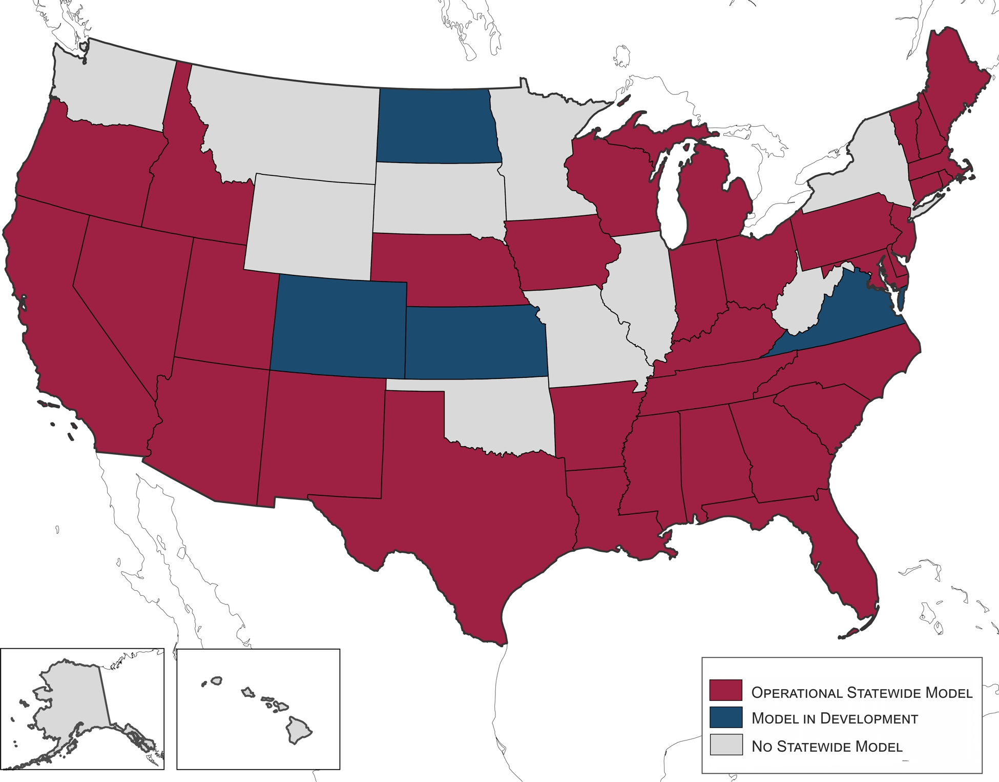

Introduction
------------

Statewide travel forecasting models predict all travel in the state, potentially by all modes, for both goods and people. Logically included with statewide models are super-regional models that cover all or parts of multiple states, and possibly the whole US. The importance of statewide models stems directly from the amount of long-distance and intercity travel in the US. According to the 2001-02 NHTS just under one-third of all person miles are long-distance (as defined as more than 50 miles within the NHTS), and according to the 2002 Commodity Flow Survey the vast majority of freight ton-miles are long distance. Statewide models go beyond metropolitan models principally by including larger, if not all, portions of long distances trips and by explicitly including passenger and freight modes for intercity travel. The field of statewide modeling is still maturing, even though models have been deployed in Michigan and Kentucky for more than 40 years.

The current status of statewide modeling in all states can be found here: [Current Status of Statewide Models](Current_Status_of_Statewide_Models).\

''States with operational statewide transport models in 2016 (Copyright Transportation Research Board)

\
Important documents and events in the dissemination of information on statewide model development are listed in the reference section.
The initial motivation for information dissemination was to encourage the development of models in states that did not have them, but a more recent motivation has been to foster research and development to improve models across-the-board. Persistent dominant themes emerged from each of these sessions, conferences and reviews:

-   Statewide models have for the most part developed along similar methodological lines to traditional metropolitan models; however, there is less certainty as to what should be contained within a statewide model.
-   The largest problems in implementing statewide models relate to issues of scale.
-   Models from different states vary greatly in complexity, cost and development time.
-   Models are most successful when they are able to address statewide priorities as expressed by legislators and other political leaders.
-   There are major deficiencies in our data about long-distance passenger travel and rural passenger travel.
-   Statewide models are more compatible with secondary freight data sources, such as the Commodity Flow Survey, than are metropolitan models.
-   There is keen interest among states (with or without models) in the progress other states have made in deploying models.

The statewide modeler community, centered on the TRB [Statewide Modeling Subcommittee](Statewide_Modeling_Subcommittee_ADA10(2)), is promoting selective research topics to improve the state-of-the-practice. Successes have included multiple NCHRP projects or tasks that have documented the current state-of-the-practice, expanded our knowledge of freight forecasting and outlined a prospective national travel forecasting model.

Statewide Models: Rationale
---------------------------

The first three sections summarize sections 2.1, 2.2 and 2.3 of [NCHRP Synthesis 514](http://www.trb.org/Publications/Blurbs/176702.aspx). More detailed information can be found in the report.

### Motivations

-   Statewide models capture travel outside of urban areas.
-   Statewide models capture travel between urban areas.
-   Statewide models are especially concerned about long distance travel.
-   Freight movement can be handled well by statewide models.
-   Enhancing MPO models is a common use of statewide models.

### Scenario Analysis

-   Infrastructure scenarios.
-   Policy scenarios.
-   Global scenarios.

### Performance Measures

-   Four dimensions: duration, extent, intensity and variability.
-   Typical performance measures include: travel time, travel delay, travel distance, diversion, speed, congestion metrics, equity analysis, emissions and economic benefits.

### Utility and Costs

NCHRP Project 8-36C, Task 137 assesses the utility and costs of statewide travel demand models. This research builds on [NCHRP Synthesis 514](http://www.trb.org/Publications/Blurbs/176702.aspx) by performing interviews with statewide modeling practitioners. The model is built around the table shown below.

\
\
These two reports provide an excellent overview for the agency deciding to either “get in the statewide modeling game,” or an agency that wants to upgrade their existing model.

Statewide Models: Types
-----------------------

Statewide models can take many forms. The type of model developed is usually determined based on the resources available and the needs of the transportation planning stakeholders and decision makers. Common types of statewide models include trip-based, activity-based, ODME, and special models, including corridor-level, freight, High Speed Rail, multi-state, national, and provincial. Trip-based person models, very similar in structure to comparable urban models, are the most common type of statewide models.

### Trip-based Models

[Trip-based models](Trip-Based_Models), also commonly known as **four-step models**, are so called because the primary unit of analysis is the trip interchange (i.e. origin-destination pair) between two geographic locations. The primary work done by trip-based models is to estimate all of the trips in a region, classify them by location and mode, and predict their use of transportation networks.

To learn more about Statewide trip-based models and their applications, click [here](Statewide_Models:_Trip-based_Models).

### Activity-based Models

[Tour-based](Tour-based_models) and [activity-based models](Activity-Based_Models) models predict which activities are conducted when, where, for how long, for and with whom, and the travel choices they will make to complete them. Having this type of detailed model provides many [benefits](Benefits_of_Activity_Based_Models). A number of states have developed statewide tour- or activity-based models including [California](http://www.dot.ca.gov/hq/tpp/offices/omsp/statewide_modeling/cstdm.html) and others.

To learn more about Statewide activity-based models and their applications, click [here](Statewide_Models:_Activity-based_Models).

### ODME Models

Origin-destination matrix estimation ([ODME](ODME)) is an iterative proportional fitting process that utilizes vehicle count data and an origin-destination seed matrix to produce a matrix that best matches observed trips in a region. The process has been used in development of statewide models where there is insufficient survey data available.

To learn more about Statewide ODME models and their applications, click [here](Statewide_Models:_ODME_Models).

### Special Models

Models can be created for specific projects, such as corridor-level studies or major investment or infrastructure projects like High Speed Rail, or can cover geographic areas larger than a state, such as multi-state or national models.These models are like statewide models in that they address many similar issues, like long-distance trips.

To learn more about Statewide special models and their applications, click [here](Statewide_Models:_Special_Models).

Statewide Models: Special Issues
--------------------------------

This section is under construction and will contain sections on Long Distance/Short Distance travel (the "old" section on Long Distance Travel has been included shown below), I-E & EE, Seasonality, and Alternate Modes

### Long-distance travel

Statewide travel models differ somewhat from urban and regional models in that they need to explicitly consider [long-distance travel](Long-distance_Travel) that may be made on a relatively infrequent basis in comparison to typical urban and regional travel. In addition, while urban and regional models typically consider trips or tours that typically start and end the day at a person's home, statewide travel models must consider travel that do not start or end the day at a person's home.Long-distance trips are more likely to be divided into categories by frequency of travel or by purpose such as recreational/tourist versus business-oriented trips. Such considerations are more likely to be indicative of long-distance variations by trip length, mode choice, and other aspects of travel.

Various definitions have been used to define long distance travel. A frequently used threshold is 50 miles.

NCHRP Report 735 Transferable Parameters for long distance and rural trip-making (2012) is a valuable source of information on long distance travel. The NCHRP report explains how statewide models have fundamental differences from urban models due to long distance trip making and rural trips.

For more information on long-distance travel, click [here](Long-distance_Travel).

### External Travel

### Seasonality

### Alternate Modes

Statewide Models: Data
----------------------

This section is under construction and will contain sections on emerging data, surveys and integration with urban models. A draft intro is shown below from the "old" section. Also, the "old" section on integration with urban models is included which will be updated.

Key data include:

-   Long distance travel data sources include the 1995 American Travel Survey (ATS). A recent FHWA study (2013) updated the 1995 ATS with the Traveler Analysis Framework (TAF) for the years 2008 and 2040;
-   Census data: Census Public Use Microdata, Census Transportation Planning Package (CTPP);
-   Freight Data: Commodity Flow Survey (CFS), Freight Analysis Framework (FAF), Vehicle Identification and User Survey (VIUS), Transearch;
-   Employment data: Dun and Bradstreet; Employment Security Data (ES-202), Info USA;
-   Surveys: National Household Travel Survey (NHTS), household travel surveys;
-   Economic models: Regional Economic model (REMI);
-   Other data: MPO data, origin-destination data.

[Data](Statewide_Models:_Data) contains more detailed information on statewide models data.

##### Statewide/urban model integration

There are pros and cons on the level of integration between urban/regional models and statewide models. For example, if a statewide model uses the same demographic assumptions as a state's MPO models, there is a greater likelihood of consistency among different models. On the other hand, use of MPO demographic forecasts in a statewide model could lead to complications in maintaining and updating the statewide model. Without continuous coordination, the statewide model might become outdated as MPOs make corrections and updates to demographic data on a regular basis. Another consideration is that MPO forecasts likely reflect local politics and policies whereas use of independent forecasts for a statewide model could be considered as unbiased.

Statewide Models: Components
----------------------------

### Networks and TAZs

Traffic analysis zones (TAZs) are typically larger in statewide models than those found in urban and regional models. Thus, it is best practice for statewide zones to represent an aggregation of smaller regional model TAZs in urban portions of a state. This process of "nesting" urban zones within larger statewide model zones maximizes consistency between models and simplifies data development as urban model socioeconomic data and/or trip tables can easily be aggregated to statewide model TAZs. With advancements in computer technology, some statewide models now include the entirety of a state's urban zone systems, though this tends to be more common in smaller states.

Consistent with zonal structure, statewide highway networks tend to be more simplified than those found in urban and regional models. In most cases, statewide model networks would include all Interstate, U.S., and state route designated highways, at a minimum. Where appropriate, county routes are included for proper zone loading and connection to higher order facilities, especially in lower density rural areas. It is preferable that statewide models include all roadways that interchange with Interstate highways since Interstate traffic counts are specific to locations between ramp access and egress points.

Network aggregation in statewide models is most common within urbanized areas as Metropolitan Planning Organizations (MPOs) generally use models with greater detail than what is typically found in statewide models. It is not necessary to include most county, collector, and local streets in statewide model networks as MPO/regional models will be used to forecast intraurban travel instead of a statewide model. Care should be taken with respect to the inclusion of traffic counts in the urban portions of statewide model networks as the aggregated networks in these areas will make model replication of count volumes difficult to achieve.

Representative structural metrics and demographic ratios for several different Statewide Model networks and zone systems were depicted in Table 3.3 of the Task 91, NCHRP project 8-36-B Final Report, including:

-   Number of Zones
-   Number of Links
-   Ratio of Links per Zone
-   Persons per Household or Dwelling Unit
-   Employment per Population
-   Autos per Household or Dwelling Unit
-   Population per TAZ

These topics are discussed further in Sections 4.2 and 4.3 of [NCHRP Synthesis 514: Statewide and Megaregional Travel Forecasting Models](http://apps.trb.org/cmsfeed/TRBNetProjectDisplay.asp?ProjectID=3968).

### Trip generation/activity generation

Most statewide trip generation models are somewhat different than their metropolitan counterparts. Typically, the most basic trip purposes are used: HBW, HBO, and NHB. In addition, long-distance purposes are usually included. These can consist of Business and Pleasure, but more detailed models could use Commute, Business-Related, Personal Business, and Pleasure purposes. The definition of “long-distance” has not been standardized – it generally varies between 50 and 100 miles, depending on the size of the state. It should be remembered that because statewide zones are larger than urban TAZs, many short trips (including many school trips) become intrazonal and will not be assigned to the network.
Long-distance trip rates are low – typically 0.5-3.0% of total trips, but they represent a higher share of VMT. These trip rates are commonly expressed to 3-5 decimal places because they are so small. Most statewide models focus on weekday travel, but a few include weekend travel as well.
Aside from long-distance trip purposes, statewide generation models tend to use similar structures as metropolitan generation models. Productions are based on a cross-classification table using household size, income or autos, and perhaps an urban/rural indicator. Linear regression is used for attractions and a special attempt is sometimes made to include major tourist destinations either in the attraction model or as special generators. While it can be difficult to determine the cutoff point for what constitutes a “major” attraction, statewide models usually only isolate special generators of statewide significance.

A note on NHB travel: long distance trips tend to be multi-stop tours with a mixture of short and long legs. Using the conventional definition, most long-distance trips are NHB. However, the NHB category might not provide the best description of these trips, leading to less accuracy in subsequent model steps. This would be a key motivation to use a tour- or activity-based model, which avoids the NHB category. If the model is trip-based, perhaps the purposes should be re-defined slightly.

“External” travel takes on a different meaning in the context of statewide models. Freight models generally work better if the model includes the entire U.S., so many such models cover the whole country. For person travel modeling, external zones are often equated with roadways crossing the state line or some point past a state’s metropolitan areas of influence. Depending on where the state is located, it may be useful to include Canada and/or Mexico as external stations and treat those locations as “external”.

### Trip distribution/destination choice

Most statewide distribution models use the basic gravity model structure. The principal difference from a metropolitan area model is that the F factor function is typically “flatter” and must include longer travel times – typically 200 minutes or more, depending on the size of the state. Using a logit model for destination choice is somewhat more difficult, due to the scale of the problem. Many logit models have a difficult time handling trips that could range between 10 minutes and 350 minutes long.

Model calibration has some similarities to a conventional metropolitan area model, in that the process includes examining the trip length frequency distribution, average travel time, and district-district movements. The share of intrazonal trips though will be much higher than in a metropolitan area model due to the larger zone sizes in statewide models.

One significant difference is that it can be difficult or expensive to obtain sufficient data on observed travel, and so alternative techniques are needed to create a statewide trip table. One option is to use an origin-destination matrix estimation (ODME) process to create the trip table, which is then forecasted using conventional Fratar techniques. Another idea is to merge/weave existing MPO trip tables, which is suitable for smaller states which are mostly or entirely covered by MPO models.

### Mode choice

Mode choice in statewide models requires a different approach from MPO models. Most statewide models only deal with highway travel and thus the focus is largely on auto occupancy conversions. The level of sophistication of the auto occupancy model depends on the intended use of the model. If the model will be used for HOV, HOT, or toll analysis, consideration might be given to a logit model for the different occupancy “modes” (drive alone, two per car, three or more per car). Increased vehicle occupancy is typically associated with non-work travel, longer trip length, and higher travel costs. If a logit model is not warranted, the usual approach is to apply average vehicle occupancy factors by purpose and possibly trip length. Auto occupancy factors are generally higher in statewide models than MPO models due to longer trip lengths and a higher likelihood of multi-occupant vehicle trips.

For urbanized states and situations where intercity modal trade-offs are very important, nested logit models are sometimes used. However, the effort to code a transit network can be significant and so for states where transit is less important, look-up tables that are based on trip purpose, household income or vehicle ownership, distance, and area type can be used. Non-motorized trips are nearly all intrazonal and thus are rarely addressed in statewide models. At the statewide level, transit may be a competitive mode for shorter trips (&lt; 25 miles) and for much longer trips (&gt; 300 miles), air and intercity rail and bus are sometimes considered.

Modeling intercity trips for high-speed rail analysis is an example of a specialized application of a statewide model. This process requires a sophisticated share model to evaluate the trade-offs in time and cost among highway, air, rail, and bus modes for long-distance travel. As noted above, it can be a challenge to use a logit model for intercity travel due to the difficulty in handling very high travel times. Also, it is usually better to represent service frequency in terms of the number of trains per day rather than average wait time.

### Freight modeling approaches

Statewide freight models can be a component of a statewide model or a stand alone model.

Per the Task 91, NCHRP project 8-36-B Final Report, statewide freight models can be grouped into the following categories:

· **No Freight Model** – Modeling may be restricted to MPOs within the state and the state DOT does not operate a model which covers all of the MPOs in the state as well as the rural areas between MPOs; or the state DOT may operate a model, but that model covers only passenger trips or includes total
highway vehicles, and does not separately report demand or performance for vehicles which carry passengers and those which carry goods.

· **Truck Model** – The state DOT operates a travel demand model and that model separately forecasts the demand and performance of autos and trucks
on the highway network, but does not distinguish between trucks which carry freight and trucks which provide other functions (e.g., service, maintenance,
construction, local delivery). Also, the travel demand model does not include forecasts for nonhighway freight modes.

· **Direct Commodity Table Freight Model** – The state DOT operates a travel demand model, and that model, rather than including modules which calculate a trip table for freight vehicles, processes a directly acquired multimodal commodity table into a freight truck trip table. That table is assigned to a highway network, either separately or most often as part of a multiclass assignment with autos and other trucks.

· **Four-Step Freight Model** – The state DOT operates a travel demand model and that model forecasts a freight truck trip table, in addition to trip tables
for other nonhighway modes, through the use of trip generation, trip distribution, and mode choice modules. Freight truck trips are then assigned to
the highway network, either separately or most often as part of a multiclass assignment with autos and other trucks.

· **Economic Freight Model** – The state DOT operates a travel demand model which calculates the demand and consumption of freight as a result of activities modeled in an economic model. The difference from the Four-Step Freight Model above is that the employment or other indicators of economic
activity which generate the production or consumption of freight are not provided exogenously, but are calculated iteratively within the model as a
result of its calculations of transport costs.

· **Disaggregated Freight Model** – A more recent development has been the implementation of disaggregated freight simulation models, that could be viewed as activity-based models for freight.

To learn more about Statewide freights models and their applications, click [here](Statewide_Freight_Modeling).

### Trip assignment issues/validation/post processing

While conventional trip assignment algorithms are generally used in statewide models, there are some interpretive differences in some statewide models. For example, some statewide models use factored travel times and/or trips as a means of minimizing the numeric magnitudes. In rural areas, which represent a large percentage of lane miles in statewide models, the percentage of truck trips is generally higher than what is found in urban settings and thus it is important to properly reflect this in the capacity of network links, speed/delay functions, and passenger car equivalents. With large segments of highway traversing mountainous regions, percent grade is more likely a factor on speed and capacity than what is found in a typical urban model.

Validation of statewide models is more challenging than urban and regional models due to several factors. The first of these is the multi-centric nature of statewide models, which are generally comprised of multiple urbanized areas. The gravity model tends to distribute trips among these MPO areas at a much higher rate than would typically occur in a smaller multi-centric region. A second issue is the difficulty of validating traffic counts on low volume roadways. With a larger share of low volume roadways in a statewide model network, it becomes difficult to achieve volume-over-count ratios and percent root mean square error standards typically achieved in the validation of urban and regional models. A third issue is that the aggregate network and zone structures found in statewide models make it difficult to validate traffic counts as a single roadway might take the place of multiple parallel routes found in an urban model. Thus, consideration should be given to limiting statewide model validation in urban settings to highway segments with few parallel routes such as bridges, mountain passes, and urbanized boundaries.

The report titled NCHRP Project 836-B Task 91: Validation and Sensitivity Considerations for Statewide Models includes additional guidance on the validation of statewide models, along with metrics culled from a number of statewide models from across the U.S. A link to this document is [here.](http://onlinepubs.trb.org/onlinepubs/nchrp/docs/NCHRP08-36(91)_FR.pdf)

Statewide Models: Resources
---------------------------

This section contains a link to the Statewide Modeling Subcommittee and a link to Statewide Modeling Case Studies.

[Statewide Modeling Subcommittee](Statewide_Modeling_Subcommittee_ADA10(2)) is the link for all information on the Statewide Modeling Subcommittee.

[Statewide Modeling Case Studies](Statewide_Modeling_Case_Studies) is the link for all information on Statewide Modeling Case Studies.

<h1>
References

</h1>
-   Cambridge Systematics, *National Travel Demand Forecasting Model Phase I Final Scope*, Transportation Research Board, Washington DC 2008. <http://onlinepubs.trb.org/onlinepubs/nchrp/docs/NCHRP08-36(70)_FR.pdf>
-   Cambridge Systematics, Global Insight, Cohen, H, Horowitz A.,& Pendyala,R., ''NCHRP Report 606, Forecasting Statewide Freight Toolkit", Transportation Research Board, Washington DC 2008. <http://www.trb.org/Publications/Blurbs/159781.aspxhttp://onlinepubs.trb.org/onlinepubs/nchrp/docs/NCHRP08-36(70)_FR.pdf>
-   Cambridge Systematics, *NCHRP 8-36B Task 91: Validation and Sensitivity Considerations for Statewide Models* , Transportation Research Board, Washington, DC, 2010. <http://onlinepubs.trb.org/onlinepubs/nchrp/docs/NCHRP08-36(91)_FR.pdf>
-   Donnelly, R. & Moeckel, *NCHRP Synthesis 514 Statewide and Megaregional Travel Forecasting Models*, Transportation Research Board, Washington, DC, 2017. <http://www.trb.org/NCHRP/Blurbs/176702.aspx>
-   Erhardt G, Tsang F & Francis B., *NCHRP Project 8-36C, Task 137, Assessing the Utility and Costs of Statewide Travel Demand Models,* TRB, Washington, DC, 2018.http://onlinepubs.trb.org/onlinepubs/nchrp/docs/NCHRP08-36(137)\_FR.pdf
-   Giaimo, G. & Schiffer, R., *Transportation Research Circular E-C075, Statewide Travel Demand Modeling, A Peer Exchange*, Transportation Research Board, Washington DC. 2005. <http://onlinepubs.trb.org/onlinepubs/circulars/ec075.pdf>
-   Horowitz, A.,*Guidebook on Statewide Travel Forecasting*, Federal Highway Administration, Washington, DC,1999. <https://www.fhwa.dot.gov/planning/processes/statewide/forecasting/swtravel.pdf>
-   Horowitz, A. *NCHRP Synthesis 358 Statewide Travel Forecasting Models*, Transportation Research Board, Washington, DC, 2006.http://onlinepubs.trb.org/onlinepubs/nchrp/nchrp\_syn\_358.pdf
-   Schiffer, R.,*NCHRP Report 735 Transferable Parameters for Long Distance and Rural Trip-making* Transportation Research Board, Washington, DC, 2012. <http://onlinepubs.trb.org/onlinepubs/nchrp/nchrp_rpt_735.pdf>

