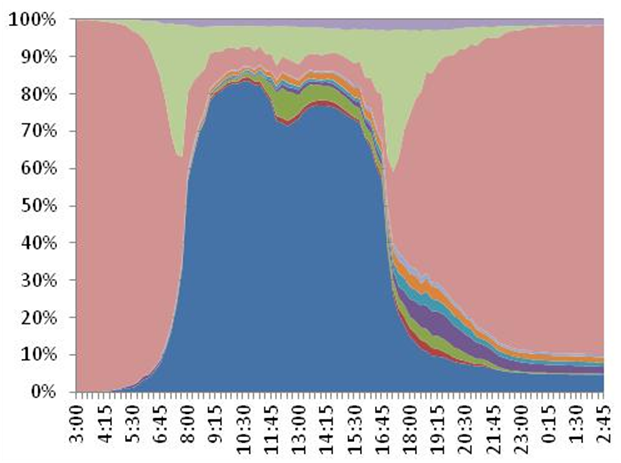

Learn more about this circle at [temporal data](Temporal_Data).

Any data that incorporates the time dimension may be considered temporal data. In travel analysis, the time dimension is critical to understanding, explaining, and modeling travel demand. Congestion on a network is inherently related to the temporal concentration of travel demand at specific locations. Trends over time, often captured through the use of longitudinal data sets, constitute temporal data that is useful to understanding changes in patterns of development or behavior over time. Another form of temporal data is concerned with people's time use behavior, i.e., how people spend time over the course of a day, week, month, or year. Temporal data can be combined with [Spatial Data](Spatial_Data) to better understand and model time-space interactions that characterize and shape land use development patterns, demographic evolution, and activity-travel behavior.

Types of Temporal Data
----------------------

This section provides a brief description of the different types of temporal data that may be encountered and that may be of value in travel analysis.

##### Trend Data

Trend data captures the changes in a phenomenon or behavior of interest over time (usually extended periods of time). Longitudinal observations of a phenomenon or behavior of interest yield trend data. Repeated cross-sectional data, time series data, and panel data sets are all examples of longitudinal data that provide information about trends over time. There are many examples of trends of interest in the travel analysis domain. Population and employment changes over time, changes in trip rates and mode choice over time, and changes in fuel prices and household income are all examples of trend data. The [Bureau of Transportation Statistics](http://www.bts.gov) (BTS) maintains an extensive amount of trend data for different modes of transportation.

*Sources of Trend Data*: [Bureau of Transportation Statistics](http://www.bts.gov), [National Household Travel Survey series](http://nhts.ornl.gov/), [Highway Performance Monitoring System](http://www.fhwa.dot.gov/policyinformation/hpms.cfm), [Energy Information Administration](http://www.eia.gov/), [Census Bureau](http://www.census.gov/), [FHWA Office of Highway Policy Information](http://www.fhwa.dot.gov/policyinformation/index.cfm)

##### Temporal Distributions of Demand

Travel demand varies along the temporal axis. Within a day, a higher percent of travel takes place (on weekdays) in the morning (6-9 AM) and evening (4-7 PM) periods, leading to the classic identification of peak periods associated with the prevalence of commute journeys within these time periods. The time of day distribution for shopping or other discretionary trips may be quite different from the time of day distribution for work and work-related trips. With a week, there is likely to be variation in travel demand across the days of the week, particularly between weekdays and weekend days. Mondays and Fridays are often considered to be different in terms of travel characteristics when compared with other weekdays. Over the course of a year, travel demand varies across months of a year with summer month travel demand and patterns considerably different from patterns seen in the fall and spring months when schools are in session. Holiday season travel also exhibits considerable differences, thus leading to temporal variations in travel demand over the course of a year. These differences may be observed in both short and long distance travel demand. A few data sources that offer trend data can be used to unravel seasonal and monthly variations in travel demand (for example, see the [Traffic Volume Trends](http://www.fhwa.dot.gov/policyinformation/travel_monitoring/tvt.cfm) published by the FHWA of the US Department of Transportation). However, [travel survey data](Travel_Survey_Data) is generally needed to measure and understand temporal patterns of demand within a day. Time of day distributions of travel demand (by purpose and mode) are critical to planning congestion relief measures, travel demand management and multimodal strategies, and [pricing](Pricing_and_Valuation) schemes. Interest in time-of-day modeling has led to an increasingly disaggregate representation of time in travel demand model systems with new [activity-based travel demand model](Activity-Based_Models) systems, founded on microsimulation-based paradigms, capable of simulating activity-travel patterns along the continuous time axis (at the resolution of one minute). Such models purport to represent activity scheduling and sequencing processes (e.g., [Roorda et al, 2008](http://www.sciencedirect.com/science/article/pii/S0965856407000924)).

*Sources of Temporal Distribution of Demand Data*: [Travel Survey Data](Travel_Survey_Data), Traffic Volume Trends and Counts (Federal, State, and Local), [Bureau of Transportation Statistics](http://www.bts.gov)

##### Network Travel Time (Skim) Data by Time of Day

Just as temporal data may be collected and analyzed to understand variation in travel demand over time, temporal data may also be collected to characterize variation in transport supply over time. [Highway](Transportation_Networks) and [transit networks](Transit_networks) generally do not exhibit the same characteristics throughout the day. Highway networks tend to be more congested during the peak periods, thus leading to different origin-destination travel times and shortest paths in the peak periods when compared with off-peak periods. Transit networks may offer differing levels of supply through the course of a day. Frequency of service and route coverage may be more extensive during peak periods, and service may be entirely unavailable during the overnight hours. Thus, transit service supply (and transit travel time) varies through the course of a day. In some instances, airlines offer service between specific markets only during certain months of the year depending on the demand. In the context of travel demand modeling and forecasting, congested and uncongested skims (measures of [network impedance](Impedance)) are applied for modeling travel choices and assigning traffic to networks during different periods of the day. Many agencies have moved away from daily travel modeling (and daily network assignment) to reflect the time-dependent nature of networks. Dynamic traffic assignment algorithms are gaining increasing attention in the field as they reflect the time-dependent nature of shortest paths and associated route choice dynamics.

*Sources of Temporal Data on Network Supply*: Metropolitan Planning Organizations (MPOs), State Departments of Transportation (DOTs), Transit agencies

##### Time Use and Activity Engagement Data

People engage in activities through the course of a day, week, month, season, and year. Time use data (often derived from time use surveys, but can also be derived from activity and [travel surveys](Travel_Survey_Data)) can provide valuable insights into how people allocate and spend time, when people engage in different types of activities, and what people are doing at various points in time. Time use data generally offers a complete picture of activity-travel patterns through the course of the period of observation (say, 24 hours), including information about activities undertaken outside home and inside the home. Although travel models have been largely confined to the modeling of out-of-home activities and travel, there has been considerable work in the research arena into relationships between in-home and out-of-home activities (e.g., [Yamamoto and Kitamura, 1999](http://link.springer.com/article/10.1023/A:1005167311075)). How people allocate and spend time for travel has been of much interest to the community for several decades, with several arguing both in support of and against the notion of a travel time budget (TTB) that exhibits constancy over time and across geographical contexts (for a review on this topic, see [Mokhtarian and Chen, 2004](http://www.sciencedirect.com/science/article/pii/S0965856404000680)). Considerable work has also been devoted to the study of temporal (scheduling and activity/travel duration) constraints using time use and activity data (e.g., [Schwanen and Kwan, 2008](http://www.sciencedirect.com/science/article/pii/S0016718507001790)).

|                                                                                                       |                                             |
|-------------------------------------------------------------------------------------------------------|---------------------------------------------|
|  |  |

*Sources of Time Use Data*: [American Time Use Survey](http://www.bls.gov/tus/) (ATUS), [Multinational Time Use Study](http://www.timeuse.org/mtus/surveys)

##### Vehicle Count Data

Traffic data is critical for validating and running travel demand models. One of the many interesting features of traffic data is that the data is always just a sample. Even continuous collection sites (such as ATRs) usually have some error built in (missing days/hours; errors due to the equipment). All of the traffic data subtopics are related to an extent since they use similar data collection equipment. Essentially though there are three main areas: (1) Volume data; (2)Vehicle classification data; and (3) Speed data.

The other areas (data periods, equipment/technologies and screenline counts) are subsets of the above.
It is important to mention that traffic data is used for many other purposes than providing data to travel demand models and for traffic forecasting. Some other uses of traffic data include: Pavement management, Construction management/lane closures, Locating businesses (restaurants), Determination of funding (use of VMT for allocating federal matches), Determining speed limits, Safety analysis, Crash analysis, Determination of level of service and other performance measures for highway facilities, Use for traffic impact studies, Use for signalizing intersections, Use for reporting highway conditions to Congress (VMT, VHT, etc.);Use by HPMS for assessing future highway demand (apart from similar efforts using travel demand models); and Use for air quality.

Interested readers can find more information on this subject at:
<http://tfresource.org/VehicleCounts>

Analysis of Temporal Data
-------------------------

Temporal data may be analyzed and modeled using a variety of statistical and econometric methods. In the travel demand modeling arena, time of day choice models have been developed to model the scheduling of activities through the course of a day. Discrete choice modeling methods, for example, have been used to model time of day choice (e.g., [Zeid et al, 2006](http://trb.metapress.com/content/ar31871041148332/)) where a day is split into a number of discrete time periods representing - for example - AM peak, PM peak, midday, evening, and overnight hours. Duration models have been employed to explain time use behavior. The time allocated or spent to various activity types or activity episodes (including travel) may be modeled using semi- and non-parametric hazard-based duration functions ([Hensher and Mannering, 1994](http://www.tandfonline.com/doi/abs/10.1080/01441649408716866#.Ujo6ptKsOSo); [Bhat and Pinjari, 2008](http://abdulpinjari.weebly.com/uploads/9/6/7/8/9678119/bhat_pinjari_2008_duration_modeling_nov1.pdf)). These duration models are now finding their way into activity-based travel demand models where coarse representation of time of day periods is being increasingly abandoned in favor of continuous representation of the time dimension. When it comes to trend data that represents changes over extended periods of time, classic time series methods may be used to forecast macro-level phenomena into the future (e.g., [Lane, 2012](http://www.sciencedirect.com/science/article/pii/S0966692311001578)). Auto-regressive moving average methods, which account for inter-temporal autocorrelation and lagged effects, are commonly used to model time series data ([Woodward et al, 2011](http://www.crcpress.com/product/isbn/9781439818374)).

References
----------

Bhat, C.R. and A.R. Pinjari (2008) [Duration Modeling](http://abdulpinjari.weebly.com/uploads/9/6/7/8/9678119/bhat_pinjari_2008_duration_modeling_nov1.pdf). In D.A. Hensher and K.J. Button, eds, *Handbook of Transport Modelling*, 2nd Edition, Chapter 6, Elsevier Science Ltd., pp. 105-132.

Hensher, D.A. and F.L. Mannering (1994) [Hazard‐based duration models and their application to transport analysis](http://www.tandfonline.com/doi/abs/10.1080/01441649408716866#.Ujo6ptKsOSo). *Transport Reviews*, **14(1)**, pp. 63-82.

Lane, B.W. (2012) [A time-series analysis of gasoline prices and public transportation in US metropolitan areas](http://www.sciencedirect.com/science/article/pii/S0966692311001578). *Journal of Transport Geography*, **22**, pp. 221-235.

Mokhtarian, P.L. and C. Chen (2004) [TTB or not TTB, that is the question: a review and analysis of the empirical literature on travel time (and money) budgets](http://www.sciencedirect.com/science/article/pii/S0965856404000680). *Transportation Research Part A*, **38(9-10)**, pp. 643-675.

Roorda, M.J., E.J. Miller, and K.M.N. Habib (2008) [Validation of TASHA: A 24-h activity scheduling microsimulation model](http://www.sciencedirect.com/science/article/pii/S0965856407000924). *Transportation Research Part A*, **42(2)**, pp. 360-375.

Schwanen, T. and M-P. Kwan (2008) [The Internet, mobile phone and space-time constraints](http://www.sciencedirect.com/science/article/pii/S0016718507001790). *Geoforum*, **39(3)**, pp. 1362–1377.

Woodward, W.A., H.L. Gray, and A. Elliott (2011) [Applied Time Series Analysis](http://www.crcpress.com/product/isbn/9781439818374). CRC Press.

Yamamoto, T. and R. Kitamura (1999) [An analysis of time allocation to in-home and out-of-home discretionary activities across working days and non- working days](http://link.springer.com/article/10.1023/A:1005167311075). *Transportation*, **26(2)**, pp. 231-250.

Zeid, M.A., T.F. Rossi, and B. Gardner (2006) [Modeling time-of-day choice in context of tour and activity-based models](http://trb.metapress.com/content/ar31871041148332/). *Transportation Research Record: Journal of the Transportation Research Board* **1981**, pp. 42-49.

Related Content
---------------

{{\#ask: [:+](:+)
| format=ul
}}

------------------------------------------------------------------------

Learn more about this circle at [temporal data](Temporal_Data).

