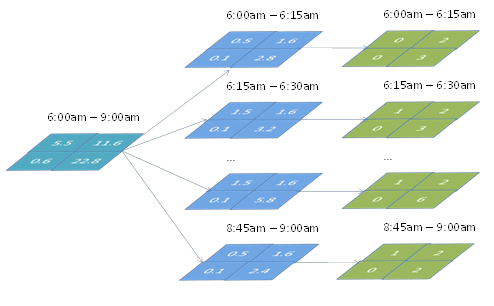
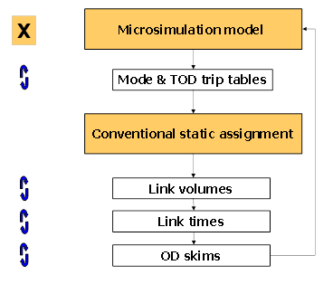
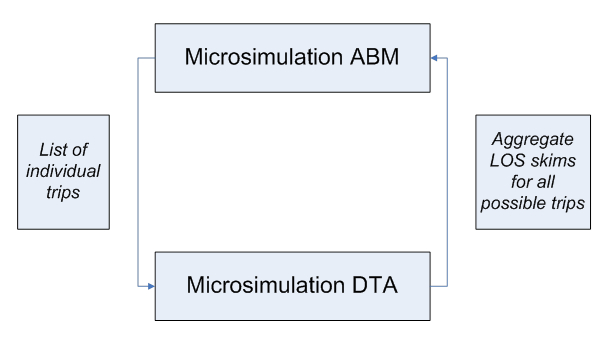
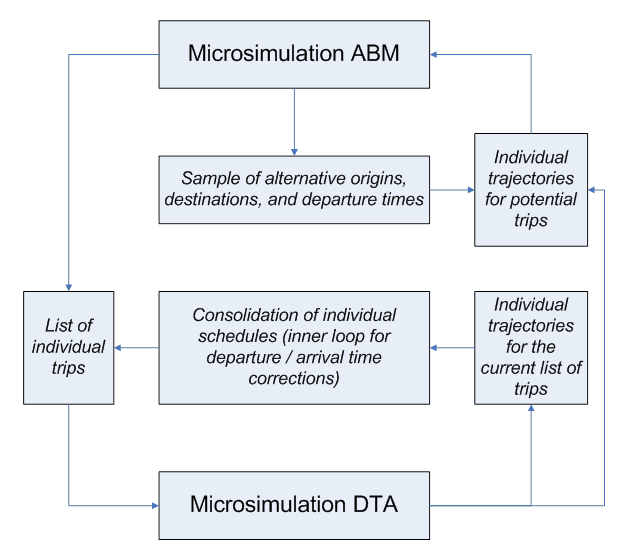

{==Practical Integration Schemas==
Four principal practical integration schemas arise as the consequence of two principal demand model structures (4-step and ABM) and two principal network model structures (Static Assignment and Dynamic Assignment that can be combined in all possible ways).

|                     |                                               |                                                   |
|---------------------|-----------------------------------------------|---------------------------------------------------|
|                     | Static User Equilibrium                       | DTA                                               |
| 4-step/trip-Based . | 1=Conventional well-explored                  | 3=Usual for DTA in practice (demand is stretched) |
| Activity-Based      | 2=Usual for ABM in practice (UE is stretched) | 4=Most promising avenue (first attempts)          |

For more information, see [Travel Demand and Network Model Integration Schemas](Travel_Demand_and_Network_Model_Integration_Schemas)

### Trip-based / Static network

Theory and practice of integrated demand-network models have a long history dated back to the fundamental works of Evans, 1976, Florian. 1977, and others. The basic idea of these integrated formulations was that that the demand part of the model can be expressed as a set of entropy-maximization terms (Wilson, 1970) while the network part of the model can be expressed as a set of link-based congestion terms (Beckman, 1956).

### Trip-based / Dynamic network

Up to date, most applications of Dynamic Traffic Assignment were based on fixed demand inputs from either 4-step or Activity-Based Models. This partial (one-way) integration is possible but it requires some steps to be made to bring the 4-step model to a compatible temporal resolution with DTA. 4-step operates with broad time-of-day periods and fractional trips. DTA requires finer demand slices (15 min) and discrete trips. Split factors are normally applied (developed from household survey or traffic counts) with subsequent rounding up the number of trips as shown in the Figure below:

''Figure 5

### Activity-based / Static network

ABM brings several important differences compared to 4-step that have to be addressed. First, ABM is associated with a complicated chains of choices with structural changes in the list of agents instead of predetermined matrix of choices pertinent to a 4-step model. Secondly, entropy-maximizing formulation for demand terms that is the cornerstone of the 4-step model equilibrium is theoretically possible but impractical because of huge dimensionality of daily activity patterns. Thirdly, microsimulation of “crisp” choices instead of fractional probabilities principally affects the associated averaging strategies. Averaging can be applied simultaneously to several components of the model as shown in Figure below (Vovsha, et al, 2008).

''Figure 6

### Activity-based / Dynamic network

This type of integrated models is in general recognized as the most important avenue in travel modeling. Recent research projects including SHRP 2 C10 and L04 as well as the Chicago ABM-DTA integration project explored several new ways for integration of microsimulation models that include a principally new notion of temporal equilibrium and individual schedule consistency that cannot be achieved with aggregate models. As shown in Figure 4, one of the possible solutions is to employ DTA to produce aggregate LOS matrices (the way they are produced by STA), and use these LOS variables to feed the demand model. This approach, in the aggregation of individual trajectories into LOS skims however, would lose most of the details associated with DTA and the advantages of individual microsimulation (for example, individual variation in Values of Time or other person characteristics). Essentially with this approach, the individual schedule consistency concept would be of very limited value because travel times will be very crude for each particular individual. Nevertheless, this approach has been adopted in many studies due to its inherent simplicity \[Bekhor et al, 2011; Castiglione, 2012\]. The emphasis in these studies was to use more disaggregation in the LOS skims – many more time periods, smaller zones, several VOT classes, etc. but at a certain point, that also becomes unmanageable because of the sheer amount of data.

''Figure 7

**New Methods**

New methods of equilibration for ABM and DTA are presented in Figure 8, where two innovative technical solutions are applied in parallel. The first solution is based on the fact that a direct integration at the disaggregate level is possible along the temporal dimension if the other dimensions (number of trips, order of trips, and trip destinations) are fixed for each individual. Then, full advantage can be taken of the individual schedule constraints and corresponding effects. The inner loop of temporal equilibrium includes schedule adjustments in individual daily activity patterns as a result of congested travel times being different from the planned travel times. It is very much helps the DTA to reach convergence (internal loop), and is nested within the global system loop (when the entire ABM is rerun and demand is regenerated). The second solution is based on the fact that trip origins, destinations, and departure times can be pre-sampled and the DTA process would only be required to produce trajectories for a subset of origins, destinations, and departure times. In this case, the schedule consolidation is implemented though corrections of the departure and arrival times (based on the individually simulated travel times) and is employed as an inner loop. The outer loop includes a full regeneration of daily activity patterns and schedules but with a sub-sample of locations for which trajectories are available (it also can be interpreted as a learning and adaptation process with limited information).

''Figure 8

### Practical Convergence Methods

**Averaging**

These methods have been borrowed from conventional 4-step modeling techniques, but can be also used with microsimulation as far as they are applied to continuous outputs/inputs like LOS variables and/or synthetic trip tables generated by the Moving Successive Averaging (MSA). Averaging can be applied to different components of the travel model including trip tables, Level-of-Service Variables, link traffic volumes, etc (Vovsha et al, 2008).

**Enforcement**

These methods are specific to microsimulation and designed to ensure convergence of “crisp” individual choices by suppressing or avoiding Monte-Carlo variability. These methods are currently at an early stage of theoretical development, with some empirical strategies showng very good results (Vovsha et al, 2008). Enforcement methods include Re-using the same random numbers or starting random seeds for certain choices that would ensure that the choice will be replicated if no change occurs to the inputs, Gradual freezing of portions of households or travel dimensions from iteration to iteration, and nnalytical discretizing of probability matrices instead of Monte-Carlo simulation.

