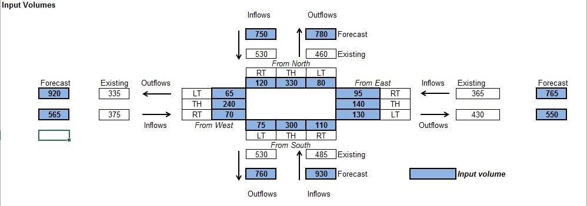
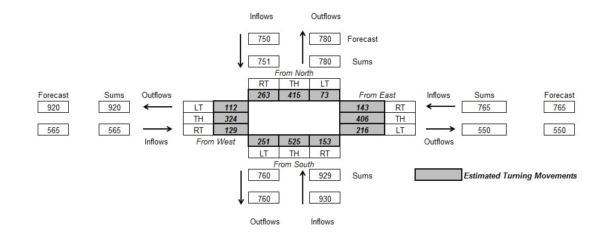

Objective
---------

Turning movements from regional travel forecasting models are known to have large errors. Furthermore, there is usually insufficient historical turning movement data to form a time series that can be extrapolated to the forecast year. Thus, it is most often necessary to refine preliminary forecasts of turning movements so that they are consistent with historical data.

Background
----------

NCHRP Report 255 documented methods of refining turning movements. These methods were adopted, roughly intact, into NCHRP Report 765. Spreadsheets are available to perform these refinements for 3-way and 4-way intersections.

Guidelines
----------

The most recommended technique of turning movement refinement is mathematically identical to Fratar factoring. Inputs include historical turning movement counts, usually for the base year, and forecasted volumes entering and leaving the intersection. This technique does not make any use of forecasts of turning movements from a travel forecasting model.

Turning movements are organized into an O-D matrix, where the rows are entering traffic (origins) and the columns are leaving traffic (destinations). Row and column targets are traffic volumes that are derived from earlier steps in the forecasting process. Then the given, historical O-D matrix is iteratively proportioned until there is a reasonable match between row and column totals and their respective targets.
Refined turning movements should be reported to the nearest whole vehicle.

Advice
------

If turning movements from a travel forecasting model are considered to have some validity, then they may be included in the refinement process by treating the process as a synthetic O-D table estimation. (See [OD table refinements](OD_table_refinements_in_project_level_traffic_forecasting).) A spreadsheet for performing this estimation was created for NCHRP Report 765. NCHRP Report 765 should be consulted for details.

It is important to verify that changes in land use between the base year and the forecast year do not undermine the validity of these techniques by dramatically shifting the fraction of vehicles making right or left turns.

Example
-------

An example of this method is illustrated in the two figures below. The first figure shows the base-year turning movement counts, the calculated incoming and outgoing traffic volumes (by summing the turning movements, labeled “existing”) and the future volumes, both incoming and outgoing. Blue cells are inputs, and white cells are outputs. Notice that traffic is conserved through the intersection, which is a requirement for this technique. The actual calculations are hidden, but are similar to Fratar factoring. The second figure shows the forecasted turning movements (gray cells) and the calculated incoming and outgoing traffic volumes. Also notice that there are tiny discrepancies between the forecasted turning movements and the forecasted volumes owing to convergence error.

Items to Report
---------------

-   Future year turning movements.

References
----------

NCHRP Report 765.

