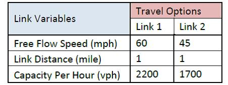
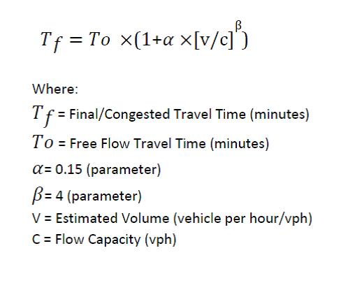
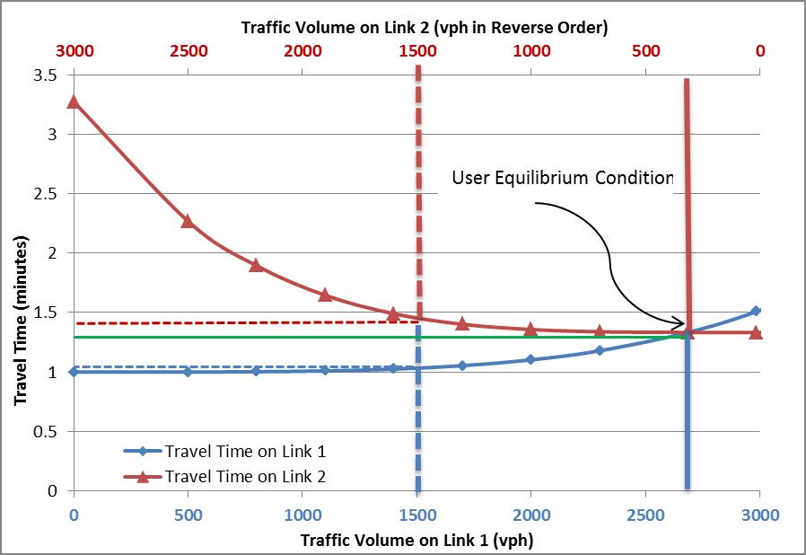

Summary
-------

------------------------------------------------------------------------

Although the term user equilibrium (UE) is not mentioned in Wardrop’s paper^1^, in the context of transportation modeling, the term is used to describe a route choice assumption formally proposed by Wardrop: “The journey times on all the routes actually used are equal and less than those which would be experienced by a single vehicle on any unused routes”. This criterion is also known as Wardrop’s first principle.

This condition of UE can be described with an example case where an origin destination (OD) pair is connected by two one-way links representing two different routes. Illustrated in Figure 1, the assumed traffic demand between these OD is 3000 vehicle per hour (vph). Fixed characteristics of links utilized in the calculation are listed in Table 1. Travel times on these links are estimated by using a typical Bureau of Public Roads volume delay function shown in equation below where travel time is an increasing function of flow. This type of flow dependent functions for estimating travel time are also called link cost function.

**Figure 1: Origin Destination Travel Options**

**Table 1: Link Characteristics**

A graphical representation of user equilibrium condition is illustrated in Figure 2. Travel time on each link is represented in Y axis. Travel time on Link 1 is dependent on the link traffic volume shown on bottom X axis. Travel time on Link 2 is dependent on link traffic volume shown on top X axis. Note that the top X axis numbers are in reverse order so the sum of the two volumes will always equal 3,000. The point where these two travel time curves meet is the user equilibrium condition, where travel time on both links is equal (i.e. 1.333 minutes represented by green line). At this UE point, the traffic volume on link 1 is 2686 and traffic volume on link 2 is 314. Any other allocation of traffic between these two links results in unequal travel time and violates above mentioned Wardrop’s criteria. It is also important to note that, at this UE condition, the estimated traffic on link 1 is higher than assumed link capacity. This is one of the weaknesses frequently brought up in many transportation planning studies. Therefore, the estimated traffic volume and travel time are also interpreted as magnitude of total demand and the extent of congestion in model application scenarios. Assignment models that relates to link capacities are available but are not as widely used in practice.

**Figure 2: An Example of User Equilibrium Condition**

The dotted lines in Figure 2 show an example of conditions when the UE criterion is not met. In this case, traffic volume on link 1 is 1500 and remaining 1500 traffic is on link 2. This allocation of traffic results in a better travel time for link 1 (dotted blue) and worse travel time for link 2 than the travel time at UE condition. The above example is an oversimplification of real world network assignment problems, where an origin-destination is connected by many more links. Therefore, in practice estimation of link traffic volume based UE model are resolved through iterative algorithms.

## References
[1. Wardrop, J.G. (1952) Some theoretical aspects of road traffic research, Proceedings of the Institution of Civil Engineers, Part II, volume 1, number 2, pages 325-378.](https://www.icevirtuallibrary.com/doi/10.1680/ipeds.1952.11362)

