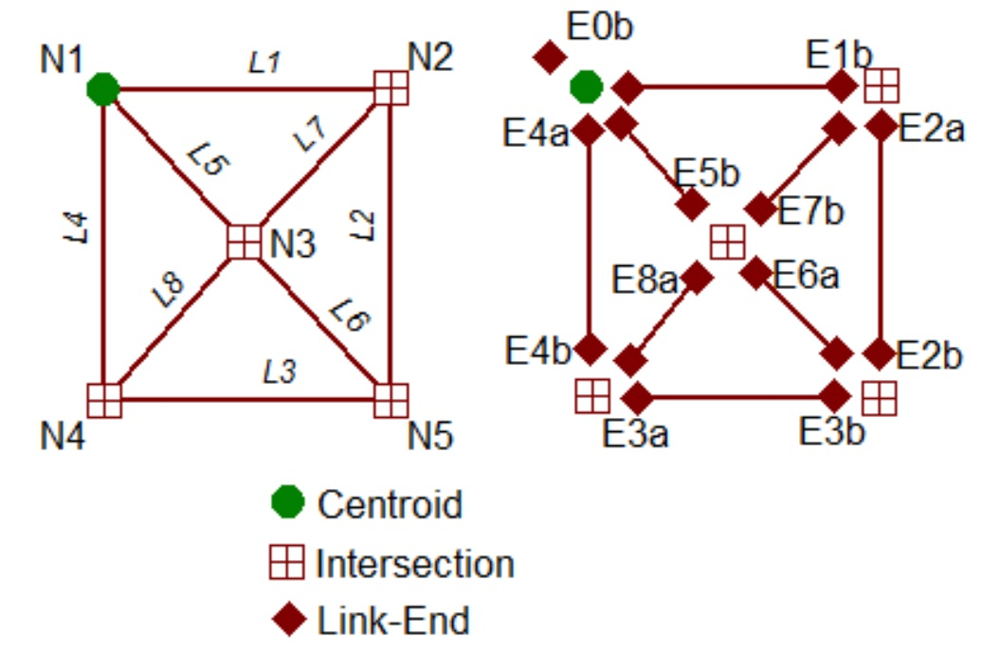
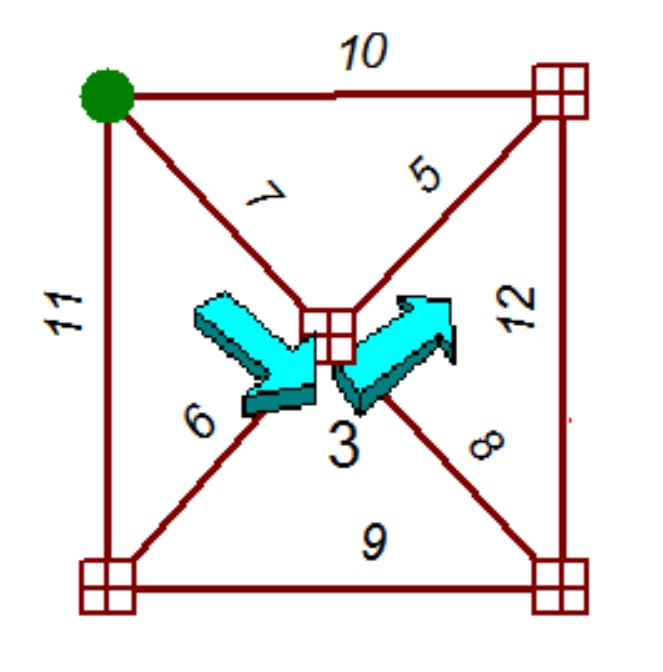

Rationale for Vine Building
---------------------------

Path building algorithms, which are essential to traffic assignments, can have difficulties in handling networks with turn penalties. Vine building can correctly build shortest paths in these instances, but at the cost of somewhat more computational effort over tree building. Vine building is poorly documented in the technical literature, so this article will describe vine building in some detail. Many travel forecasting software products implement vine building.

Turn penalties arise in a number of distinct ways within traffic networks. A turn may be prohibited by a large penalty. A class of turns, such as left turns, can be discouraged by placing small penalties throughout the network. Specific turns may be penalized because of historically known delays or because of calculated delays within the traffic assignment step. Left-turns (in right-hand drive countries) are especially prone to such penalties.

The first attempts to correctly handle turn penalties involved expanding intersections to show every possible turn as a separate link. Early SEMCOG networks were noted for this feature. However, coding networks in this fashion greatly increased network size.

One of the earliest mentions in the travel forecasting literature of vine building was contained in a doctoral dissertation by Kirby in the late 1960s, which was summarized in an article by Kirby and Potts in 1969.[^1].

Algorithm
---------

Vine building can be accomplished with a non-trivial modification of the well-known [Dijkstra tree building algorithm](Path_Finding_Algorithm). The Dijkstra algorithm moves from node to node across the network, while vine building moves from link-end to link-end. That is, each link is given two link-ends and either end can be a terminus of a path segment. A link-end has the same physical location as a node, but it is separately identified. Nodes contain a list of possible penalties at an intersection, but otherwise do not participate in the vine building activity. A typical 4-way intersection would therefore have five entities at a that location: one node and four link-ends. A step between link-ends involves both a tiny hop across the intersection, perhaps incurring a penalty, and a big jump over a subsequent link, incurring link traversal distance.

A tree from the Dijkstra algorithm is a set of paths emanating from a single node, such that no two paths may cross at any other node. A vine is also a set of paths from a single node, but paths may cross each other at other nodes. The 2D graphical depiction of a vine can look tangled, even though a traveler still cannot switch between paths, except at the origin node.

The figure below shows a simple 8 link network (left) and that same network with the link-ends separately identified (right). Note that one additional link-end (E0b) has been added outside the network, near the origin, to help initiate the algorithm. This network has a single left-turn penalty of 3 minutes for the SE to NE movement at node N3. There are never turn penalties at the origin, by definition. This figure shows the names of most of the link-ends, as convenient. For example, “E1b” is the name of the “b” end of link L1. The missing names should be obvious.

Conventionally, each link has an “a” end and a “b” end. The designation (“a” or “b”) for any link-end is often arbitrary; however, in many travel models traffic on one-way streets flows in the “a” to “b” direction.

Vine building progresses similarly to the Dijkstra algorithm, by labeling link-ends as being either “temporary” or “permanent”. All link-ends are initially unlabeled. A link-end label is declared “permanent” when it is assured to be on the shortest path from the origin. “Temporary” labels may be updated until such time that they become “permanent”. A label consists of two items: (1) the travel distance (or travel time or travel cost) from the origin; and (2) the “back” link-end, which is the immediately previous link-end on the path. Temporary labels are applied to link-ends that are “neighbors” to to a permanently labeled link-end. A “neighbor” link-end is always reached by a single hop-jump sequence. Link-ends at the same node location are not neighbors. Ends of the same link are not neighbors.

The algorithm can then be executed with the following steps:

Step 0. Permanently label the artificial link-end at the origin with 0 distance and an undefined “back” link-end.

Step 1. Apply or update temporarily labels to all link-ends that are neighbors to a permanently labeled link-end. Old temporary labels are updated, as necessary, by selecting the current shortest distance from the origin and its associated back link-end. (As an expedience, only the neighbors to the most recently permanently labeled link-end need new labels or updated labels.) The new distance at a temporarily labeled link-end is the distance to the back link-end plus the turn penalty of the hop plus the distance of the jump.

Step 2. Find the temporary label with the shortest distance from the origin. Make that label permanent. If all link-ends have been labeled, then stop. If link-ends remain unlabeled, then go to Step 1.

Interpretation
--------------

A node may be reached from multiple directions. The shortest path to any given node may be identified by the link-end at that node with the lowest labeled distance from the origin. Since destinations in traffic networks typically do not have turn penalties, the shortest path is unambiguous.
U-turns are permissible. They may be prohibited with a large U-turn penalty.

As with the Dijkstra algorithm there are two instances where tie breaking may be necessary. First, if there are two link-ends that have temporary labels which are tied for shortest, then only one of these can be made permanent at a given iteration in the algorithm. This tie may be broken arbitrarily, with the solution remaining unique. Second, if a link-end can be reached from two different directions with the exact same distance from the origin, paths are not unique. Such ties must be broken by rule, so that the path building process can at least be replicated. Fortunately, ties are rare in capacitated traffic networks, once travel time recalculation has begun.

As with the Dijkstra algorithm, paths can be traced in reverse by working from the destination link-end to the origin link-end, following the trail of back link-ends.

Performance
-----------

The algorithm completes in a finite number of iterations.

Vine building is slower than tree building by the ratio of the number of link-ends to the number of nodes. For most urban networks this ratio is approximately 3.
The storage requirements for the back link-end table is also approximately 3 times larger than the storage requirements for a back node table.

A vine building algorithm uses comparatively little RAM, but is highly computational. Most 4-step models will spend a majority of their computation time in vine building. Therefore, it is very important to use excellent programming techniques when coding vine building algorithms.

Example
-------

The figure below shows the distances for the example network. For simplicity the distances have been set to be the same in both directions of a link; this is not a requirement of the algorithm. The units of distance are minutes. There is one left turn penalty of 3 minutes at node N3.

Step 0. Link-end E0b is permanently labeled as (0, blank).

Iteration 1:

Step 1. Apply temporary labels to the neighbor link-ends, E1b, E4b, and E5b. Since there are no turn penalties at the origin, by definition, the hop value is 0 and the jump value is the link distance in each case. So the new temporary labels are:

E1b – (10, E0b)

E4b – (7, E0b)

E5b – (11, E0b)

Step 2. E4b is closest to the origin of all temporary labels, so make it permanent. Not finished, so continue.

Iteration 2:

Step 1. Add or update all temporary labels for neighboring link-ends to E4b. These neighbors are E5a, E8b, E6b, and E7a. E5a involves a U-turn. E7a involves the penalized turn and its distance is the sum of 7 (from E4b) and 3 (from the left turn) and 5 (from link L7). So the newest temporary labels are:

E5a – (14, E4b)

E6b – (15, E4b)

E7a – (15, E4b)

E8b – (13, E4b)

Step 2. E1b is closest to the origin of all temporary labels, so make it permanent. Not finished, so continue.

Subsequent iterations:

The algorithm continues until all link-ends have been permanently labeled.

References
----------

[^1]: R. F. Kirby, R. B. Potts, “The minimum route problem for networks with turn penalties and prohibitions,” Transportation Research 3, 397-408 (1969).

